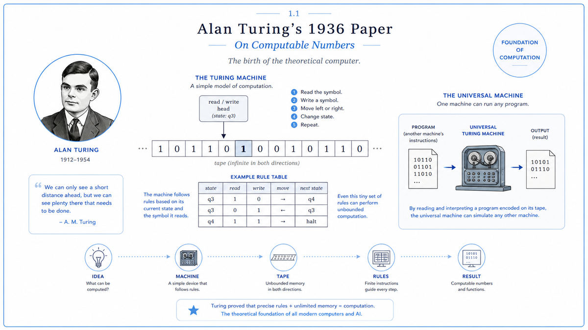

  

  <a href="https://www.cs.virginia.edu/~robins/Turing_Paper_1936.pdf">📄 Original Paper</a> · Alan Turing (Born Maida Vale, London, 1912)

<em>He set out to put a limit on what machines could do. He ended up describing every machine ever built.</em>

---

In 1928 the German mathematician David Hilbert posed a question that he hoped would crown a century of effort to put mathematics on a perfectly logical footing. He asked whether there exists a single mechanical procedure that, given any mathematical statement, can decide in finite time whether the statement is provable from the axioms. He called it the Entscheidungsproblem, the decision problem. If the answer were yes, mathematics could in principle be mechanized. A clerk with a long enough scroll and infinite patience could one day check every mathematical truth.

Turing was twenty three when he set out to prove the answer was no. He did not begin from a theorem. He began from a stranger question of his own. What does it actually mean to follow a procedure mechanically? Hilbert had used the word as if everyone knew. Turing realized nobody did. So he built a definition. He imagined the simplest possible thing that could be said to follow rules. A strip of paper. A head that reads one square at a time. A short list of instructions. Anything a human could compute by hand, this thing could compute too. He called it a computing machine.

Then he turned the machine on itself. He showed there are problems no such machine can ever solve, and the decision problem was one of them. Hilbert's dream was finished. The computer was the wreckage Turing left behind.

  

<em>A tape, a head, a rule table. The minimum machinery needed to compute anything computable.</em>

---

Before Turing, computing was a human act. Slow, error prone, tied to a particular person at a particular desk. After Turing, computation became something universal, something that could be carried out by anything that followed rules. Every phone, laptop, satellite, and language model in operation today is a physical embodiment of the abstract machine Turing described in 1936.

The second half of his proof matters just as much, and is far less celebrated. Turing showed there are problems no machine, no matter how fast or how clever, will ever be able to solve. Not because nobody has worked hard enough on them. Because the structure of computation itself forbids it. The most famous example is the halting problem. No machine can reliably decide, for every possible program and every possible input, whether the program will eventually finish or run forever.

Both halves shape modern AI. The first says intelligence may, in principle, be computable. Recognizing faces, translating languages, playing Go, writing poems. All things once thought to require human understanding turn out to be reducible to mechanical rules. The second says some questions are forever beyond any machine. Not engineering limits but proven impossibilities, like asking for a square circle.

---

A Turing machine has only three parts. A tape, infinite in length, divided into cells, each holding one symbol from a small alphabet. A head, sitting over one cell at a time, able to read the symbol there, write a new symbol, and move one cell to the left or right. A rule table, which says, for each combination of current state and current symbol, what to write, which way to move, and what state to enter next.

That is all. There is no memory of the past, no awareness of the future, no operating system, no clock. Only symbols and rules.

Turing's first claim was that this minimal device, given the right rule table, could carry out any algorithm a human with pen and paper could carry out. Long division, sorting a list, calculating planetary orbits, training a neural network. Different problems need different rule tables, but the underlying machine is always the same.

His second claim was deeper. He described a universal Turing machine. A single machine that, when handed a description of any other Turing machine on its tape, simulates that machine perfectly. This is the principle behind every modern computer. The hardware is the universal machine. The software is the description it reads. When a phone runs an app, the phone is a universal machine running another machine inside itself.

---

Turing proved the halting problem unsolvable using a technique called diagonalization, which Cantor had used decades earlier to show that some infinities are larger than others.

Suppose, for contradiction, that a machine H exists which can take any program P and any input I and reliably output yes if P halts on I, and no if P runs forever. From H, build a new machine D that asks H what P does when given P itself as input, and then deliberately does the opposite. Ask what D does when given itself. Either answer leads to a contradiction. So H cannot exist.

The same trick, in slightly different dress, was Turing's weapon against the Entscheidungsproblem. He showed that for any computing machine, one can write a logical statement which is true if and only if that machine eventually halts. A general decision procedure for logic would therefore be able to settle the halting question for every machine. We just proved no such halting decider exists. Therefore no general decision procedure for logic exists either. Hilbert's dream was mathematically impossible.

---

Turing's paper landed in a small academic world and stayed there for nearly a decade. Then the war came. Turing himself helped design real machines at Bletchley Park to break German codes. After the war, his abstract machine became the conceptual foundation of the first electronic computers. ENIAC, EDVAC, and the ones that followed. Every line of code written since 1945 traces its lineage back to that tape and that head.

The next stop on this walk is 1937. A 21 year old graduate student named Claude Shannon, working a few miles away at MIT, was about to do for electrical circuits what Turing had done for mathematics. Where Turing showed that logic could be done by a machine, Shannon would show that any machine made of switches was already doing logic.

---

  <a href="../README.md">← Back to the walk</a> &nbsp;·&nbsp; <a href="1937-Shannon-Switching-Circuits.md">Next: Shannon 1937 →</a>

