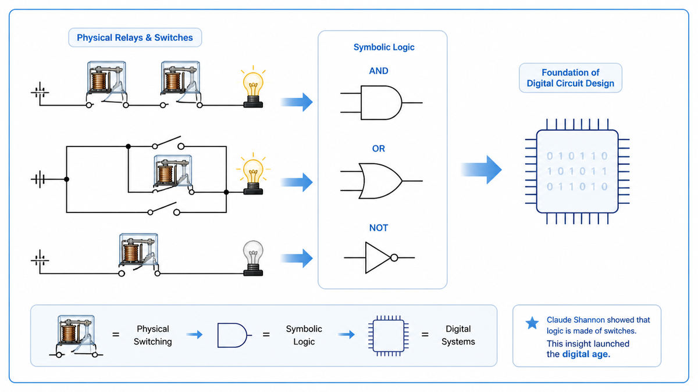

  

  <a href="http://fab.cba.mit.edu/classes/862.19/notes/computation/Shannon-1937.pdf">📄 Original Paper</a> · Claude Shannon (Born Petoskey, Michigan, 1916)

<em>Twenty one years old, seventy five pages, the digital age in one move.</em>

---

In 1854 the English mathematician George Boole published a strange book of pure symbols. He showed that all of logic could be reduced to two values, true and false, and three operations on them, AND, OR, and NOT. To mathematicians it was a curiosity. To engineers it was nothing at all. The work sat on a shelf for eighty years.

In 1936 a 21 year old named Claude Shannon arrived at MIT as a graduate student. He took a job tending Vannevar Bush's differential analyzer, a six ton mechanical computer that solved differential equations using rotating shafts. The analyzer was steered by more than a hundred electrical relays. Each relay was a tiny switch with two states, open or closed. Setting up a calculation meant rewiring the relay panel by hand. Shannon spent his days inside that tangle, fixing it.

One afternoon he saw it. The two states of a relay, open and closed, behaved exactly like the two values in Boole's algebra, false and true. Two relays in series let current pass only when both were closed, just as Boolean AND was true only when both inputs were true. Two relays in parallel let current pass when either was closed, just as Boolean OR was true when either input was true. The whole tangle of metal and wire in front of him was an unrecognized physical instance of an eighty year old logical algebra.

The thesis Shannon wrote made the connection rigorous. Any Boolean expression could be drawn as a circuit. Any circuit could be reduced to a Boolean expression. From that moment, designing a switching circuit was no longer a craft of trial and error. It was a math problem. Every digital chip ever made is a direct descendant of this insight.

  

<em>Two switches in series for AND, two in parallel for OR. From these two patterns, every digital circuit can be built.</em>

---

Before Shannon, electrical circuits were designed by intuition. An engineer would sketch a network of switches that seemed likely to do the job. They would build it, test it, find the bugs, rewire, test again. There was no theory of correctness. There was no method for finding the smallest circuit that did a given job. Two engineers might produce the same function in two completely different layouts, with no way to prove either of them right.

After Shannon, a circuit became an algebraic equation. Engineers could write down what they wanted in Boolean terms, simplify the expression with the rules of algebra, and translate the simplified expression back into a circuit guaranteed to be the smallest one that worked. Telephone companies adopted the technique within a few years. Circuit complexity exploded.

The deeper consequence was conceptual. Shannon had shown that a physical system, made of metal and electricity, could carry abstract logical truth. The bridge between matter and mind, which philosophers had argued about for centuries, suddenly had a concrete proof. Logic could be mechanized. Once that idea existed, a real machine that thinks logically was no longer fantasy. It was an engineering problem.

---

Boolean algebra has two values, written as 0 and 1, or false and true. It has three operations.

AND, written as a dot or as multiplication, gives 1 only when both inputs are 1. OR, written as a plus sign or as addition, gives 1 when either input is 1. NOT, written as a bar over the symbol or as an apostrophe, flips a 0 to a 1 and a 1 to a 0.

Shannon's mapping was direct. A switch in a circuit corresponded to a Boolean variable. A closed switch was 1. An open switch was 0. Two switches wired in series corresponded to AND, because current flowed only if both were closed. Two switches wired in parallel corresponded to OR, because current flowed if either was closed. A normally closed contact, which opened only when its relay was energized, corresponded to NOT.

The mapping ran both ways. Given any Boolean expression, Shannon showed how to draw an equivalent circuit. Given any circuit, he showed how to read off an equivalent Boolean expression. The theorems of Boolean algebra became rules for circuit transformation.

---

Boolean algebra has two values, 0 and 1. Three operations: AND (·), OR (+), and NOT (the bar). The basic identities are:

> A · A = A &nbsp;&nbsp;&nbsp; A + A = A
> A · 0 = 0 &nbsp;&nbsp;&nbsp; A + 0 = A
> A · 1 = A &nbsp;&nbsp;&nbsp; A + 1 = 1
> A + A' = 1 &nbsp;&nbsp; A · A' = 0

The most important rules are De Morgan's laws, which Shannon used to redraw whole sections of a circuit:

> (A · B)' = A' + B'
> (A + B)' = A' · B'

These turn an AND of NOTs into a NOT of an OR. In a circuit, this means a tangle of inverted switches in series can be replaced by a single inverter around a parallel arrangement. Same logic, simpler wiring.

---

Shannon's thesis arrived at exactly the right moment. Electromechanical relays were giving way to vacuum tubes. Vacuum tubes would soon give way to transistors. Each new technology was just a different way to physically realize an on or off switch. Shannon's framework did not care which one was used. Every generation of computer hardware since 1938 has been built on his algebra of switches.

Shannon himself was not done. Eleven years later he would write a second paper that did for communication what this one did for circuits. The next stop on this walk is 1941, where a young engineer in Berlin, who had read neither Turing nor Shannon, was about to wire two thousand telephone relays into the first programmable computer ever built.

---

  <a href="1936-Turing-Computable-Numbers.md">← Previous: Turing 1936</a> &nbsp;·&nbsp; <a href="1941-Zuse-Z3.md">Next: Zuse Z3 1941 →</a>

