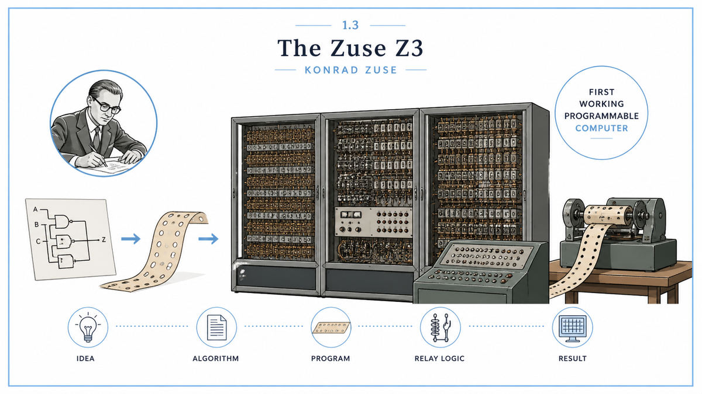

  

  <a href="https://ed-thelen.org/comp-hist/Zuse_Z1_and_Z3.pdf">📄 Technical Analysis (Rojas, 1997)</a> · Konrad Zuse (Born Berlin, Germany, 1910)

<em>The first programmable computer was a stack of telephone relays in a Berlin apartment.</em>

---

Konrad Zuse trained as a civil engineer. His first job after graduation involved doing the same calculation thousands of times, by hand, using paper, pencil, and a slide rule. The work bored him. He wanted a machine that could do it for him.

He had never heard of Turing. He had never heard of Shannon. He was 26 years old, working in Berlin, mostly alone. He started building computers anyway.

Zuse had a problem Shannon did not. He needed real switches, not theory. His first machine, the Z1, ran on mechanical sliders he built in his parents' living room. The Z2 added electromechanical relays. By 1941, in a small workshop on Methfesselstraße, he had completed a third machine he called the Z3. It used about two thousand telephone relays. It read its program from a strip of punched film. It did binary floating-point arithmetic. It computed for hours without human intervention.

Nobody outside Germany knew it existed. Nobody inside Germany, except a few engineers, thought it mattered much. Two years later, Allied bombs destroyed the Z3 and most of Zuse's notes. But the machine had run. The first programmable computer had not been built at MIT or in Cambridge. It had been built in a Berlin workshop, by a man who had never read either of the papers that should have made it possible.

  

<em>Five blocks talking to each other through telephone relays. The shape of every computer to follow.</em>

---

The Z3 settled a question that the war and circumstance had left open. A real, working programmable computer was possible. It was not a mathematician's blackboard exercise. It was an engineering problem with a solution.

That solution included most of the architectural ideas modern computers still use. A separate processor and memory. Binary representation of everything, including numbers. Floating-point arithmetic, with mantissa and exponent treated separately. A clock that drove every operation in lockstep. A program loaded from external storage, not hardwired into the circuitry. Many of these choices would later be formalized in von Neumann's 1945 EDVAC report. Zuse had reached most of them, by trial and error, four years earlier.

The Z3 also proved that hardware had caught up with theory. Turing in 1936 had described an abstract computing machine on paper. Zuse in 1941 had built one out of metal and wire. The gap between abstract logic and actual machinery, which would later be the central question of every computing era, had been crossed for the first time.

For AI specifically, the Z3 closed a loop. McCulloch and Pitts would soon argue the brain itself is a kind of Turing machine. The Z3 showed Turing machines could be physically constructed. A real machine that thinks logically was now a question of effort, not of possibility.

---

A modern computer has five elements that talk to each other in a clock cycle. A processor that performs operations. A memory that holds data. An input device that brings new data in. An output device that sends results out. A control unit that decides what happens next.

The Z3 had all five.

The processor was a binary arithmetic unit built from relays. It could add, subtract, multiply, divide, and compute square roots of 22 bit floating-point numbers. The memory was a separate bank of 64 words, each 22 bits wide, also built from relays. The input was a small keyboard for entering decimal numbers. The output was a row of lamps that displayed results in decimal. The control unit was the most novel piece. It read a strip of perforated 35mm movie film as the program. Each row of holes encoded a single instruction.

The choice of binary was not a citation of Boole or Shannon. Zuse had read neither of them. He had simply realized that a relay had only two states, and that two states made the design dramatically simpler than ten. He chose floating-point because his target users, fellow engineers, worked with numbers across vast scales. Mantissa and exponent were stored separately, just as they are in every chip today.

---

A relay is a small electromagnet that pulls a metal contact closed when energized. The Z3 used about two thousand of them, arranged in tall racks. They clicked quietly as they switched. The clock rate was 5 to 10 hertz, driven by a small motor on the back of the cabinet.

A program for the Z3 was a strip of 35mm movie film with eight tracks of holes punched into it. Each row of eight holes encoded one instruction. The film passed through a reader that converted the holes into electrical signals. Each instruction selected an operation, such as add or load, and an address in memory.

A single multiplication of two floating-point numbers took about three seconds. The machine drew roughly four kilowatts of power, mostly to drive the relay coils. The operator entered numbers on a small keyboard, started the film, and watched lamps light up in decimal as the answer emerged.

A modern smartphone CPU performs in one second what the Z3 needed about thirty years to do. The architecture in between is mostly the same.

---

Zuse's workshop and the original Z3 were destroyed by Allied bombs in late 1943. Most of his notes were lost with it. The Z4, his next machine, survived the war by being moved to a barn in Bavaria, and was later installed at ETH Zurich, where it ran as the only computer in continental Europe for several years. Most of the credit for inventing the modern computer went elsewhere, to ENIAC at Penn and to von Neumann's EDVAC report. Zuse had quietly done much of it first.

The next stop on this walk is 1943. Two researchers in Chicago, working in another world entirely, were about to ask whether the same logic Zuse had wired into telephone relays might already be running inside the human brain.

---

  <a href="1937-Shannon-Switching-Circuits.md">← Previous: Shannon 1937</a> &nbsp;·&nbsp; <a href="1943-McCulloch-Pitts-Logical-Calculus.md">Next: McCulloch &amp; Pitts 1943 →</a>

