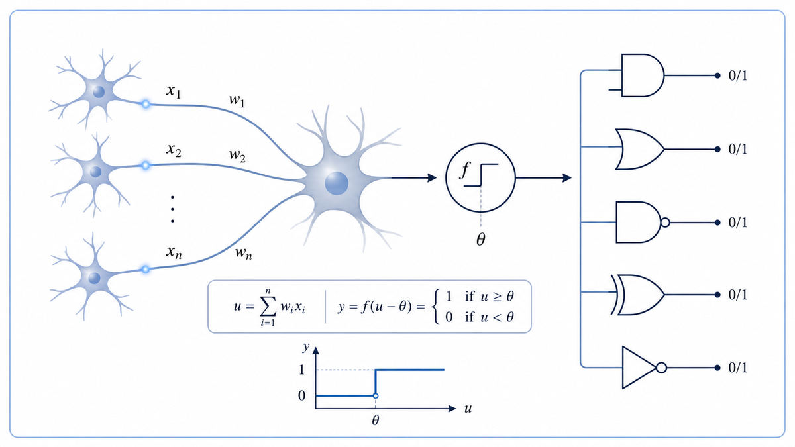

  

  <a href="https://www.cs.cmu.edu/~epxing/Class/10715/reading/McCulloch.and.Pitts.pdf">📄 Original Paper</a> · Warren McCulloch (Born Orange, New Jersey, 1898) &amp; Walter Pitts (Born Detroit, Michigan, 1923)

<em>The paper that turned the brain into a circuit, and the circuit into a brain.</em>

---

McCulloch had spent twenty years searching for a logic of the brain. A neurologist by training and a philosopher by temperament, he believed the gap between firing neurons and abstract thought had to be bridgeable. He lacked the mathematics. Pitts was the mathematics.

A self-taught logic prodigy from a poor Detroit family, Pitts at age twelve had spent a week in the Carnegie public library reading Russell and Whitehead's Principia Mathematica cover to cover. At fourteen he wrote to Russell pointing out errors in it. By 1942 he was a homeless nineteen-year-old at the University of Chicago. McCulloch took him into his home.

The two stared at the same question from opposite directions. McCulloch had biology and wanted logic. Pitts had logic and wanted biology. The paper they wrote together in 1943 said both things at once. The all-or-nothing firing of a neuron is, mathematically, a logical operation. A wire that carries a 1 or a 0. Connect enough of these neurons in the right pattern and the network can compute anything a Turing machine can compute. They had reduced the brain to logic. They had built logic out of biology. They did both in a single move.

  

<em>A handful of inputs, a threshold, and a binary output. The whole architecture of every neural network since.</em>

---

This was the first mathematical theory of how thought might emerge from physical matter. Before it, the mind and the machine sat in different worlds. After it, they were the same world drawn in different ink. The paper made AI conceptually possible. If the brain computes logic, and a Turing machine computes logic, then anything the brain can do, a machine might do too.

Within five years the paper had directly seeded von Neumann's stored-program computer architecture, which cited it by name. It also seeded Wiener's cybernetics. From there the lineage grew into the entire computational theory of mind. Within fifteen years that lineage produced the perceptron. Within seventy it produced GPT.

---

A McCulloch-Pitts neuron has four parts. Excitatory inputs, each a 0 or a 1. Inhibitory inputs, also 0 or 1. A threshold θ. A single output line.

The rule for firing is simple. The neuron outputs a 1 if no inhibitory input is active and the sum of active excitatory inputs reaches the threshold. Otherwise it outputs 0. That is the entire neuron. There are no weights. There is no learning. There are no continuous values. Only binary threshold logic.

With this primitive, McCulloch and Pitts showed that every basic logical gate can be built from a single neuron. AND is two excitatory inputs with threshold 2. OR is two excitatory inputs with threshold 1. NOT is an inhibitory input acting on a constantly-active line. From AND, OR, and NOT, any Boolean expression can be assembled. Add loops between neurons, and the network becomes a finite-state machine. Bolt on memory, and the network becomes Turing-complete.

The crucial limitation, which would haunt the field for the next fifteen years, was this. The network could not learn. Every connection and every threshold had to be designed by hand. Learning, when it came, would be Rosenblatt's contribution in 1958.

---

A McCulloch-Pitts neuron has excitatory inputs x₁, ..., xₙ and inhibitory inputs y₁, ..., yₘ, each taking the value 0 or 1, plus a threshold θ. The neuron's output at the next time step is:

> 1 if (every yⱼ = 0) and (x₁ + x₂ + ... + xₙ ≥ θ)
> 0 otherwise

That is the entire formal model. Two consequences follow.

The first is universality at the gate level. Any Boolean function of n variables can be realized by a feed-forward network of these neurons in two layers. The reason is that NAND alone is universal in Boolean algebra, and a NAND can be built from a single M-P neuron with two excitatory inputs of threshold 2 and an inhibitory feedback line.

The second is universality at the automaton level. Any finite-state automaton can be realized by a recurrent network of M-P neurons, because state can be held in cycles. Combined with Turing's earlier proof of the universality of his machines, this means networks of M-P neurons are computationally as powerful as anything mechanical can ever be.

---

In 1945 von Neumann read the paper. He took the McCulloch-Pitts neuron as his unit of logic and wrote First Draft of a Report on the EDVAC, the document that defined the architecture of every computer built since.

In 1948 Norbert Wiener built cybernetics on three foundations: McCulloch and Pitts on logic, Turing on computation, and Shannon on information.

In 1949 Donald Hebb supplied the missing piece, a rule by which connections could strengthen with use. He summarized it in five words: neurons that fire together wire together.

In 1958 Frank Rosenblatt combined the McCulloch-Pitts neuron with the Hebbian rule. The result was the perceptron, the first neural network that could be trained on data instead of designed by hand. The walk forward leads next to von Neumann's First Draft in 1945, a document that took the McCulloch-Pitts neuron and used it to design the architecture of every modern computer.

---

  <a href="1941-Zuse-Z3.md">← Previous: Zuse Z3 1941</a> &nbsp;·&nbsp; <a href="1945a-Von-Neumann-EDVAC.md">Next: von Neumann 1945 →</a>

