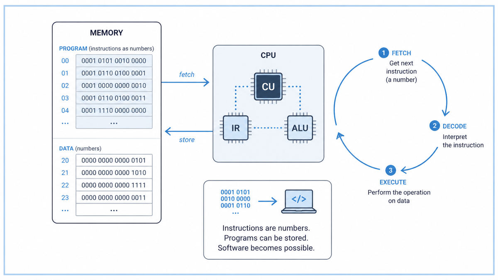

  

  <a href="https://fab.cba.mit.edu/classes/862.16/notes/computation/vonNeumann-1945.pdf">📄 Original Report</a> · John von Neumann (Born Budapest, Hungary, 1903)

<em>The 101 page draft that defined the shape of every computer built since.</em>

---

Von Neumann was 41 in 1945 and had spent most of the war doing massive numerical simulations for the Manhattan Project. Day after day he watched rooms full of women slogging through arithmetic on mechanical calculators, computing the shockwaves of fission. He knew the bottleneck of the bomb was not physics. It was arithmetic.

In summer 1944 he ran into Herman Goldstine, the Army's liaison to a secret project at the University of Pennsylvania, on a railway platform in Aberdeen, Maryland. Goldstine described an 18,000 tube electronic computer called ENIAC being built to compute artillery tables. Within months von Neumann was sitting in on every design meeting at Penn.

ENIAC had a fundamental problem. To change what it computed, technicians had to physically rewire the cables, sometimes for days. The program lived in the wires. Eckert, Mauchly, and the rest of the team had been arguing, since at least 1944, about a successor machine called EDVAC. They wanted the program to live in memory, like data, swappable in seconds.

Von Neumann had read the McCulloch-Pitts paper of 1943 carefully and discussed it with the authors directly. The paper described a neuron as a binary threshold device, and Boolean networks of such neurons as a model of thought. Von Neumann saw the analogy. A computer could be built out of abstract logic elements, the way McCulloch-Pitts had built thought out of neurons. Memory, control, and arithmetic could all reduce to networks of these simple gates. The program could be just another set of numbers in the same memory as the data. The machine would fetch its instructions one at a time, like a reader working through a recipe.

In June 1945 von Neumann sat down with handwritten notes and produced a 101 page draft titled First Draft of a Report on the EDVAC. He wrote it in the language of formal logic. He built the machine on paper from "E elements," directly inspired by McCulloch-Pitts neurons. He said almost nothing about vacuum tubes, capacitors, or transmission lines. He described the logical skeleton of an idea machine.

Goldstine distributed copies under von Neumann's name alone, to dozens of laboratories around the world. The document became the foundational text of postwar computing. Eckert and Mauchly, who had been arguing for the same ideas in private for over a year, found themselves uncredited. The architecture in the draft would forever bear von Neumann's name. The grievance never healed.

  

<em>Five organs talking through a single bus. The instruction is just another number in memory.</em>

---

The First Draft did three things, any one of which would have been epoch making.

First, it described what we now call the von Neumann architecture. A central processing unit. A memory holding both data and instructions. Input and output. A control unit that fetches instructions one at a time. Five components, talking to each other through a single bus. Every general-purpose computer built since 1945, from EDSAC to a modern smartphone, follows this design.

Second, it crystallized the stored-program concept. Programs are data. They live in the same memory as the numbers they manipulate. An instruction can be modified by another instruction. A computer can build, edit, and run programs without anyone touching its wires. This is the foundation of all software.

Third, it grounded computer design in mathematical logic. Von Neumann did not write about gears or tubes. He wrote about logical functions, conditional branching, and recursion. The computer became, for the first time, a logic problem. After the First Draft, designing a new computer meant first writing down what it should compute in the language of mathematics, before deciding which physical components would build it. This separation of logical design from physical implementation is the deepest gift the document gave the field.

---

The von Neumann architecture has five organs.

Memory holds both data and instructions, treated identically as binary numbers. The control unit reads one instruction from memory, decodes what it means, and tells the rest of the machine what to do. The arithmetic logic unit performs operations on data, such as addition or comparison. Input devices bring new data into memory. Output devices send results out.

The whole machine runs on a single rhythm called the fetch-decode-execute cycle. The control unit holds a program counter, a number that tells it where in memory the next instruction lives. It fetches that instruction, increments the counter, decodes the instruction, and executes it. Then it repeats. Forever, or until it hits a halt.

The deepest move was the unification of code and data. An instruction is not a special wire pattern. It is a number stored in a memory cell, indistinguishable from any other number. This makes three new things possible. A program can call another program by jumping to a different memory address. A program can modify its own instructions by writing to memory. A program can be loaded into memory from a tape or a card, with no rewiring at all.

This is the move that turned a calculator into a computer.

---

The First Draft formalizes a computer using "E elements," gates that take binary inputs and produce a binary output based on a threshold. Two inputs with threshold one is OR. Two inputs with threshold two is AND. An inhibitory input gives NOT. These were directly inspired by the McCulloch-Pitts neuron of 1943.

From these E elements, von Neumann built the entire machine on paper. Memory cells, adders, multipliers, the control unit, all reducible to networks of threshold gates. He estimated their physical timing in microseconds. An addition would take one microsecond. A 30 bit multiplication would take about 302 microseconds.

A typical fetch-decode-execute cycle, as von Neumann sketched it:

> 1. Read the program counter (PC). It points to a memory address.
> 2. Fetch the word at that address. Treat it as an instruction.
> 3. Increment PC.
> 4. Decode the instruction's operation code.
> 5. Execute the operation, possibly modifying memory or PC.
> 6. Return to step 1.

This loop, on a pulse rhythm of microseconds, is the heartbeat of every CPU built since.

---

Goldstine had distributed the First Draft to two dozen institutions by autumn 1945. Within three years, four major laboratories had used it as the basis for their own machines.

The British were first to actually run a stored-program computer. In June 1948, the Manchester Baby ran a 17 line program for 52 minutes and successfully computed the highest factor of an 18 bit number. EDSAC at Cambridge followed in May 1949, the first practical stored-program machine in regular service. EDVAC itself, the machine described in the draft, was finally completed in 1951.

For AI specifically, von Neumann's draft did one quiet thing. By treating programs as data, it made software possible. By making software possible, it made it possible to write programs that wrote other programs. Every machine learning model is, in the end, a program that another program optimizes. None of that exists without the move von Neumann formalized in 1945.

The next stop on this walk is also 1945. A few weeks after the First Draft began circulating, an essay appeared in The Atlantic Monthly. Its author, Vannevar Bush, did not write about hardware or software. He wrote about something even further ahead, a vision of a machine that would store a person's whole life of thinking and let them follow trails between any two ideas they had ever read.

---

  <a href="1943-McCulloch-Pitts-Logical-Calculus.md">← Previous: McCulloch &amp; Pitts 1943</a> &nbsp;·&nbsp; <a href="1945b-Bush-As-We-May-Think.md">Next: Bush 1945 →</a>

