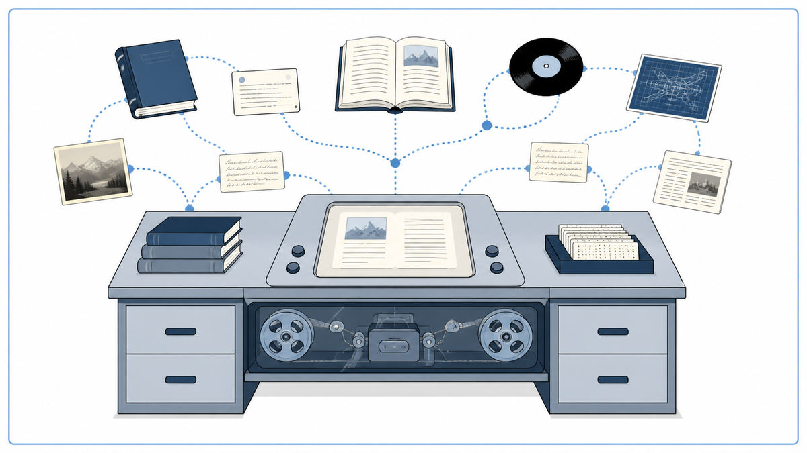
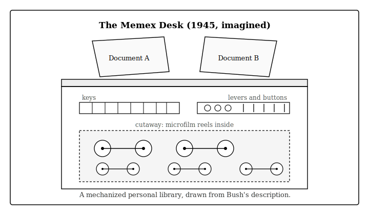

  

  <a href="https://www.theatlantic.com/magazine/archive/1945/07/as-we-may-think/303881/">📄 Original Essay (The Atlantic, July 1945)</a> · Vannevar Bush (Born Everett, Massachusetts, 1890)

<em>He had spent the war making weapons. He spent its end imagining a machine that would help humans think.</em>

---

In summer 1945, Vannevar Bush was the most powerful scientist in America. As Director of the Office of Scientific Research and Development, he had spent five years organizing the entire US scientific war effort, including the Manhattan Project. The bomb would drop on Hiroshima within weeks.

Bush was tired and worried. He worried about what fifty thousand newly trained American scientists would do when the war ended. He also worried about something deeper. The body of human knowledge was already too vast for any single person to navigate. Specialists could no longer read each other's work. Important findings were disappearing into journal stacks no one could search. The same explosion of science that had won the war was about to outrun the human mind.

So he wrote an essay. Not a paper. Not a report. An essay for the educated reader of The Atlantic Monthly. He titled it "As We May Think."

He proposed a machine. He called it the Memex, short for memory extender. Inside the desk it sat in: microfilm storage of every book, journal, letter, and note a person had ever read. On top of the desk: two slanted screens, levers, a small camera, and a keyboard. The user could pull any document onto the screens by pressing keys, link any two documents together with a button-press, and replay that trail of associations years later.

The deepest move was the linking. The mind, Bush observed, does not work alphabetically. It works by association. Idea A reminds you of B which reminds you of C. Card catalogs and library indexes force linear or hierarchical retrieval. Bush wanted a machine that worked the way memory worked. He wanted to augment human thinking, not replace it.

In 1945 the Memex was impossible. Bush imagined microfilm because magnetic disks did not yet exist. He imagined photoelectric reading because pixels did not yet exist. The technology would take fifty more years to catch up. Yet the essay reshaped what a generation wanted from machines. Doug Engelbart, later inventor of the mouse and the modern user interface, read it as a Navy radar technician in the Philippines and chose his career on the spot. Ted Nelson coined the word hypertext in 1965, directly inspired by Bush's trails. Tim Berners-Lee built the World Wide Web on the same idea forty four years after the essay appeared.

Bush had imagined a machine that thinks alongside a human, not for them. Every search engine, every Wikipedia link, every personal note-taking app since traces back to the trail he sketched in 1945.

  

<em>The mind works by association. Bush wanted his machine to do the same.</em>

---

The essay did three things that mattered.

First, it shifted the focus of computing from calculation to thought. Until 1945, every computer, whether ENIAC at Penn or Zuse's Z3 in Berlin, was a number cruncher. Bush proposed something different. A machine for navigating ideas, not solving equations. It was the first time someone had publicly imagined a computer as a thinking tool, not a calculating tool. Personal computing, in spirit, begins here.

Second, it introduced association as a retrieval principle. Indexes are alphabetical. Card catalogs are hierarchical. Both force the user to know what they are looking for before they can find it. Associative trails, by contrast, let one document lead to another by meaning, the way one thought leads to another in a human mind. This is the conceptual core of hypertext and, eventually, of the World Wide Web.

Third, it sketched the possibility of an external personal memory. A device, owned by an individual, that holds everything they have ever read or written, and lets them retrieve it instantly. In 1945 this was a dream. By 2010 it was a phone in everyone's pocket. The arc from Memex to Google search to ChatGPT runs through this single article.

For AI, "As We May Think" is a quiet ancestor. The dream of a machine that augments human knowledge, rather than replacing it, lives in every retrieval-augmented model and every human-in-the-loop system today. Bush was not predicting AI. He was, in 1945, asking what the new computing technology should be used for. His answer was thinking, not weaponry.

---

The Memex was a desk-sized machine. The desktop had two slanting screens, a keyboard, a set of buttons, and a small camera. Inside the desk was microfilm storage. According to Bush's design, an entire personal library of millions of pages could fit in a few cubic feet.

  

<em>The desk Bush sketched in 1945. None of the pieces existed yet at the scale he needed, but the layout did.</em>

The user worked with documents on the two screens. Pressing a button could pull up any page from any book, journal, or note in the storage. The two screens could show two different documents at once.

The crucial action was linking. When the user found two documents that belonged together, they pressed a button. The machine recorded a link between them. Days, years, or decades later, viewing one document, the user could press a button and the machine would jump straight to the other. A sequence of such links became a trail. A trail through one's own associations.

A scholar could build trails on, say, the development of the bow and arrow. A doctor could build trails on every patient case that resembled a current one. A researcher could share trails with colleagues. The Memex was both a personal memory and a transferable one.

This vision contained almost every element of the modern web. The two screens are tabs in a browser. The buttons are links. The trails are bookmarks, browser histories, and the path-tracking of a search engine. The word hypertext, coined twenty years later by Ted Nelson, is the direct technical descendant of Bush's links.

---

The Memex was never built. The technology Bush imagined, microfilm and photoelectric scanning, was already a decade behind what would soon be possible with electronics. By the time computers were powerful enough to do what the Memex described, they had moved beyond microfilm entirely. The vision survived. The hardware was forgotten.

Doug Engelbart spent the 1960s building a real version of what Bush had described. His 1968 demonstration in San Francisco, later called The Mother of All Demos, showed a working system with a mouse, hyperlinks, video conferencing, and collaborative editing. Most of what Bush sketched in 1945 was on stage, working, twenty three years later.

Ted Nelson, working in parallel, coined hypertext in 1965 and spent decades trying to build a global linked-document system he called Project Xanadu. Xanadu never shipped at scale. In 1989 a young engineer at CERN named Tim Berners-Lee built a simpler version, called it the World Wide Web, and changed the world. The first web browser had two key features: pages of text, and links between them. Bush's trails, finally, on a global scale.

For AI, the descendants run further. Search engines extended Bush's principle to the entire internet. Knowledge graphs at Google and Facebook extended it to structured facts. Large language models extended it to learned associations between every word a human has ever written. The dream of a machine that augments thought, rather than replacing it, is the dream Bush asked for in 1945.

The next stop on this walk is 1947. In a small lab at Bell Telephone Laboratories in Murray Hill, New Jersey, three physicists were about to build a tiny piece of germanium that would replace every relay and vacuum tube in every computing machine to come.

---

  <a href="1945a-Von-Neumann-EDVAC.md">← Previous: von Neumann 1945</a> &nbsp;·&nbsp; <a href="1947-Transistor.md">Next: Transistor 1947 →</a>

