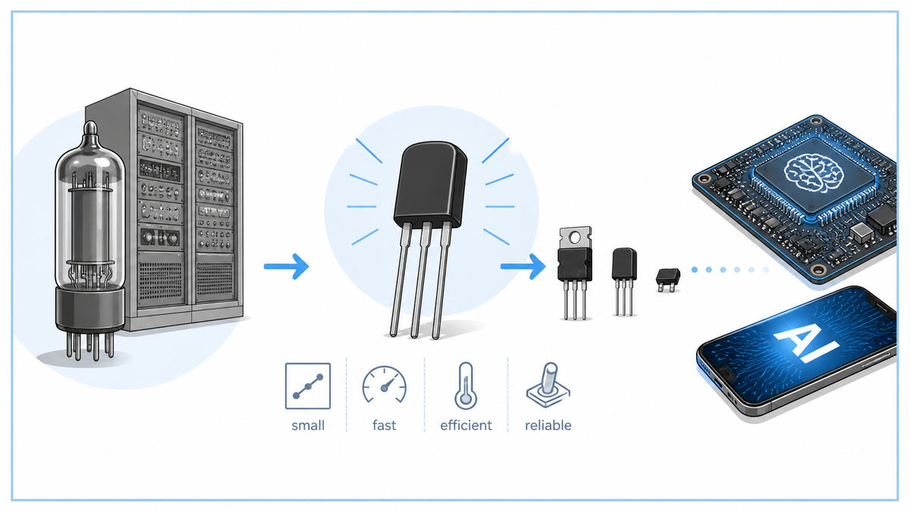

  

  <a href="https://www.computerhistory.org/siliconengine/invention-of-the-point-contact-transistor/">📄 Technical History (Computer History Museum)</a> · John Bardeen (Born Madison, Wisconsin, 1908), Walter Brattain (Born Amoy, China, 1902), William Shockley (Born London, England, 1910)

<em>Three men, a piece of germanium, and the end of the vacuum tube.</em>

---

By 1945 the vacuum tube was the workhorse of all electronics. Every radio, every telephone exchange, every computer used them. ENIAC at Penn had eighteen thousand of them. They burned out constantly. They drew enormous power. They generated heat that melted insulation. The vacuum tube was an old technology already, a glass envelope wrapped around a thread of glowing wire. Bell Labs needed something better.

Mervin Kelly, the new director of research at Bell Labs, had been recruiting solid-state physicists since 1936 to find a replacement. Bell needed amplifiers in long-distance phone lines, and vacuum tubes were unreliable across thousands of miles. Kelly believed the answer lay in semiconductors, materials like germanium and silicon that were neither conductors nor insulators. Their conductivity changed dramatically with temperature, light, and trace impurities. Nobody understood exactly why.

In early 1945 Kelly assembled a small solid-state team led by William Shockley. The team included John Bardeen, a quiet theoretical physicist who would later become the only person to win two Nobel Prizes in Physics. It also included Walter Brattain, a meticulous experimentalist who could machine almost anything in glass and metal. Shockley was the brilliant, abrasive leader. Bardeen and Brattain were the two who actually made the device work.

Shockley's first idea was a "field-effect" amplifier. A strong electric field, applied through a third electrode, should change the conductivity of a piece of germanium beneath it, and thus modulate a current. He sketched it. Bardeen and Brattain tried to build it. It refused to work.

For a year, no one knew why. In March 1946 Bardeen proposed the answer. Electrons trapped on the surface of the germanium were screening the applied field, preventing it from reaching the bulk of the material. He called these "surface states." The next year and a half was an attempt to find a way past them.

On December 16, 1947, after weeks of patient experiment, Brattain pressed two gold-foil contacts onto a small slab of germanium, only a fraction of a millimeter apart, held in place by a plastic wedge that he had cut with a razor. He connected the device to a power supply. A small voltage at one contact controlled a much larger current at the other. The output signal was a hundred times stronger than the input. The vacuum tube had been replaced.

A week later, on the afternoon of December 23, Bardeen and Brattain demonstrated the device to Bell Labs leadership. Shockley described it later as "a magnificent Christmas present." Privately he was furious. The breakthrough had been made by his subordinates while he was elsewhere. Within weeks, working alone in a hotel room, Shockley invented a more practical successor, the junction transistor. The team won the Nobel Prize in Physics in 1956. They never spoke as friends again.

  

<em>The original device was held together by a plastic wedge cut with a razor. Inside it, the digital age began.</em>

---

The transistor is the most-manufactured object in human history. By 2025, about ten sextillion of them have been built, more than ten thousand for every grain of sand on Earth. It is, by orders of magnitude, the most successful invention of the twentieth century.

Three properties made it world-changing. The transistor is small. A vacuum tube was the size of a thumb. A modern transistor is smaller than a virus. The transistor is fast. A vacuum tube switched in microseconds. A modern transistor switches in trillionths of a second. The transistor is cheap. A 1948 transistor cost a few dollars. A modern one costs a billionth of a cent.

These three properties together did to electronics what Shannon's switching theory had done to logic. They turned every problem of digital computing into a question of how many transistors could be afforded. The answer kept growing. ENIAC had 18,000 vacuum tubes and filled a room. The IBM 7090 in 1959 had 50,000 transistors and was much smaller. The Intel 4004 in 1971 had 2,300 transistors on a single chip. The Apple M1 in 2020 had 16 billion. The NVIDIA H100 in 2022 had 80 billion.

Every other thing in this walk depends on the transistor. Shannon's information theory needed transistors to become engineering. Von Neumann's architecture needed transistors to fit on a desk. Modern AI, which depends on running quadrillions of arithmetic operations per second, needed transistors so small that billions of them could be packed onto a chip the size of a fingernail. The transistor is the substrate every later step in this story stands on.

---

A transistor is a three-terminal device. The three terminals are usually called emitter, base, and collector, or in modern field-effect transistors, source, gate, and drain. A small signal at one terminal controls a much larger current flowing between the other two.

This is the principle of amplification. A weak signal becomes a strong one. A microphone-strength voltage at the base of a transistor can drive a loudspeaker through the collector. The same principle, applied differently, makes a switch. If the controlling signal is on, current flows. If the controlling signal is off, current does not. A transistor can be either always-on amplifier or rapid switch, depending only on how the input signal is biased.

Two transistors connected in the right pattern make a NAND gate. From NAND alone, every Boolean operation can be built. From Boolean operations, every computation can be built. Shannon had shown this in 1937 with relays. The transistor took the same logical structure and made it a thousand times faster, a million times smaller, and a billion times cheaper.

The original 1947 design was a "point-contact" transistor. Two gold wires pressed against a piece of germanium, with a metal base plate underneath. It was crude and fragile. Within a year Shockley had designed a "junction" transistor with three layers of doped semiconductor in a sandwich, far more rugged. By the early 1960s, junction transistors had given way to MOSFETs, which use an electric field across an oxide layer to control current. Almost every transistor manufactured today is a MOSFET. The principle is unchanged from 1947.

---

A semiconductor like germanium or silicon is, in pure form, neither a good conductor nor a good insulator. Its behavior is dominated by tiny amounts of impurities, called dopants, deliberately added to the crystal.

Doping comes in two flavors. N-type doping adds atoms with one extra electron compared to silicon, such as phosphorus. The extra electrons are free to wander, and the material conducts more easily. P-type doping adds atoms with one fewer electron, such as boron. The missing electrons leave behind "holes," which behave like positive charges and also conduct.

A modern junction transistor is three layers of doped semiconductor in sequence, NPN or PNP. At each boundary between N and P types, electrons and holes meet and recombine, leaving a thin "depletion region" with no free carriers. This region acts as a barrier to current flow. A small voltage at the middle layer can shrink or grow the depletion regions on either side, which controls how much current crosses the entire device. This is the heart of every junction transistor.

In a MOSFET, the same principle works through an oxide layer. A metal gate sits above a thin layer of silicon dioxide, which sits above the silicon. Voltage on the gate creates an electric field that pulls or pushes carriers in the silicon below, opening or closing a conducting channel between source and drain. No current flows through the gate itself, which is why MOSFETs use almost no power when they are not switching.

The numbers tell the rest of the story. The first transistor in 1947 was a few millimeters across. By 1971 transistors were ten micrometers wide. By 2000 they were 130 nanometers. By 2025 they are about 3 nanometers, which is roughly fifteen silicon atoms. They cannot get much smaller. Quantum tunneling makes electrons leak through walls only a few atoms thick.

---

The transistor's first decade was modest. It was used in hearing aids, transistor radios, and military hardware. The pivotal step came in 1958, when Jack Kilby at Texas Instruments and Robert Noyce at Fairchild Semiconductor independently invented the integrated circuit, a way to put many transistors on a single piece of silicon. By 1965, Gordon Moore had observed that the number of transistors on a chip was doubling roughly every two years. The observation became Moore's Law and held for fifty years.

Shockley, after the Nobel Prize, left Bell Labs and moved to California. In 1956 he founded Shockley Semiconductor Laboratory near Palo Alto. He was a difficult boss, and within a year eight of his best engineers, later called the "traitorous eight," had quit and founded Fairchild Semiconductor. Among them were Robert Noyce and Gordon Moore. Ten years later, Noyce and Moore left Fairchild and started Intel. The geographic concentration of those companies, all within twenty miles of Stanford University, became known as Silicon Valley. The whole modern technology industry traces back to Shockley's bad management and one piece of germanium pressed against two gold wires.

For AI, the transistor is the substrate. Every weight in every neural network is a number stored in transistors. Every multiplication in every forward pass is performed by transistors. The training run of a modern language model uses about 10^24 transistor switching events. Without the transistor, modern machine learning is mathematically possible but physically impossible. The graph of compute available for AI from 1947 to today is essentially the graph of transistor density.

The next stop on this walk is 1948. A few months after Bell Labs publicly announced the transistor, the same Claude Shannon who had connected Boolean algebra to switching circuits in 1937 published a second paper. This one was about communication, noise, and the smallest possible unit of information. He called it the bit.

---

  <a href="1945b-Bush-As-We-May-Think.md">← Previous: Bush 1945</a> &nbsp;·&nbsp; <a href="1948a-Shannon-Information-Theory.md">Next: Shannon 1948 →</a>

