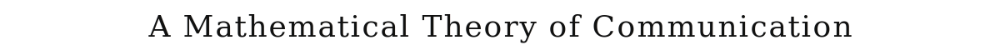
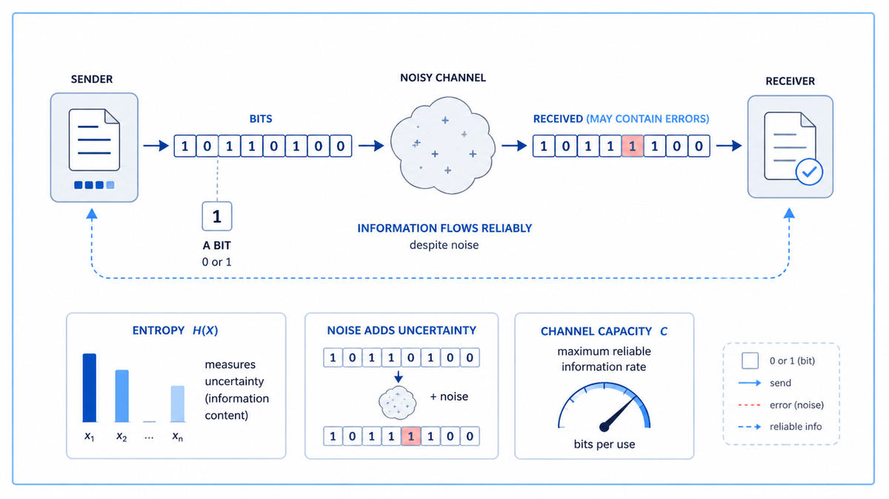

  

  <a href="https://people.math.harvard.edu/~ctm/home/text/others/shannon/entropy/entropy.pdf">📄 Original Paper</a> · Claude Shannon (Born Petoskey, Michigan, 1916)

<em>Eleven years after he gave us the digital circuit, Shannon gave us the bit.</em>

---

In 1937 Shannon had shown that any electrical circuit was, secretly, a problem in Boolean logic. The thesis made him famous in a small circle and sent him, by 1941, to Bell Labs in Manhattan. The war was on. Bell Labs was a strange wartime place. Down one corridor, three physicists were arguing about germanium and surface states. Down another, Shannon was working on cryptanalysis and on a fire-control system for anti-aircraft guns.

Cryptography was the backdrop. Shannon spent the war years working alongside Alan Turing, who visited Bell Labs in 1943, and on classified projects involving the encryption of voice signals between Roosevelt and Churchill. The work forced him to think hard about a problem that nobody had solved cleanly. What is information? How do you measure it? How much of it can a wire, or a radio, or a coded message actually carry?

By 1945 he had a draft. By 1948 he had the paper. It was 79 pages long, in two parts, in the Bell System Technical Journal. The title was deliberately understated. "A Mathematical Theory of Communication." Inside it, Shannon did three things that no one had done before.

He defined information mathematically. Information was uncertainty resolved. A message that confirmed something already known carried no information. A message that resolved a coin flip carried one unit. Shannon called the unit a bit, a name his colleague John Tukey had suggested. He defined how to measure the information content of any source, deterministic or random, using a formula that took the form of entropy in physics. The formula now bears his name.

He proved that any communication channel has a hard limit, called its capacity, measured in bits per second. No physical method, however clever, can transmit more than the capacity. This was the most surprising result in the paper. People had assumed that with enough bandwidth, enough power, and enough engineering, you could push any amount of data through any channel. Shannon proved this was false. There was a ceiling, and it depended only on the channel's bandwidth and the ratio of signal to noise.

He proved, in the same paper, that any rate below the capacity could be transmitted with arbitrarily small error, even on a noisy channel, given the right encoding. This was the most beautiful result in the paper. Until 1948, engineers had assumed that noise was a fundamental limit on accuracy. More noise, more errors. Shannon showed that with sufficient cleverness in encoding, errors could be driven to nearly zero on any channel below capacity. This is why your phone call sounds clear over a noisy line, why a satellite signal from Pluto reaches Earth intact, why a hard drive recovers from scratched sectors. Each of those technologies is a working application of Shannon's coding theorem.

In one paper, Shannon had created a new field. The field was information theory. Every modern technology that compresses, transmits, or stores data is built on its theorems. He was 32 years old.

  

<em>The diagram from page 2 of the paper. Every communication problem reduces to this picture.</em>

---

Before 1948, communication engineering was a craft of intuitions. Engineers built radios, telephones, and telegraphs that mostly worked. They had no theory of what was achievable in principle. They could not prove that one design was as good as any could be, or that another design was leaving capacity on the table. They had no language for measuring information itself. The very word "information" had no technical meaning.

After 1948, all of that changed. Information became a quantity, like length or energy, with a precise unit, the bit. Communication became a problem with provable upper bounds and provable optimal strategies. Compression algorithms could be designed to approach Shannon's bound on how small a file could be made. Error-correcting codes could be designed to approach his bound on how reliably a noisy channel could be used. Every modern data format, from JPEG to MP3 to ZIP, is a practical application of his theorems.

The deeper consequence was conceptual. Information theory turned out to apply to vastly more than communication. Statisticians used Shannon's entropy to measure how informative a measurement is. Biologists used it to measure how much information a DNA sequence carries. Physicists used it to connect entropy in thermodynamics with entropy in computation. Linguists used it to measure how predictable a language is. Economists used it to analyze decision-making under uncertainty.

For AI specifically, Shannon's framework is the air the field breathes. Every neural network's loss function is, at its core, a measure of information lost. Every language model is, mathematically, a system that estimates the entropy of human language and tries to minimize it. The training objective of a modern transformer, called cross-entropy loss, is named directly after Shannon's measure. Without information theory, machine learning has no way to even define its own objective.

---

Shannon's central insight was that information equals surprise. A message tells you something only if you did not already know it. The more unexpected the message, the more information it carries.

Imagine a coin flip. If the coin is fair, you have no idea which side will come up. Telling you the outcome resolves a real question. The result carries one bit of information. If the coin is rigged so it always comes up heads, telling you the outcome resolves nothing. You already knew. The result carries zero bits.

Shannon generalized this. The information content of a source is its entropy, defined as the average surprise of its messages. A source that always sends the same symbol has entropy zero. A source that sends each of two symbols with equal probability has entropy one bit. A source that sends each of 256 symbols with equal probability has entropy eight bits. English text has an entropy of about one to two bits per character, far less than the eight bits per byte used to store it. This is why text compresses so well.

The second key idea is channel capacity. Every physical channel, whether a copper wire, a radio band, or a fiber optic cable, has a maximum number of bits it can transmit per second without error. Shannon proved that this capacity depends on only two things, the channel's bandwidth in hertz and its signal-to-noise ratio. The formula, now called Shannon-Hartley, is

> C = B · log₂(1 + S/N)

where B is the bandwidth, S is the signal power, and N is the noise power. This single formula sets the absolute limit for every communication system humans will ever build.

The third key idea, the most surprising, is the noisy channel coding theorem. Below capacity, errors can be driven to zero. Above capacity, no scheme can drive errors below a positive threshold. The line is sharp. Engineering creativity matters only on one side of it.

---

The information content of a single message with probability p is defined as

> I(p) = log₂(1/p) = −log₂(p)

A common message, with probability close to 1, carries close to zero bits. A rare message, with probability close to zero, carries many bits. The base-2 logarithm makes the unit a bit.

The entropy H of a source that emits N possible symbols with probabilities p₁, p₂, ..., p_N is the average information per symbol:

> H = − Σ pᵢ · log₂(pᵢ)

This formula has an exact mathematical resemblance to entropy in statistical mechanics, which is why it bears the same name. Shannon was reportedly told by von Neumann to use the word "entropy" because, von Neumann said, "nobody knows what entropy really is, so in a debate you will always have the advantage."

Shannon's two main theorems, in modern form:

> Source coding theorem: A source with entropy H bits per symbol can be losslessly compressed to an average of H bits per symbol, but no fewer. This sets the floor on compression.

> Noisy channel coding theorem: A channel with capacity C bits per second can transmit at any rate R less than C with arbitrarily small error probability, given enough encoding work. At rates above C, error probability is bounded above zero.

The proofs of both theorems use a method now called the random coding argument. Shannon showed that a randomly chosen code is, on average, almost as good as the best possible code. This was a startling proof technique. It said the optimal solution exists without telling you how to construct it. Decades of subsequent work, from Hamming codes to LDPC codes to polar codes, have been the search for explicit codes that approach Shannon's bounds.

---

The paper landed in a small academic world, and from there spread everywhere. Within five years it had created a new field. Within ten years it was the foundation of every modulation, coding, and compression technique used in telephony. Within twenty years it was being applied across biology, statistics, physics, and economics.

In 1949 Shannon wrote a follow-up paper showing that one-time-pad encryption was provably unbreakable, founding modern cryptography on information-theoretic ground. In 1950 he wrote a paper analyzing chess as an information problem, estimating that the game tree has about 10^120 positions. The estimate is now called Shannon's number.

In 1956 Shannon attended the Dartmouth Summer Research Project on Artificial Intelligence, where the term "artificial intelligence" was coined. He was one of four formal organizers, alongside John McCarthy, Marvin Minsky, and Nathaniel Rochester. AI as a named field begins, in part, with him.

In the longer arc, Shannon's framework became the substrate of all digital civilization. Cell phones use his coding theorems to push voice through noisy radio. Hard drives and SSDs use them to recover from physical errors. Streaming video uses them to compress motion pictures down to a few megabits per second. Every JPEG, every MP3, every ZIP file, every interplanetary signal from a Voyager probe is a physical instance of Shannon's mathematics.

For AI, the arc continues straight to today. Cross-entropy loss, used in training every modern neural network, is Shannon's relative entropy in disguise. The information bottleneck framework for understanding what neural networks learn is built on his theorems. Modern compression-based reasoning, where models are evaluated on how well they compress text, treats intelligence itself as a problem in information theory, exactly the way Shannon framed it in 1948.

The next stop on this walk is also 1948. A few months after Shannon's paper appeared, Norbert Wiener published a book called Cybernetics. Where Shannon focused on communication between machines, Wiener asked a larger question: could the same mathematics describe communication and control inside a human nervous system? Could thought itself be a feedback loop?

---

  <a href="1947-Transistor.md">← Previous: Transistor 1947</a> &nbsp;·&nbsp; <a href="1948b-Wiener-Cybernetics.md">Next: Wiener 1948 →</a>

