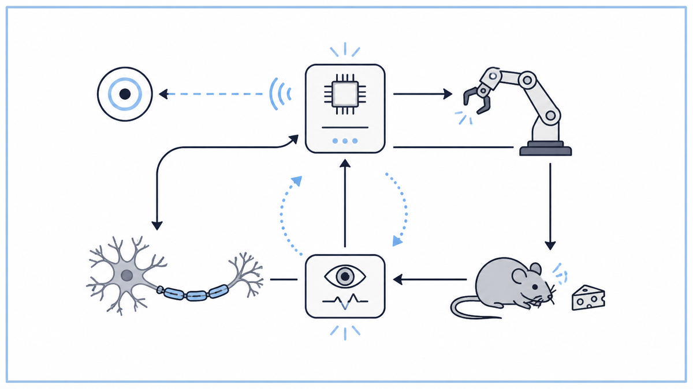

  

  <a href="https://monoskop.org/images/4/41/Wiener_Norbert_Cybernetics_or_Control_and_Communication_in_the_Animal_and_the_Machine_2nd_ed_1961.pdf">📄 Original Book (1948)</a> · Norbert Wiener (Born Columbia, Missouri, 1894)

<em>The book that gave the world a single word for the idea that machines and minds run on the same engine.</em>

---

Wiener was a child prodigy turned MIT professor. He had earned his Harvard PhD at 18, in mathematical logic. By 1940 he was 46 years old, brilliant, eccentric, and deeply uncomfortable with the way the war was changing the kind of mathematics he could do.

The Army gave him a problem. German bombers flew faster than the time it took an anti-aircraft gun to swing, fire, and have the shell reach altitude. To hit one, the gunner had to aim not at the plane but at where the plane would be several seconds later, with the plane actively trying to dodge. No human gunner could do this reliably. Wiener was asked to design a machine that could.

The mathematics he developed was about prediction in the presence of noise. The machine had to estimate the plane's future position from a noisy stream of radar data, then continuously correct its aim based on observed error. Each correction fed back into the next prediction. Wiener and his graduate student Julian Bigelow built a working prototype. By 1943 he had a paper, co-authored with the physiologist Arturo Rosenblueth, called "Behavior, Purpose, and Teleology." It made an audacious claim. The same equations that described the gun aiming itself also described a person reaching for a cup of coffee. Both were feedback systems. Both observed their own error and corrected it. Both could be called purposeful in the same mathematical sense.

After the war Wiener kept pulling on this thread. He talked to McCulloch and Pitts about neurons. He talked to von Neumann about computers. He talked to Rosenblueth about the human nervous system. He noticed that wherever he looked, in radar tracking, in muscle coordination, in thermostats, in the central nervous system, in animal behavior, in economic systems, the same mathematical structure kept appearing. A goal, a measurement, an error signal, a corrective action, and a return to measurement. Feedback was everywhere. Feedback was, perhaps, what intelligence actually was.

In 1947, while visiting Mexico, he wrote the book that gave this insight a name. He took the Greek word kubernetes, meaning "steersman," the same root that gives us "governor," and called the field cybernetics. The book was published in 1948 as Cybernetics: or Control and Communication in the Animal and the Machine. It was technical, sometimes opaque, riddled with errata. It became, almost instantly, one of the most influential scientific books of the century.

The bigger move was philosophical. Wiener was arguing that the line between machine and mind was, mathematically, a fiction. Both were systems that took in information, processed it, and acted on the world based on goals. Both made errors and corrected them. Both could be analyzed with the same equations. The animal, in cybernetics, became a kind of machine. The machine, in cybernetics, became a kind of animal. The two had run on different metaphors for centuries. Wiener proposed a single mathematics underneath both.

  

<em>One diagram, applied universally. From a thermostat to a thought.</em>

---

Cybernetics did three things that mattered.

First, it gave science a unified language for self-regulating systems. Before Wiener, an engineer studying a thermostat, a biologist studying body temperature, and a psychologist studying habit formation worked in three completely different vocabularies. After Wiener, they all spoke about goals, sensors, error signals, and corrective action. The same equations applied. The same diagrams worked. A whole tier of cross-disciplinary research, from systems biology to control engineering to operations research, became possible only after this language existed.

Second, it framed thought itself as information processing. Wiener was the first major scientist to argue, in print, that what the brain does is computationally describable. Not metaphorically, but literally. Memory is information stored in patterns of neural connection. Perception is a feedback loop between sensory input and predicted state. Action is the output of an internal controller. This framing was the philosophical bedrock of cognitive science, of artificial intelligence as a research program, and of every subsequent attempt to build machines that think.

Third, it raised the alarm. Wiener was unusual among postwar scientists in caring deeply about the social consequences of his work. In Cybernetics and his 1950 follow-up The Human Use of Human Beings, he warned that automation would produce a "second industrial revolution" that would displace not just human muscle but human cognition. He warned that machines coupled to economic incentives would optimize for goals nobody had explicitly chosen. He warned, in 1948, about exactly the alignment problem that AI safety researchers worry about today.

For AI specifically, cybernetics was the parent field. The first AI conference at Dartmouth in 1956 was, in many ways, a renaming of the cybernetics movement. Many of its participants, including McCulloch, were former cyberneticians. The framework of agents pursuing goals through feedback survives intact in modern reinforcement learning. Every neural network's training loop is a cybernetic feedback loop in disguise. Wiener's diagrams, drawn for radar systems in 1943, describe a modern transformer being fine-tuned by RLHF without changing a single arrow.

---

A feedback system has four essential parts. A goal, which specifies the desired state. A sensor, which observes the current state. A comparator, which computes the error between goal and observation. A controller, which acts on the system to reduce that error. The system's output then changes the state, the sensor reads it again, and the loop repeats.

This pattern is called negative feedback because the corrective action opposes the error. A thermostat is the canonical example. The goal is 70 degrees. The sensor reads 68. The comparator says the error is +2 degrees toward cold. The controller turns on the heater. The room warms up. The sensor reads 71. The comparator says the error is now -1 toward warm. The controller turns off the heater. The room is held, on average, at the goal.

Wiener's surprise was to recognize the same loop in places no one had thought to look. A person reaching for a cup of coffee makes hundreds of small corrections per second, with the eyes as sensor and the muscles as controller. A predator stalking prey adjusts its trajectory based on observed motion. A national economy responds to inflation through interest rate changes, with the central bank as controller. A neuron's firing rate adjusts in response to its inputs, modulated by the activity of its neighbors.

Cybernetics also identified a dangerous failure mode called positive feedback. If the corrective action amplifies the error rather than reducing it, the system runs away. A microphone too close to a speaker produces audio feedback. An economy in a speculative bubble buys more because prices are rising. A political system rewarding extremism becomes more extreme. Wiener saw all of these as the same mathematical phenomenon, and warned that designed systems must be carefully checked for this failure.

The most general claim of the field was this. Wherever a system maintains a goal in the face of disturbance, the same mathematics applies. Engineering, biology, psychology, economics, and politics could all be studied with the same toolkit. This claim was both the field's great strength and the source of its eventual fragmentation, since real systems rarely fit one toolkit cleanly.

---

The core mathematical object in cybernetics is the transfer function, which describes how a system's output responds to its input over time. For a simple feedback loop with input r, output y, plant transfer function G, and feedback transfer function H, the closed-loop response is

> y / r = G / (1 + GH)

The denominator (1 + GH) is what makes feedback work. When GH is large and positive, the closed-loop system follows the input r closely, regardless of disturbances or imperfections in G. This is why a properly tuned feedback system is robust.

The Wiener filter, developed during the anti-aircraft work, is a different but related idea. Given a noisy signal x = s + n, where s is the true signal and n is noise, the optimal estimate of s in the mean-squared-error sense is computed from the spectral properties of s and n. Wiener derived the formula in the frequency domain. The same machinery underlies modern Kalman filters, used in everything from GPS to spacecraft navigation.

Cybernetics also imported Shannon's information theory directly. Wiener treated feedback channels as communication channels. The amount of correction the system can apply per second is bounded by the information rate of the feedback path. A coarse sensor or a slow controller cannot stabilize a fast plant, no matter how clever the algorithm. This insight, that information capacity bounds control capacity, is now standard in every control engineering curriculum.

For neural systems, Wiener offered a more speculative framework. He treated the brain as a collection of feedback loops operating at different time scales. Reflexes were fast loops. Habits were slower loops. Conscious thought was the slowest loop, integrating signals from many faster ones. The framework was not rigorous, and modern neuroscience has refined it considerably. But the underlying claim, that the brain is computationally describable as a hierarchy of self-regulating processes, has held up remarkably well.

---

Cybernetics had a strange trajectory. For a decade after 1948 it was the hottest field in science, then it fragmented into specialized children. Control theory took the engineering. Cognitive psychology took the mind-as-information-processor framing. Operations research took the optimization. Artificial intelligence took the goal-pursuing agent. The 1956 Dartmouth Conference, often credited as the founding of AI, was largely a re-titling of the cybernetics agenda. The cybernetic core survives intact in modern AI. Reinforcement learning, the framework behind AlphaGo and behind RLHF training of language models, is pure cybernetics in updated mathematical clothing. An agent observes its environment, takes an action, receives a reward signal, and updates its policy to reduce future error. Wiener would have recognized the diagram immediately.

The next stop on this walk is 1949. In Montreal, a Canadian psychologist named Donald Hebb was about to answer one specific question Wiener had not. Wiener had argued that the brain was a feedback system, but he had not said how the feedback adjusted the brain itself.

---

  <a href="1948a-Shannon-Information-Theory.md">← Previous: Shannon 1948</a> &nbsp;·&nbsp; <a href="1949-Hebb-Organization-of-Behavior.md">Next: Hebb 1949 →</a>

