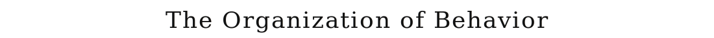
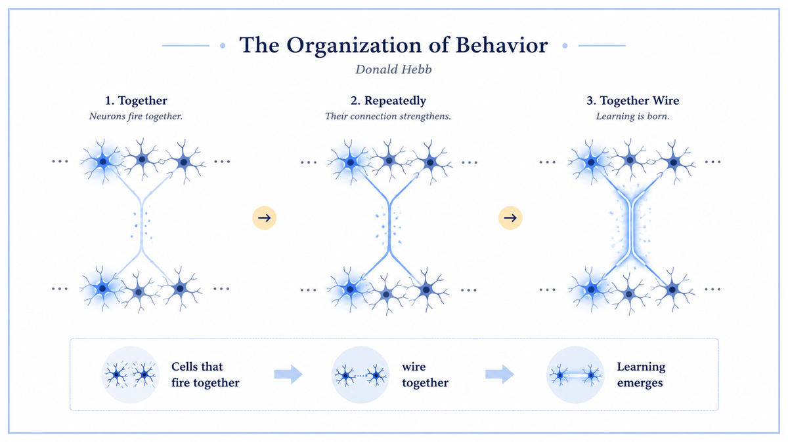

  

  <a href="https://pure.mpg.de/rest/items/item_2346268_3/component/file_2346267/content">📄 Original Book (1949)</a> · Donald Hebb (Born Chester, Nova Scotia, Canada, 1904)

<em>Six years after McCulloch and Pitts gave us a neuron that could not learn, a Canadian psychologist gave it a way to learn.</em>

---

By 1949 the McCulloch-Pitts neuron had been sitting on the table for six years. It reduced thought to logic. It could compute anything a Turing machine could compute. But it could not learn. Every connection, every threshold, every wiring decision had to be made by hand by a human designer. The brain, plainly, did not work that way. The brain wired itself.

Donald Hebb was a Canadian psychologist who had been thinking about this question since the 1930s. Born in Chester, Nova Scotia in 1904, he had studied at McGill, taught school for several years, and worked under Karl Lashley in the United States on the brain mechanisms of behavior. By the 1940s he was back at McGill, where he would spend the rest of his career. He was not a mathematician. He was not a logician. He was an experimentalist who wanted a theory of how brains actually change with experience.

The book he published in 1949, *The Organization of Behavior: A Neuropsychological Theory*, was the answer. Its central proposal occupies a single famous paragraph. When an axon of cell A is near enough to excite cell B and repeatedly or persistently takes part in firing it, some growth process or metabolic change takes place in one or both cells such that A's efficiency, as one of the cells firing B, is increased. The summary, attributed to Hebb's student Carla Shatz decades later, is shorter. Cells that fire together wire together.

This was the first specific, mechanical, biologically-plausible theory of how learning could happen at the level of individual synapses. It was a rule. It was local. It required no global teacher and no external supervisor. Two neurons in the brain, each going about its business, would update the connection between them based only on their own joint activity. Repeated co-activation strengthened the link. Over time, networks of these locally-adapting connections would self-organize into structured representations of the world.

Hebb went further. He argued that learning at the synapse could not be the whole story. The brain had to organize its activity into larger functional units. He proposed cell assemblies, groups of neurons that, through Hebbian strengthening, had become so tightly interconnected that activating any subset would activate the whole. A cell assembly was the neural correlate of a perception, a concept, an idea. Sequences of cell assemblies, each triggering the next, were the mechanism of thought itself. He called these phase sequences. Modern neuroscience has refined the picture, but the basic architecture, local synaptic learning building up to distributed assemblies building up to sequences of activation, remains the working model of the brain.

  

<em>One sentence of theory. Every neural network learning rule of the next seventy-five years descends from it.</em>

---

Before Hebb, neural networks were static circuits. McCulloch and Pitts had shown that networks of binary neurons could compute, but every wiring decision had to be made by a designer. Hebb supplied the missing piece. He gave the network a way to wire itself in response to its own experience. With this single addition, the neural network became a system that could be trained on data rather than designed by hand. The whole subsequent history of machine learning, from the perceptron in 1958 to GPT in 2025, depends on having some rule by which connections adapt to data. Hebb wrote the first such rule.

The rule was also biologically real, not just useful. Decades later, Eric Kandel won the Nobel Prize in 2000 for showing that long-term potentiation in actual brains, the strengthening of real synapses with co-activation in real neural tissue, follows essentially Hebbian dynamics. Hebb had guessed correctly from psychology and reasoning, before the biology was available to confirm it.

For AI specifically, Hebb is the bridge between McCulloch-Pitts and Rosenblatt. The 1943 paper gave you the neuron. The 1949 book gave you the learning rule. In 1958 Frank Rosenblatt put the two together and built the perceptron. The lineage continues unbroken. Hopfield networks in 1982 are explicitly Hebbian. Modern unsupervised learning, contrastive methods, and even attention mechanisms in transformers all rest on the same fundamental idea. Patterns that co-occur in the data should produce stronger connections in the model.

---

The Hebbian rule is local. To update the connection between neuron A and neuron B, the only information needed is the activity of A and the activity of B. No information from elsewhere in the network is required. This locality is what makes the rule biologically plausible. A real synapse has access only to the firing of the two neurons it connects. It cannot see what is happening across the rest of the brain.

The rule is also unsupervised. There is no teacher signal telling the network what is correct. Co-activation alone drives learning. This means a Hebbian network can extract structure from raw experience. When two events repeatedly happen together in the world, the corresponding neurons repeatedly fire together in the brain, and the connection between them strengthens. The network ends up encoding the statistical regularities of its environment without ever being told what to encode.

The cell assembly is the second concept. A cell assembly is a group of neurons whose connections, after enough Hebbian strengthening, are so dense that activating any sufficient subset activates the whole. The assembly behaves as a unit. It is the network's representation of a concept, a percept, or a memory. Modern terms for closely related ideas include attractor states, distributed representations, and embeddings. They all share the basic Hebbian intuition that meaning lives in the joint activity of many neurons, not in any single one.

The third concept is the phase sequence. Cell assemblies do not fire in isolation. One assembly, by virtue of its connections to others, activates the next assembly in turn. A trained brain has built up Hebbian-strengthened pathways between assemblies that correspond to meaningful sequences. Reasoning, planning, and recall are all phase sequences in Hebb's account.

---

Hebb's 1949 statement was qualitative. The mathematical formalization, now called the Hebbian learning rule, is

> Δwᵢⱼ = η · xᵢ · xⱼ

where wᵢⱼ is the connection strength between neurons i and j, xᵢ and xⱼ are their activities, and η is a positive learning rate. When both neurons are active, the product xᵢ · xⱼ is positive and the connection strengthens. When either is silent, the product is zero and the connection does not change.

The simple form has a problem. The weights only grow. There is no mechanism for them to shrink. A pure Hebbian network would saturate, with every connection eventually pinned at its maximum value. Modern variants address this with normalization terms or anti-Hebbian rules that weaken connections when one neuron fires without the other. The Oja rule from 1982 adds a normalization that keeps weights bounded and causes the network to converge on the principal component of its input.

Even with these refinements, the core idea is unchanged. Connections track the co-activation statistics of the inputs. Repeated co-occurrence becomes durable structure in the network. This is the algorithmic skeleton of every learning rule that came after, including Rosenblatt's perceptron rule and ultimately backpropagation, which can be derived as a generalized error-driven Hebbian rule.

---

In 1958 Frank Rosenblatt at Cornell combined the McCulloch-Pitts neuron with a Hebbian-style learning rule and produced the perceptron. The perceptron was the first neural network that could be trained on data instead of designed by hand. It learned to classify images, recognize letters, and discriminate patterns, and it set off the first wave of neural network research that would carry through the 1960s.

In 1982 John Hopfield at Caltech showed that a fully connected network with symmetric Hebbian connections could store and retrieve patterns as stable attractors of its dynamics. Hopfield networks were a direct realization of Hebb's cell assemblies, with rigorous mathematics borrowed from statistical physics. They reignited neural network research in the 1980s after the long winter that followed Minsky and Papert's perceptron critique.

The Hebbian intuition continued to spread. Self-organizing maps in the 1980s, independent component analysis in the 1990s, and the attention mechanism in transformers all use variants of the same idea. Strengthen the connection between things that co-occur. Modern large language models, in a deep sense, are Hebbian. They learn that words appearing in the same context should have similar representations because the gradient updates push their embeddings toward each other when they co-occur in the training data.

The walk forward leads next to 1950, where Alan Turing, having defined what a machine can compute, asks the harder question of whether one can think.

---

  <a href="1948b-Wiener-Cybernetics.md">← Previous: Wiener 1948</a> &nbsp;·&nbsp; <a href="../02-Birth-of-AI-(1950s)/1950-Turing-Computing-Machinery-Intelligence.md">Next: Turing 1950 →</a>

