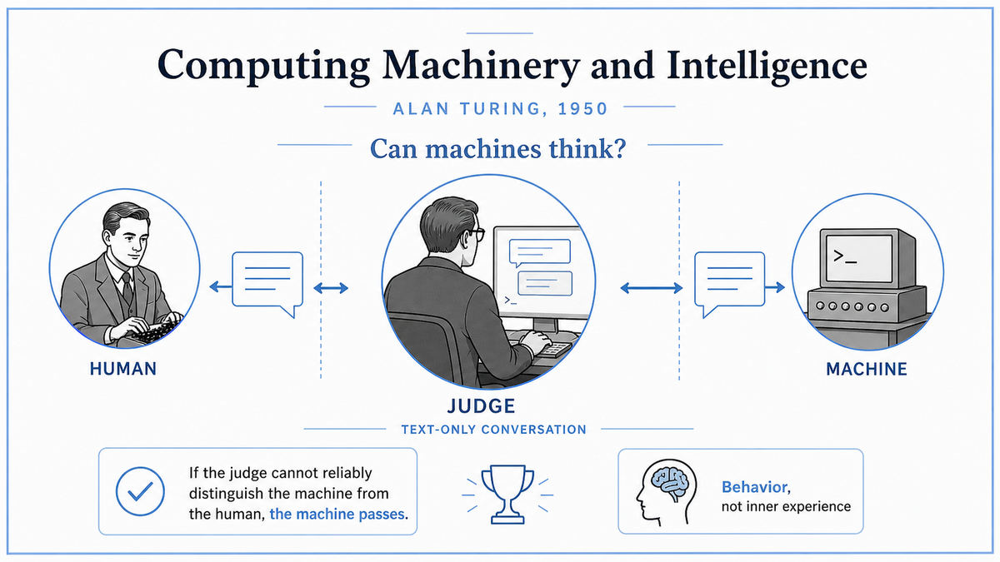

  

  <a href="https://courses.cs.umbc.edu/471/papers/turing.pdf">📄 Original Paper</a> · Alan Turing (Born Maida Vale, London, 1912)

<em>Fourteen years after he defined what a machine can do, Turing asked whether one could think.</em>

---

By 1950 Turing was 38 years old and one of the most famous mathematicians in Britain. He had survived the war, broken the Enigma cipher at Bletchley Park, helped design Britain's first electronic computers, and watched his 1936 abstract machine become the foundation of an entire industry. He was also being persecuted by the British government for being gay. He had two years left to live.

The question that obsessed him in his final productive years was different from the one in 1936. Then, he had asked what a machine could in principle compute. Now, he asked something stranger. Can a machine think?

He saw immediately that the question was a trap. The words "machine" and "think" did not have agreed-upon definitions. A debate about whether machines think would degenerate into a debate about what those words mean. Philosophers had been doing exactly that for centuries, and gotten nowhere.

So Turing did what he had done with the Entscheidungsproblem in 1936. He replaced the messy question with a precise one. He proposed a game. An interrogator sits in one room, communicating only by typed text with two hidden players, one a human and one a machine. The interrogator's job is to figure out which is which. The machine's job is to fool the interrogator. If the machine succeeds reliably, Turing argued, the question "can it think" has been settled, because there is nothing else "thinking" could mean that this game does not capture.

The paper made one prediction and ten arguments. The prediction was that by 2000, machines would have a 30 percent chance of fooling an average interrogator after five minutes of conversation. The ten arguments were rebuttals to objections he expected. The theological objection. The mathematical objection. The argument from consciousness. The argument from various disabilities. The argument from informality of behavior. Each one Turing answered, sometimes seriously, sometimes with sharp wit. He saved space at the end for one constructive idea. The way to build a thinking machine, he suggested, would not be to program adult intelligence directly. It would be to build a child machine and let it learn.

This last paragraph was perhaps the most prophetic single passage in the history of AI. Turing had described, in 1950, the basic shape of machine learning. Build a system that does not yet know what it is doing. Train it on data. Reward what works. Punish what does not. Let intelligence emerge through experience, not be hand-coded by the programmer.

  

<em>Strip away the body, the voice, the face. Leave only the words. If the machine still fools you, what else could "thinking" mean?</em>

---

Before this paper, "machine intelligence" was a fuzzy notion. After it, the field had a concrete benchmark. The Turing Test, as it came to be called, gave researchers something to aim at. Pass the test, and the question is settled. Fail it, and the work is not yet done. For seventy years, almost every public conversation about whether AI has "really" arrived has been a conversation about whether some system has passed it.

The deeper move was philosophical. Turing argued that the question "can a machine think" should be answered by external behavior, not internal state. We do not have access to other people's inner experience either. We attribute thinking to other humans because of how they behave. If a machine behaves the same way, the same attribution is justified. This was a sharp, and to many people uncomfortable, philosophical claim. It set the terms for every later debate about AI consciousness, the Chinese Room argument, and the question of whether large language models "really" understand anything.

For AI specifically, Turing did three things in this paper. He set the field's first goal. He predicted, half a century in advance, that the goal would be approachable. He sketched the technique that would eventually approach it, machine learning, decades before any working learning algorithm existed.

---

The Imitation Game has three players. An interrogator, called C. A human, called B. A machine, called A. The interrogator sits in a separate room and communicates with A and B only through typed text. The interrogator does not know which is the machine and which is the human. The interrogator's job is to find out by asking questions.

Each side responds in writing. The human tries to help the interrogator identify them correctly. The machine tries to fool the interrogator into making the wrong identification. If the machine wins this game often enough, with a wide enough range of interrogators and questions, it has, by Turing's definition, demonstrated thinking.

Turing was careful about what the test does and does not measure. It does not require the machine to look human. It does not require it to feel anything. It does not require it to be conscious in any metaphysical sense. It only requires that the machine's verbal behavior be indistinguishable from human verbal behavior under interrogation. Turing chose this carefully, because every other proposed criterion had been challenged on grounds of vagueness or unfairness.

The test has been criticized in two main directions ever since. Some argue it is too easy. A machine could pass without any real understanding, just by exploiting tricks of conversation. Others argue it is too hard. Real intelligence might exist in forms that do not look human at all and would never pass a test designed for human imitation. Both criticisms have force. Both miss what Turing was actually doing. He was not claiming the test is the final word on intelligence. He was claiming it is a clean, operational substitute for an unanswerable philosophical question.

---

This paper has no mathematics. Turing chose to write in plain English, for an audience of philosophers, in the journal Mind. The argument is structured as nine objections and nine replies, plus a closing constructive section.

The objections, in Turing's order, are the theological objection, the heads-in-the-sand objection, the mathematical objection, the argument from consciousness, the arguments from various disabilities, Lady Lovelace's objection, the argument from continuity in the nervous system, the argument from informality of behavior, and the argument from extra-sensory perception.

The most influential of these is Lady Lovelace's objection. Ada Lovelace, writing about Babbage's Analytical Engine in 1843, had argued that a machine can only do what it is told. It cannot originate anything. Turing's reply was crisp. A machine that has been programmed with a learning rule, and then trained on experience, will produce outputs its programmer never anticipated. The programmer's role is to set up the learning, not to specify the outputs. This is exactly the mechanism by which every modern neural network works.

The closing section sketches what Turing called a learning machine. It would have a child-like initial state, a means of altering its own structure based on experience, and a teacher who provides reward and punishment signals. This is the conceptual blueprint of modern reinforcement learning, written 60 years before deep reinforcement learning would actually demonstrate it on Atari games.

---

In June 1954, four years after the paper, Turing was found dead in his bedroom from cyanide poisoning, two years into a chemical castration sentence imposed for his homosexuality. He was 41. The British government issued a posthumous pardon in 2013.

His paper, however, did exactly what he hoped. It set the agenda. Within six years, John McCarthy, Marvin Minsky, Claude Shannon, and Nathaniel Rochester had organized a summer workshop at Dartmouth College to take Turing's challenge seriously. The next stop on this walk is that workshop, the moment in 1956 when "artificial intelligence" got its name.

---

  <a href="../01-The-Beginning-(1930s-40s)/1949-Hebb-Organization-of-Behavior.md">← Previous: Hebb 1949</a> &nbsp;·&nbsp; <a href="1956-Dartmouth-Workshop.md">Next: Dartmouth 1956 →</a>

