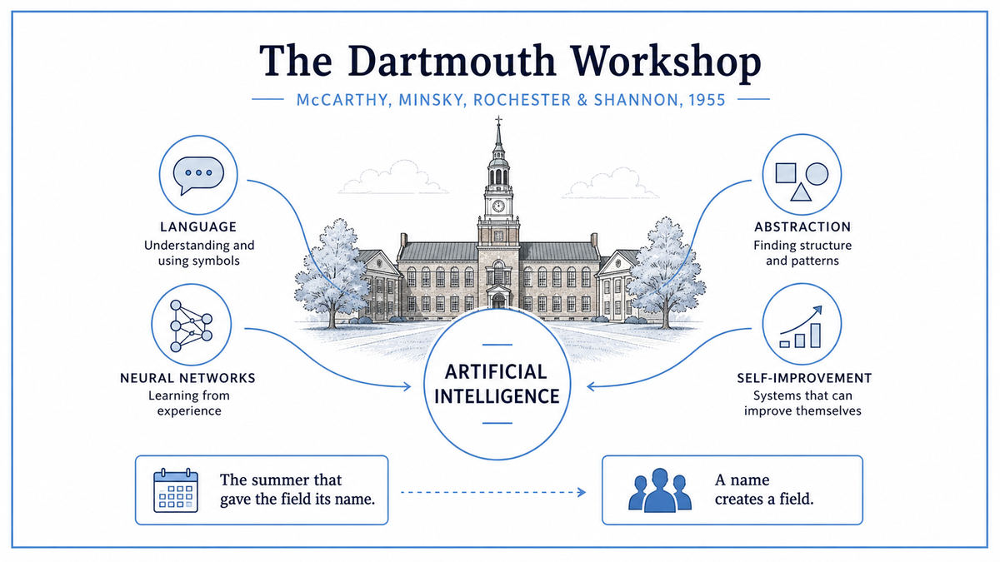

  

  <a href="http://jmc.stanford.edu/articles/dartmouth/dartmouth.pdf">📄 Original Proposal (1955)</a> · John McCarthy (Born Boston, Massachusetts, 1927), Marvin Minsky (Born New York City, 1927), Nathaniel Rochester (Born Buffalo, New York, 1919), Claude Shannon (Born Petoskey, Michigan, 1916)

<em>The summer that gave the field its name.</em>

---

In 1955 four men sat down to write a funding proposal. McCarthy was a 28 year old mathematician at Dartmouth. Minsky was 28 and at Harvard. Rochester was 36, the chief designer of the IBM 701. Shannon was 39, already famous for two foundational papers and quietly the most respected of the four. They had been talking, individually and together, about a question that fascinated all of them. Could a machine, given enough programming, do the things humans do with their minds?

The four had been around the cybernetics community for years. They had read Turing's 1950 paper. They had read McCulloch and Pitts on neurons. They had attended the Macy Conferences. They were tired of cybernetics. The label had become baggy and philosophical, and Wiener's personality dominated every room. They wanted a fresh start, with a fresh name, and a sharper agenda.

McCarthy chose the name. He proposed "artificial intelligence" deliberately, partly to avoid the word "cybernetics," partly to draw a line between this new field and the older debates about feedback and control. The name was chosen to be specific. Not "machine intelligence," not "thinking machines," not "computational psychology." Artificial intelligence, with the suggestion that the goal was to manufacture, by engineering, the same capacities that biology had produced.

The proposal, sent to the Rockefeller Foundation in August 1955, asked for funds to bring ten researchers to Dartmouth College for two months in the summer of 1956. The opening sentence stated their working assumption with stunning confidence. "Every aspect of learning or any other feature of intelligence can in principle be so precisely described that a machine can be made to simulate it." This was not a question they were investigating. It was a position they were starting from.

The proposal listed seven research topics. Automatic computers. Programming machines to use language. Neuron networks. Theory of the size of computation. Self-improvement. Abstractions. Randomness and creativity. Each of these would become a major subfield of AI. The seven topics, listed on a single page in 1955, are essentially the agenda the field has worked on ever since.

The Rockefeller Foundation gave them $7,500. The workshop ran from late June through mid August 1956. About twenty people drifted in and out across the eight weeks, including Allen Newell and Herbert Simon, who arrived with a working program called the Logic Theorist, the first AI program ever written. It could prove theorems from Russell and Whitehead's Principia Mathematica. Some of the proofs it found were more elegant than the originals.

Despite this, the workshop did not produce the breakthroughs the organizers had hoped for. People came at different times. Conversations went in different directions. No collective document emerged. McCarthy himself later said it had been disappointing as a research event. What it produced instead was much larger. It produced a field. Within a decade, AI labs would exist at MIT, Stanford, Carnegie Mellon, and Edinburgh. McCarthy founded the MIT AI Lab. Minsky co-founded it. Newell and Simon founded the Carnegie Mellon group. The four people who organized the summer had effectively appointed themselves the founding fathers of a new science.

  

<em>Four men, seven topics, eight weeks. The agenda for the next seventy years of AI research.</em>

---

Dartmouth mattered for three reasons.

First, it gave the field a name. Before 1956, work on machine intelligence was scattered across cybernetics, automata theory, operations research, and a dozen smaller communities. After 1956, there was one term: artificial intelligence. A name lets you publish papers in it, hire faculty for it, write grant proposals about it, and attract students into it. The infrastructure of a research field follows from its name.

Second, it set the agenda. The seven topics in the 1955 proposal turned out to be the actual research areas of AI. Symbolic reasoning. Natural language. Neural networks. Computational complexity. Machine learning. Knowledge representation. Creativity and search. Every modern AI system fits inside this list. The proposal authors had, with very limited information, correctly identified the seven hard problems of the field.

Third, it founded the network. McCarthy, Minsky, Newell, Simon, and others who attended became the senior generation of AI for the next thirty years. They trained the students. They led the labs. They edited the journals. They reviewed the grants. The intellectual culture of AI, including its strengths and its blind spots, came from the people who shaped it that summer in Hanover.

For the broader story of this walk, Dartmouth marks the moment when AI became a deliberate engineering project rather than a philosophical curiosity. Before Dartmouth, smart people speculated about whether machines could think. After Dartmouth, smart people built machines and tested whether they could.

---

The Dartmouth proposal was built on a single working hypothesis. Intelligence is precisely describable. Anything precisely describable can be programmed. Therefore intelligence can be programmed.

This is a strong claim. It assumes that whatever the brain does, it does by following rules sufficiently regular that they can be written down. It assumes that following the rules is enough. There is no need for biology, for embodiment, for evolution, for consciousness as a separate thing. The mind is a process, the process is computational, and any sufficiently capable computer can run it.

Most of the seven topics in the proposal flow directly from this hypothesis. If language is rule-governed, machines can use language. If concepts are formed by abstraction, machines can form abstractions. If creativity arises from controlled randomness in search, machines can be creative. The proposal assumes the answer is yes to all of these, and asks only how.

The two most influential topics, in retrospect, were neural networks and self-improvement. The neural networks topic referenced the McCulloch-Pitts work of 1943 and looked ahead to learning rules like the one Hebb had proposed in 1949. The self-improvement topic anticipated what we now call machine learning. A machine that gets better with experience does not need to be programmed for every situation. The proposal correctly identified this as the central problem of AI, even though no working algorithm for it would exist for another two years.

What the Dartmouth team underestimated, badly, was difficulty. The proposal suggested that significant progress on most of these problems could be made by ten people working together for two months. The actual time required was, on most of the seven topics, roughly five decades. The field's history of overconfidence, of hype cycles followed by AI winters, begins with the optimism of this proposal.

---

The proposal contains no mathematics. It is a research agenda, not a result. Each of the seven topics is a paragraph of prose describing what the authors hope to investigate, with the mathematics deferred to whoever takes up the problem.

The closest thing to a mathematical claim is the central conjecture. "Every aspect of learning or any other feature of intelligence can in principle be so precisely described that a machine can be made to simulate it." This is the Church-Turing thesis applied to cognition. If thinking is computation, and computation is universal, then any thinking that can be specified can be simulated.

The conjecture has not been proven. It has not been disproven. After seventy years of effort, the question of whether arbitrary human cognition can be precisely described remains open. The field's progress has been concrete on specific tasks, like image classification or text generation, but the general claim of the proposal remains a working hypothesis rather than a theorem.

What the Logic Theorist, the working program brought to Dartmouth by Newell and Simon, did demonstrate mathematically was modest but real. A computer could perform symbolic reasoning. It could search a tree of possible proof steps and find a valid path from axioms to a target theorem. The Logic Theorist proved 38 of the first 52 theorems in Chapter 2 of Principia Mathematica, sometimes finding shorter proofs than Russell and Whitehead. This was the first concrete mathematical evidence that the Dartmouth conjecture was, in at least some narrow domains, true.

---

Within two years, every major figure who would shape AI for the next generation had committed to it as their primary research field. McCarthy moved to MIT in 1957 and co-founded the MIT AI Lab with Minsky. He invented Lisp in 1958. Newell and Simon expanded the Logic Theorist into the General Problem Solver. Frank Rosenblatt at Cornell built the first working perceptron in 1958, training a McCulloch-Pitts-style network with a Hebbian-inspired rule. Arthur Samuel, who had attended Dartmouth, published a paper in 1959 on a program that learned to play checkers, coining the term "machine learning."

The next stop on this walk is 1958, where Frank Rosenblatt built the first machine that could actually learn from examples. He called it the perceptron.

---

  <a href="1950-Turing-Computing-Machinery-Intelligence.md">← Previous: Turing 1950</a> &nbsp;·&nbsp; <a href="1958a-Rosenblatt-Perceptron.md">Next: Rosenblatt Perceptron 1958 →</a>

