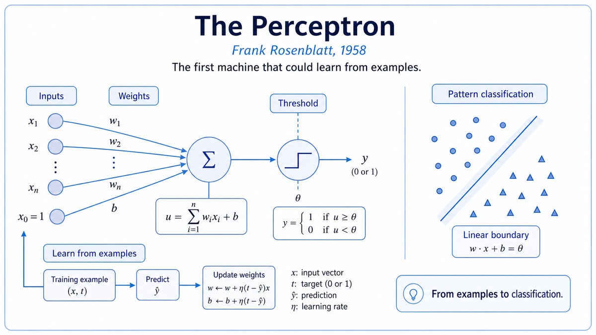

  

  <a href="https://www.ling.upenn.edu/courses/cogs501/Rosenblatt1958.pdf">📄 Original Paper</a> · Frank Rosenblatt (Born New Rochelle, New York, 1928)

<em>The first machine that could learn from its own mistakes.</em>

---

Frank Rosenblatt was 30 years old, a research psychologist at Cornell Aeronautical Laboratory in Buffalo, New York. He was an unusual figure for the AI of his moment. McCarthy and Minsky, the Dartmouth organizers, came at intelligence from logic and symbolic reasoning. Rosenblatt came at it from the brain. He had a PhD in psychology, an obsession with neurons, and a willingness to build machines instead of just theorize about them.

Rosenblatt had read McCulloch and Pitts. He had read Hebb. He understood the two pieces sitting on the table. McCulloch and Pitts had given the field a model of an individual neuron. Hebb had given the field a rule for how connections between neurons might strengthen with use. Nobody had put the two pieces together into a working machine that could actually learn.

In 1957 Rosenblatt did. On the IBM 704 at Cornell, he simulated a network of artificial neurons with adjustable weights on each connection. He fed it pictures, told it what they should be classified as, and let his learning rule update the weights when the network was wrong. After enough examples, the network started getting things right on its own. He called the machine a perceptron.

The 1958 paper presented this work formally. The title, "The Perceptron: A Probabilistic Model for Information Storage and Organization in the Brain," was deliberately ambitious. Rosenblatt was not just describing a pattern recognition algorithm. He was claiming his machine was a working theory of how the brain stored information. The brain, Rosenblatt argued, did not work by holding coded representations in addressable memory. It worked by adjusting the strength of connections between cells, exactly as his perceptron did.

Two years later, Rosenblatt and his team built a physical version called the Mark I Perceptron. It had a 20-by-20 grid of light sensors, hundreds of motorized potentiometers acting as adjustable weights, and a learning circuit that could rewire itself in response to training. The machine could learn to distinguish between simple shapes after a few hundred training examples. The New York Times reported on the demonstration. The Navy issued a press release predicting the perceptron would soon walk, talk, see, write, and reproduce itself. Rosenblatt himself was modest in print and immodest in person. He believed, without much evidence at the time, that this was the first step toward machine intelligence in general.

The hype, predictably, outran the reality. But the underlying mathematical move was real, and it survived the backlash that came nine years later. Every neural network in modern AI, including the model writing this sentence, descends directly from the algorithm Rosenblatt published in 1958.

  

<em>An artificial neuron with tunable connections, plus a rule for changing them when the answer is wrong. The whole engine of machine learning, in one diagram.</em>

---

The perceptron mattered for one reason that overshadows everything else. It learned. Before Rosenblatt, every AI system, including the Logic Theorist that had impressed the Dartmouth attendees, was hand-coded. Engineers wrote rules. The machine followed them. Behavior outside the rules required new code. The perceptron was different. The engineer specified a network architecture and a learning rule. The machine then improved its own behavior by being shown examples. The behavior emerged from data, not from the programmer.

This was a categorical break. It was the first concrete demonstration of what Turing had imagined in 1950 when he sketched the idea of a child machine that improves through training. It was the first working application of Hebb's 1949 rule about strengthening connections through experience. It was, in the language of the field, the first machine learning system worthy of the name.

The second thing it mattered for was philosophical. The perceptron showed that intelligent behavior could emerge from a network of simple units with no symbolic understanding of what they were doing. None of the individual artificial neurons knew what a triangle was. The network as a whole reliably distinguished triangles from squares. Intelligence could be a statistical property of a network rather than a logical property of a program. This idea was deeply unsettling to the symbolic AI mainstream and remains a central tension in the field today.

For the modern era, the lineage is direct. Multi-layer perceptrons. Convolutional networks. Recurrent networks. Transformers. Every modern deep learning model is a more sophisticated descendant of the same template. Inputs. Weights. A nonlinear activation. A learning rule that updates the weights based on error. The architecture has grown enormously. The basic algorithm is unchanged.

---

A perceptron has three pieces. Inputs, with a weight on each connection. A summing function that combines the weighted inputs. A threshold that turns the sum into a binary output. The McCulloch-Pitts neuron of 1943 had the same structure, with one critical difference. McCulloch-Pitts weights were fixed. Rosenblatt's weights could change.

The change was governed by a learning rule. After the perceptron made a prediction, it compared its output to the correct answer. If the answer was right, the weights stayed the same. If the answer was wrong, the weights were nudged in the direction that would have produced the right answer. The size of the nudge was controlled by a small constant called the learning rate. After enough examples, the weights settled into values that classified the training data correctly.

Rosenblatt proved a remarkable result, called the perceptron convergence theorem. If the data is linearly separable, meaning you can draw a single straight line, plane, or hyperplane that separates the two classes, then the perceptron learning rule is guaranteed to find it in a finite number of steps. The machine cannot get stuck. It cannot fail. As long as a solution exists, the algorithm will find it.

This was both the perceptron's great strength and its fatal limitation. Linear separability is a strict condition. Many real classification problems are not linearly separable. The simplest example, the XOR problem, requires the network to output 1 when exactly one of two inputs is 1, and 0 otherwise. No single perceptron can solve this. Marvin Minsky and Seymour Papert would prove this rigorously in their 1969 book, and the proof would nearly kill the field for fifteen years.

---

A perceptron computes a weighted sum of its inputs and applies a threshold:

> output = 1 if (w₁·x₁ + w₂·x₂ + ... + wₙ·xₙ) ≥ θ
> output = 0 otherwise

The weights w₁ through wₙ are the parameters being learned. The threshold θ can be absorbed into the weights as an extra input fixed at 1, which simplifies the math.

The learning rule, in modern notation, is:

> w_new = w_old + η · (target − output) · x

where η is the learning rate, a small positive constant. If output equals target, the second term is zero and weights do not change. If output is too low, the weights on active inputs increase. If output is too high, they decrease.

The perceptron convergence theorem says that if the training data is linearly separable, this update rule will converge in a finite number of steps. The proof, published by Albert Novikoff in 1962, bounds the number of weight updates by 1/γ², where γ is the geometric margin between the two classes. Larger margin means faster convergence. This idea, called margin maximization, would resurface in the 1990s as the foundation of support vector machines.

The XOR limitation comes from a geometric fact. A single perceptron with n inputs implements a hyperplane in n-dimensional space. Points on one side of the hyperplane get output 1. Points on the other side get output 0. XOR cannot be solved this way because no straight line can separate the points (0,0) and (1,1) from the points (0,1) and (1,0). They are arranged on opposite corners of a square. A multi-layer network can solve XOR, but Rosenblatt did not have a learning algorithm for multi-layer networks. That algorithm, called backpropagation, would not be popularized until 1986.

---

The perceptron set off the first major hype cycle in AI history. Funding flowed. Researchers around the world built variants. Bernard Widrow at Stanford developed the Adaline, a closely related learning machine. By the mid 1960s, perceptron research was the most active subfield in AI.

Then came 1969. Marvin Minsky and Seymour Papert published Perceptrons, a book that proved with rigorous mathematics what the perceptron could not do. Single-layer networks could not solve XOR or many other natural problems. Multi-layer networks might be able to, but no one knew how to train them. The book was widely read as a death sentence. Funding for neural network research collapsed. Rosenblatt died in a sailing accident in 1971 on his 43rd birthday, before the field could revive.

The revival came in 1986, when David Rumelhart, Geoffrey Hinton, and Ronald Williams published a paper showing how backpropagation could train multi-layer networks. The XOR problem fell immediately. From there, the lineage runs through LeCun's convolutional networks in 1989, the deep learning explosion of the 2010s, and every transformer trained today.

The next stop on this walk is also 1958. While Rosenblatt was building the first learning machine, John McCarthy at MIT was inventing a programming language designed specifically for symbolic AI. He called it Lisp.

---

  <a href="1956-Dartmouth-Workshop.md">← Previous: Dartmouth 1956</a> &nbsp;·&nbsp; <a href="1958b-McCarthy-Lisp.md">Next: McCarthy Lisp 1958 →</a>

