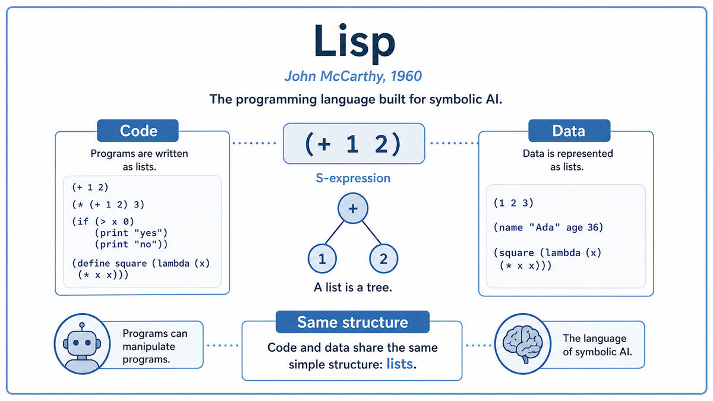

  

  <a href="https://www-formal.stanford.edu/jmc/recursive.html">📄 Original Paper (1960)</a> · John McCarthy (Born Boston, Massachusetts, 1927)

<em>The programming language built specifically to make AI possible.</em>

---

In 1956, fresh from organizing the Dartmouth Workshop, John McCarthy returned to MIT with a problem. He wanted to build AI systems. The Logic Theorist that Newell and Simon had brought to Dartmouth was impressive, but it was written in IPL, a list-processing language that McCarthy found awkward. Existing alternatives like Fortran were designed for numerical computation. None of them were built for the thing AI actually needed, which was the manipulation of symbolic structures.

What does an AI program manipulate? Not numbers. Not strings of fixed-length data. It manipulates ideas, sentences, rules, relationships. It needs to take a logical statement, transform it, combine it with other statements, and produce new statements. The natural representation for this is a tree. A logical formula like (and (or A B) (not C)) is a tree where every node is either a symbol or a list of subtrees. Every existing programming language made trees inconvenient, because trees were not what they were designed for.

McCarthy decided to design a new language from scratch. Its core data structure would be the list. Every program and every piece of data would be a list, or a list of lists, all the way down. There would be no distinction between code and data, because both would be the same thing. A program in this language could read another program as data, transform it, and run the result. The language would be able to write programs about programs.

He called it Lisp, short for List Processor. The first implementation, on the IBM 704, ran in 1958, the same year Rosenblatt unveiled the perceptron. The 1960 paper, "Recursive Functions of Symbolic Expressions and Their Computation by Machine," gave the language its formal foundation. McCarthy showed that Lisp was theoretically equivalent to a Turing machine, but easier for humans to reason about, especially when the human was trying to reason about reasoning itself.

Lisp came with several inventions that have since spread to every modern programming language. Recursion as the primary control flow. Garbage collection, the automatic recovery of memory no longer in use. Conditional expressions, the if-then-else that every modern language now has. The treatment of functions as values that can be passed around like any other data. Each of these was novel in 1958. Each is now standard.

For the next thirty years, Lisp was the language of AI. Every major AI lab used it. Every major AI textbook taught it. Every major AI system from MIT, Stanford, and Carnegie Mellon was written in it. The dominance was so complete that "AI" and "Lisp programmer" became, in the 1970s, almost synonyms.

  

<em>Lisp's central trick. Code is a list. Data is a list. They are the same kind of thing, and any program can read, modify, and execute any other program.</em>

---

Lisp mattered for two distinct reasons.

The first is craft. Lisp made it possible to write AI programs that would have been nearly impossible in any other language of the era. Symbolic manipulation, recursive search, automatic memory management, dynamic data structures, all of these were either built into Lisp or trivial to add. A researcher with an idea could prototype it overnight in Lisp, where the same idea in Fortran or Algol would have taken weeks. The pace of AI research in the 1960s and 1970s was set, in part, by the productivity of Lisp.

The second is conceptual. By unifying code and data, Lisp made it natural to write programs that wrote programs. An AI system in Lisp could examine its own rules, modify them, generate new ones, and execute the result. This is called metaprogramming, and Lisp was the first language to make it a routine activity rather than a special trick. Modern AI systems, from automated theorem provers to compiler optimizers to language model agents, all rely on this capacity. Lisp showed it was possible.

The lineage forward is wider than it looks. Lisp's direct descendants are Scheme, Common Lisp, Clojure, and Racket. Each is still in serious use. Lisp's indirect descendants are most modern programming languages. Garbage collection, first invented for Lisp, is now in Java, Python, JavaScript, Go, and Ruby. First-class functions, first practical in Lisp, are now in every functional and most procedural languages. The conditional expression, list comprehensions, recursion as a normal tool, all of these came from Lisp.

For modern AI specifically, Lisp's influence is more indirect. Most modern deep learning is written in Python, not Lisp. But the conceptual moves that Lisp pioneered, especially the treatment of programs as data, run through every neural architecture search system, every program synthesis tool, and every language model that generates code.

---

A Lisp program is built from one structure called the S-expression, where S stands for symbolic. An S-expression is either an atom, like a number or a symbol, or a list of S-expressions enclosed in parentheses. That is the entire syntax of the language. There are no semicolons, no curly braces, no statement terminators. There are only atoms and lists.

The expression (+ 2 3) is a list with three elements. The first element is the symbol +. The second is the number 2. The third is the number 3. To Lisp, this is just data, a list of three things. But Lisp also has a rule for treating data as code. To evaluate a list, treat the first element as a function and the rest as its arguments. Under this rule, the list (+ 2 3) is also a program that adds 2 and 3, returning 5.

Because code and data have the same shape, programs can manipulate other programs as easily as they manipulate any other data. This is why Lisp programs can write Lisp programs. A function that takes a program as input, transforms it, and returns a new program is just another Lisp function operating on lists. There is no separate macro language, no template system, no code generator. There is only Lisp, manipulating Lisp.

Recursion is the natural control structure in Lisp. To process a list, you handle the first element, then recursively process the rest of the list. This style is called list processing, and it is what gives the language its name. Modern languages have caught up by adding map, filter, and reduce as built-in operations. In Lisp, these were the original tools.

The interpreter is the closing trick. McCarthy showed in his 1960 paper that the entire Lisp language could be defined in about half a page of Lisp code. A Lisp program called eval can read any other Lisp program and execute it. The language is, in this sense, self-describing. Its specification fits inside itself.

---

Lisp is built on Alonzo Church's lambda calculus, the same formal system that, alongside Turing machines, defines what is computable. McCarthy borrowed the lambda notation directly. A function in Lisp that takes x and returns x squared is written, in modern syntax, as (lambda (x) (* x x)). This is essentially Church's notation with a different bracket style.

The language has seven primitive operations from which everything else can be built. quote, atom, eq, car, cdr, cons, and cond. From these seven, plus the ability to define functions and call them recursively, every Lisp program ever written can be assembled.

McCarthy's most famous theoretical contribution in the paper is the universal Lisp interpreter, called eval. In half a page, he wrote a Lisp function that takes any Lisp expression as input and returns its value. This function, written in Lisp itself, demonstrated that Lisp was self-hosting. Paul Graham later called this construction "the Maxwell's equations of software," because it captured the essence of computation in a form so compact that it has not been improved upon in sixty years.

The seven primitives map directly to set operations and elementary logic. car returns the first element of a list. cdr returns the rest. cons builds a list from a head and a tail. atom tests whether something is an atom. eq tests equality. quote prevents evaluation. cond is conditional branching. From these, Lisp builds everything.

---

Lisp's reign at MIT and Stanford lasted three decades. Throughout the 1960s, 70s, and 80s, almost every major AI system was written in it. Macsyma, the first symbolic mathematics program. SHRDLU, the language understanding system. Macsyma's descendants Maple and Mathematica. Expert systems like MYCIN and DENDRAL. The first emacs editor. The Lisp Machine, an entire computer architecture optimized for running Lisp, sold by companies like Symbolics and Lisp Machines Inc through the 1980s.

The reign ended in the 1990s, partly because of Lisp's own success. The features that made Lisp special, like garbage collection and dynamic typing, were adopted by mainstream languages. Python and Java, easier to learn and faster to deploy, captured the AI workflow. By 2010, almost no new AI system was written in Lisp. The legacy code at older institutions persisted, but new work moved on.

What survived was the conceptual contribution. The idea that programs should manipulate other programs is now everywhere, from automatic differentiation in PyTorch to code generation by language models. The next stop on this walk is also 1958. The same year that gave us the Perceptron and Lisp also produced a quiet hardware breakthrough that would, eventually, make both of them run a billion times faster.

---

  <a href="1958a-Rosenblatt-Perceptron.md">← Previous: Rosenblatt Perceptron 1958</a> &nbsp;·&nbsp; <a href="1958c-Integrated-Circuit.md">Next: Integrated Circuit 1958 →</a>

