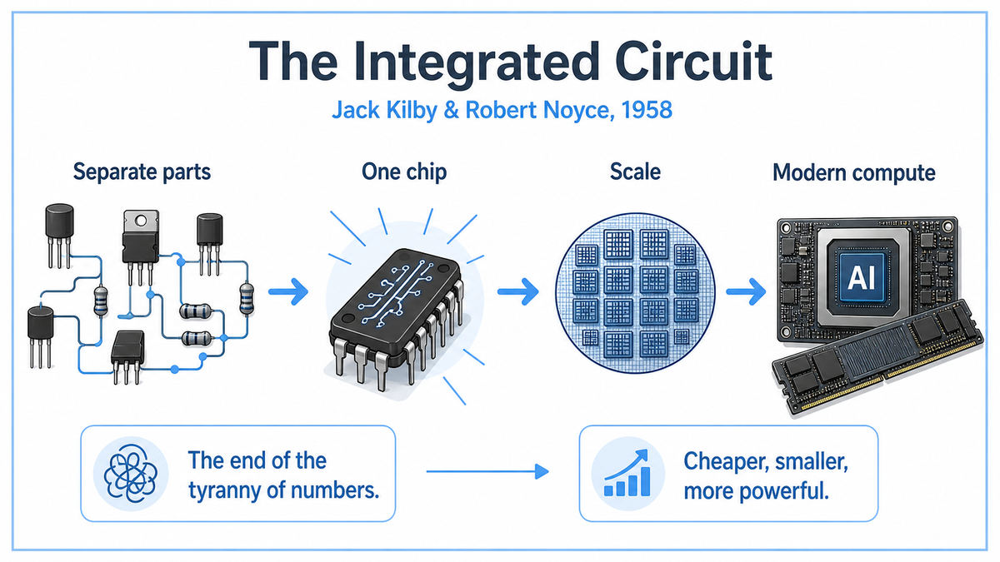

  

  <a href="https://www.computerhistory.org/siliconengine/practical-monolithic-integrated-circuit-concept-patented/">📄 Technical History (Computer History Museum)</a> · Jack Kilby (Born Jefferson City, Missouri, 1923), Robert Noyce (Born Burlington, Iowa, 1927)

<em>Eleven years after the transistor was invented, two men, working separately, found a way to put many of them on a single piece of silicon.</em>

---

By 1958 the transistor was eleven years old and had a serious problem. It worked. The problem was that it worked too well. Engineers wanted more of them. A radio used a few. A computer used a few thousand. The Air Force wanted a flight computer with hundreds of thousands. Each transistor had to be individually manufactured, individually packaged, and individually wired to its neighbors. The wiring alone would take months. The yield, the fraction of working circuits after assembly, dropped exponentially as the count grew. The industry called this the "tyranny of numbers." Without a solution, the future of electronics was capped.

Jack Kilby was a 35 year old engineer who had just joined Texas Instruments in May 1958. He was new enough that he was not eligible for the company's standard summer vacation. While his colleagues took the last two weeks of July off, Kilby sat alone in a deserted lab in Dallas, thinking about the tyranny of numbers.

His insight came in late July. The problem was that engineers were assembling circuits from different materials. Transistors were silicon. Resistors were carbon. Capacitors were ceramic. Wires were copper. Five different materials, five different manufacturing processes, five different ways for things to go wrong at assembly. What if all the components were made from the same material? What if they were all etched into a single slab of semiconductor at the same time? No assembly. No wiring between components, only the chip itself. Mass production became possible.

On September 12, 1958, Kilby demonstrated the first working integrated circuit. It was a sliver of germanium half an inch long with two transistors, three resistors, and a capacitor, all formed in the same piece of material, all connected by tiny wires bonded to the surface. He attached it to an oscilloscope, flipped a switch, and watched a clean sine wave appear on the screen. The tyranny of numbers was over.

A few months later, in January 1959, Robert Noyce at Fairchild Semiconductor in California arrived at the same idea independently. Noyce was 31, one of the eight engineers who had walked out on William Shockley two years earlier to found Fairchild. He had two crucial improvements over Kilby. He used silicon instead of germanium, which would prove easier to manufacture at scale. And he used the planar process, a manufacturing technique developed by his Fairchild colleague Jean Hoerni, which allowed the connecting wires to be deposited as flat metallic strips on the chip's oxide surface, rather than bonded by hand. Noyce filed his patent in July 1959. Kilby had filed his five months earlier.

The two patents triggered ten years of litigation. The courts eventually ruled both men inventors of the integrated circuit, with Kilby credited for the original idea and Noyce credited for the planar process that made it manufacturable. They became, in the AI era, the two patron saints of every chip ever made. When Kilby won the Nobel Prize in 2000, he opened his speech by saying that Noyce, who had died in 1990, would have shared it.

  

<em>Same circuit, different physics. Components stop being assembled. They start being grown.</em>

---

The integrated circuit changed the slope of every graph that mattered.

Before 1958, the cost of an electronic system grew roughly linearly with the number of transistors it used. Each transistor needed to be made, packaged, and wired. After 1958, the cost grew much more slowly than the count. Etching ten transistors on a chip cost barely more than etching one. Etching a thousand cost barely more than ten. Within a decade, the cost per transistor had fallen by a factor of a hundred. Within fifty years, it had fallen by a factor of a billion.

This is the cost curve that made everything possible. The smartphone in your pocket has more transistors than there were grains of rice in the world's annual harvest in 1958. None of that is possible without integrated circuits. The transistor by itself was a marvel. The integrated circuit was the marvel that made the marvel scalable.

For AI specifically, the lineage is direct. Every modern AI system is, at the lowest level, a vast integrated circuit. The H100 GPU has 80 billion transistors on a single die. The training of a large language model runs on tens of thousands of these chips operating in parallel. The energy cost of training that model is dominated by the energy cost of switching transistors. Without the integrated circuit, modern AI does not just run slower. It does not exist at all.

The IC also gave the world Moore's Law, formulated by Gordon Moore in 1965, which observed that the number of transistors on a chip doubled roughly every two years. This was not a law of physics. It was a description of what the industry had been doing and what it expected to keep doing. For the next fifty years, the prediction held. The graph of available compute, plotted against time, became the most consistent exponential in human history. Every other technology graph since 1960 is downstream of this one.

---

An integrated circuit takes the components of an electronic system and fabricates them all from the same piece of semiconductor at the same time. Where a 1957 circuit had separate transistors, resistors, and capacitors connected by wires, a 1958 integrated circuit had all of these features etched into a single slab of silicon.

The technique that made this possible is called the planar process. Start with a clean wafer of silicon. Grow a thin layer of silicon dioxide on its surface. Use photolithography, the same technique used in printing, to project a pattern onto the oxide and etch holes in specific places. Diffuse impurities through these holes to create areas of n-type and p-type silicon, which form the active regions of transistors and diodes. Repeat with different patterns for resistors and capacitors. Finally, deposit thin metal lines on top to wire everything together.

The result is a single piece of silicon that contains an entire functional circuit. Nothing has been assembled. Nothing has been soldered. Everything was created in place by a sequence of chemical and optical steps applied to the whole wafer at once.

The key advantage is parallelism. A modern chip foundry can fabricate thousands of identical chips on a single wafer in a single batch. Each step in the process applies to all of them simultaneously. A complex circuit that would have taken weeks to wire by hand in 1957 can be produced in millions of identical copies in a few days using the same technique that produced the original prototype. This is why chips became cheap. The marginal cost of an additional transistor approaches zero, because the manufacturing equipment treats the whole wafer at once.

The other key advantage is reliability. A wired circuit fails when a wire breaks or a connection corrodes. An integrated circuit has no wires in the traditional sense. Its connections are metallic patterns deposited under glass, sealed against the world. A modern integrated circuit has connection failure rates measured in failures per billion hours of operation. This reliability is what made it possible to build computers with billions of components and have them run for years without a hardware error.

---

The original Kilby integrated circuit was a slab of germanium roughly 11 millimeters by 1.5 millimeters. It contained two bipolar transistors, three resistors, and a capacitor, connected by gold bond wires welded to the chip's surface. It performed the function of a phase-shift oscillator, generating a sine wave at about 1.3 megahertz. When Kilby flipped the switch on September 12, 1958, the oscilloscope showed the wave, and the integrated circuit era began.

The Noyce silicon chip a few months later used the planar process developed by Jean Hoerni. The wafer was n-type silicon. Areas of p-type silicon were formed by diffusing boron through windows in the oxide layer. A second oxide layer was grown on top. Aluminum traces were deposited through additional windows to make the connections. This produced a true monolithic circuit, one in which every component and every connection was integrated into the same continuous structure. No bond wires. Nothing assembled.

The mathematics of integration are about feature size and yield. If a chip uses transistors of size F, the area of a chip is roughly N × F², where N is the number of transistors. Smaller F means more transistors per unit area. The cost per transistor falls as F shrinks. The yield, the fraction of chips that work, depends on defect density. Each defect on the wafer destroys one chip, regardless of how many transistors that chip contains. So when F shrinks and N grows, the cost per transistor falls dramatically.

In 1958, F was about 50 micrometers, the resolution achievable with then-current photolithography. In 1971, the Intel 4004 had F of about 10 micrometers and 2,300 transistors. In 2025, F is about 3 nanometers and a single chip can have 100 billion transistors. The progression follows Moore's Law remarkably closely. The mathematics of the original 1958 invention determined every step of this progression.

---

The chip industry exploded. Within five years, integrated circuits were being designed into everything from hearing aids to NASA's Apollo Guidance Computer. By 1971, Intel had built a complete general-purpose CPU on a single chip, the 4004, with 2,300 transistors. The microprocessor, the heart of every modern computer, was a direct descendant of Kilby and Noyce.

Noyce went on to co-found Intel with Gordon Moore in 1968, a company built entirely on the manufacture of more and more powerful integrated circuits. Moore observed in 1965 that transistor counts were doubling every two years and predicted the trend would continue. The prediction held for fifty years. By 2020, a single chip held more transistors than there are stars in the Milky Way galaxy.

For AI, the consequence was simply that the math became affordable. Training a neural network is a question of how many multiplications and additions you can do per second. The integrated circuit drove that number up by ten orders of magnitude between 1958 and 2025. Every plateau and breakthrough in AI history maps onto a corresponding inflection in chip capability. Without the IC, neural networks remain a curiosity. With it, they become the dominant technology of the era.

The next stop on this walk is 1959. Arthur Samuel at IBM was about to build a checkers program that improved with experience and, in the process, give machine learning its name.

---

  <a href="1958b-McCarthy-Lisp.md">← Previous: McCarthy Lisp 1958</a> &nbsp;·&nbsp; <a href="1959-Samuel-Machine-Learning.md">Next: Samuel Machine Learning 1959 →</a>

