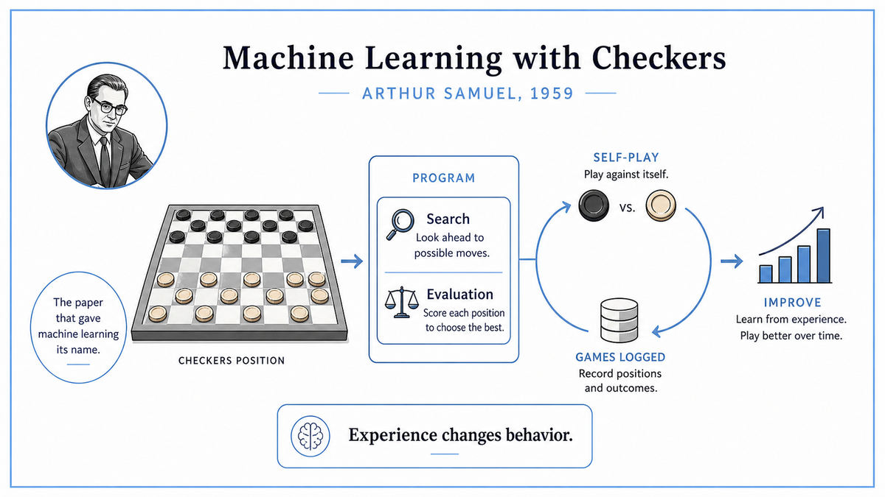

  

  <a href="https://hci.iwr.uni-heidelberg.de/system/files/private/downloads/636026949/report_frank_gabel.pdf">📄 Original Paper</a> · Arthur Samuel (Born Emporia, Kansas, 1901)

<em>The paper that gave machine learning its name, written by a 57 year old engineer who taught a computer to beat him at checkers.</em>

---

Arthur Samuel was an unlikely AI pioneer. He was 57 years old in 1959, an engineer who had spent thirty years working on vacuum tubes at Bell Labs and IBM. He was not a logician like McCarthy, not a psychologist like Rosenblatt, not a member of the Dartmouth circle. He was a hands-on hardware man who had been pulled into computer research late in his career, and his most lasting contribution to AI grew out of a hobby.

In 1947 Samuel had wagered with a colleague that he could write a program to beat any human at checkers. The wager looked easy at first. Checkers has simple rules. The board is small. Computers are fast. Samuel started writing code that would search through possible moves and pick the best one. By 1952, on the IBM 701, he had a working program. It played a legal game of checkers. It just played badly.

The reason was the same reason every game-playing program of the era played badly. The programmer had to write down, by hand, what made a good position. How important is having more pieces than the opponent. How important is controlling the center. How important is keeping pieces near the back row to be promoted. Each of these was a feature, weighted by some number that the programmer guessed. Get the weights wrong and the program played terribly. Get them right and the program played okay. Nobody knew how to get them right except by trial and error. And the programmer's intuition was the bottleneck.

Samuel saw a way around the bottleneck. The program did not need a programmer to tune its weights. The program could tune its own weights. Have it play games against itself. After each game, look at every position the winning side had been in, and slightly increase the weights of features that were present in those positions. Look at every position the losing side had been in, and slightly decrease those weights. Run thousands of games. The weights will drift toward values that produce wins.

He implemented this on the IBM 704 between 1955 and 1959. The program played itself. After every game, it adjusted its evaluation function. After thousands of games, it had taught itself to play better than Samuel could. By the early 1960s, the program was beating skilled amateur players. Samuel had built a machine that improved with experience, without anyone telling it what to do.

The 1959 paper, "Some Studies in Machine Learning Using the Game of Checkers," published in the IBM Journal of Research and Development, was Samuel's account of how this worked. The title made history. It was the first widely-read paper to use the term "machine learning" in its modern sense. Samuel defined the field in a single sentence that has been quoted ever since. Machine learning, he said, is the field that gives computers the ability to learn without being explicitly programmed.

  

<em>Two copies of the program play each other. The score is computed by a function with adjustable weights. After every game, the weights move slightly toward whatever produced wins. Repeat thousands of times.</em>

---

Samuel mattered for three reasons.

First, he gave the field its name. "Machine learning" had appeared occasionally in earlier writing, but Samuel's 1959 paper, with a working program demonstrating the concept, made the term concrete. After this paper, machine learning was the established name for any system that improved through experience. Sixty years later, the term has not changed.

Second, he proved the concept worked outside of toy demonstrations. Rosenblatt's perceptron from 1958 was a learning system, but it was a deliberately stripped-down model. Samuel's checkers program played a real game, against real opponents, at a level that could be measured against humans. It demonstrated, in 1959, that learning was not just a theoretical possibility but a practical engineering technique. The wager he made in 1947 was eventually won, decades later. Modern checkers programs descended from his work are unbeatable.

Third, he invented or anticipated several techniques that became standard. He used what we now call temporal difference learning, where the program adjusts the evaluation of an earlier position based on the evaluation of a later position. Richard Sutton would formalize this in 1988 as TD learning, the foundation of reinforcement learning. Samuel had it working in 1955. He used self-play, training the program by having it play against copies of itself. AlphaGo would use the same idea sixty years later. He used alpha-beta pruning, a search optimization that became a standard tool in game-playing AI. He used what we now call rote learning, caching positions the program had seen before. Almost every technique in modern game-playing AI traces back, in some form, to Samuel.

For the broader story of AI, Samuel demonstrated that the dream from the Dartmouth proposal was real. Machines could be built that improved through experience. The path forward for AI was not just to write smarter programs. It was to write programs that wrote themselves smarter.

---

Samuel's checkers program had three pieces. A search procedure that explored possible move sequences from the current board position. An evaluation function that scored each board position with a number. A learning rule that adjusted the evaluation function based on game outcomes.

The search was a game tree. From the current position, list every legal move. From each resulting position, list every legal move the opponent could make. Continue down for several moves, building a tree of possibilities. At the leaves of the tree, evaluate each position. Then back up through the tree, assuming the opponent will pick whatever is worst for the program and the program will pick whatever is best. The minimax procedure. The position with the best back-propagated score is chosen as the next move. Samuel added alpha-beta pruning, an optimization that skips parts of the tree once they cannot affect the final answer.

The evaluation function was a weighted sum of features. Samuel hand-picked about 38 features of a checkers position. Number of pieces. Mobility. Center control. Threats. Each feature was a number. The program multiplied each feature by a weight and summed them up. The result was the program's estimate of how good the position was.

The learning rule adjusted the weights. After each game, Samuel looked at every position the program had been in. He compared the position's score, computed by the current weights, to the score of the position seven moves later in the actual game. If the later position was better than the earlier one predicted, the weights for features active in the earlier position got nudged up. If it was worse, they got nudged down. Over thousands of games, the weights drifted toward values that made earlier positions correctly predict later outcomes.

Self-play was the secret to scale. Samuel did not have thousands of human games to learn from. He had one IBM 704. So he had the program play against itself, day and night, generating millions of training positions in the process. The same trick, on vastly more powerful hardware, is what made AlphaZero possible. Self-play eliminates the need for a human teacher.

---

Samuel's evaluation function had the form

> score(position) = w₁·f₁(position) + w₂·f₂(position) + ... + wₙ·fₙ(position)

where each fᵢ is a feature of the position, like piece count or center control, and each wᵢ is a learnable weight. The program's estimate of how good a position was, was a linear combination of features.

The learning rule, in modern notation, was an early form of temporal difference learning:

> wᵢ_new = wᵢ_old + η · [score(later position) − score(earlier position)] · fᵢ(earlier position)

If the actual outcome of the game several moves later was better than the program had predicted at the earlier position, all features active in the earlier position had their weights nudged up. If worse, nudged down. The constant η is a small learning rate.

This is essentially the rule Sutton would name TD(0) in 1988. Samuel was using it three decades earlier. The connection was not formally identified at the time, partly because reinforcement learning did not exist as a named field until the 1980s. Sutton's 1988 paper credits Samuel as the earliest known use of a temporal difference method.

Samuel also experimented with what he called signature tables, a way of grouping features into combinations rather than treating each feature independently. This was a precursor to the kind of feature engineering that dominated machine learning until the deep learning era. The IBM 704's memory was only 2,048 words of 36 bits each, so Samuel had to be ruthless about what he could afford to track. The constraints forced him toward economical representations that turned out to be theoretically interesting.

---

Samuel kept improving the checkers program for two more decades. By the mid-1970s, his program had reached strong amateur level. The line he started was eventually completed by Jonathan Schaeffer's Chinook program in the 1990s, which beat the human world champion. In 2007 Schaeffer's team proved that with perfect play, checkers always ends in a draw. Sixty years after Samuel's wager, the game was solved.

Samuel's broader legacy ran through reinforcement learning. Sutton and Barto's TD learning, which generalized Samuel's approach, became the foundation of modern reinforcement learning. TD-Gammon in 1992 used the same idea on backgammon. Deep Q-Networks in 2013 combined it with neural networks to play Atari games. AlphaGo in 2016 combined it with neural networks and self-play to beat the world champion at Go. AlphaZero in 2017 generalized further, learning chess, shogi, and Go from scratch with no human knowledge except the rules. Every one of these systems is a direct descendant of what Samuel built in 1955.

This paper closes Era 02 of this walk. We have followed the field from Turing's abstract machine in 1936, through Shannon's switching circuits, the Z3, the McCulloch-Pitts neuron, the von Neumann architecture, the Memex, the transistor, information theory, cybernetics, Hebb's learning rule, Turing's imitation game, the Dartmouth founding, the perceptron, Lisp, the integrated circuit, and now machine learning.

The next era is the 1960s. AI's first wave of optimism, when the Dartmouth promise of a thinking machine within a generation seemed within reach, and Lisp programs were beginning to do remarkable things.

---

  <a href="1958c-Integrated-Circuit.md">← Previous: Integrated Circuit 1958</a> &nbsp;·&nbsp; <a href="../03-First-Wave-Symbolic-AI-(1960s)/1965-Moore-Law.md">Next: Moore's Law 1965 →</a>

