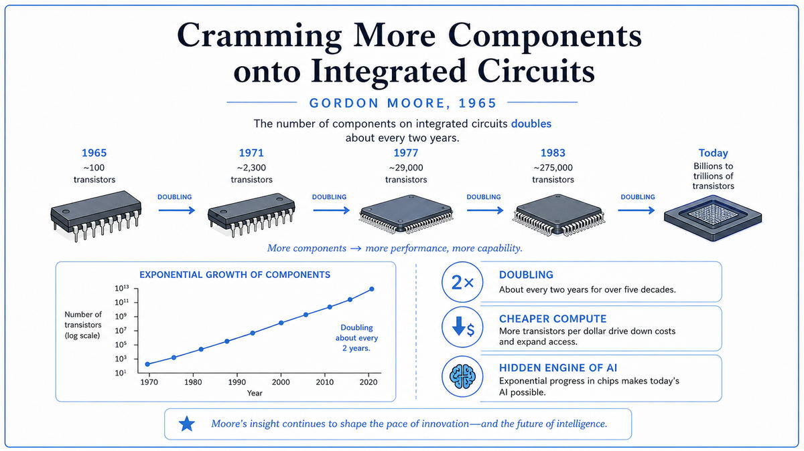

  

  <a href="https://www.cs.utexas.edu/~fussell/courses/cs352h/papers/moore.pdf">📄 Original Paper</a> · Gordon Moore (Born San Francisco, California, 1929)

<em>Five dots on a graph. A ten-year extrapolation. The most famous prediction in computing history.</em>

---

In April 1965, Gordon Moore was 36 years old and Director of Research and Development at Fairchild Semiconductor. The integrated circuit was six years old. Fairchild was selling them. So was Texas Instruments. The technology worked, but customers were nervous. Buying a new chip design meant betting on what chips would look like five or ten years out. Customers wanted some way to predict the future of the technology before they committed.

The editors of Electronics magazine asked Moore to write something for their 35th anniversary issue. They wanted predictions about where electronics was going. Moore took the assignment seriously. He pulled the cost-per-component data from Fairchild's last few years of production and plotted it against time on a logarithmic scale. He had five data points: 1959 with one component on the cheapest chip, 1962 with eight, 1963 with about 16, 1964 with about 32, and 1965 with about 64. Five dots. They formed a clean straight line on a log scale, which meant the count was doubling every year.

He wrote a four-page article called "Cramming More Components onto Integrated Circuits." In it he made a single bold claim. The doubling would continue for at least another decade. By 1975, he predicted, you would be able to put 65,000 components on a single chip. That was a thousand-fold increase from where the industry was in 1965, based on a five-point extrapolation.

The article was a marketing piece for an industry trade journal. Moore's main goal was to convince his customers that integrated circuits were the future and that they should keep designing for them. He included casual predictions of what the technology would enable. "Home computers, or at least terminals connected to a central computer." "Automatic controls for automobiles." "Personal portable communications equipment." Each of these would become a multi-trillion-dollar industry within forty years. None of them existed in 1965.

The article had no formal mathematics. It had no theory of why the doubling would continue. It had no claim that this was a law of nature. Moore was an industry insider extrapolating from a graph and predicting that engineering progress would keep happening because the economic incentives to make it happen were enormous. The prediction held for fifty years. By 1975, chips had 65,000 components, exactly as Moore had predicted. Moore revised the prediction to a doubling every two years rather than every year. That revised prediction also held, almost exactly, for the next forty years.

Carver Mead at Caltech started calling it "Moore's Law" in the mid 1970s. The name stuck. By the 1990s it had become the most quoted prediction in technology, taught in every electrical engineering curriculum, repeated in every business strategy meeting, and used as the planning baseline by every chip company on Earth.

  

<em>The original observation. Five real measurements, a straight line through them, extended forward by a decade.</em>

---

Moore's Law mattered because it became self-fulfilling. Once everyone in the industry believed the doubling would continue, every chip company planned its roadmap around it. If your competitor was going to ship a chip with twice as many transistors in two years, you had to do the same or lose the market. The prediction created the conditions for its own success. Hundreds of billions of dollars of R&D investment over fifty years was committed on the assumption that Moore's Law would hold, and the law held because the investment was committed.

The economic effect was unprecedented in human history. The cost per transistor fell from a few dollars in 1965 to about a billionth of a cent in 2025. No other technology has ever sustained that kind of compound improvement for that long. The cost of every other major industrial product, from automobiles to airliners to washing machines, has fallen by maybe an order of magnitude over the same period. The cost of computation has fallen by ten orders of magnitude. The graph is the most consistent exponential in industrial history.

For AI specifically, Moore's Law is the substrate. Every plateau and breakthrough in AI is downstream of the corresponding inflection in chip capability. The 1980s neural network revival waited for cheap memory. The 2012 deep learning explosion waited for affordable GPUs. The 2020s language model boom waited for chips with billions of transistors and enough memory bandwidth to feed them. None of these would have been possible if Moore had been wrong about the trend, or if the industry had stopped believing in it.

The deeper consequence is cultural. Moore's Law trained an entire generation of engineers, executives, and investors to expect exponential progress. Every five years, the available compute would be ten times more. Plans that looked impossible at current capability could be made on the assumption that capability would catch up. Modern AI is, in some ways, the discipline that has most fully internalized this expectation. Every paper that proposes scaling laws, every startup that bets on training a bigger model next year, every infrastructure roadmap that assumes ten times more compute in five years, is operating in a tradition Moore created.

---

Moore's original 1965 claim, in his exact words, was that "the complexity for minimum component costs has increased at a rate of roughly a factor of two per year." This is more careful than the popular version. He was talking about a specific quantity, the number of components on the most cost-effective chip, and a specific rate, doubling per year, over a specific window, the previous five years.

In 1975, with ten more years of data, Moore revised the prediction. The doubling rate had slowed to about every two years. He published a new paper acknowledging this. The "every 18 months" version that became popular through the 1980s and 90s was actually an Intel colleague's projection, not Moore's. The colleague, David House, was looking at chip performance, which combined transistor count growth with transistor speed growth and gave the faster doubling rate.

What is doubling matters. Different things were doubling at different rates over the law's history. Transistor count per chip doubled every two years. Performance per dollar doubled every 18 months. Energy efficiency per operation doubled every 18 to 24 months. Memory capacity doubled every 18 months. None of these are the same trend, although they are all related, and people often called all of them "Moore's Law" without distinguishing.

The mechanism behind the doubling was a combination of three things. First, transistors got smaller, allowing more of them per unit area. Second, manufacturing yields improved, so fewer chips were lost to defects. Third, wafer sizes grew, so more chips could be made per batch. Each of these contributed roughly an order of magnitude per decade. Multiplied together, they gave the observed exponential.

Moore's Law is now slowing. Below about 5 nanometers, transistors hit physical limits set by quantum tunneling and atomic-scale variation. The industry has not stopped progressing, but the doubling rate has lengthened, and the gains are coming more from clever architecture and specialization than from raw transistor count. Modern AI accelerators, with thousands of small cores optimized for matrix operations, represent a different kind of progress than the simple shrinkage Moore originally observed.

---

Moore's law in equation form is

> N(t) = N₀ · 2^(t/τ)

where N(t) is the number of transistors at time t, N₀ is the initial count, and τ is the doubling time. In Moore's 1965 version, τ was one year. In his 1975 version, τ was two years. The popular "performance" version used τ of 18 months.

The cost equation paired with this is

> cost per transistor ≈ C₀ · 2^(−t/τ)

If a chip with N transistors costs roughly the same as a chip with one transistor did before, the cost per transistor falls at the same rate that N rises. This is what made the law economically transformative. Doubling per chip with constant cost per chip means halving cost per function.

The physics behind the doubling involved Dennard scaling, formulated by Robert Dennard at IBM in 1974. Dennard observed that as transistors shrink, their voltage and current scale down proportionally, so power density stays constant. A chip twice as dense uses the same power. A chip twice as dense at the same power runs twice as fast. Dennard scaling held until about 2005, when leakage currents in very small transistors broke the relationship. Since then, chips have continued to grow in transistor count but stopped getting faster per core. This is why modern processors have many cores rather than one fast core.

The compound effect is what makes the numbers wild. From 1965 to 2025 is sixty years. At one doubling every 18 months, that is 40 doublings, or a factor of about 10^12. The actual count of transistors on a typical chip went from about 60 in 1965 to about 100 billion in 2025. That is a factor of 1.7 × 10⁹. The actual progress was somewhat slower than Moore's original prediction would have implied, because the rate slowed several times over the decades. But the order of magnitude is right.

---

Moore co-founded Intel with Robert Noyce in 1968, three years after the article. Intel built its business around staying on the curve Moore had described. By 2000 it was the largest semiconductor company in the world. Moore died in 2023, having watched his casual industry prediction become the most influential observation in technology history.

For AI, the next stop on this walk is 1966. Joseph Weizenbaum at MIT had just released a small program called ELIZA. It was the first chatbot. It was meant as a warning about how easily humans anthropomorphize machines. People took the warning as an inspiration instead.

---

  <a href="../02-Birth-of-AI-(1950s)/1959-Samuel-Machine-Learning.md">← Previous: Samuel 1959</a> &nbsp;·&nbsp; <a href="1966-Weizenbaum-ELIZA.md">Next: Weizenbaum ELIZA 1966 →</a>

