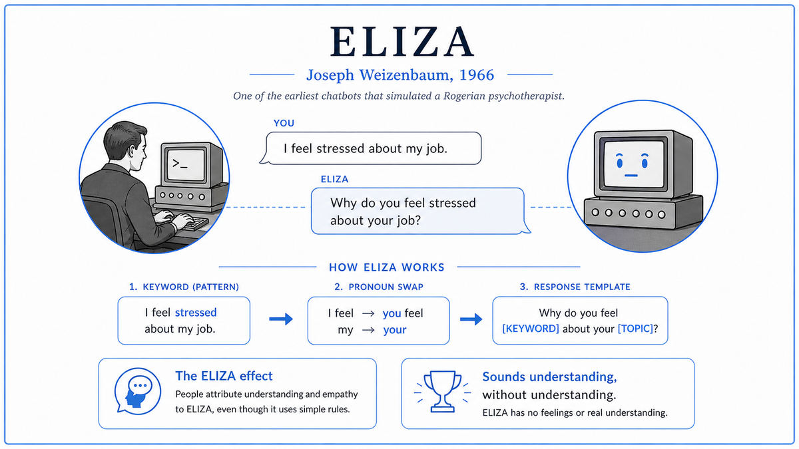

  

  <a href="https://dl.acm.org/doi/pdf/10.1145/365153.365168">📄 Original Paper (1966)</a> · Joseph Weizenbaum (Born Berlin, Germany, 1923)

<em>The first chatbot. Its creator spent the rest of his life warning people to take it less seriously than they did.</em>

---

Joseph Weizenbaum was a German Jewish refugee. His family had escaped Berlin in 1936 when he was 13 years old, fleeing the rising Nazi state. By 1963 he was an associate professor of computer science at MIT, working on a list-processing language called SLIP. He was a serious programmer with a deep skepticism of grand claims about artificial intelligence.

Around 1964, Weizenbaum decided to demonstrate something he believed should be obvious. He wanted to show that a computer could appear to converse with a human while having no understanding whatsoever. He thought this would be a useful warning. Researchers in the AI community had been making confident predictions that machines would soon understand natural language. Weizenbaum suspected the apparent successes were tricks, and he wanted to expose the trick.

He wrote a program he called ELIZA. The name came from the character in Shaw's play Pygmalion, the flower girl who is taught to imitate refined speech without actually becoming refined. ELIZA was, by design, a flower girl. It used pattern matching to recognize templates in user input, and a script of rules to produce templated responses. It had no model of meaning. It had no memory of previous turns. It had no representation of facts about the world. It just rewrote what the user said into a question that sounded like reflective listening.

The most famous script was called DOCTOR. It was modeled on the conversational style of a Rogerian psychotherapist, the kind of therapist who asks open questions and reflects the patient's words back. Weizenbaum chose this style for a specific reason. A Rogerian therapist plausibly knows nothing about the patient's life and asks questions that draw the patient out. ELIZA's lack of knowledge was, in this script, indistinguishable from professional restraint.

The result was uncanny. People who knew ELIZA was a computer program with about a hundred rules became emotionally engaged in conversations with it. Weizenbaum's own secretary, who had watched him build the program from scratch, asked him to leave the room so she could have a private conversation with it. Doctors saw the program and started suggesting it might be useful for actual patient care, since psychiatrists were expensive and computers were not. None of these reactions matched what Weizenbaum thought he had built. He thought he had built a satire. The world treated it as a discovery.

The 1966 paper, in Communications of the ACM, described ELIZA technically. The aftermath became Weizenbaum's life work. In 1976 he published Computer Power and Human Reason, a book-length argument that AI researchers, journalists, and the general public were systematically overestimating what computers could do, and that the gap between simulating intelligence and possessing intelligence mattered enormously. He spent decades, until his death in 2008, as the field's loudest internal critic.

  

<em>The whole trick. There is no model of language, no understanding of feelings. There are only patterns and rewrites.</em>

---

ELIZA mattered for two reasons that pulled in opposite directions.

The technical contribution was modest. ELIZA was the first widely-known program that engaged in conversation with humans in natural English. It demonstrated that pattern matching, with a carefully chosen script, could produce surprisingly engaging dialogue. The technique it used, called rule-based natural language processing, dominated the field for the next thirty years. Every chatbot from ELIZA through to AI Pygmalion, Racter, ALICE, and SmarterChild used essentially the same approach. Modern voice assistants like the early Siri and Alexa still used rule-based pattern matching for many of their responses. The line from ELIZA to ChatGPT runs through dozens of these systems.

The cultural contribution was much larger. ELIZA exposed something about humans that nobody had quite seen before. People are willing to attribute understanding, empathy, and even emotional connection to a system that has none of these things, as long as the system follows the surface conventions of conversation. This phenomenon, now called the ELIZA effect, has shown up in every generation of AI since. Users falling in love with chatbots. Users disclosing private trauma to systems they know are programs. Users believing language models are conscious. The pattern is the same. ELIZA was the first time anyone documented it.

For modern AI, this is the deeper lesson. The question of whether a system actually understands what it is saying is, from the user's perspective, often invisible. If the surface behavior is convincing, humans will fill in the rest. This was Weizenbaum's warning in 1966. The field of AI has spent sixty years either ignoring it or rediscovering it.

---

ELIZA had two parts. A general engine that did pattern matching and substitution, and a script that defined the patterns and substitutions for a particular conversational domain. The engine was about 200 lines of MAD-SLIP. The DOCTOR script was a few hundred rules. Together they produced the illusion of a therapist.

A rule had three pieces. A keyword that triggered the rule. A pattern that the user's input had to match. A template for the response. When the user typed something, ELIZA looked for keywords in the input, sorted by priority. For each matched keyword, it tried the patterns associated with that keyword. The first pattern that matched was used to generate a response from the template.

The patterns used wildcards. A pattern like "my * is *" would match "my mother is angry" or "my computer is broken" or "my back is sore." The template would refer to the matched fragments by position. If the pattern was "my * is *" and the template was "Tell me more about your *1," then "my mother is angry" became "Tell me more about your mother." Pronouns were swapped automatically. "I" became "you." "me" became "you." "my" became "your." This pronoun reversal alone produced startlingly conversational output.

When no pattern matched, ELIZA had fallback responses. "Please go on." "I see." "Why do you say that?" These generic prompts kept the conversation moving when the engine had nothing specific to say. The fallbacks were carefully chosen to encourage the user to keep typing without revealing how little ELIZA understood. They were, in retrospect, the most therapeutically respectable parts of the program.

The DOCTOR script was deliberate genius. By choosing a Rogerian therapist as the model, Weizenbaum made ignorance look like a virtue. A therapist who asks questions rather than giving answers does not need to know anything about the patient. ELIZA did not need to know anything about anybody. The script and the technique were perfectly matched to each other.

---

There is no real mathematics in ELIZA. The engine is a pattern-matching machine, not a model. The closest thing to a formal idea is the structure of the patterns themselves.

A pattern is a sequence of literal words and wildcards. The wildcards bind to substrings of the user's input. The matching algorithm walks through the pattern and the input together, trying to find a binding for each wildcard such that the literals line up correctly. If a binding exists, the pattern matches and the wildcards have known values. If no binding exists, the pattern fails and the engine moves on to the next rule.

When a pattern matches, the response template is filled in by substituting the wildcard bindings. The pronoun reversal is applied to the substituted text, so that what the user said about themselves is reflected back as something about them. The result is grammatically reasonable English that has the same topical content as the user's input but in question form.

The full ELIZA engine is roughly equivalent to a finite-state machine that processes one input at a time, transitions based on keyword matches, and emits one output per turn. There is no internal state that persists across turns in any meaningful way. Each interaction is independent. This is why ELIZA cannot remember what you said two turns ago. It also cannot contradict itself, because it has no self.

The contrast with a modern language model is sharp. Modern systems have hundreds of billions of parameters, learned from text rather than written by hand, that produce contextually rich responses with apparent memory across long conversations. But the human reaction to them is recognizably the same as the reaction to ELIZA. The ELIZA effect scales. The technology underneath has changed completely. The phenomenon Weizenbaum documented in 1966 has not.

---

ELIZA seeded an entire lineage of chatbots, expert systems, and natural language interfaces. Within a decade, programs like SHRDLU, PARRY, and Racter had pushed the rule-based approach much further. Expert systems through the 1980s, including MYCIN for medical diagnosis and DENDRAL for chemistry, were built on the same foundation of hand-coded rules and pattern matching. The line of descent runs through AOL's SmarterChild in 2001, Apple's Siri in 2011, and Amazon's Alexa in 2014, all of which used rule-based methods alongside more modern statistical components.

The current generation of large language models broke from the rule-based tradition entirely. Instead of writing patterns by hand, they learn to predict the next word from massive corpora of text. The behavior they produce is vastly richer than ELIZA's. The user reaction to them, however, is the same one Weizenbaum saw in 1966. People form emotional attachments. People disclose private information. People attribute understanding the system does not have.

The next stop on this walk is 1969. Marvin Minsky and Seymour Papert were about to publish a book called Perceptrons, a rigorous mathematical critique that would devastate Rosenblatt's neural network research and trigger the first AI winter.

---

  <a href="1965-Moore-Law.md">← Previous: Moore's Law 1965</a> &nbsp;·&nbsp; <a href="1969-Minsky-Papert-Perceptrons.md">Next: Minsky-Papert Perceptrons 1969 →</a>

