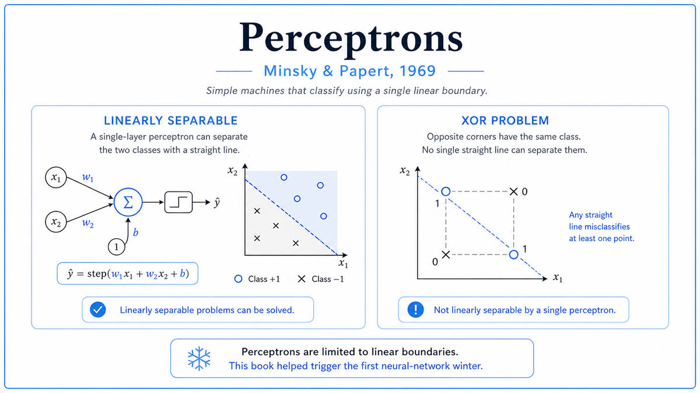

  

  <a href="https://mitpress.mit.edu/9780262630221/perceptrons/">📄 Original Book (1969)</a> · Marvin Minsky (Born New York City, 1927), Seymour Papert (Born Pretoria, South Africa, 1928)

<em>The book that proved what perceptrons could not do, and accidentally killed neural network research for fifteen years.</em>

---

By 1968, Marvin Minsky had been frustrated with neural networks for over a decade. He had written his PhD thesis on them in 1954. He had attended the Dartmouth Workshop in 1956. He had watched, with increasing skepticism, as Frank Rosenblatt's perceptron drew enormous funding and even more enormous press coverage through the early 1960s. Minsky and Rosenblatt had known each other since high school. They were friends in a sharp, debating way. Minsky thought Rosenblatt was making promises the perceptron could not deliver, and he suspected the math could prove it.

Seymour Papert was a South African mathematician who had arrived at MIT in 1963 from Geneva, where he had worked with Jean Piaget on child development. Minsky and Papert met at a London symposium in 1960 and discovered they had each independently proven the same theorem. They became collaborators. By 1965 they had decided to write a book together. The book would be a rigorous mathematical analysis of what perceptrons could and could not compute.

The work took longer than expected. Mathematical problems they assumed would be straightforward turned out to be subtle. Theorems they expected to prove easily required entirely new techniques. The book they finally published in 1969 was a thin volume of dense mathematics called Perceptrons: An Introduction to Computational Geometry. They dedicated it to Frank Rosenblatt.

The book proved, with full rigor, several things about single-layer perceptrons that Rosenblatt's enthusiasts had been glossing over. The most famous result was about XOR, the simple function that returns 1 when exactly one of two inputs is 1. A single-layer perceptron, the kind Rosenblatt had built, cannot compute XOR. It cannot, in fact, compute any function whose two output classes are not linearly separable. The proof was elementary. Two inputs and two outputs map to four points on a square. XOR places the two output-1 points at opposite corners of the square. No straight line through the square can put both of those corners on one side and both of the output-0 corners on the other.

This was an embarrassing limitation. XOR is not an obscure function. It is a fundamental Boolean operation, the most natural test case for any logic circuit. A learning machine that cannot learn XOR is severely limited as a model of cognition. But the book did not stop there. It also proved, through more elaborate mathematics, that single-layer perceptrons could not compute parity, could not reliably compute connectedness of figures in an image, and could not compute several other natural geometric predicates. The class of functions that single-layer perceptrons could learn was, mathematically, much smaller than Rosenblatt and his followers had implied.

About multi-layer perceptrons, the kind with hidden layers between input and output, the book was less definitive. There was no learning algorithm for multi-layer networks at the time. Backpropagation would not be popularized until 1986. So Minsky and Papert wrote, in a brief and now-infamous passage near the end of the book, that they thought the limitations of single-layer perceptrons probably extended to multi-layer ones in some form, but that this was an "intuitive judgment" rather than a proven result. The hedge was important. The reader response was not.

The AI research community, and especially the funders who had been pouring money into perceptron research, read the book as a death sentence. Funding for neural network research collapsed within two years. Rosenblatt died in a sailing accident in 1971, age 43. The first AI winter, in which neural networks were considered a discredited research direction, began and lasted until the mid 1980s. When backpropagation arrived in 1986 and demonstrated that multi-layer networks could in fact solve XOR and many other problems, the field rebooted, but with most of the original generation of researchers either dead, retired, or moved on.

  

<em>AND can be solved by a perceptron. XOR cannot. The four corners of a square are arranged so that no single line through the square gets all the answers right.</em>

---

Perceptrons mattered for two opposite reasons.

In the short term, it killed the field. The book was rigorous. Its proofs were correct. Its conclusions, narrowly read, were unimpeachable. The combination of mathematical authority and the personal stature of the authors (Minsky was already one of the most respected figures in AI) gave the book enormous weight. Funders, reading the book as proof that perceptrons were a dead end, redirected their money toward symbolic AI. Researchers who had built careers on neural networks either changed fields or watched their grants disappear. By 1972 the perceptron community had effectively dissolved.

In the long term, the book set the agenda for the next generation. The specific limitations Minsky and Papert proved became the targets that future neural network research had to overcome. XOR became the standard benchmark, the function that any new architecture had to be able to learn or be dismissed. When backpropagation appeared in 1986, the first thing Rumelhart, Hinton, and Williams demonstrated was that their multi-layer network could solve XOR. The book had defined the bar that the next breakthrough had to clear, and that breakthrough cleared it.

The deeper lesson is about the politics of mathematical results. Minsky and Papert had proven a precise statement, that single-layer perceptrons cannot compute certain functions. The reading public, including many researchers, took it as a more general statement, that neural networks of any kind cannot compute those functions. The authors knew this was overreach but did not loudly correct it. The misreading became consensus, and the consensus changed the field.

For modern AI, the cautionary tale is sharp. Mathematical proofs about specific architectures are precise. Their interpretations in popular discourse are not. A correct theorem about today's models, reread through future hardware and future algorithms, may turn out to apply only to today's models, not to the deeper question the theorem appeared to settle.

---

A single-layer perceptron, in the form Minsky and Papert analyzed, has three pieces. A retina of input units. A layer of feature detectors that look at small regions of the retina. A single output unit that takes a weighted sum of the feature detector outputs and applies a threshold. Each feature detector can compute any function of its local input region, but the output unit can only do a weighted sum followed by a threshold.

The geometric interpretation is what makes the theorems possible. Each input pattern is a point in a high-dimensional space. The output unit, computing a weighted sum and threshold, defines a hyperplane in that space. Patterns on one side of the hyperplane get output 1. Patterns on the other side get output 0. The perceptron learning rule adjusts the position of this hyperplane based on errors.

This works perfectly when the two classes of patterns can be separated by a hyperplane. It fails when they cannot. Linear separability, formally, means that for some choice of weights, every pattern of class 1 gives a positive weighted sum and every pattern of class 0 gives a negative one. If no such weights exist, the perceptron cannot learn the function.

XOR is the smallest example. The four input patterns are (0,0), (0,1), (1,0), (1,1). The XOR outputs are 0, 1, 1, 0. The two output-1 patterns sit at (0,1) and (1,0), opposite corners of the unit square. The two output-0 patterns sit at (0,0) and (1,1), the other two corners. No line through the square can put both 1-corners on one side and both 0-corners on the other. The function is not linearly separable.

A multi-layer network can solve this by composing two linear classifiers with a nonlinearity in between. The first hidden unit can learn "(0,1) or (1,0)". The second hidden unit can learn "not (1,1)". The output unit can combine these. Three units total, two layers, and XOR is solved. But Minsky and Papert had no learning algorithm for multi-layer networks, and they were skeptical that one could be built. They were wrong. Backpropagation, seventeen years later, was that algorithm.

---

Minsky and Papert defined a perceptron formally as a function

> ψ(X) = 1 if Σᵢ αᵢ φᵢ(X) > θ, else 0

where X is the input pattern, the φᵢ are local feature detectors of bounded complexity, the αᵢ are real-valued weights, and θ is a threshold. The constraint of "bounded complexity" on the feature detectors is what they called the order of the perceptron. Order 1 means each feature detector looks at one input. Higher orders allow each detector to combine multiple inputs.

Their main theorems took the form "no perceptron of finite order can compute predicate P." For XOR, they proved this for order 1. For parity, the function that returns 1 when an odd number of inputs are active, they proved that no perceptron of finite order can compute it for arbitrarily large inputs. For connectedness, the predicate that returns 1 if a figure in the input is topologically connected, they proved a similar unboundedness result.

The proofs use a technique they called the group invariance theorem. If a function is invariant under some group of transformations of the input, then any perceptron computing it must respect that invariance, which constrains the form of the perceptron and the size of its feature detectors. For parity, the relevant group is permutation of inputs. For connectedness, it is more complex spatial transformations. The technique generalized cleanly and let them prove negative results that direct computation could not have produced.

The hedge about multi-layer networks appears on page 232. They wrote that they believed extensions of perceptrons to additional layers would suffer "essentially the same kinds of limitations" as single-layer ones, but they admitted this was an "intuitive judgment" without a proof. The reading public skipped the hedge. The 1988 expanded edition of the book contained an epilogue in which Minsky and Papert defended their original judgment, arguing that the apparent successes of multi-layer networks in the 1980s did not actually contradict their book. The defense was ungenerous and not entirely convincing. By then, the damage and the recovery had both already happened.

---

The fifteen years after Perceptrons were quiet for neural networks and noisy for symbolic AI. Expert systems, theorem provers, and rule-based reasoning systems became the dominant research directions through the 1970s. The label "connectionism" disappeared from grant proposals. A few researchers, including Stephen Grossberg, Teuvo Kohonen, and Geoffrey Hinton, kept working on neural networks but in much smaller communities, often without grant funding.

The revival came in 1986 with the publication of "Learning representations by back-propagating errors" by David Rumelhart, Geoffrey Hinton, and Ronald Williams. The paper presented backpropagation, a learning algorithm that could train multi-layer networks. The first demonstration was XOR. The Minsky-Papert wall came down. From there the lineage runs through LeCun's convolutional networks in 1989, the deep learning explosion in the 2010s, and every modern transformer.

This paper closes Era 03. The 1960s ended with AI funding strong, expert systems on the rise, and the perceptron community fractured. The 1970s would bring the first AI winter, as the symbolic systems also failed to deliver on their grandiose promises and the Lighthill Report cut British AI funding to almost nothing.

The next stop on this walk is 1971. Three engineers at a small chip company called Intel were about to ship the first general-purpose microprocessor on a single chip. They called it the 4004.

---

  <a href="1966-Weizenbaum-ELIZA.md">← Previous: Weizenbaum ELIZA 1966</a> &nbsp;·&nbsp; <a href="../04-First-AI-Winter-(1970s)/1971a-Intel-4004.md">Next: Intel 4004 1971 →</a>

