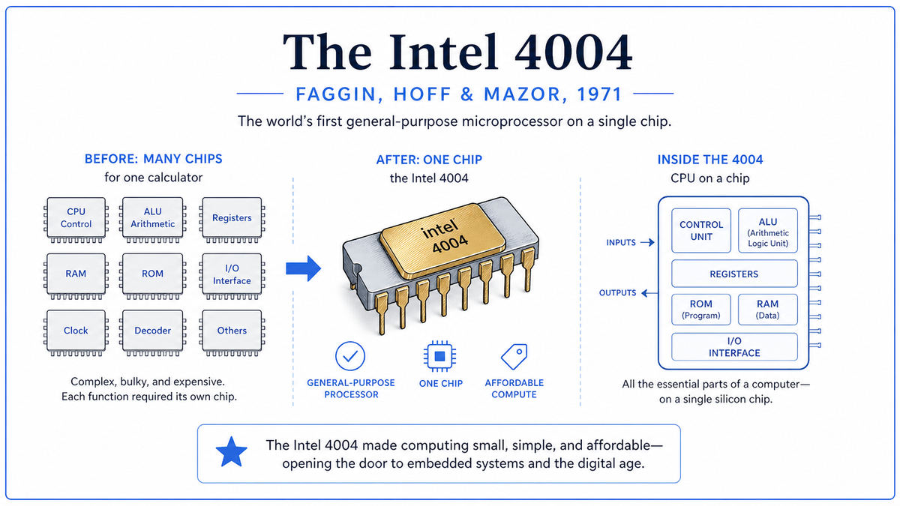

  

  <a href="https://www.intel.com/content/www/us/en/history/virtual-vault/articles/the-intel-4004.html">📄 Technical Analysis</a> · Federico Faggin (Born Vicenza, Italy, 1941), Ted Hoff (Born Rochester, New York, 1937), Stan Mazor (Born Chicago, Illinois, 1941)

<em>An entire computer's central processor, on a chip the size of a fingernail.</em>

---

In April 1969, the Japanese calculator company Busicom approached Intel with a contract. They wanted twelve custom chips designed to power a new programmable desktop calculator. Each chip would handle one specific function. Twelve chips, twelve different designs, all custom, all useful only for this one calculator.

Intel was a small company, less than two years old, with about a hundred employees. The contract was assigned to Ted Hoff, a 31 year old Stanford PhD who had recently joined as employee number 12. Hoff looked at Busicom's twelve-chip plan and decided it was crazy. Twelve custom chips meant twelve separate engineering projects, twelve sets of masks, twelve manufacturing lines. The total cost would be enormous. The chips would be useful only for this one calculator.

The better way was a general-purpose chip. Build one CPU that could execute instructions from a memory chip. Put the calculator's specific functionality into software, stored in the memory. Now the same hardware could be reused for any product, just by changing the program. The custom-design problem became a software problem. The chip count dropped from twelve to four.

Hoff sketched the architecture in 1969. Stan Mazor helped him refine the instruction set. Intel hired Federico Faggin in April 1970 specifically to build it in silicon. Faggin was a 28 year old Italian engineer who had recently developed silicon-gate MOS technology at Fairchild, a fabrication technique that allowed many more transistors to fit on a chip than the older aluminum-gate process. He took over the design and finished it in nine months. Masatoshi Shima from Busicom contributed to the logic design.

The chip was tiny. A rectangle of silicon about three millimeters by four, sealed in a 16-pin ceramic package smaller than a postage stamp. It contained 2,300 transistors. It executed about 60,000 instructions per second. By the standards of IBM mainframes, it was slow and primitive. By the standards of "a computer on a chip," it was a revolution. Faggin etched his initials F.F. into one corner of the die.

Intel almost did not sell it. The company was a memory chip business, and management worried logic chips would alienate customers. Busicom had paid for the design and held exclusive rights. Faggin had to convince Bob Noyce, by demonstrating customer prototypes, that the chip had market potential. In May 1971, Intel returned Busicom's $60,000 development fee in exchange for the right to sell the chip to other customers.

The 4004 was officially announced on November 15, 1971. The headline read "Announcing a New Era of Integrated Electronics." Intel was right about the era. The 4004 was the first general-purpose computer that anyone could afford.

  

<em>Twelve different custom chips, each useful only for one calculator. One general chip, useful for anything you could write a program for.</em>

---

The 4004 democratized computing. Before 1971, a computer was a million-dollar machine that filled a room. After 1971, a computer's central processor was a $200 chip you could solder onto a circuit board. The cost of computing power dropped by four orders of magnitude almost overnight. Any product that could benefit from a few thousand instructions per second could now afford to have one.

Within five years, microprocessors were inside arcade games, traffic lights, microwave ovens, and the first personal computers. The Altair 8800, generally considered the first PC, used the Intel 8080, a direct descendant of the 4004. Every personal computer ever sold owes its existence to the design template the 4004 established.

For AI specifically, the 4004 began the curve that everything else rides on. AI is a math-intensive activity. Every breakthrough maps onto a corresponding inflection in available compute. The 4004 was the first step on a trajectory that goes through the 8080, the 386, the Pentium, the multi-core CPUs of the 2000s, and the GPUs of the 2010s. Without the cost reductions that started with the 4004, none of the modern AI infrastructure would be affordable.

The deeper consequence was social. The 4004 took computing out of the corporation, the government lab, and the university. It put computing into the hands of hobbyists, students, and entrepreneurs. The personal computer revolution, the internet, the smartphone, and modern AI are all downstream of this single chip.

---

A microprocessor is a complete computer central processing unit on a single chip. It has four parts. An arithmetic logic unit that performs basic math. A set of registers that hold data temporarily. A control unit that fetches instructions from memory and decides what the other parts should do. An instruction decoder that translates the bits of an instruction into control signals.

The 4004 had all four. Its ALU could add, subtract, and perform basic logic on 4-bit numbers. It had 16 general-purpose registers, each holding 4 bits. Its instruction decoder recognized 46 different instructions. The chip ran at 740 kilohertz, executing roughly 60,000 instructions per second.

The conceptual key is the separation of hardware and software. Before the 4004, "a chip" meant a circuit that did one specific thing. After the 4004, "a chip" could mean a general computer that did whatever its program told it to do. The same hardware could run a calculator program in the morning and a traffic light controller in the afternoon. The functionality was no longer baked into the silicon. It was loaded from memory, and could be changed by writing new code.

This is the same conceptual move that von Neumann had described in 1945. The 4004 was the first time it happened on a single chip. The architectural idea was a quarter century old. The economic transformation came when the architectural idea fit into one chip.

---

The 4004 was a 4-bit chip, meaning its registers and ALU operated on 4 bits at a time. To handle larger numbers, the program had to combine multiple 4-bit operations. Adding two 8-bit numbers required two 4-bit additions, with a carry passed between them. Multiplication was implemented in software using loops of additions.

The chip's external interface used 16 pins. Four pins shared between data, address, and instruction signals. Twelve pins for power, clock, control, and synchronization. Each instruction cycle was eight clock periods long. The first three were used to send a 12-bit memory address out on the four data pins. The next two received the 8-bit instruction. The remaining three executed the instruction.

The chip was fabricated using the silicon-gate MOS process Faggin had developed. This process used polysilicon to form the gates of the transistors, replacing the aluminum gates of the previous generation. Polysilicon gates self-aligned with the source and drain regions, which meant the manufacturing process could produce smaller, faster, more reliable transistors. Without silicon-gate technology, fitting 2,300 transistors on a chip this small would not have been possible.

The 4004's performance, by modern standards, is laughable. It executed about 60,000 instructions per second. An H100 GPU executes hundreds of trillions of arithmetic operations per second. The 4004 to the H100 represents about ten orders of magnitude of improvement in raw compute, achieved over fifty years through the relentless application of Moore's Law to the basic template the 4004 established.

---

The same Intel team designed the 8008 in 1972, the 8080 in 1974, and the 8086 in 1978, which became the basis of the IBM PC architecture. Every modern x86 processor traces directly back to the 8086, which traces back to the 8080, which traces back to the 4004.

Faggin left Intel in 1974 to found Zilog, where he designed the Z80, the chip that powered the original Sinclair, Tandy, and Sega home computers. Hoff stayed at Intel until 1983. The four engineers, including Shima, were inducted as Fellows of the Computer History Museum in 2009.

For AI, the lineage runs through every accelerator chip ever built. The Tensor Processing Unit, the H100, every custom AI chip from Cerebras, Groq, and Tenstorrent, all of them are sophisticated descendants of the 4004's basic template. A general-purpose computational substrate, configurable by software, manufactured on silicon.

The next stop on this walk is also 1971. Terry Winograd at MIT was about to defend a PhD thesis on a program called SHRDLU that had a conversation in English about a small world made of colored blocks.

---

  <a href="../03-First-Wave-Symbolic-AI-(1960s)/1969-Minsky-Papert-Perceptrons.md">← Previous: Minsky-Papert Perceptrons 1969</a> &nbsp;·&nbsp; <a href="1971b-Winograd-SHRDLU.md">Next: Winograd SHRDLU 1971 →</a>

