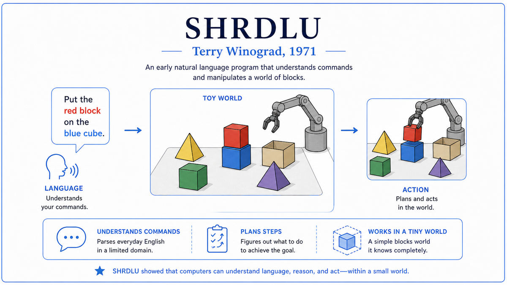

  

  <a href="https://hci.stanford.edu/~winograd/shrdlu/">📄 Original Thesis (1971)</a> · Terry Winograd (Born Takoma Park, Maryland, 1946)

<em>Inside a small world of toy blocks, a program seemed to understand English. The illusion lasted about as long as the world did.</em>

---

In 1968 Terry Winograd was a 22 year old MIT graduate student looking for a thesis topic. He had a math degree from Colorado College, a year of linguistics study at University College London, and an interest in how human language and human reasoning fit together. The MIT AI Lab was the most ambitious place in the world for asking that question, with Minsky running it and Papert advising students.

The natural language problem was particularly stuck. ELIZA had shown in 1966 that pattern matching could fake conversation, but ELIZA did not understand anything. Other programs of the era could parse sentences, but the parsing produced syntactic structures that the program could not actually use. The gap between recognizing a sentence and using its meaning was vast.

Winograd's insight, encouraged by Papert and Minsky, was to shrink the world. Instead of trying to build a program that understood English in general, he would build one that understood English about a specific tiny world, small enough that everything in it could be modeled completely in the program's memory. With the world fully modeled, comprehension would not be magic. It would be lookups in a structured database, driven by a parser, glued together by inference.

The world he chose was a flat surface holding a few blocks, pyramids, and a box. Different colors. Different sizes. A simulated robot arm could pick up blocks, stack them, put things in the box. Winograd called the program SHRDLU, after the second-most-common arrangement of letters on Linotype keyboards.

Between 1968 and 1970, working alone on a DEC PDP-6, Winograd built it in MicroPlanner, a Lisp-based language. It used a vocabulary of about 200 words, all describing things or actions in the blocks world. It had a parser, a planner, a discourse memory, and a world model. It could answer questions, execute commands, learn names for compound objects, and explain its own reasoning.

The thesis was filed in February 1971 as MIT AI Technical Report 235. It was published as a book in 1972 under the title Understanding Natural Language. Inside the small world of blocks, SHRDLU looked exactly like a program that understood English. It seemed, briefly, like Turing's promise from 1950 was about to be fulfilled. The 1971 IJCAI conference gave Winograd the Computers and Thought Award.

  

<em>The dialogue is taken directly from the 1971 thesis. SHRDLU could resolve pronouns, ask for clarification, and execute multi-step plans, all inside a world simple enough to fit in a single screen.</em>

---

In the short term, SHRDLU was the most impressive natural language demonstration anyone had seen. The dialogues were better than any chatbot before or for years afterward. SHRDLU resolved pronouns correctly, asked clarifying questions, planned action sequences that required moving other things first, and learned new vocabulary on the fly. Funders pointed at SHRDLU as evidence that AI was on the verge of solving language. Optimism in the field surged.

In the long term, SHRDLU was the case study that taught the field about brittleness. SHRDLU's apparent intelligence was inseparable from the smallness of its domain. Inside the blocks world, every word had exactly one meaning. Outside the blocks world, none of this held. When researchers tried to extend the SHRDLU approach, the engineering effort exploded. The program needed more rules, more words, more handling of edge cases, and the additions interacted in ways that made the system fragile.

By the late 1970s, the verdict was clear. SHRDLU's apparent understanding was a property of the world's simplicity, not of the program's design. The technique did not scale. The conclusion contributed to the loss of confidence that triggered the first AI winter. Winograd himself walked away from this kind of AI by the mid 1980s, shifting to human-computer interaction.

For modern AI, SHRDLU's legacy is the lesson about toy domains. The Winograd Schema Challenge, a benchmark proposed in 2011 and named in his honor, deliberately uses pronoun-disambiguation puzzles that look easy but require real-world knowledge. By 2020, language models like GPT-3 were getting these schemas right. The gap between SHRDLU's narrow brittleness and GPT-4's broader competence took fifty years to close.

---

SHRDLU had four major components that worked together. A parser that converted English sentences into syntactic structures. A semantic system that mapped those structures into meaning. A planner that figured out how to satisfy commands. A world model that tracked the state of the blocks.

The parser used systemic grammar, developed by the linguist M.A.K. Halliday. Winograd's implementation, called PROGRAMMAR, was unusual in that the grammar was not a static set of rules. It was a set of procedures. Parsing a sentence meant running procedures that could query the world model and the discourse history as they ran. Syntax was no longer separate from semantics. The parser could refuse to accept a syntactically valid parse if the resulting meaning was nonsensical.

The semantic system mapped parse outputs into expressions in MicroPlanner. A noun phrase like "the green pyramid" became a procedure that searched the world model for an object whose color was green and whose shape was pyramid. If exactly one such object existed, the noun phrase was resolved. If zero existed, SHRDLU asked for clarification.

The planner could decompose commands into sequences of basic actions. A command like "put the red cube in the box" might require first removing the green cube currently sitting on top of the red one. SHRDLU would notice this dependency and plan accordingly.

The world model was a database of facts about every object: position, color, size, shape, what was on top of what, what was inside what. SHRDLU updated this model as the simulated arm moved things around. The world was small enough that the model could be complete and exact. The integration of these four components, talking to each other constantly, was what made SHRDLU look intelligent.

---

SHRDLU is not a mathematical system. It is an engineering system. The mathematics involved are mostly formal grammar from linguistics and the symbolic logic of the planning system. There is no learning algorithm, no statistical model, no probability anywhere in the program. Every behavior is the result of explicit rules written by Winograd.

The grammar was implemented as a transition network, with PROGRAMMAR procedures attached to each transition. The procedures could call back into the world model and the discourse memory, making the parser context-sensitive.

The planner used a backward-chaining proof procedure adapted from Carl Hewitt's Planner language. Given a goal, the planner would search for a sequence of actions that would achieve it. Each action had preconditions and effects. The search was depth-first with backtracking. If an action's preconditions were not met, the planner would set the preconditions as new subgoals and recurse. This approach was a forerunner of modern AI planning systems.

The total program was about 5,000 lines of Lisp and MicroPlanner. By modern standards this is small. By 1970 standards, on a PDP-6 with about 256 kilowords of memory, it was substantial. The same program written today, in any modern language, could fit on a single laptop and run instantaneously. The difficulty in 1970 was making it run at all on the available hardware.

---

The years immediately after SHRDLU saw enthusiastic attempts to extend the approach. Roger Schank at Yale built systems for understanding stories. Bill Woods built LUNAR for answering questions about lunar rocks. Each system was, like SHRDLU, impressive within its narrow domain. None of them generalized.

By the late 1970s the limitations were clear, and SHRDLU's reputation began to shift from breakthrough to cautionary tale. Hubert Dreyfus, a philosopher who had been criticizing symbolic AI since the 1960s, found a sympathetic audience among researchers who had tried to scale up SHRDLU-style systems and failed. Winograd's 1986 book Understanding Computers and Cognition argued that symbolic AI was based on a misunderstanding of how human cognition worked. He left the AI field for human-computer interaction shortly afterward.

The path forward for natural language understanding ran through statistics, not symbols. By the 1990s, statistical machine translation had displaced rule-based approaches. By the 2010s, neural networks trained on vast text corpora had displaced statistics. By the 2020s, large language models with the transformer architecture were doing things SHRDLU could not have done in any domain, including handling open-world ambiguity and learning from text rather than from hand-coded rules.

For Era 04, SHRDLU is the story's high point and the start of the descent. The next stop on this walk is 1972. Alain Colmerauer at the University of Marseille was about to publish a programming language called Prolog, designed to express logical relationships directly as program code.

---

  <a href="1971a-Intel-4004.md">← Previous: Intel 4004 1971</a> &nbsp;·&nbsp; <a href="1972-Colmerauer-Prolog.md">Next: Colmerauer Prolog 1972 →</a>

