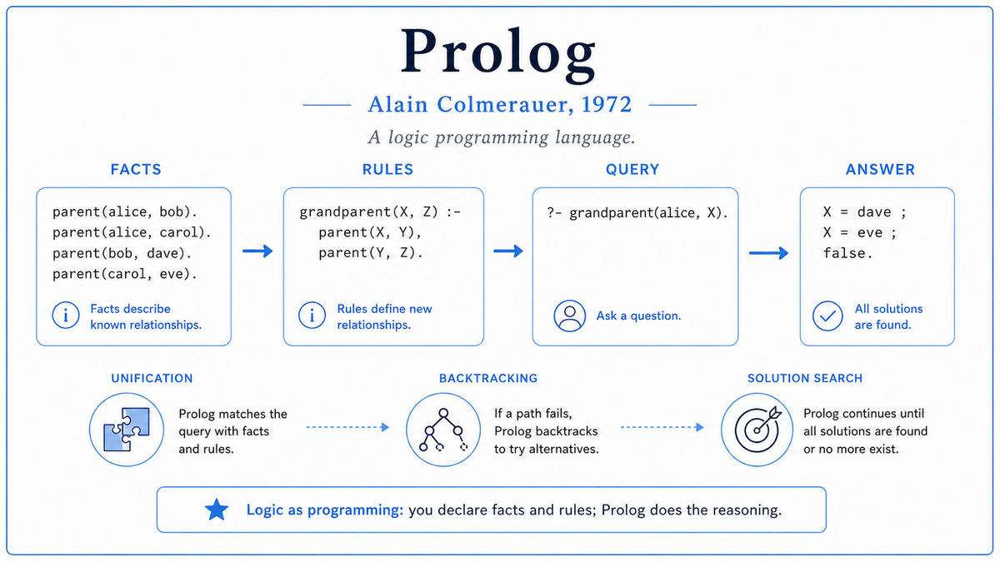

  

  <a href="http://alain.colmerauer.free.fr/alcol/ArchivesPublications/PrologHistory/19november92.pdf">📄 The Birth of Prolog</a> · Alain Colmerauer (Born Carcassonne, France, 1941)

<em>A programming language where you state what is true and the computer figures out what to do about it.</em>

---

In 1971 Alain Colmerauer was a 30 year old French computer scientist at the Université d'Aix-Marseille at Luminy, leading a small group called the Groupe d'Intelligence Artificielle. His goal was to build a system that could understand French. The same idea Winograd was working on at MIT, applied to French.

Colmerauer needed a programming language for the inference engine. Lisp was the obvious choice. But Colmerauer was not satisfied. Lisp was procedural. To solve a problem in Lisp, you wrote a procedure that, step by step, computed the answer. Colmerauer wanted a language where you could state the rules and let the language figure out how to apply them.

The key influence was Robert Kowalski, a logician at the University of Edinburgh. Kowalski had been developing a refinement of Alan Robinson's resolution principle, a method for doing logical inference automatically. Kowalski visited Marseille in 1971 and 1972. He convinced Colmerauer that resolution could be the engine of a new kind of programming language. Instead of writing procedures, the programmer would write logical formulas. The interpreter would prove the formulas using resolution, and the proofs would be the program's behavior.

Colmerauer, with his student Philippe Roussel, implemented the first version of Prolog in the summer of 1972. Roussel coined the name from "PROgrammation en LOGique." The first program it ran was Colmerauer's French question-answering system. The user could type questions in a restricted French syntax, and Prolog would derive the answers using logical resolution.

The result was strange and beautiful. A working program that contained no procedures. No assignment. No loops. Just facts, rules, and questions. The same set of rules could answer many different questions, depending on which arguments were known and which were variables. The same Prolog program that answered "is bob the grandparent of jim" could also answer "who is the grandparent of jim" or "for whom is bob a grandparent." The programmer wrote it once. The interpreter inverted it as needed.

When Colmerauer presented the work at Stanford in 1972, the American AI establishment was skeptical. McCarthy and his students were Lisp people. He left Stanford with no converts. Within a decade Prolog was a major programming language across Europe and Japan. Forty years on, Prolog code from 1972 still runs on modern interpreters, almost unchanged, because the language was an embodiment of mathematical logic.

  

<em>The programmer states what is true. The system uses logical inference to answer questions. The same rules answer many different questions automatically.</em>

---

Prolog proved the concept of declarative programming. Before Prolog, the assumption was that programmers had to specify every step a computer should take. Prolog showed that, for a large class of problems, you could state the rules and let the computer figure out the steps. This idea has since spread throughout computing. SQL, the language used for almost every database query in the world, is declarative. Modern functional languages like Haskell are declarative. Constraint solvers, theorem provers, and many AI planning systems are declarative.

It became the European and Japanese AI standard. While American AI research clustered around Lisp, European and Asian groups adopted Prolog. Japan made the most ambitious bet. In 1982 the Japanese Ministry of International Trade and Industry launched the Fifth Generation Computer Systems Project, a ten-year initiative with about 400 million dollars of funding, aimed at building parallel computers natively designed to execute Prolog. The bet did not pay off. The hardware was hard to build, the AI techniques the project committed to did not deliver, and by the early 1990s the project had quietly wound down. The American response, including significant DARPA investment in symbolic AI, helped fund the period of AI optimism that crested in the late 1980s before the second AI winter.

For modern AI, Prolog represents a road not taken. The dominant paradigm today is statistical learning over neural networks. Prolog represents the alternative, in which knowledge is represented explicitly as logical formulas, inference is exact, and explanations are derivable from the rules used to reach a conclusion. The two paradigms have different strengths. Neural networks scale to massive amounts of data but are opaque. Prolog-style systems are transparent and verifiable but are difficult to scale to messy real-world inputs. Modern interest in explainable AI has revived attention to logic-based methods.

---

A Prolog program has three kinds of statements. Facts. Rules. Queries.

A fact is an unconditionally true statement. parent(tom, bob) means tom is the parent of bob. parent(bob, ann) means bob is the parent of ann. The order of arguments matters. The collection of facts is the program's database.

A rule is a conditional statement, written backwards. grandparent(X, Z) :- parent(X, Y), parent(Y, Z) reads as "X is the grandparent of Z if X is the parent of some Y and Y is the parent of Z." The :- symbol is read as "if." The comma between conditions is read as "and." Variables, written with a capital first letter, can stand for anything.

A query is a question. ?- grandparent(tom, X) asks "for what value of X is tom a grandparent of X?" Prolog answers by trying to prove the query using the facts and rules. The proof procedure works by unification, which is the mathematical operation of finding consistent values for variables that make two terms identical. To prove grandparent(tom, X), Prolog matches it against the rule head, then tries to satisfy the body. It finds parent(tom, bob) in the facts, so Y becomes bob. Then it needs parent(bob, Z). It finds parent(bob, ann). Prolog reports X = ann.

The remarkable property is that the same rules can be used in many directions. The grandparent rule can answer all of these questions: who is bob's grandparent, who is jim's grandparent, who are the grandparents in the database, who are the grandchildren. The rule does not care which arguments are known and which are variables. The unification engine handles all directions automatically. This is the key power of declarative programming. You write the relationship once. The language uses it however you ask.

---

Prolog is built on a fragment of first-order logic called Horn clauses. A Horn clause is a logical formula with at most one positive literal. In Prolog notation, it has the form

> head :- body₁, body₂, ..., bodyₙ.

where the head is the conclusion and each body item is a precondition. A fact is a Horn clause with no body. A rule is a Horn clause with both. A query is a Horn clause with no head, just a body to be proven.

The execution model is SLD resolution, a refinement of Alan Robinson's 1965 resolution principle. To answer a query, Prolog tries to derive the empty clause from the query and the program's facts and rules. The derivation proceeds by repeatedly selecting a goal, finding a rule whose head can be unified with it, and replacing the goal with the rule's body. If the empty clause is reached, the query is proven.

Unification is the mathematical operation that makes this work. Given two terms, unification finds the most general substitution that makes them equal. If two terms cannot be unified, the proof step fails and Prolog backtracks to try a different rule. Unification is decidable and computationally efficient for the term language Prolog uses, which is what makes the inference engine practical.

Maarten van Emden and Robert Kowalski formalized the semantics of Prolog in 1976. Prolog's computational power is identical to that of any general programming language. It is Turing complete. The trade-off is in expressiveness for specific domains. Prolog is unmatched for problems that have natural logical structure: parsing, theorem proving, planning, expert systems. It is awkward for problems that are inherently procedural.

---

Prolog spread through Europe in the late 1970s. David H. D. Warren at Edinburgh built the first compiler in 1977, then in 1983 designed the Warren Abstract Machine, a virtual machine that became the standard implementation target for fast Prolog systems. By 1980 there were Prolog implementations in nearly every European AI lab.

The Japanese Fifth Generation Project, announced in 1982, made Prolog famous worldwide. The project promised to build a new kind of computer, designed from the silicon up to execute Prolog programs in parallel. American and European responses were a mix of fear and skepticism. The Strategic Computing Initiative in the US and the Alvey Programme in the UK both directed substantial money toward AI in the early 1980s, partly motivated by the perceived Japanese threat. By the early 1990s, the Fifth Generation Project had failed to deliver the AI breakthroughs promised. The lesson, in retrospect, was that the bottleneck in AI was not the speed of inference but the source of knowledge, and Prolog could not solve the second problem.

Prolog's modern life is mature and narrow. It is taught in AI courses worldwide. It is used in formal verification. Constraint logic programming, an extension of Prolog, is used for scheduling and combinatorial optimization in industry. The language's intellectual influence on databases, type systems, and programming language theory has been enormous, even where Prolog itself is not used.

The next stop on this walk is 1973. James Lighthill, a respected British mathematician with no AI background, was about to write a report for the British government that recommended cutting funding for AI research. The Lighthill Report would trigger the first AI winter in Britain.

---

  <a href="1971b-Winograd-SHRDLU.md">← Previous: Winograd SHRDLU 1971</a> &nbsp;·&nbsp; <a href="1973-Lighthill-Report.md">Next: Lighthill Report 1973 →</a>

