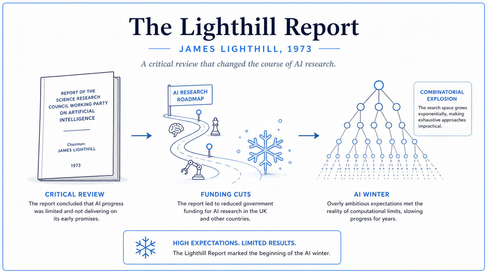

  

  <a href="https://www.aiai.ed.ac.uk/events/lighthill1973/lighthill.pdf">📄 Original Report</a> · James Lighthill (Born Paris, France, 1924)

<em>The 49-page report by an outsider that ended the first golden age of AI.</em>

---

By 1972, twenty years after the Dartmouth Workshop, the British Science Research Council had a problem. AI research in the UK was concentrated at the University of Edinburgh, where Donald Michie had built one of the largest AI labs in the world. Edinburgh wanted more money, more equipment, more autonomy. The funding council was being asked to commit serious money to a field whose results were unclear.

The council needed a verdict from someone outside the AI community. They picked Sir James Lighthill. He was 48 years old, the Lucasian Professor of Mathematics at Cambridge, the same chair Newton had once held. He was a fluid dynamicist with no AI background and no allegiance to anyone in the field. The council asked him to make a personal review of AI as a scientific subject and advise whether it deserved continued funding.

Lighthill spent most of 1972 reading the AI literature, visiting the major AI labs, and forming his own view. The report he delivered in July 1972 and the council published in early 1973 was titled "Artificial Intelligence: A General Survey." It was 49 pages long. It was devastating.

His central organizing move was to slice AI into three categories. Category A was advanced automation. Pattern recognition systems, automatic landing systems, robotic arms. These had real applications and real results. Category C was the use of computers to model and study the central nervous system. These were legitimate science with concrete value to other fields. Lighthill approved of both.

Category B was the trouble. Lighthill defined it as the building of robots and the pursuit of general artificial intelligence. The dream of a thinking machine. The grand promises that McCarthy, Minsky, Newell, and Simon had been making for two decades. According to Lighthill, Category B was the intellectual core of AI, but it had not delivered. The systems that had been built worked only on toy problems. Attempts to extend them to real-world complexity ran into a fundamental obstacle that Lighthill called the combinatorial explosion. The number of possibilities grew so fast as the problem size increased that no amount of computer time could make brute-force search practical. The heuristics needed to manage the explosion were domain-specific and did not generalize.

His conclusion was direct. The promises of AI's pioneers had not been kept. Continued investment in Category B was not justified. The British government should fund Categories A and C, but not the central program of building general artificial intelligence. Within months, the SRC had cut funding for AI research at most British universities. Only Edinburgh and Sussex retained meaningful programs. The British AI community, which had been world-class in the 1960s, was effectively dismantled.

The first AI winter had begun.

  

<em>Lighthill's slicing of the field. Categories A and C were endorsed. Category B, the heart of AI as McCarthy and Minsky understood it, was declared a failure.</em>

---

The report was technically correct about combinatorial explosion. The 1960s and early 1970s AI systems did not scale, and the reason was exactly what Lighthill said. SHRDLU's blocks world worked because there were only a few dozen objects. Chess programs worked because they searched a few hundred thousand positions. As the problem domain grew, the search space exploded faster than computers could grow. The eventual answer would be not to brute-force the search but to use learned representations. Modern deep learning is, in some sense, a long answer to Lighthill's challenge.

The report formalized a critique that had been building for years. Herbert Simon predicted in 1957 that a computer would be world chess champion within ten years. Marvin Minsky predicted in 1967 that within a generation the problem of creating AI would be substantially solved. By 1972, these predictions were obviously wrong. Lighthill simply documented what insiders had been quietly admitting. He gave the public, and the funders, permission to take the disappointment seriously.

The funding consequences set a template that has repeated. AI funding is partly a bet on whether the field will deliver on its current promises. When promises outpace delivery, funding contracts. The first AI winter, triggered in Britain in 1973, was followed by the more severe global AI winter of the late 1980s, after the collapse of the expert systems boom. Each winter has taught the field a similar lesson, that overpromising leads to retrenchment.

For the broader story of this walk, Lighthill was the moment AI lost its first battle in public. The Dartmouth promise of 1956 had been that intelligent machines were a few decades away. Lighthill, in 1973, said no. He was overruled by history eventually. But it took fifty years.

---

Lighthill's central technical concept is combinatorial explosion. It is the most important idea in classical computer science for understanding why hard problems are hard.

Many AI problems require searching through possible options. A chess game has many possible moves. A natural language sentence has many possible parses. A planning task has many possible action sequences. To solve these problems by search, the program looks at one option, evaluates it, then moves on to another. The total amount of work scales with the number of options.

The trouble is that the number of options grows exponentially in the depth of the search. A chess position has roughly 30 legal moves. After two moves, 30 by 30 is 900 positions. After four moves, 810,000. After ten moves, about 600 trillion. No computer in 1973 could evaluate 600 trillion positions in a reasonable time. No computer in 2025 can either. Brute-force search hits a wall not because the algorithm is bad but because the problem grows faster than the compute.

The 1960s AI systems Lighthill was reviewing all relied on search of one form or another. SHRDLU searched for parses and plans. The Logic Theorist searched for proofs. Chess programs searched move trees. Each of these systems worked on small problems. As the problem grew, the search exploded, and the heuristics needed to prune the search became domain-specific and brittle.

Lighthill's argument was that AI had no general technique for managing combinatorial explosion. The field's apparent successes were all examples of clever pruning specific to a particular toy domain. The pruning techniques did not transfer. Without a general method for handling explosion, the dream of a general intelligent machine was, in Lighthill's view, technically infeasible.

The eventual answer turned out to be representation learning. Modern deep learning systems do not search through possibilities the way 1960s systems did. They learn statistical patterns from data, and at inference time they evaluate one or a few specific outputs based on the learned patterns. The search problem is replaced by a function approximation problem, which has different scaling properties. This was not a solution anyone in 1973 could have anticipated.

---

The Lighthill Report contains very little formal mathematics. It is a policy document, written in clear prose.

The mathematics that the report implicitly relies on is the analysis of computational complexity. A search algorithm that explores a tree of branching factor b to depth d performs roughly b^d operations. For chess, b is about 30 and d for tournament play is around 80, giving 30^80 positions, a number with about 118 digits. No physically realizable computer can ever evaluate 30^80 positions. Any problem solvable only by deep search through a moderately branching tree is, in a precise mathematical sense, intractable.

The theoretical foundation was being developed at the same time. Stephen Cook published the foundational paper on NP-completeness in 1971. The class of NP-complete problems, which includes many natural AI problems, is believed to require exponential time in the worst case. Lighthill did not cite Cook, but the spirit of his critique was consistent with what theoretical computer scientists were proving rigorously.

What Lighthill could not have known was the eventual escape. It was not a clever search algorithm. It was the abandonment of search as the central paradigm. Modern systems work by training a model on data. Training a large language model takes weeks of compute on thousands of chips, but the training cost is one-time. After training, generating an answer takes milliseconds. The amortization of training across many uses is what makes modern AI economically viable. The 1973 systems had no equivalent amortization, because they did not learn.

---

The most famous immediate consequence was the Lighthill Debate. On May 9, 1973, the BBC broadcast a televised confrontation at the Royal Institution in London. Lighthill defended his report against three of the field's leading figures: Donald Michie of Edinburgh, John McCarthy from Stanford, and Richard Gregory of Bristol. McCarthy attacked Lighthill's three-category framework as artificial. Michie defended Edinburgh's robotics research. Lighthill held his ground. The audience went home undecided. The funders had already decided.

The British AI community shrank. American funders, including DARPA, took notice. The Mansfield Amendment of 1973 had already required DARPA-funded research to have direct military relevance, pushing American AI funding in the same direction. By the mid 1970s, AI funding had contracted significantly on both sides of the Atlantic.

The first winter ended in the early 1980s, when expert systems briefly reignited commercial interest in AI. The recovery lasted only a few years before the second AI winter in the late 1980s, when expert systems also failed to scale.

The next stop on this walk is 1974. While Lighthill was triggering the first AI winter, a Harvard PhD student named Paul Werbos was about to defend a thesis containing an algorithm that, more than a decade later, would resurrect the field. He called it backpropagation, and almost no one noticed.

---

  <a href="1972-Colmerauer-Prolog.md">← Previous: Colmerauer Prolog 1972</a> &nbsp;·&nbsp; <a href="1974-Werbos-Backpropagation.md">Next: Werbos Backpropagation 1974 →</a>

