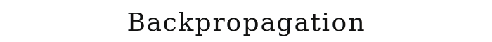
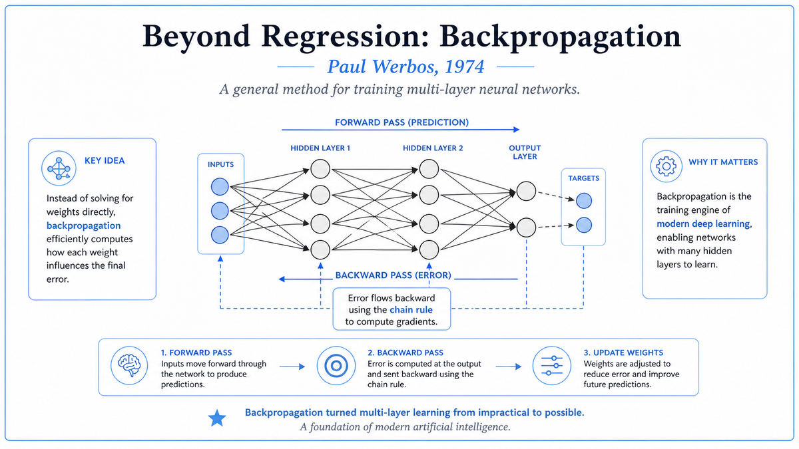

  

  <a href="https://www.werbos.com/Mind.htm">📄 Original Thesis (1974)</a> · Paul Werbos (Born Philadelphia, Pennsylvania, 1947)

<em>The algorithm that would eventually define modern AI, buried inside a social science thesis nobody read.</em>

---

In August 1974 Paul Werbos, age 26, defended his PhD thesis at Harvard's Committee on Applied Mathematics. The thesis was titled "Beyond Regression: New Tools for Prediction and Analysis in the Behavioral Sciences." It was a social science thesis. Werbos's advisor was Karl Deutsch, a political scientist. The reading audience, in 1974, was political scientists.

Buried in Chapter 2 of this thesis was a mathematical method that would, ten years later, transform artificial intelligence. Werbos called it the dynamic feedback approach. We now call it backpropagation.

Werbos wanted forecasting models more flexible than ordinary regression. Regression assumes a fixed mathematical form, like a straight line, and finds the best parameters for that form given data. Werbos wanted models with internal complexity, networks of interconnected units that could express richer functions. The mathematical form he chose was, in essence, a multi-layer neural network. Inputs flowed forward through layers of units, each layer computing some transformation, until a final output was produced.

The challenge was training such a network. To find good parameters, you needed to know how to adjust each one. For a multi-layer network, the math was hard, because each parameter affected the output through many intermediate layers. The brute-force approach scaled badly. A network with thousands of parameters would require thousands of separate gradient calculations.

Werbos's insight was that you could compute all the gradients at once by running the network backward. After computing the forward pass to produce a prediction, you compared the prediction to the target and got an error. Then you propagated this error backward through the network, layer by layer, using the chain rule of calculus. At each layer, the error told you how much each weight had contributed, and you adjusted the weights to reduce the error. The whole calculation took roughly the same amount of work as a single forward pass. The cost did not scale with the number of parameters.

This is backpropagation. It is the algorithm that makes modern deep learning possible. Without it, training a network with millions or billions of parameters would be computationally infeasible. With it, you can train networks of essentially any size.

Werbos did not present this as an AI breakthrough. He was a political scientist solving a forecasting problem. The thesis went into the Harvard library and was largely ignored by the AI community, which by 1974 was deep into the first AI winter. The algorithm sat there, fully formed and correct, for more than a decade before anyone in the AI mainstream noticed.

  

<em>The two-phase mechanism. Forward to predict. Backward to learn. The chain rule of calculus, applied at scale, is the mathematical heart of every modern neural network.</em>

---

Backpropagation matters because it is the algorithm that trains every modern neural network. Every large language model, every image classifier, every speech recognition system, every recommendation engine that uses deep learning, all of them are trained by some variant of the algorithm Werbos described in 1974.

The historical significance is layered. In 1974, neural networks were considered a discredited research direction. Minsky and Papert's 1969 book had proven the limitations of single-layer perceptrons, and the AI community had concluded that multi-layer networks were probably no better. The reason multi-layer networks were thought to be impractical was precisely that no efficient training algorithm was known. Werbos had the algorithm. He just did not announce it as the answer to Minsky and Papert.

The algorithm was rediscovered independently several times. David Parker described it in 1985 at MIT. Yann LeCun described a version in 1985 in France. Most famously, David Rumelhart, Geoffrey Hinton, and Ronald Williams published a Nature paper in 1986 that brought backpropagation to broad attention. That paper showed multi-layer networks could solve XOR and several other tasks Minsky and Papert had identified as impossible for single-layer networks. The 1986 publication kicked off the second wave of neural network research.

The lesson is uncomfortable. The right answer existed in 1974. It sat in a Harvard library for twelve years. It was not adopted because the people who needed it were not reading social science theses. The first AI winter was caused, in part, by the absence of an algorithm that already existed. Modern AI is a product not just of the right ideas but of those ideas reaching the right communities at the right time.

For the broader story, Werbos's thesis closes Era 04 with a dramatic irony. The first AI winter was at its coldest in 1974. The thesis that contained the key to ending the winter was published in the same year.

---

A neural network is a function that takes some input, applies a sequence of transformations, and produces an output. Each transformation is a layer. Each layer has parameters, called weights, that determine its behavior. To make the network useful, the weights must be set to values that produce correct outputs on training data.

Training is an optimization problem. Define an error function that measures how wrong the network's output is on a training example. Pick weights that minimize this error, averaged over the training set. The standard method is gradient descent. Compute the gradient, the direction of steepest increase, and step in the opposite direction. Repeat until convergence.

The trouble is computing the gradient. The gradient is a vector with one component for each weight. Computing the component for a single weight by perturbing it and measuring the change takes one full forward pass. With a million weights, the naive approach takes a million forward passes per training example. This is computationally infeasible.

Backpropagation computes the entire gradient in a single backward pass that takes about the same time as one forward pass. The trick is the chain rule of calculus. The error depends on the output. The output depends on the last layer's activations. The last layer's activations depend on the second-to-last layer's activations. And so on, back to the input. At each step, the chain rule tells you how to compute the partial derivative of the error with respect to that layer's weights, given the partial derivative with respect to the next layer's activations.

The practical algorithm is simple. Forward pass, computing each layer's output. Compute the error at the final layer. Propagate the error backward through the layers, computing the gradient with respect to each layer's weights as you go. Use the gradients to update the weights with a small step in the direction that reduces error. Repeat for many training examples and many passes through the data, called epochs.

---

Consider a simple feedforward network with one hidden layer. The input is a vector x. The hidden layer computes h = f(W₁x + b₁), where W₁ is the input-to-hidden weight matrix, b₁ is a bias vector, and f is a nonlinear activation function. The output is y = W₂h + b₂. For a training example with target t, the error is E = ½(y − t)².

To train, we need ∂E/∂W₁ and ∂E/∂W₂. By the chain rule:

> ∂E/∂W₂ = (y − t) · hᵀ
> ∂E/∂W₁ = [W₂ᵀ · (y − t) ⊙ f'(W₁x + b₁)] · xᵀ

Each gradient is computed by combining quantities already produced during the forward pass with quantities computed during the backward pass. The backward pass propagates the error signal δ = (y − t) backward through the network. At each layer, δ is multiplied by the layer's transposed weight matrix, then multiplied element-wise by the derivative of the activation function. The result is the error signal for the previous layer.

The computational cost is dominated by matrix multiplications. A complete forward and backward pass through the network costs about three times as much as a forward pass alone. This is independent of the number of weights, which is the key efficiency property.

Werbos's 1974 derivation was more general than the standard textbook version. He framed backpropagation as a method for computing gradients of an output with respect to inputs in any directed acyclic computational graph. The neural network case was a special instance. The general formulation anticipated modern automatic differentiation libraries like PyTorch and TensorFlow.

---

The breakthrough into general awareness came in 1986, with Rumelhart, Hinton, and Williams's Nature paper "Learning representations by back-propagating errors." The paper was short, clear, and directly addressed the Minsky-Papert challenge by showing that multi-layer networks trained with backpropagation could solve XOR and learn useful internal representations.

The 1986 paper triggered the second wave of connectionism. Within a few years, neural network research was active again at every major AI lab. Yann LeCun used backpropagation to train convolutional networks for handwritten digit recognition, leading to LeNet-5 in 1998. Jürgen Schmidhuber's lab developed long short-term memory networks. The neural network revival lasted through the 1990s, slowed by computational limits and the rise of statistical alternatives like SVMs, then re-accelerated dramatically in the 2010s when GPUs made training large networks practical.

By 2012, when AlexNet won the ImageNet competition by a wide margin, backpropagation was the de facto training algorithm for the vast majority of deep learning systems. It still is. Every modern deep learning framework, including PyTorch, TensorFlow, and JAX, has backpropagation built in. Trillions of dollars of value have been created by systems whose training depends on the algorithm Werbos described in 1974.

The next stop on this walk is 1976. While Werbos's thesis sat unread in the Harvard library, a different kind of AI was emerging at Stanford. Edward Shortliffe was building MYCIN, a rule-based expert system for diagnosing blood infections. MYCIN would become the template for the expert systems boom of the 1980s.

---

  <a href="1973-Lighthill-Report.md">← Previous: Lighthill Report 1973</a> &nbsp;·&nbsp; <a href="1976-MYCIN.md">Next: MYCIN 1976 →</a>

