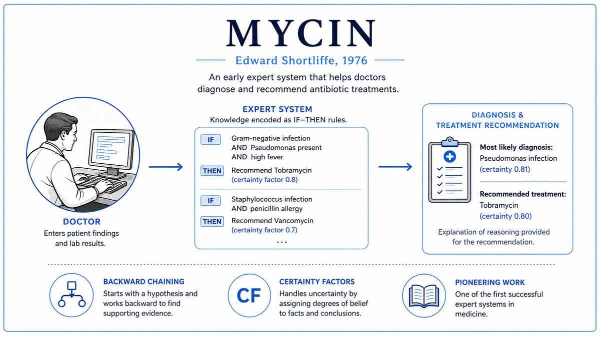

  

  <a href="https://stacks.stanford.edu/file/druid:ks467wp9009/ks467wp9009.pdf">📄 Original Dissertation (1975)</a> · Edward Shortliffe (Born Edmonton, Alberta, Canada, 1947)

<em>A computer program that diagnosed bacterial infections better than most general practitioners. Hospitals never used it.</em>

---

In 1972 Edward Shortliffe was a 25 year old MD-PhD student at Stanford. He was simultaneously training to be a physician and pursuing a doctorate in computer science under Bruce Buchanan, a senior researcher in the Stanford Heuristic Programming Project. The combination defined his thesis.

The medical problem was bacterial infections. When a patient came in with a serious infection, the doctor needed to identify which bacterium was responsible and prescribe an effective antibiotic. The choice was time-critical. Bacterial blood infections can kill within hours. The exact bacterium often could not be cultured for one or two days, but treatment had to start immediately. General practitioners were often not very good at this guessing. Specialists in infectious disease were better. There were not enough specialists.

Shortliffe's idea was to encode the specialist's reasoning as a set of computer rules. Through interviews with Stanford's infectious disease experts, he extracted the rules they used to diagnose infections and recommend antibiotics. He encoded these in a Lisp program he called MYCIN, named after the suffix common to many antibiotics. By 1975, MYCIN contained about 600 rules covering bacterial blood infections and meningitis.

The rules took the form of if-then statements with associated certainty factors. If the patient had a fever, and a culture from blood had shown a gram-negative rod, then suspect a particular kind of infection with a particular degree of confidence.

To use MYCIN, a physician would sit at a terminal and start a consultation. After about thirty questions, MYCIN would chain its rules backward from possible diagnoses to the available evidence, identify the most likely infections, and recommend antibiotics with dosages. If asked, MYCIN would explain its reasoning, walking through the rules it had used.

Formal evaluation showed MYCIN performed remarkably well. In a 1979 study, MYCIN's recommendations were judged by infectious disease faculty to be acceptable in 65 percent of cases, comparable to the recommendations of the faculty themselves and significantly better than those of medical residents and general practitioners.

MYCIN was never used in a real hospital. Doctors were uncomfortable trusting a machine for life-or-death decisions. Hospitals had no networks in 1976, so MYCIN could not pull patient records. The legal liability was unresolved. If MYCIN recommended an antibiotic that killed the patient, who was responsible? No one knew. The system that proved expert AI could match human specialists sat unused in the lab where it was built.

  

<em>MYCIN's three-component architecture became the template for every expert system that followed. The medical knowledge could be replaced with knowledge from any other domain, and the same engine would work.</em>

---

MYCIN proved that expert reasoning could be encoded as rules. Before MYCIN, the dominant view in AI was that intelligence required general-purpose problem solvers. MYCIN took the opposite approach. Instead of building a general reasoner and giving it knowledge, build a domain-specific reasoner with knowledge baked into its architecture. The narrow approach worked. MYCIN was not intelligent in any general sense, but it was a competent specialist within its domain. This insight became the foundation of the expert systems boom of the 1980s.

MYCIN's architecture was reusable. The Stanford team realized that the inference engine and user interface were independent of the medical knowledge. Strip out the rules about bacteria, and what remained was a general-purpose tool for building rule-based systems. They called the stripped-down version EMYCIN, for Empty MYCIN. The pattern, separating the inference engine from the knowledge base, became the standard architecture for expert systems and is still used in modern rule-based systems.

MYCIN's deployment failure became a permanent lesson. The technical performance was not enough. A medical AI system that doctors will not use, hospitals cannot integrate, and lawyers cannot insure does not save lives. The same lesson is being relearned in 2025 with large language models in medicine. Models that score well on medical license exams can sit unused in clinical practice for the same reasons MYCIN sat unused in 1976.

For the broader AI story, MYCIN was the start of a commercial wave that would dominate AI in the 1980s. Companies like Teknowledge, Inference Corporation, and Intellicorp were founded to build and sell expert systems. The wave crested in the late 1980s and crashed in the early 1990s, when the cost of maintaining large rule bases became prohibitive. The second AI winter followed. But the architectural insight from MYCIN has outlived every winter.

---

An expert system has three components. A knowledge base, an inference engine, and a user interface.

The knowledge base is a collection of rules in a uniform format. A representative MYCIN rule looked like:

> If: the site of the culture is blood, and the gram stain of the organism is gramneg, and the morphology of the organism is rod, and the patient is a compromised host
> Then: there is suggestive evidence (0.6) that the identity of the organism is pseudomonas-aeruginosa.

The number 0.6 is the certainty factor. Rules can be chained. A complete diagnosis is the conclusion of a chain of rules, each contributing partial evidence.

The inference engine searches through the knowledge base. MYCIN used backward chaining. Given a hypothesis like "is this E. coli?", the engine found all rules whose conclusions matched and checked whether the preconditions were satisfied. If a precondition was unknown, the engine treated it as a new sub-hypothesis and recursed. The recursion bottomed out when a precondition could be answered by asking the user.

The user interface mediated between the doctor and the system. Critically, MYCIN could explain its reasoning. If the doctor asked "why did you ask that?", the system showed the rule that had led to the question. If the doctor asked "how did you conclude that?", the system showed the inference chain. The explanation capability was important for medical adoption because doctors needed to verify the system's reasoning before trusting its recommendations.

The conceptual depth of expert systems is in the separation of knowledge from inference. The knowledge in the rules is what experts know. The inference engine is generic machinery that applies rules systematically. Changing domains means changing the rules, not the engine. The cost was that the system could only work in domains where experts could articulate their knowledge as rules. Tasks performed by intuition, like recognizing faces, do not fit the rule-based pattern.

---

MYCIN's most novel mathematical contribution was certainty factors. Bayesian probability was the orthodox framework for reasoning under uncertainty in 1972, but it had two practical problems. First, doing exact Bayesian reasoning required knowing the joint probability distribution over all relevant variables, which for medical diagnosis meant millions of probabilities that no doctor could supply. Second, the conditional independence assumptions that made Bayesian reasoning tractable were rarely satisfied in clinical reality.

Shortliffe and Buchanan invented certainty factors as a heuristic alternative. A certainty factor CF is a number between minus one and plus one. CF equal to one means certain truth. Minus one means certain falsity. Zero means no information. The combination rules for certainty factors are simpler than Bayesian updates. The formulas were chosen to be consistent with intuition about how evidence should accumulate, not to satisfy probability axioms.

The mathematical critique came later. Judea Pearl's 1988 book on Bayesian networks showed that probabilistic reasoning could be made tractable by exploiting structural independence in graphs of variables. By the early 1990s, Bayesian networks had displaced certainty factors as the standard formalism for uncertain reasoning in AI. MYCIN's certainty factor calculus is now a historical curiosity, but the engineering insight that motivated it has been validated by every subsequent generation of probabilistic AI.

---

The most direct successor was EMYCIN, the domain-independent shell extracted from MYCIN's inference engine. PUFF for pulmonary function diagnosis became one of the few expert systems that was actually deployed clinically.

The commercial expert systems boom of the 1980s built directly on the MYCIN template. Companies like Teknowledge, founded in 1981 by some of MYCIN's developers, sold expert system shells modeled on EMYCIN. American Express used expert systems for credit authorization. Schlumberger used them for oil well log analysis. The most famous commercial success was XCON, which Digital Equipment Corporation used for configuring VAX computer orders.

The crash came in the late 1980s. The maintenance burden of large rule bases became unmanageable. As businesses changed, the rules had to change, and the interactions between rules made every change risky. Expert systems could not handle situations slightly outside their training. The market for expert systems collapsed. The second AI winter began.

For modern AI, MYCIN is both a milestone and a warning. The architectural pattern of separating domain knowledge from generic inference is alive in modern rule-based systems. The lesson about deployment applies with full force to current efforts to deploy large language models in medicine, law, and finance. The basic insight that domain expertise can be made computational has been validated and extended in ways Shortliffe could not have imagined, but the social and legal challenges he could not solve in 1976 are still being negotiated today.

This paper closes Era 04. The next stop is 1980. While MYCIN sat unused in Stanford, a team at Digital Equipment Corporation was about to deploy an expert system that did get used, and would save the company tens of millions of dollars per year.

---

  <a href="1974-Werbos-Backpropagation.md">← Previous: Werbos Backpropagation 1974</a> &nbsp;·&nbsp; <a href="../05-Comeback-(1980s)/1980-XCON.md">Next: XCON 1980 →</a>

