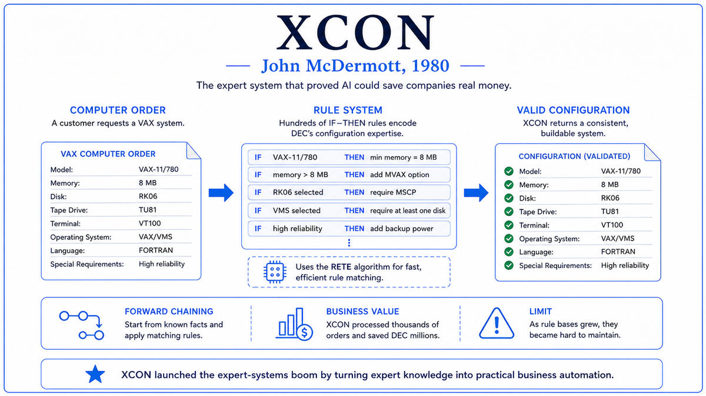

  

  <a href="https://cdn.aaai.org/AAAI/1980/AAAI80-076.pdf">📄 Original Paper (1980)</a> · John P. McDermott (Born Glenwood, Minnesota, 1942)

<em>The first expert system to make real money. The 1980s AI boom started here.</em>

---

In 1978 Digital Equipment Corporation had a problem. DEC was the second-largest computer company in the world, behind IBM. Its flagship VAX-11/780 minicomputer was a major commercial success, but the VAX was complicated. Customers ordered systems with custom configurations, choosing among about 420 possible components. Every order required a technical editor to check that the chosen components were mutually compatible and would actually work when shipped.

The technical editing process was slow and error-prone. Configuration errors meant that systems arrived missing cables, with incompatible cards, or unable to power on. DEC's standard remedy was to ship missing components free of charge. DEC estimated configuration errors were costing the company millions of dollars per year.

DEC had tried to automate the process twice before, in FORTRAN and BASIC. Both attempts had failed. The configuration rules were too complex and too interconnected to be expressed cleanly in a procedural language. Every time the rules changed, which they did constantly as new components were introduced, the program had to be rewritten in places that were hard to predict.

In late 1978, DEC approached Carnegie Mellon University. McDermott was then a 36 year old research associate working on rule-based systems with Allen Newell's group. He had originally trained as a philosopher with a PhD from Notre Dame in 1969 before moving into AI. By 1978 he was deeply involved with OPS5, a production-rule programming language developed by Charles Forgy at CMU.

He spent four to six months learning VAX configuration from DEC's senior technical editors. He sat with them as they processed orders, asking why they made each decision. Some rules were obvious. Others were idiosyncratic, like "if the customer ordered the high-end unibus adapter, the second cabinet needs an extra fan because the original fan layout was designed for the older adapter." The senior technicians knew rules like this from years of experience. They could not write them down, but they could state them in conversation. McDermott encoded each one as an OPS5 production rule.

The system that emerged, internally called R1, contained about 250 rules in its first prototype in April 1979. By January 1980 it was deployed at DEC's manufacturing plant in Salem, New Hampshire, processing real orders. DEC renamed it XCON for eXpert CONfigurer. By 1986, XCON had grown to 2,500 rules and had processed 80,000 orders with 95 to 98 percent accuracy. DEC estimated the system was saving 25 million dollars per year.

McDermott's 1980 paper describing R1 was published at AAAI. The architecture was the same MYCIN architecture: knowledge base, inference engine, user interface. The contribution was the demonstration. Expert systems could move from research to deployment, from saving lives to saving dollars.

  

<em>The before-and-after that launched a thousand consulting contracts. Every Fortune 500 company in 1985 wanted its own XCON.</em>

---

XCON proved that expert systems could make serious money. MYCIN had proved expert systems could match human performance, but MYCIN was never deployed. XCON was deployed for years, doing real work. Its 25 million dollars per year in savings was easy for executives to understand. Within two years, every major American corporation was looking for its own XCON-style application.

It created an industry. Teknowledge, founded in 1981 by some of MYCIN's developers, sold expert system shells. IntelliCorp sold KEE. Inference Corporation sold ART. By the mid 1980s, the expert systems software industry was generating about 1 billion dollars per year. The American AI funding situation, which had been dire after the Lighthill Report, recovered substantially. The Strategic Computing Initiative, launched in 1983 by DARPA, directed about a billion dollars into AI over the decade.

XCON contained the seeds of the second AI winter. As it grew from 250 rules to 2,500 rules, its maintenance became increasingly difficult. Adding a rule for a new component sometimes broke unrelated rules in unpredictable ways. The interactions between rules created what knowledge engineers called the brittleness problem. By the mid 1980s, DEC had a team of eight knowledge engineers working full time just to maintain XCON. By the late 1980s, the cost of maintaining large rule bases had begun to exceed the benefits in many deployments. By the early 1990s the expert system market had collapsed.

The pattern in modern AI is similar. The 1980s expert systems boom is the closest historical analogue to the 2020s large language model boom. A new technology delivers spectacular early results, attracts massive investment, then runs into the limits of its core approach. The same questions being asked now were asked then. How does the technology scale? Does it generalize beyond the cases it was trained on?

For the broader story of AI, XCON is the moment when AI moved from research curiosity to industrial product. After XCON, AI was no longer a purely academic discipline. It was a technology with a market.

---

XCON's architecture is the MYCIN architecture applied to a commercial problem. Knowledge base of if-then rules, inference engine, user interface. The differences are in scale and direction.

The knowledge base contained about 2,500 rules at maturity. Each rule had a condition pattern that matched components, customer requirements, or partial configurations, and an action that added, removed, or modified components. A typical rule might say "if the system includes a unibus adapter and the unibus adapter requires more cooling than the standard fan provides, then add an upgraded fan." The rules were a flat set, and the inference engine selected which rule to fire next based on conflict resolution heuristics.

The inference engine was OPS5, which used forward chaining rather than MYCIN's backward chaining. The engine starts with known facts in working memory and applies rules whose conditions match, generating new facts that may trigger further rules. For configuration tasks, forward chaining is natural: you start with the customer's order and derive the complete configuration by repeatedly applying rules until no more apply.

The matching algorithm underneath OPS5 was Forgy's RETE network, one of the most important algorithms in the history of rule-based systems. RETE precomputes a network of partial matches and updates the network incrementally as facts change. Without RETE, XCON's 2,500 rules would have been computationally impractical. With it, XCON could process an order in about a minute.

The conceptual lesson is the value of capturing tacit knowledge. The senior technical editors knew how to configure a VAX. They could not write down their knowledge as a procedure, because much of it was case-by-case. But they could state their knowledge as if-then rules in conversation, one rule at a time. McDermott's contribution was patient knowledge engineering, sitting with experts and turning their tacit knowledge into explicit rules. The methodology became standard practice in the 1980s.

---

XCON's mathematics is dominated by the RETE matching algorithm. The naive matching algorithm checks every rule against every fact in working memory at every cycle, giving cost roughly R × F^P where R is the number of rules, F is the number of facts, and P is the average number of conditions per rule. For 2,500 rules and a few hundred facts, this cost would be prohibitive.

RETE precomputes a directed graph of partial matches. Each node corresponds to a partial pattern that several rules share. When a fact is added to working memory, RETE propagates the change through the graph, updating only the nodes affected. The amortized cost per fact addition is logarithmic in F, independent of the number of rules. The price is memory.

The expert system's reasoning is not formally probabilistic. Each rule is treated as a hard logical implication. This contrasts with MYCIN's certainty factors. XCON's domain, computer configuration, was deterministic enough that hard rules sufficed.

The mathematical limits of pure rule-based systems became visible as XCON grew. With 2,500 rules, the interactions formed a combinatorial structure that no human could fully understand. Adding a new rule could affect the firing of dozens of existing rules in unpredictable ways. This brittleness problem is mathematically connected to how rule-based systems implement reasoning. Each rule is a local change, but the global behavior is determined by the global structure of all rules acting together. The maintenance cost was eventually what killed the expert systems industry. The modern alternative is to learn rules from data instead of writing them by hand.

---

The Japanese Fifth Generation Computer Systems Project, launched in 1982, accelerated the boom by triggering Western governments to invest defensively. The American Strategic Computing Initiative, the British Alvey Programme, and the European ESPRIT programme together directed billions of dollars into AI research and applications during the 1980s.

The bust came in two phases. The first phase, around 1987 to 1988, was triggered by the high cost of maintaining large rule bases. The second phase, around 1990 to 1992, was triggered by the failure of expert systems to handle exceptions and novel situations gracefully. The expert systems software market collapsed. Several major vendors went bankrupt. AI departments inside large corporations were dissolved. The second AI winter began.

XCON itself ran for over a decade at DEC, finally being phased out in the early 1990s as DEC's business shifted away from VAX systems. By that point, maintenance had become so expensive that the original cost-benefit analysis no longer favored continued operation. McDermott went on to other research at CMU. He died in 2024.

The next stop on this walk is 1982. While the expert systems industry was being born, a Caltech physicist named John Hopfield was about to publish a paper describing a new kind of neural network, one based on physics analogies. The paper would help reawaken interest in neural networks, a field that had been left for dead since the Lighthill Report.

---

  <a href="../04-First-AI-Winter-(1970s)/1976-MYCIN.md">← Previous: MYCIN 1976</a> &nbsp;·&nbsp; <a href="1982-Hopfield-Networks.md">Next: Hopfield Networks 1982 →</a>

