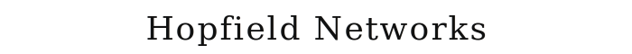
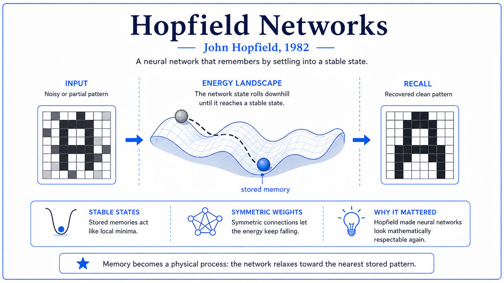

  

  <a href="https://www.pnas.org/doi/10.1073/pnas.79.8.2554">📄 Original Paper (1982)</a> · John Hopfield (Born Chicago, Illinois, 1933)

<em>A physicist looked at neural networks and saw spin glasses. The field came back from the dead.</em>

---

In January 1982, John Hopfield was 48 years old and one of the most respected condensed matter physicists in the United States. He had been Caltech faculty since 1980, with a joint appointment in Chemistry and Biology. He had a long list of distinguished contributions to physics. By any measure, Hopfield was an established senior physicist with no obvious need to move into a new field.

The new field he chose was neural networks, which in 1982 was a dead field. The Lighthill Report had ended British funding in 1973. American funding had collapsed. Frank Rosenblatt had died in 1971. Minsky and Papert's 1969 book had become consensus. Most AI researchers in 1982 thought neural networks were a discredited research direction.

Hopfield came at the problem from a physicist's angle. He was interested in how computational properties could emerge from large numbers of simple elements interacting locally. This is the same kind of question physicists ask about magnets, where global magnetization emerges from local interactions between atomic spins. His specific intuition was that biological memory, the ability to retrieve a complete memory from a partial cue, looked structurally similar to the dynamics of certain physical systems with multiple stable states. If you could engineer a network of artificial neurons whose stable states corresponded to specific memories, the system would naturally implement what computer scientists called content-addressable memory.

The crucial step was finding a function on the network's state space that always decreases as the network evolves. Physicists call this an energy. If the energy can be defined and always decreases, then the network's dynamics must eventually settle into a state where the energy cannot decrease further, which is a local minimum. By choosing the connection weights carefully, you could place the local minima at specific patterns you wanted to store. Feed in a noisy or partial version of a stored pattern, and the dynamics would naturally evolve toward the nearest stored pattern.

The paper was four pages long, titled "Neural networks and physical systems with emergent collective computational abilities," published in PNAS on April 15, 1982. It introduced the binary Hopfield network, a fully connected network with symmetric weights. It defined the energy function. It proved the convergence theorem. It demonstrated how Hebbian learning could store patterns as energy minima. It estimated the storage capacity at about 0.14N patterns for N neurons.

The narrow technical effect was modest. Hopfield networks were limited tools, with binary neurons and limited capacity. The broad cultural effect was enormous. Hopfield's stature as a physicist, and the paper's framing in terms of physics that physicists understood, drew physicists into neural network research. The field, dead in 1980, was alive again by 1985. By 1986, the connectionist revival was in full swing. Hopfield's 1982 paper was the spark.

In 2024, John Hopfield and Geoffrey Hinton were awarded the Nobel Prize in Physics for their foundational contributions to machine learning with artificial neural networks. The Nobel committee specifically cited the 1982 paper.

  

<em>The two halves of the same idea. A network with all-to-all symmetric connections (left) implements a dynamics that always decreases an energy function (right). Memories are placed at the bottoms of valleys. Recall is gravity.</em>

---

Hopfield's paper provided mathematical justification for neural network dynamics. Before Hopfield, neural network research had been largely empirical. People built networks, tried various learning rules, and reported what worked. There was no general theoretical framework that explained why networks should converge at all. The energy function changed this. Once you could write down an energy function, you had a guarantee that the dynamics terminate. You also had a tool for analyzing what kinds of patterns could be stored.

The paper attracted physicists into AI. Statistical mechanics turned out to be ideally suited to analyzing neural networks. Within a few years, physicists like Daniel Amit, Hanoch Gutfreund, and Haim Sompolinsky had used spin glass theory to derive precise results about Hopfield network capacity. Many physicists who entered the field in the 1980s would become leaders of the deep learning revolution two decades later.

The paper rehabilitated neural networks as a respectable research topic. After Minsky and Papert's 1969 book, neural networks had been associated with overpromising. Hopfield's paper, published in PNAS by a famous physicist, framed the topic in language that academic communities outside AI could engage with. By 1985, neural network research was no longer fringe.

The deeper lesson is about how dead fields come back. Neural networks did not return because someone proved Minsky and Papert wrong. They returned because someone reframed the problem in language and mathematics that a different research community could engage with. Hopfield did not solve the problems Minsky and Papert had identified. He sidestepped them by introducing a different kind of network with different dynamics.

For modern AI, Hopfield's paper is foundational in a way that is sometimes underappreciated. Modern transformer attention mechanisms are mathematically related to modern Hopfield networks with continuous activations and exponential interactions. The intuition that memory is a process of settling into a stable state of a high-dimensional dynamical system traces directly to the 1982 paper.

---

A Hopfield network has three defining features. Symmetric connections. Asynchronous binary updates. An energy function.

The network consists of N binary neurons, each in state plus one or minus one. Every neuron is connected to every other neuron, but no neuron connects to itself. The connection from neuron i to neuron j has a weight Wij, and the connections are symmetric, meaning Wij equals Wji. The symmetry is the critical engineering choice that makes the energy function work.

The dynamics work as follows. At each time step, one neuron is selected at random to update. The selected neuron computes the weighted sum of all the other neurons' current states. If positive, the neuron sets its state to plus one. If negative, minus one. Only one neuron changes per step.

The energy function is

> E = −½ Σᵢⱼ Wᵢⱼ sᵢ sⱼ

The crucial property is that any time a neuron flips its state because the dynamics tells it to, the energy decreases or stays the same. It never increases. The network must eventually settle into a state where no neuron wants to flip, which is a local minimum.

To use the network as a memory, you set the connection weights using Hebb's rule. To store a pattern p, you set Wij to be proportional to pᵢ × pⱼ. To store multiple patterns, you sum these contributions. Each stored pattern becomes a local minimum of the energy. To retrieve a stored pattern, you initialize the network with a noisy version and let the dynamics run.

The conceptual depth is in the equivalence between dynamics and computation. The network is not running an algorithm in the conventional sense. It is letting physics happen, and the physics computes the answer. This is a fundamentally different model of computation from von Neumann architecture. The relaxation model is closer to how biological brains and modern transformer attention layers actually work.

---

The proof that the energy function decreases is short. Suppose neuron k is selected to update. Its weighted input is

> hₖ = Σⱼ Wₖⱼ sⱼ

The neuron sets its new state sₖ' to plus one if hₖ is positive and minus one if negative. The change in energy is ΔE = −Δsₖ × hₖ. By the update rule, sₖ' has the same sign as hₖ, so ΔE is always negative or zero. The energy strictly decreases on every flip. Since E is bounded below, the dynamics must eventually halt at a local minimum.

The Hebbian learning rule for storing P patterns is

> Wᵢⱼ = (1/N) Σμ pᵢ^μ pⱼ^μ

where pμ is the μ-th stored pattern. Each stored pattern becomes a fixed point and a local minimum.

The capacity analysis is one of the most beautiful results from physics applied to neural networks. Daniel Amit, Hanoch Gutfreund, and Haim Sompolinsky showed in 1985 that a Hopfield network can reliably store about 0.138 N patterns before the storage breaks down. Beyond this critical capacity, the stored patterns interfere and the network develops spurious local minima. The 0.138 number is universal, independent of the specific patterns stored, as long as the patterns are uncorrelated.

Modern Hopfield networks, developed by Krotov and Hopfield starting in 2016, replace the quadratic energy function with exponential interactions. The result is a dramatic increase in storage capacity. These networks turn out to be mathematically equivalent to attention mechanisms in transformers, one of the surprising bridges between the classical 1980s neural network research and the 2020s large language model boom.

---

The immediate aftermath was an explosion of interest in neural networks from physics. By 1985, the spin glass community had thoroughly analyzed the Hopfield model. In parallel, the cognitive science community was also returning to neural networks. The Parallel Distributed Processing research group at UC San Diego, led by David Rumelhart and Jay McClelland, was working on connectionist models of cognition that drew on similar intuitions to Hopfield's.

Hopfield himself continued to contribute. The 1984 continuous-state version of his network. The 1985-1986 work with David Tank on optimization. In 2016, with Dimitry Krotov, the dense associative memory networks. The 2024 Nobel Prize was awarded for the cumulative contribution.

For the AI story, Hopfield 1982 is the moment when neural networks became respectable again. The next four years would bring the backpropagation paper, the PDP volumes, and the first commercially viable connectionist applications. The next stop on this walk is 1986. David Rumelhart, Geoffrey Hinton, and Ronald Williams were about to publish a Nature paper that would bring backpropagation, the algorithm Werbos had described in 1974, to the broader AI community.

---

  <a href="1980-XCON.md">← Previous: XCON 1980</a> &nbsp;·&nbsp; <a href="1986a-Rumelhart-Hinton-Williams-Backpropagation.md">Next: Rumelhart-Hinton-Williams Backpropagation 1986 →</a>

