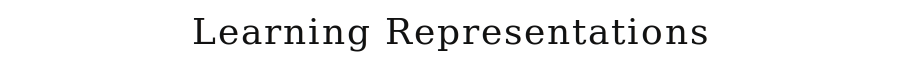
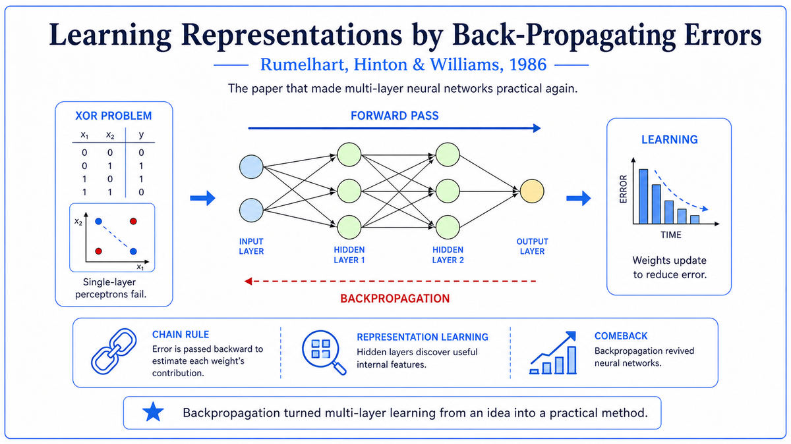

  

  <a href="https://www.nature.com/articles/323533a0">📄 Original Paper (Nature 1986)</a> · David Rumelhart (Born Wessington Springs, South Dakota, 1942), Geoffrey Hinton (Born Wimbledon, London, 1947), Ronald Williams (Born Southern California, 1945)

<em>The four-page Nature paper that ended the first AI winter and started the modern era.</em>

---

By the early 1980s, three researchers in three different parts of the United States were converging on the same idea. David Rumelhart was at UC San Diego, leading the Parallel Distributed Processing research group with Jay McClelland. He was a 40 year old psychologist with a doctorate from Stanford. Geoffrey Hinton was at Carnegie Mellon, having moved there in 1982. He was 35, born in Wimbledon, descended from George Boole. He had spent his career on neural networks during a period when most AI researchers considered them dead. Ronald Williams was a member of Rumelhart's group, a mathematician with a Caltech bachelor's and a UCSD doctorate.

The idea they were converging on was backpropagation, the same algorithm Werbos had described in his 1974 thesis. None of them knew about Werbos's thesis. Rumelhart had developed the algorithm independently in spring 1982. Hinton was initially skeptical that backpropagation could work, accepting it only after Rumelhart and Williams demonstrated empirically that it trained much faster than Boltzmann machines. By 1985, the trio had a working algorithm.

The decisive demonstration was XOR. The same XOR that Minsky and Papert had used in 1969 to prove that single-layer perceptrons had fundamental limitations. The same XOR that had become the symbol of neural networks' supposed dead end. Rumelhart, Hinton, and Williams showed that a simple multi-layer network with two input units, two hidden units, and one output unit, trained with backpropagation from random initial weights, learned XOR reliably. The proof that had killed neural networks in 1969 was retired by a working demonstration in 1985.

They published the result in Nature on October 9, 1986, in a four-page paper titled "Learning representations by back-propagating errors." The title was important. The paper was not just about backpropagation. It was about what backpropagation enabled networks to learn. The deep claim was that when you train a multi-layer network on a task, the hidden units automatically discover useful features of the data. The paper demonstrated this with several tasks, including a network that learned family relationships in two synthetic family trees, where the hidden units came to represent abstract concepts like generation, nationality, and gender, even though no one had told the network these concepts existed.

The same trio had a longer version in chapter 8 of the Parallel Distributed Processing volumes, published by MIT Press the same year. The PDP volumes became the foundational texts of modern connectionism.

Within months of the Nature paper, neural network research was alive again. Within a year, every major American AI lab had a backpropagation working group. Backpropagation, the algorithm Werbos had described twelve years earlier in a thesis nobody read, had finally arrived in the right place at the right time.

  

<em>The same XOR problem that closed neural networks in 1969 was the first demonstration that opened them again in 1986. Same problem, same input, completely different conclusion, because the algorithm to train multi-layer networks finally existed.</em>

---

The paper broke the Minsky-Papert wall. Backpropagation eliminated the limitations of single-layer networks in the most direct way possible: by showing that multi-layer networks trained with the algorithm could solve all of them. The paper did not argue with Minsky and Papert's mathematics. The mathematics was correct for single-layer networks. The paper showed that the conclusions did not extend to multi-layer networks once a learning algorithm existed.

It introduced the concept of learned representations to a broad audience. The paper's central claim was not just that multi-layer networks could be trained, but that training caused the hidden units to develop useful internal representations. This view, called representation learning, became the philosophical foundation of modern deep learning. Every successful deep learning system since 1986 has been a system that learns useful representations from data.

The paper was a sociological event as much as a scientific one. Nature is one of the most widely read scientific journals in the world. A four-page demonstration that a previously discredited approach now worked, published in Nature with a clear title and compelling examples, reached a much broader audience than any technical AI conference could.

The paper also illustrates a deep lesson about how scientific ideas spread. Werbos had backpropagation in 1974. Parker had it independently in 1985. LeCun had it independently in 1985. Rumelhart, Hinton, and Williams had it independently from 1982. Six independent discoveries of essentially the same algorithm, spread across three countries and twelve years. Only the 1986 Nature paper produced widespread adoption. The reason is sociological, not technical. The right venue, the right authors, the right framing, the right moment.

For modern AI, the 1986 paper is the moment when the lineage to today's systems became continuous. Every major modern technique can be traced back through a chain of incremental improvements to multi-layer networks trained with backpropagation.

---

The 1986 paper presents the same backpropagation algorithm that Werbos had described in 1974, but with a different emphasis. The algorithm itself is straightforward. Compute a forward pass through the network. Compute the error at the output. Propagate the error backward through the layers, computing the gradient of the error with respect to each weight. Update the weights in the direction that reduces the error. Repeat for many training examples.

The conceptual content of the paper is in what happens when you do this. A multi-layer network has layers between the input and the output, called hidden layers because they are not directly observed. Their values during training are determined entirely by the network's response to the data plus the constraint that the output should match the target. The hidden units have no externally specified meaning. Whatever meaning they acquire is learned.

The 1986 paper's deepest claim is that this learning is not arbitrary. When you train a network on a structured task, the hidden units organize themselves to represent the structure. The paper's family relationships demonstration is the cleanest example. The network had two input groups, one encoding a person's name and one encoding a relationship type. After training, the hidden units came to represent abstract concepts. One hidden unit became active for English-family people and inactive for Italian-family people. Another distinguished older from younger generations. The network had not been told about nationality, generation, or gender. It had discovered these distinctions because they were the structure of the task.

The result was philosophically important. Symbolic AI had assumed that intelligence required explicit representations of concepts, manually programmed by knowledge engineers. The 1986 paper showed that, at least for some tasks, useful concepts could emerge automatically from gradient descent on raw data. This idea would not be fully validated until the deep learning revolution of the 2010s, but it was first demonstrated cleanly in 1986.

---

The mathematical core of the paper is the chain rule of calculus applied to the network's structure. For a network with input vector x, hidden activations h, and output y, the error E depends on y, which depends on the weights from hidden to output, which depends on h, which depends on the weights from input to hidden. The chain rule gives us all the partial derivatives recursively.

The specific update rule for a weight wᵢⱼ from unit i to unit j is

> Δwᵢⱼ = −η × δⱼ × oᵢ

where η is the learning rate, oᵢ is the activation of unit i, and δⱼ is the error signal at unit j. For an output unit, δⱼ is the difference between the unit's output and its target, multiplied by the derivative of the activation function. For a hidden unit, δⱼ is computed by summing the error signals from the layer above:

> δⱼ_hidden = (Σₖ δₖ_above × wⱼₖ) × f'(netⱼ)

This formula is the heart of backpropagation. The cost of computing all the δ's is roughly the same as one forward pass, independent of the number of weights.

The 1986 paper specifically used the sigmoid activation function. Modern networks use ReLU, but the basic backpropagation calculus is unchanged. The paper observes that local minima are rarely a problem in practice. Modern theoretical work has shown that, in sufficiently overparameterized networks, almost all local minima are roughly as good as the global minimum.

The paper does not introduce new mathematics. The chain rule was old. Gradient descent was old. What the paper did was apply the mathematics to a clear problem, demonstrate the result clearly, and present the conclusion in a venue that the right people read.

---

The immediate aftermath was the second connectionist boom. Within a year, neural network research groups were forming at every major American university. The annual NeurIPS conference, which had started in 1987, became the central venue.

The most consequential application in the late 1980s was Yann LeCun's work on convolutional networks for handwritten digit recognition. LeCun, then at Bell Labs, had independently derived backpropagation as a graduate student in France. By 1989, his networks were reading handwritten zip codes on US Postal Service envelopes, the first major commercial application of deep learning.

The 1986 paper did not solve all problems. Training deep networks remained difficult through the 1990s. Vanishing gradients made deep networks fail to learn. By the mid 1990s, the second connectionist boom was fading. Statistical methods like support vector machines displaced neural networks in many applications.

The full vindication came in the 2010s. With GPU computing, large data sets, and architectural improvements like ReLU and dropout, deep networks finally became practical. The 2012 AlexNet result kicked off the deep learning revolution. Every modern AI system is trained with some variant of the backpropagation algorithm the 1986 paper described.

Hinton shared the 2018 Turing Award with Yoshua Bengio and Yann LeCun. Hinton received the 2024 Nobel Prize in Physics, jointly with John Hopfield. Rumelhart died in 2011. Williams died in 2024.

The next stop on this walk is the same year, 1986. The Parallel Distributed Processing volumes, of which the Nature paper was a small part, would establish connectionism as a mature field with its own methodology.

---

  <a href="1982-Hopfield-Networks.md">← Previous: Hopfield Networks 1982</a> &nbsp;·&nbsp; <a href="1986b-PDP-Volumes.md">Next: PDP Volumes 1986 →</a>

