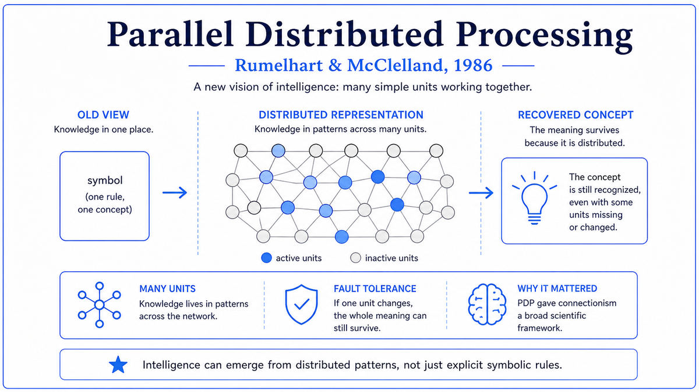

  

  <a href="https://mitpress.mit.edu/9780262680530/parallel-distributed-processing-volume-1/">📄 The PDP Volumes (MIT Press 1986)</a> · David Rumelhart (Born Wessington Springs, South Dakota, 1942), James McClelland (Born Cambridge, Massachusetts, 1948)

<em>Two volumes, twenty-six chapters, and a complete intellectual program for building minds out of networks.</em>

---

By 1981 David Rumelhart and James McClelland had been thinking together about cognition for several years. Rumelhart was a 39 year old psychology professor at UC San Diego with a doctorate in mathematical psychology from Stanford. McClelland was a 33 year old researcher at UCSD with a doctorate from the University of Pennsylvania. They met at UCSD in the late 1970s and discovered they shared an unfashionable conviction. They thought the dominant theory of cognition, in which the mind was a symbol-manipulation system like a Turing machine, was fundamentally wrong.

Their alternative was inspired by the brain. The brain has billions of neurons. The neurons interact in parallel. No single neuron contains a complete thought. Cognition, they argued, must be like that. A massively parallel computation in which many simple units interact, with knowledge stored not in any single location but in the patterns of connections between units. They called this view parallel distributed processing, abbreviated PDP. They started a research group at UCSD with the same name.

The PDP group grew through the early 1980s. Geoffrey Hinton joined as a postdoc and brought ideas about Boltzmann machines. Paul Smolensky contributed harmony theory. Jeffrey Elman, working on speech and language, joined later. By 1984 the group had a body of work substantial enough to warrant a comprehensive treatment.

Rumelhart and McClelland decided to write a book together. They wanted to lay out the foundations of the PDP framework, demonstrate it in a wide range of cognitive tasks, and engage with the symbolic AI tradition. By 1985 the book had become two volumes.

Volume 1, Foundations, came out from MIT Press in 1986 with a green cover. Chapter 8, by Rumelhart, Hinton, and Williams, contained the long version of the backpropagation paper. Other chapters covered competitive learning, harmony theory, Boltzmann machines, and the mathematics of distributed representation.

Volume 2, Psychological and Biological Models, came out at the same time with a blue cover. It applied the PDP framework to specific cognitive phenomena: word recognition, speech perception, memory, past tense morphology, sentence processing.

The two volumes together became known simply as PDP. Within a few years they were the standard textbook of connectionism. By 2025, they had been cited more than 19,000 times. They are widely considered the most important publication in cognitive science of the late twentieth century.

  

<em>The defining contrast that organized the entire PDP framework. On the left, symbolic AI's atomic representation. On the right, the distributed pattern that is the foundation of every modern neural network.</em>

---

The volumes provided a complete intellectual framework, not just an algorithm. Backpropagation was a technique. PDP was a worldview. The volumes argued that cognition was fundamentally about parallel distributed computation, that knowledge was stored in patterns of connections rather than in symbols, that learning emerged from gradient-based weight updates, and that intelligent behavior was the result of many simple interactions rather than the execution of explicit rules. The volumes gave the connectionist community a shared vocabulary, methodology, and research program.

They triggered the past tense debate, the most consequential intellectual confrontation in cognitive science in the late twentieth century. Chapter 18 of Volume 2 was Rumelhart and McClelland's connectionist model of how children learn the English past tense. The model was a simple feedforward network. It learned regular verbs, irregular verbs, and the developmental pattern of overregularization in which children temporarily produce errors like "goed" before settling on "went." The network achieved this without any explicit rule for past tense formation. Steven Pinker and Alan Prince published a 200-page critique in 1988 arguing that some kind of symbolic rule was necessary. The debate ran for two decades. The intellectual content is still being relitigated in 2025 in the context of large language models.

The volumes shaped a generation of researchers. Many leaders of the modern deep learning movement either contributed to PDP or were trained on it. Hinton's chapter on Boltzmann machines became the foundation for his later work on deep belief networks. Elman's recurrent network designs became the foundation of modern recurrent architectures.

For the broader story of AI, the PDP volumes are the moment when neural networks moved from technique to paradigm. After the volumes, working on neural networks was no longer a niche research direction. It was a coherent intellectual program with a shared vocabulary, recognized journals, annual conferences, and a textbook.

---

The defining concept of the PDP framework is distributed representation. The volumes spend many chapters explaining what this means and why it matters.

In symbolic AI, a concept like "dog" is represented by a dedicated symbol or memory location. The system has a cell for dog, another cell for cat, another cell for car. The advantage is clarity. The disadvantage is brittleness. If the dog cell is damaged, the system loses the concept. The relationships between concepts must be specified explicitly.

In a PDP network, "dog" is represented by a pattern of activity across many units. No single unit means "dog." The dog concept is the entire pattern, with each unit contributing partial information. Unit 1 might be active for things that are alive. Unit 2 might be active for things that are furry. Unit 3 might be active for things that bark. Different concepts produce different patterns. Similar concepts produce similar patterns. Cat and dog share many active units. Cat and car share fewer.

The advantages of distributed representation are several. Robustness to damage: if one unit fails, the pattern is still recognizable. Automatic similarity: similar concepts produce similar patterns, so the network generalizes naturally. Compositional structure: complex concepts can be built from combinations of simpler features. Capacity: the number of distinct patterns scales exponentially with the number of units.

The cost is interpretability. In a symbolic system, you can point at a cell and say "this is the dog concept." In a distributed system, you cannot point at any single thing. The concept is an emergent property of the entire pattern. This remains a challenge for modern deep learning. Modern interpretability research is in part an attempt to recover the kind of clarity that symbolic representations had, while keeping the advantages of distributed representations.

The volumes also codified several other concepts. Constraint satisfaction. Settling dynamics. Coarse coding. Each has analogs in modern AI systems. Modern transformer attention is a kind of constraint satisfaction. Modern diffusion models are a kind of settling. Modern embeddings are a kind of distributed representation.

---

Volume 1 presents the mathematical foundations of connectionism in a unified framework. The general PDP system has eight components: a set of processing units, a state of activation, an output function, a pattern of connectivity, a propagation rule, an activation rule, a learning rule, and an environment.

These eight components define the space of possible PDP models. Hopfield networks, perceptrons, multi-layer feedforward networks, Boltzmann machines, and many other systems can all be described as choices within this framework. The framework was an organizational achievement. It let the field talk about specific models in a unified language.

The volumes present several specific learning rules in mathematical detail. The delta rule for single-layer networks. The generalized delta rule, the form of backpropagation, for multi-layer networks. The Hebbian rule for unsupervised learning. The Boltzmann learning rule for stochastic networks. The competitive learning rule for self-organization.

The mathematics of the volumes was not all original. Most of the specific algorithms had appeared elsewhere. The contribution was the unification, the systematic exposition, and the demonstration of how the same mathematical framework could explain a wide variety of cognitive phenomena. Many graduate students of the late 1980s and 1990s learned their math by working through the PDP volumes.

---

The immediate aftermath was the connectionist boom of the late 1980s and early 1990s. PDP-style models were applied to almost every cognitive task that had ever been studied. Hundreds of dissertations were written using the PDP framework. The Cognitive Science Society, the International Conference on Cognitive Science, and the NeurIPS conference all became major venues.

The past tense debate was the most visible part of this period. Pinker and Prince's 1988 critique was followed by Pinker's 1991 article in Science and replies from McClelland and others. The debate has not been resolved. Modern large language models, which are connectionist systems trained on large data, have largely vindicated the PDP view that complex linguistic behavior can emerge from gradient-based learning, but the deeper question of whether human cognition uses symbolic operations or not is still open.

The PDP framework also faced its own problems. Training deep networks remained difficult through the 1990s. The vanishing gradient problem, the difficulty of representing temporal sequences, the brittleness of small networks, all limited what PDP models could achieve in practice. By the mid 1990s, statistical methods like support vector machines had displaced PDP-style networks. The connectionist community contracted.

The full revival came with the deep learning explosion of the 2010s. Many techniques that made deep learning work, including convolutional networks, recurrent networks, batch normalization, dropout, and attention mechanisms, were extensions of ideas first laid out in the PDP volumes. The shift from quiet niche to dominant paradigm took twenty-five years, but the ideas the volumes had codified remained the foundation throughout.

For the broader AI story, the PDP volumes mark the moment when connectionism became a mature scientific field rather than a research curiosity. The next stop on this walk is 1989. Yann LeCun, then at Bell Labs, was about to publish a paper on convolutional neural networks for handwritten digit recognition. LeCun's work would be the first major engineering success of the connectionist revival.

---

  <a href="1986a-Rumelhart-Hinton-Williams-Backpropagation.md">← Previous: Rumelhart-Hinton-Williams Backpropagation 1986</a> &nbsp;·&nbsp; <a href="1989-LeCun-Convolutional-Networks.md">Next: LeCun Convolutional Networks 1989 →</a>

