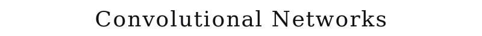
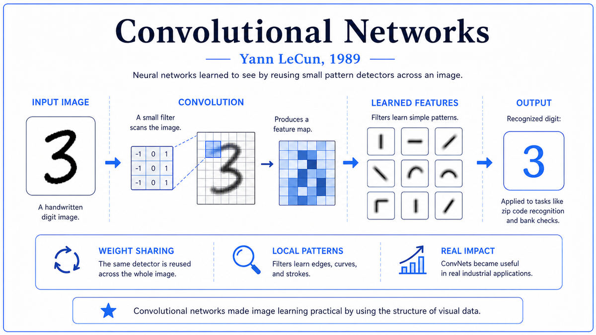

  

  <a href="http://yann.lecun.com/exdb/publis/pdf/lecun-89e.pdf">📄 Original Paper (Neural Computation 1989)</a> · Yann LeCun (Born Soisy-sous-Montmorency, France, 1960)

<em>The first neural network that did real work in the real world. It read handwritten zip codes off mail.</em>

---

In January 1988, Yann LeCun was 27 years old and starting a new job. He had finished his PhD at Université Pierre et Marie Curie in Paris in 1987, with a thesis that contained an early formulation of backpropagation. He had spent the next year as a postdoc with Geoffrey Hinton at the University of Toronto. Now he was joining Lawrence Jackel's Adaptive Systems Research Department at AT&T Bell Laboratories in Holmdel, New Jersey.

The problem they had been given was handwritten digit recognition. The US Postal Service was looking for a way to automatically read zip codes off envelopes. Handwritten digits vary enormously: different writers, pens, sizes, styles. Before LeCun arrived, the Bell Labs team had built a hybrid system that combined classical image processing with a small neural network using hand-designed feature detectors. The system worked, but the hand-designed parts were fragile and required expert tuning.

LeCun's thesis had been about an architectural idea inspired by the visual cortex. Hubel and Wiesel had shown in the 1960s that early visual cortex neurons respond to small local patches of the retinal image. Each neuron has a receptive field, a small region where stimuli affect that neuron's firing. Different neurons cover different parts of the field. Neurons of the same type are spread throughout the field. Later cortical layers combine these features into more abstract representations.

LeCun proposed to build a neural network with the same structure. Each hidden neuron would look at a small local patch of the input. Critically, neurons of the same type would share weights, so the same feature detector would slide across the entire image. This local-connection-with-weight-sharing architecture is what we now call a convolutional layer. Subsampling layers between the convolutional layers reduce spatial resolution, providing some invariance to small translations.

The architecture had two big advantages. Far fewer parameters: a 16 by 16 input fully connected to a hidden layer of 256 units has 65,536 weights, while the same input processed by a convolutional layer with 12 feature maps of 5 by 5 filters has only 300 unique weights. And the architecture encodes a useful prior. The fact that nearby pixels are related, that translation should not change the meaning, is baked into the architecture rather than learned from scratch.

LeCun and the team trained their network on 7,291 handwritten zip code digits from the US Postal Service, scanned from real mail at the Buffalo, New York post office. Training took three days on a Sun-4/260 workstation. On the 2,007-digit test set, the network achieved a test error rate of 5 percent. Two human experts achieved about 2.5 percent. By 1990, similar networks were being deployed for check reading. By 1998, refinements were processing more than 10 percent of all checks in the United States.

The paper, "Backpropagation Applied to Handwritten Zip Code Recognition," was published in Neural Computation in winter 1989. Co-authors were Bernhard Boser, John Denker, Donnie Henderson, Richard Howard, Wayne Hubbard, and Lawrence Jackel. Every modern computer vision system, every transformer trained on images, every diffusion model, traces back through a chain of refinements to this paper.

  

<em>The architecture template that would dominate computer vision for two decades. Local connections, weight sharing, and progressive spatial coarsening.</em>

---

The paper was the first real-world deployment of backpropagation. Before 1989, neural networks trained with backpropagation had solved toy problems. The 1989 paper showed that a network trained with the same algorithm could do real engineering work on real industrial data, with performance approaching human level. By 1990, similar systems were being installed in postal facilities. By the mid 1990s, financial institutions were deploying convolutional networks for check reading.

It established the principle that architecture encodes prior knowledge. A fully connected network has no idea that the input is an image. It treats every pixel independently. A convolutional network has the structure of images built into its design. With the right architecture, a network can learn from much less data than a generic network would need. This insight, that architecture matters as much as the learning algorithm, has been one of the central organizing principles of modern AI.

The paper demonstrated end-to-end learning. Before 1989, computer vision systems had multiple stages, each hand-designed. LeCun's network had a single training procedure that adjusted all the weights in all the layers simultaneously. The hand-designed feature detectors disappeared. The network learned its own features, which were better than the ones humans had been hand-designing. The end-to-end learning principle has become the default way of building modern AI systems.

The full vindication came in 2012 with AlexNet. Krizhevsky, Sutskever, and Hinton applied a much larger version of LeCun's basic architecture to the ImageNet dataset, with significantly more parameters and training data, plus refinements like ReLU and dropout, plus GPU computing. AlexNet won the ImageNet challenge by a wide margin, kicking off the deep learning revolution. The architecture was, structurally, a descendant of LeCun's 1989 network. The lineage was direct.

For the broader story, this paper closes Era 05. The foundations laid would survive the niche period of the 1990s and be ready for the explosion when the data and compute finally arrived.

---

A convolutional network has three key architectural ideas. Local receptive fields. Shared weights. Spatial subsampling.

Local receptive fields means each neuron in a convolutional layer connects to only a small spatial region of the layer below. A typical filter might be 5 by 5 pixels. Different neurons cover different patches. Each neuron is sensitive to local patterns. This matches the structure of natural images, where most of the meaningful structure is local. Edges, corners, and textures are all defined by local pixel relationships, not by relationships between distant pixels.

Shared weights means that all neurons that detect the same feature share the same weight parameters. If you have a filter that detects vertical edges, the same set of weights is used at every spatial position. The shared filter, called a convolutional kernel, gives the architecture its name. The advantage is dramatic parameter reduction. A standard fully connected layer between an input of 256 pixels and a hidden layer of 256 neurons has 65,000 parameters. A convolutional layer with 12 filters of size 5 by 5 has only 300 parameters, repeated across all spatial positions.

Spatial subsampling means that after each convolutional layer, the spatial resolution is reduced by combining nearby outputs into a single value. The 1989 LeCun network used average pooling. Subsampling reduces computation in subsequent layers and provides some invariance to small translations.

The combination of these three ideas produces a hierarchy of features at multiple scales. The first convolutional layer detects simple local patterns like edges and corners. The second detects combinations of first-layer features. Subsequent layers detect increasingly abstract patterns. The lower layers learn what useful low-level features are. The higher layers learn how to combine them.

The conceptual depth is in the principle of architectural priors. By choosing an architecture that respects the structure of images, LeCun made the learning problem dramatically easier. The architecture is a kind of pre-knowledge built into the network, telling it that nearby pixels are related, that translation is a symmetry, and that hierarchical organization is appropriate.

---

The 1989 LeCun network had four hidden layers and an output layer. The input was a 16 by 16 grayscale image.

Layer H1 was the first convolutional layer with 12 feature maps of size 8 by 8, produced by 5 by 5 filters with stride 2. Layer H2 was the second convolutional layer with 12 feature maps of size 4 by 4, with sparse connectivity. Layer H3 was a fully connected layer with 30 units. Layer H4 was the output layer with 10 units.

Total parameter count was approximately 9,760 trainable weights. By modern standards this is tiny. Modern image classifiers have hundreds of millions of parameters. The parameter sharing in the convolutional layers was what made it tractable to train on the available data.

The activation function was the hyperbolic tangent. The training loss was mean squared error. The optimization was stochastic gradient descent.

The backpropagation through convolutional layers required some care. Because the same filter weights are used at multiple positions, the gradient for a shared weight is the sum of the gradients from all the positions where it was used. Modern frameworks handle this automatically, but in 1989 LeCun and his team had to implement it by hand.

Training took 23 epochs, requiring three days on a Sun-4/260 workstation. The same training run, on a modern GPU, takes about 30 seconds.

---

The convolutional network architecture was refined into LeNet-1 in 1989, then through several versions to LeNet-5 in 1998. By 1998, LeNet-5 was reading checks at major US banks, processing more than 10 percent of all checks in the country.

But within the academic research community, the 1990s were not kind to neural networks. Support vector machines, introduced in 1995, often outperformed neural networks on small datasets, with cleaner theory and easier training. These statistical methods became the default in machine learning research. Convolutional networks worked well at scale, but the data sets and computational resources to demonstrate their advantages did not exist outside specialized industrial deployments.

LeCun continued working on convolutional networks throughout the 1990s and 2000s, often as a relatively isolated voice in a field that had moved on. He left Bell Labs in 1996. In 2003 he joined NYU as a professor.

The breakthrough came with a convergence of factors. Hinton's group developed methods for training deep networks. GPUs became cheap and accessible. Large labeled datasets like ImageNet became available. The 2012 AlexNet paper used a deep convolutional network with these new tools and won ImageNet by a huge margin. The architecture was a much larger version of LeCun's 1989 network.

In 2018, LeCun received the Turing Award jointly with Hinton and Bengio. By 2025, convolutional networks had been displaced as the state-of-the-art for many vision tasks by transformer architectures. But the basic principles LeCun introduced in 1989, end-to-end training, architectural priors, hierarchical feature learning, are baked into every modern AI system.

This paper closes Era 05. The 1980s comeback ran from XCON's commercial demonstration in 1980 through Hopfield's revival in 1982, the Rumelhart-Hinton-Williams paper and PDP volumes in 1986, and LeCun's first deployed convolutional network in 1989. By the end of the decade, neural networks were back as a research field, with practical applications and a coherent theoretical framework. Era 06, the Statistical Era, picks up the story.

---

  <a href="1986b-PDP-Volumes.md">← Previous: PDP Volumes 1986</a> &nbsp;·&nbsp; <a href="../06-Statistical-Era-(1990s)/1991-Hochreiter-Vanishing-Gradient.md">Next: Hochreiter Vanishing Gradient 1991 →</a>

