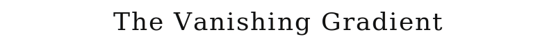
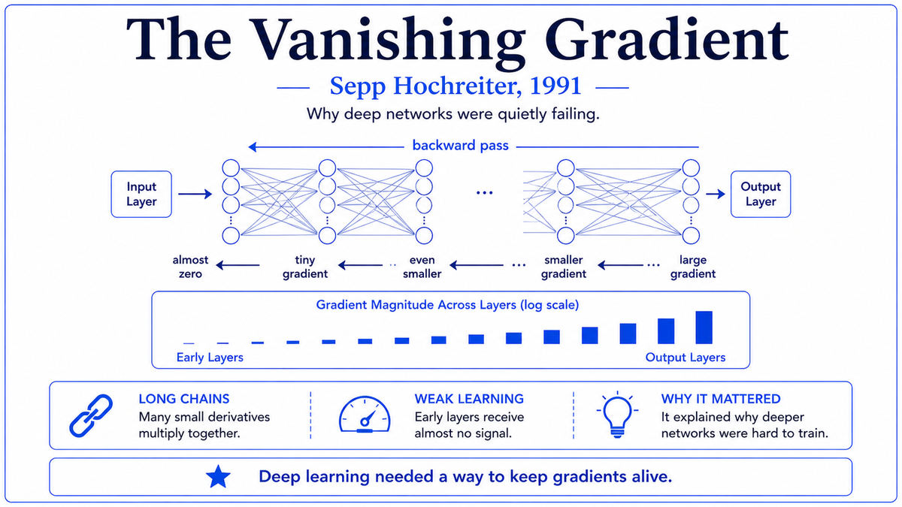

  

  <a href="https://people.idsia.ch/~juergen/fundamentaldeeplearningproblem.html">📄 Hochreiter's 1991 Thesis (Schmidhuber's commentary)</a> · Sepp Hochreiter (Born Mühldorf am Inn, Bavaria, Germany, 1967)

<em>A 24-year-old's diploma thesis explained why a decade of neural network optimism had been quietly failing in the lab.</em>

---

By 1990 the connectionist revival was four years old and hitting a wall. Backpropagation worked beautifully for shallow networks, but deeper networks and recurrent networks unfolded over many time steps refused to train. The output layers learned quickly. The deeper layers, far from the output, learned slowly or not at all. Researchers blamed local minima, slow optimizers, bad luck. Many assumed the deep layers would catch up with patience or more compute.

In Munich, a 24 year old computer science student named Sepp Hochreiter was working on his diploma thesis at the Technical University of Munich, advised by Jürgen Schmidhuber. Hochreiter ran the standard experiments. They failed in the standard way. Recurrent networks could not learn long-range dependencies. Information from many time steps in the past did not influence what the network learned at the present.

Hochreiter went looking for the cause and found a clean mathematical answer. Backpropagation, applied repeatedly through a chain of layers, multiplies the error signal at each layer by the derivative of the activation function. For the standard sigmoid used in 1991, the derivative is at most 0.25, achieved when the input to the sigmoid is exactly zero. For most inputs it is much smaller. After ten layers, even the maximum derivative product is 0.25 to the tenth power, about a millionth. The error signal arriving at the early layers is so small that the early layers cannot learn.

The mathematics was elementary. The chain rule applied to a sequence of sigmoids produces an exponentially shrinking gradient. The shrinking is not a bug to be patched out. It is a fundamental consequence of the architecture. Unless something is changed, deep networks will not train. Hochreiter also noted the mirror case. If the relevant quantities are greater than one, the gradient grows exponentially and training diverges. He called this the exploding gradient problem.

The thesis was written in German and submitted in June 1991. It was a diploma thesis, the German equivalent of a master's, never published as a research paper. It sat in the TU Munich library, mostly unread outside Schmidhuber's group. In 1994, Yoshua Bengio, Patrice Simard, and Paolo Frasconi independently rediscovered the same problem and published their analysis in IEEE Transactions on Neural Networks. The Bengio paper became the standard citation, even though Hochreiter's thesis predated it by three years. The thesis also contained the seeds of the eventual fix, which Hochreiter and Schmidhuber would develop into the Long Short-Term Memory architecture in 1997.

  

<em>The mathematics is mundane. The consequence shaped the next twenty years of deep learning research.</em>

---

The vanishing gradient analysis mattered for three reasons.

First, it explained why the connectionist revival was hitting a wall. Before 1991, researchers training deep networks had no theory for why their networks were failing. After 1991, they had a precise mathematical explanation. The problem was structural. Standard sigmoid networks with standard backpropagation could not be made to work for deep architectures, no matter how patient or well-funded the researchers. Knowing this saved enormous effort that would otherwise have been wasted on doomed experiments.

Second, it set the agenda for two decades of research. Almost every major architectural innovation in deep learning between 1991 and 2015 can be understood as a response to vanishing gradients. LSTM in 1997 replaced the leaky chain of multiplications with a memory cell whose state persists across time steps. ReLU activations replaced the saturating sigmoid with a function whose derivative is 1 in the active region. Careful weight initialization, batch normalization, and residual connections each addressed the same underlying problem. Together, they made deep learning possible.

Third, it explained why the deep learning revolution had to wait. The intuition that going deeper would help was strong by the early 1990s. But the practical engineering of training deep networks did not become reliable until the mid 2010s. The 23-year gap between knowing that deep networks should work and being able to actually train them is, in large part, the time it took the field to work around the vanishing gradient problem.

---

The vanishing gradient problem is what happens when an error signal propagating backward through a deep neural network shrinks to nothing before it reaches the early layers. The cause is the chain rule of calculus applied repeatedly across many layers.

In a feedforward network, each layer applies a nonlinear activation function to a weighted sum. Backpropagation computes how a small change to each weight would change the final loss. The chain rule says the contribution of a weight in an early layer is the product of the local effect at that layer and the chain of effects flowing forward to the loss. Every time the signal passes through another layer, another factor gets multiplied in.

For sigmoid activations, the relevant factor at each layer is the sigmoid derivative, bounded by 0.25 and usually much smaller. The product of many such factors shrinks exponentially with depth. By the time the gradient reaches a layer ten or twenty steps from the output, it can be many orders of magnitude smaller than the gradient at the output. The early layers cannot adjust their weights based on the loss they are contributing to. They cannot learn.

The same logic applies to recurrent networks unfolded over time. A recurrent network processing a sequence of length T is equivalent to a feedforward network with T layers. Gradients shrink exponentially in T, just as they shrink exponentially in depth for feedforward networks. Recurrent networks cannot learn long-range temporal dependencies.

---

For a feedforward network where each layer applies hₖ = σ(Wₖ hₖ₋₁ + bₖ), the gradient of the loss with respect to a weight in layer 1 is

> ∂L/∂wᵢⱼ = (∂L/∂hₙ) · ∂hₙ/∂hₙ₋₁ · ∂hₙ₋₁/∂hₙ₋₂ · ... · ∂h₂/∂h₁ · ∂h₁/∂wᵢⱼ

Each middle term has the form diag(σ'(zₖ)) · Wₖ. The sigmoid derivative σ'(z) = σ(z)(1 − σ(z)) is bounded between 0 and 0.25, with the maximum at z = 0.

For an N-layer network with similar weights at each layer, the gradient at layer 1 is approximately

> ‖∂L/∂h₁‖ ≈ ‖∂L/∂hₙ‖ · (¼ · ‖W‖)^(N-1)

If ‖W‖ < 4, the gradient shrinks exponentially in N. If ‖W‖ > 4, it grows exponentially. Both are pathological for training. The narrow band where the gradient is well-behaved is hard to hit, especially because weights change during training. Hochreiter showed that for standard initializations and standard sigmoids, the vanishing case dominates. For a 10-layer network with reasonable weights, the gradient at the first layer is typically 10⁻⁵ to 10⁻¹⁰ smaller than the gradient at the output. Such gradients cannot drive learning.

---

Through the 1990s and 2000s, neural network research worked around vanishing gradients in multiple ways. Reinforcement learning used eligibility traces. Speech recognition used hidden Markov models. NLP used n-gram models. Computer vision stuck with shallow networks or limited-depth convolutional architectures. The dream of training arbitrarily deep networks remained out of reach.

The breakthrough came piece by piece. Hinton's 2006 paper on deep belief networks showed that pre-training each layer separately could side-step the problem. ReLU activations, popularized in the late 2000s, replaced the saturating sigmoid with a function whose derivative is 1 in the active region. By 2012, AlexNet was using ReLU and dropout to train an 8-layer network on ImageNet. The full solution arrived with residual connections in 2015. He, Zhang, Ren, and Sun's ResNet trained networks of 152 layers by providing a shortcut path through which gradients could flow without passing through the chain of multiplications. This was the same insight Hochreiter had sketched in 1991 for recurrent networks, applied 24 years later to feedforward networks.

The next stop on this walk is 1992. Gerald Tesauro at IBM was about to publish a paper on TD-Gammon, a neural network that learned to play world-class backgammon by playing against itself. The paper was the first major demonstration that neural networks plus reinforcement learning could exceed human expert performance, and it foreshadowed many later breakthroughs including AlphaGo.

---

  <a href="../05-Comeback-(1980s)/1989-LeCun-Convolutional-Networks.md">← Previous: LeCun Convolutional Networks 1989</a> &nbsp;·&nbsp; <a href="1992-Tesauro-TD-Gammon.md">Next: TD-Gammon 1992 →</a>

