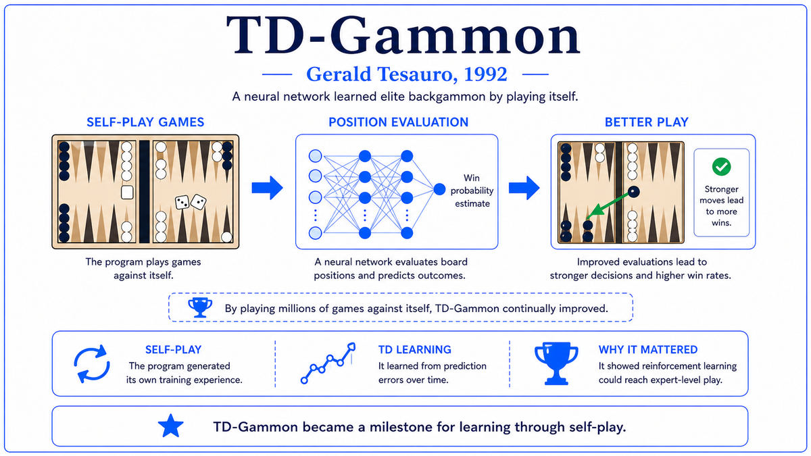

  

  <a href="https://link.springer.com/content/pdf/10.1007/BF00992697.pdf">📄 Original Paper (Machine Learning 1992)</a> · Gerald Tesauro (Born United States, IBM Watson Research Center)

<em>A neural network that taught itself backgammon through self-play. It then taught humans how to play better. Twenty-five years later, AlphaGo would do the same with Go.</em>

---

In the late 1980s Gerald Tesauro was a young theoretical physicist at IBM's Thomas J. Watson Research Center in Yorktown Heights, New York. After a postdoc at the University of Illinois, where he had collaborated with Terry Sejnowski on early connectionist models, Tesauro joined IBM in 1988 and became increasingly drawn to neural networks. By 1989 he had built a backgammon program called Neurogammon, a neural network trained by supervised learning on a hand-curated database of expert moves. Neurogammon won the 1989 Computer Olympiad, but it played only at strong intermediate level, far below the world's best humans.

The supervised approach had a built-in ceiling. The labels could only be as good as the human labellers. Tesauro wondered whether a fundamentally different approach might break the ceiling. Instead of imitating humans, the network would learn directly from outcomes. It would play games against itself, observe wins and losses, and use the outcomes to improve. The technical name was reinforcement learning. The specific algorithm was Sutton's TD(λ), introduced in 1988, which had been studied theoretically but never applied to a complex real-world task.

Most reinforcement learning at the time used lookup tables to represent the value function. Lookup tables fail for backgammon, which has roughly 10^20 possible board positions. Tesauro replaced the lookup table with a neural network that mapped any backgammon position to its estimated probability of winning. The network had three layers. The input layer encoded the board state in 198 units. The hidden layer had 80 units. The output layer had a single unit producing the network's estimate of winning probability.

The training procedure was self-play. The network started with random weights, meaning it played terribly. To play, the network looked at the current position, considered each move the dice allowed, evaluated the resulting position with itself, and chose the move that maximized its predicted probability of winning. The network played both sides. After each move, the TD(λ) update adjusted the weights based on the difference between the network's prediction at step t and step t+1. When the game ended, the final outcome served as the ground truth, and the error propagated backward through the entire game.

Starting from random initial play, with no human game records and no hand-coded backgammon knowledge, the network reached strong intermediate level after a few hundred thousand games of self-play. By 1993, version 2.1 had been trained for 1.5 million self-play games and achieved near-parity with Bill Robertie, one of the world's strongest players, in a 40-game match. The paper that described this work, "Practical Issues in Temporal Difference Learning," appeared in Machine Learning, volume 8, in 1992. Despite its modest title, it was the first demonstration that reinforcement learning combined with neural networks could match human expert performance on a complex task.

  

<em>The simplest possible diagram of self-play reinforcement learning. Twenty-five years before AlphaGo, this loop was already producing world-class players from random starting points.</em>

---

TD-Gammon mattered for three reasons that took decades to fully unfold.

First, it demonstrated that self-play could exceed human expert level. Before TD-Gammon, the dominant assumption in AI was that programs could only be as good as the human knowledge they encoded. Expert systems used hand-crafted rules. Supervised learning programs used hand-labelled examples. TD-Gammon showed that this ceiling was not real. With the right learning algorithm, a program could start from no human knowledge at all and learn to play better than the best humans, by simply playing against itself many times. Human expertise was a useful starting point but not an upper bound.

Second, it combined neural networks with reinforcement learning in a way that worked at scale. TD-Gammon used a neural network as the value function approximator, allowing it to generalize from positions it had seen to positions it had not. This combination would become the foundation of every major reinforcement learning success of the following three decades. DeepMind's deep Q-learning, AlphaGo, AlphaZero, MuZero, and OpenAI's Five all use the same basic combination Tesauro pioneered.

Third, TD-Gammon discovered superhuman strategies and taught them to humans. Backgammon experts had developed conventional wisdom about opening moves over decades of play. For the rolls of 2-1, 4-1, and 5-1, the standard opening was called slotting. TD-Gammon disagreed. It preferred a more conservative play called splitting. Top human players began experimenting with the network's preferred moves and found they actually worked better. Within a few years, slotting had largely disappeared from tournament play. The machine had found something the human masters had missed, and the human masters had updated their understanding accordingly. This was the first time in AI history that a machine had taught humans something new about a complex domain that humans had been studying for centuries.

---

The core idea of temporal difference learning is to update predictions using other predictions, not just final outcomes. In a sequential decision problem, a learning agent makes predictions at each step about the eventual outcome. The naive approach is to wait until the outcome is known, then update all predictions to be closer to the actual outcome. This works but is slow and noisy.

Temporal difference learning is cleverer. The prediction at step t+1 is itself an estimate of the outcome, based on more information than the prediction at step t. So the prediction at t+1 is, on average, a better estimate. The TD update adjusts the prediction at t to be closer to the prediction at t+1, rather than waiting for the final outcome. This is sometimes called bootstrapping. Over many updates, the predictions converge to the true expected outcome much faster than waiting for full outcomes.

For TD-Gammon, the prediction is the network's estimate of winning probability from any given position. The TD update at each move says: the network's estimate at the position before the move should be closer to the network's estimate at the position after the move. When the game ends, the actual outcome replaces the next prediction in the update, and the error propagates backward through the entire game.

The neural network's role is to make this work for backgammon's enormous state space. Instead of storing a separate prediction for each of the 10^20 possible positions, the network computes a prediction from the position's input encoding. The network learns to generalize, so positions it has never seen produce sensible predictions based on their similarity to positions it has seen. The conceptual depth is in the recognition that learning from outcomes plus self-play is enough. Outcomes plus generalization are sufficient for learning complex tasks.

---

The TD(λ) update rule is

> Δwₜ = α (Yₜ₊₁ − Yₜ) Σₖ₌₁ᵗ λ^(t−k) ∇Yₖ

where wₜ is the weight vector at time t, α is a learning rate, Yₜ is the network's output at time t, ∇Yₖ is the gradient of the network output with respect to the weights at time k, and λ is the trace decay parameter. When the game ends at step T, Y_{T+1} is replaced by the actual outcome z, which is 1 for a win and 0 for a loss. The eligibility trace eₜ = Σₖ₌₁ᵗ λ^(t−k) ∇Yₖ can be updated incrementally at each step.

The architecture of TD-Gammon 2.1 had 198 input units, 80 hidden units, and 4 output units representing the four possible game outcomes. The total parameter count was about 16,160 weights. Training took weeks on the IBM workstations of the time. Over 1.5 million games, the network performed billions of weight updates.

Tesauro found that λ=0 actually worked better than λ>0 once the network had enough hidden units. With λ=0, the eligibility trace simplifies to just the gradient at the current step. This was a surprise. Sutton's original TD(λ) paper had emphasized nontrivial λ for tabular settings. With neural networks as function approximators, the function approximation itself provides enough generalization that the eligibility trace becomes redundant. Modern deep reinforcement learning typically uses λ=0 or its equivalent.

---

The immediate aftermath of TD-Gammon was puzzling. The result was clear: a self-taught neural network had matched the world's best backgammon players. But for the next twenty years, the lessons largely did not generalize. Researchers who tried chess found that the deterministic nature made self-play less effective. Researchers who tried Go found that the larger branching factor overwhelmed the simple TD(λ) algorithm. By the late 1990s, TD-Gammon was seen as a specialized success that depended on backgammon's unusual mix of luck and skill.

This view turned out to be wrong. The reason TD-Gammon's lessons did not immediately generalize was not that the lessons were specific to backgammon. It was that the compute of the 1990s was inadequate for harder games, and several additional techniques were needed. When DeepMind's AlphaGo arrived in 2015-2016, it used the same fundamental loop as TD-Gammon: a neural network as value function, self-play to generate training data, and gradient updates to improve the network. AlphaGo used larger networks, more compute, Monte Carlo tree search instead of simple lookahead, and a separate policy network. With these additions, the same basic approach worked for Go.

AlphaZero, the 2017 follow-up that learned chess, shogi, and Go from scratch, is even more directly the spiritual descendant of TD-Gammon. AlphaZero uses no human game records, just self-play and reinforcement learning, exactly as TD-Gammon did. The lineage extends to deep Q-learning for Atari games in 2013, OpenAI Five for Dota 2 in 2018-2019, and the RLHF techniques that produced ChatGPT and its successors. The principle, that self-play plus neural networks plus reinforcement learning can produce world-class play, is unchanged from 1992.

The next stop on this walk is 1995. While Tesauro was perfecting TD-Gammon, Vladimir Vapnik and Corinna Cortes at Bell Labs were about to publish a paper that would dominate machine learning for the next decade. The Support Vector Machine offered an alternative to neural networks that was theoretically cleaner, easier to train, and often more accurate on the small datasets of the era.

---

  <a href="1991-Hochreiter-Vanishing-Gradient.md">← Previous: Vanishing Gradient 1991</a> &nbsp;·&nbsp; <a href="1995-Cortes-Vapnik-SVM.md">Next: Support Vector Machines 1995 →</a>

