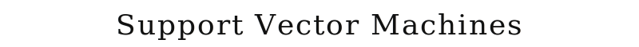
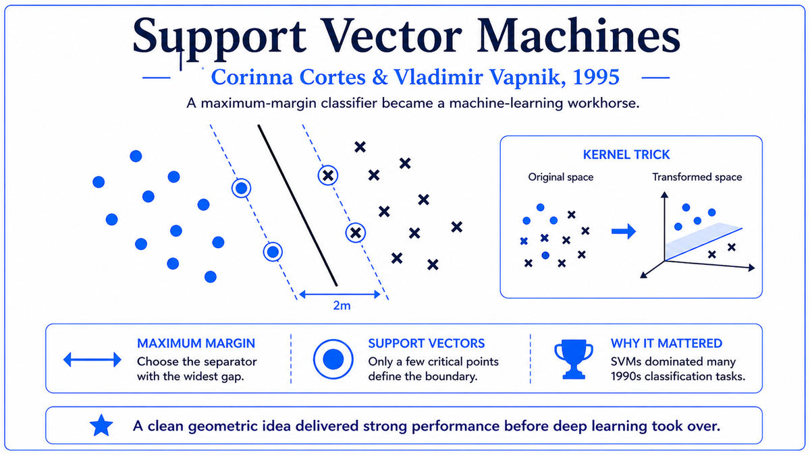

  

  <a href="https://link.springer.com/content/pdf/10.1007/bf00994018.pdf">📄 Original Paper (Machine Learning 1995)</a> · Corinna Cortes (Born Denmark, 1961), Vladimir Vapnik (Born Tashkent, Uzbek SSR, Soviet Union, 1936)

<em>The technique that humiliated neural networks for a decade. Cleaner theory, easier training, better results on small datasets. The 1990s belonged to SVMs, not neural networks.</em>

---

In 1990, the Soviet Union was collapsing. Vladimir Vapnik, a 54 year old statistician at the Institute of Control Sciences in Moscow, accepted an invitation to join AT&T Bell Labs in Holmdel, New Jersey. He had spent thirty years working alongside Alexey Chervonenkis on a deep theoretical question. What does it take for a learning machine to generalize from training data to new examples? Their answer, developed throughout the 1960s and 1970s, was now known in the West as the Vapnik-Chervonenkis theory of statistical learning, or VC theory. The theory was beautiful and almost completely unknown outside the Soviet Union.

When Vapnik arrived at Bell Labs, the Adaptive Systems Research Department was already a powerhouse. Yann LeCun was there building convolutional networks. Bernhard Boser, Isabelle Guyon, Léon Bottou, and others worked on neural networks for handwritten digit recognition. Vapnik brought a different perspective. His VC theory said that what mattered for generalization was not the number of parameters in a model, as the connectionists assumed, but the VC dimension, which measured the model's capacity to fit arbitrary data.

In 1992, Vapnik, Boser, and Guyon published a paper introducing what they called the optimal margin classifier. The idea was simple. Given training data with two classes, find the linear boundary that maximally separates them, in the sense of being as far as possible from the closest training points of either class. The width of this gap is called the margin. Margin maximization had a deep theoretical justification from VC theory: classifiers with larger margins have smaller VC dimensions and therefore better generalization bounds. The paper showed how to solve margin maximization efficiently using quadratic programming, and how to extend the linear classifier to nonlinear classification using a kernel trick that allowed operation in a very high-dimensional feature space without ever explicitly computing the coordinates in that space.

The 1992 paper assumed the training data was perfectly separable. Real data is rarely so cooperative. The 1995 paper by Corinna Cortes and Vapnik fixed this. Cortes was 34 years old, born in Denmark, with a PhD from the University of Rochester in 1993. She had joined Bell Labs in 1989 and collaborated with Vapnik throughout her graduate work. Their paper extended the optimal margin classifier to non-separable data by introducing slack variables that allowed some training points to violate the margin constraint, paying a penalty proportional to the violation. The result was the soft margin classifier, which became known as the Support Vector Machine.

The paper, titled "Support-Vector Networks," appeared in Machine Learning, volume 20, on September 15, 1995. On the standard handwritten digit recognition tasks that Bell Labs had been studying for years, the SVM matched or exceeded the performance of LeCun's convolutional neural networks. The same lab that had pioneered neural networks for character recognition now had a different technique that worked at least as well, with cleaner theory and easier training. By 2000, SVMs were beating neural networks on standard benchmarks across many domains and the NeurIPS conference, founded with neural networks at its center, was filled with SVM papers. The connectionist research community contracted into a niche kept alive by LeCun, Hinton, Bengio, and a few others.

  

<em>Among all separating hyperplanes, pick the one with the widest margin. The training points sitting on the margin boundary are the support vectors.</em>

---

SVMs mattered for three reasons that defined the 1990s and 2000s of machine learning.

First, they had solid theoretical foundations. Vapnik's VC theory provided mathematical bounds on how well a learned classifier would generalize to new data. Maximizing the margin was equivalent to minimizing an upper bound on the generalization error. SVMs had a principled answer to the central question of machine learning: when should we trust a learned model on new data? Neural networks had no comparable theory. Researchers using neural networks had to rely on heuristics, intuition, and empirical experimentation. SVMs offered a clean alternative. You could prove things about why SVMs would work.

Second, SVMs were easy to train. The optimization problem at the heart of an SVM is convex, meaning it has a single global minimum that can be found reliably by standard quadratic programming. Training was deterministic and reproducible. Two researchers training the same SVM on the same data would get the same model. Neural networks were stochastic, sensitive to initialization, prone to getting stuck in local minima, and required extensive hyperparameter tuning. SVMs eliminated this whole class of practical headaches.

Third, SVMs worked beautifully on small datasets. Most real-world classification problems in the 1990s involved hundreds or thousands of training examples. With this much data, neural networks tended to overfit. SVMs handled small data gracefully. The margin maximization principle is itself a form of regularization, automatically preferring simpler classifiers over more complex ones. SVMs marked the moment when machine learning became a respectable academic discipline distinct from connectionism.

---

The defining concept of an SVM is margin maximization. Given a training set of labeled points with two classes, there are usually many hyperplanes that successfully separate them. The SVM chooses the hyperplane that maximizes the distance to the nearest training points. This distance is called the margin, and the training points sitting at the margin boundary are called support vectors.

The intuition is geometric. If you have to draw a line between two clouds of points, draw it as far as possible from both clouds. A line that just barely separates the points is fragile. A line drawn through the middle of the gap is robust. The wider the margin, the more noise tolerance, and the better the expected performance on new data. The mathematical justification comes from VC theory. For linear classifiers with margin at least γ, the VC dimension is bounded by a quantity that does not depend on the dimension of the space at all, only on the margin and the radius of the data. By restricting attention to large-margin classifiers, you get generalization bounds that are independent of the dimensionality of your feature space.

The second key concept is the kernel trick. SVMs are linear classifiers in their feature space, but the feature space can be made arbitrarily high-dimensional through nonlinear transformations of the input. The SVM optimization problem only depends on inner products between training points. So if you have a function K(x, y) that computes the inner product between the transformed versions of x and y, you can train and use the SVM without ever computing the transformed coordinates. For a polynomial transformation, the kernel is K(x, y) = (x·y + 1)^d. For a Gaussian transformation, K(x, y) = exp(-||x-y||²/σ²), corresponding to an infinite-dimensional feature space.

The combination of margin maximization with the kernel trick is what made SVMs powerful. You could pick a kernel corresponding to a very rich feature space, then let margin maximization find the best classifier in that space, with theoretical guarantees that the resulting classifier would generalize well.

---

The hard-margin SVM, for linearly separable data, is

> minimize ½ ‖w‖² subject to yᵢ (w · xᵢ + b) ≥ 1 for all i

where w is the weight vector defining the hyperplane, b is the bias, xᵢ are the training points, and yᵢ are their labels in {-1, +1}. Minimizing ‖w‖² is equivalent to maximizing 2/‖w‖, the geometric margin.

The 1995 Cortes-Vapnik paper introduces slack variables ξᵢ ≥ 0 to handle non-separable data. The soft-margin SVM is

> minimize ½ ‖w‖² + C Σ ξᵢ subject to yᵢ (w · xᵢ + b) ≥ 1 - ξᵢ and ξᵢ ≥ 0

The penalty term C Σ ξᵢ trades off margin maximization against violations of the margin constraint. Large C means few violations are tolerated. Small C means a wider margin at the cost of more violations.

The optimization is solved in the dual formulation, where the dual variables are Lagrange multipliers αᵢ:

> maximize Σ αᵢ - ½ Σᵢⱼ αᵢ αⱼ yᵢ yⱼ K(xᵢ, xⱼ) subject to Σ αᵢ yᵢ = 0 and 0 ≤ αᵢ ≤ C

This is a convex quadratic program with a unique global optimum. After solving, the classifier is f(x) = sign(Σᵢ αᵢ yᵢ K(xᵢ, x) + b). Only training points with αᵢ > 0 contribute. These are the support vectors. The number of support vectors is typically much smaller than the total training set, which makes prediction efficient.

---

The decade after 1995 was the golden age of SVMs. Text classification, where SVMs with linear kernels became the default approach for the next 15 years. Image classification, combined with hand-engineered features like SIFT and HOG. Bioinformatics, for protein structure prediction and drug discovery. Sequential minimal optimization, introduced by John Platt at Microsoft Research in 1998, made SVM training efficient enough for large datasets.

The dominance of SVMs began to crack around 2009 to 2012. Hinton's group demonstrated that deep belief networks with layer-wise pre-training could be trained effectively despite the vanishing gradient problem. ReLU activations and dropout addressed practical issues that had limited neural networks. ImageNet provided enough data to train large neural networks. NVIDIA GPUs made the necessary compute affordable. AlexNet, in 2012, used all of these innovations together to win the ImageNet competition by a margin so large that the entire computer vision community immediately switched to deep learning.

The fundamental limitation of SVMs is that they require hand-engineered features. An SVM cannot learn a hierarchical representation from raw data. Deep neural networks learn their own features, hierarchically, given enough data and compute. When the data and compute became available, the advantage shifted decisively to neural networks. SVMs are still used in production systems for problems where small data, interpretability, or theoretical guarantees matter more than raw accuracy. They remain in every machine learning textbook.

The next stop on this walk is 1997, two years after the SVM paper. Sepp Hochreiter and Jürgen Schmidhuber, the same Hochreiter who had identified the vanishing gradient problem in 1991, were about to publish the architectural fix. Long Short-Term Memory networks would solve the vanishing gradient problem for recurrent networks, enabling neural networks to handle sequences of arbitrary length.

---

  <a href="1992-Tesauro-TD-Gammon.md">← Previous: TD-Gammon 1992</a> &nbsp;·&nbsp; <a href="1997a-Hochreiter-Schmidhuber-LSTM.md">Next: LSTM 1997 →</a>

