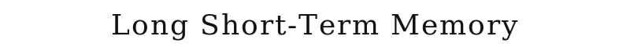
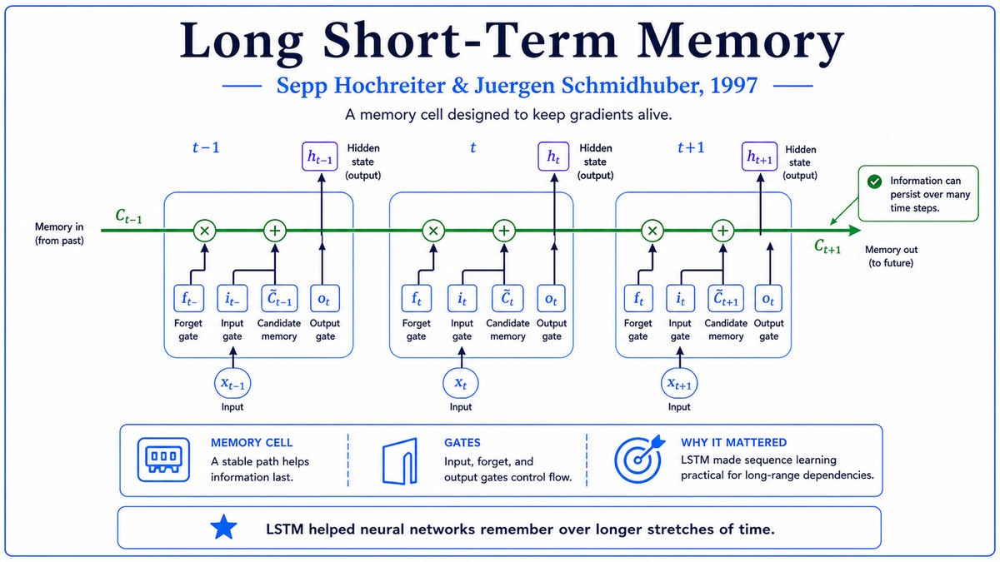

  

  <a href="https://www.bioinf.jku.at/publications/older/2604.pdf">📄 Original Paper (Neural Computation 1997)</a> · Sepp Hochreiter (Born Mühldorf am Inn, Bavaria, Germany, 1967), Jürgen Schmidhuber (Born Munich, Germany, 1963)

<em>Six years earlier, Hochreiter diagnosed why deep networks would not train. This paper was the architectural fix to his own diagnosis. It became the foundation of speech recognition, machine translation, and language modeling for the next two decades.</em>

---

In 1991, Sepp Hochreiter's diploma thesis had not just identified the vanishing gradient problem. It had also sketched ideas for how to solve it. Six years of work by Hochreiter and his advisor Jürgen Schmidhuber turned the sketch into a complete architecture, the Long Short-Term Memory network, or LSTM. Schmidhuber moved to the Dalle Molle Institute for Artificial Intelligence Research, IDSIA, in Switzerland, becoming its director in 1995. Throughout the 1990s, the two refined the ideas that became LSTM.

The intellectual problem was clear from the 1991 thesis. Standard recurrent neural networks cannot effectively learn dependencies between events separated by more than about ten steps. The vanishing gradient causes information from distant past events to be diluted to nothing. Speech recognition needs to handle dependencies of hundreds of milliseconds. Language understanding needs dependencies across whole sentences and paragraphs. Vanilla recurrent networks could not do any of this.

Hochreiter's 1991 sketch had identified the core requirement. To allow gradients to flow across many time steps, the recurrent connection must multiply the gradient by exactly 1.0 at each step. The sketch called this idea the constant error carousel, or CEC, because the error keeps cycling without losing its magnitude. The challenge was that a recurrent connection with weight exactly 1.0 cannot do anything useful by itself. It just remembers whatever was put into it. To make the architecture useful, the network needs some way to control when to write new information into the memory and when to read it out.

The 1997 paper presented the complete solution. The architecture has memory cells, each with a self-loop of weight exactly 1.0. The self-loop is the constant error carousel. Surrounding each memory cell are multiplicative gates that control access to the cell. The input gate controls when external information is allowed to write into the cell. The output gate controls when the cell's stored information is allowed to influence the rest of the network. The gates are themselves trained by backpropagation, learning to open and close based on the network's experience. When the network needs to remember an event for many time steps, the input gate opens briefly to write the relevant information, then closes. The information sits in the cell, preserved by the unit-weight self-loop, until the output gate decides it is needed.

The mathematical analysis showed this architecture could bridge time lags greater than 1000 steps, two orders of magnitude better than standard recurrent networks. The paper, titled simply "Long Short-Term Memory," was published in Neural Computation, volume 9, on November 15, 1997. The original 1997 LSTM had only two gates. The forget gate, which lets the network actively delete information from the memory cell, was added in 2000 by Felix Gers, Schmidhuber, and Fred Cummins, and has become standard in modern LSTMs.

  

<em>The architectural fix that took six years to develop. A self-loop with weight exactly 1.0 preserves gradient information across time. Multiplicative gates learn to control when information enters and leaves the cell.</em>

---

LSTM mattered for three reasons that took fifteen years to fully unfold.

First, it solved the vanishing gradient problem for recurrent networks. Recurrent networks could now handle sequences of essentially arbitrary length, with dependencies extending across thousands of time steps. This single technical advance enabled an entire class of applications that had been infeasible. Speech recognition, machine translation, handwriting recognition, music generation, time series prediction, all became tractable problems for neural networks once LSTM was available.

Second, LSTM established the principle of gated architectures. Before LSTM, neural network units were simple. A weighted sum followed by a nonlinearity. LSTM introduced the idea that a unit could have internal state, with multiplicative gates controlling access to that state. The Gated Recurrent Unit, introduced by Cho and others in 2014, is a simpler variant. The attention mechanism in transformers generalizes the gating principle to allow each output to selectively attend to all previous inputs. Modern residual connections, which made very deep networks trainable in 2015, are essentially the constant error carousel applied to feedforward networks.

Third, LSTM was the bridge between the connectionist revival of the 1980s and the modern deep learning revolution. From 1997 to 2012, neural networks were a niche topic. SVMs and other statistical methods dominated. But LSTM kept getting deployed where its advantages mattered. Google deployed LSTM for speech recognition in Google Voice in 2012, then for machine translation in 2016. Apple deployed LSTM for Siri. Facebook used LSTM for translation, processing about 4.5 billion translations per day by 2017. Even before the broader deep learning revolution, LSTM was quietly powering most of the speech and language AI in consumer products.

---

The defining concept of LSTM is the constant error carousel. To preserve a gradient signal across many time steps, the recurrent connection must have an effective derivative of exactly 1.0 at each step. The LSTM achieves this by giving the memory cell a literal self-connection of weight exactly 1.0, with no nonlinearity along that path. The gradient propagates through this connection unchanged, regardless of how many time steps it has to traverse.

The cost of having a unit-weight recurrent connection is that the connection by itself does nothing useful. It just maintains whatever value is in the cell. To do anything with the cell, the network needs ways to write new information into it and read information out of it. This is what the gates provide.

The input gate is a unit that learns when to allow external information to be written into the memory cell. At each time step, the input gate computes a value between 0 and 1 based on the current input and the network's state. This value multiplies the proposed new content. When the input gate is close to 1, the new content is written. When close to 0, the cell's state is preserved unchanged. The output gate is a similar unit that learns when to allow the memory cell's contents to influence the rest of the network. Both gates are trained by backpropagation alongside the rest of the network.

The conceptual depth is in the recognition that an architecture can encode an explicit data structure, with explicit read and write operations, while still being end-to-end differentiable. LSTM showed that you could embed discrete-feeling operations like "remember this" and "recall that" inside a continuous network. This idea has been generalized to Neural Turing Machines, memory-augmented networks, attention mechanisms, and pointer networks.

---

Let cₜ be the cell state at time t, hₜ the cell output, xₜ the external input, and σ the sigmoid activation function.

The input gate is iₜ = σ(Wᵢ xₜ + Uᵢ hₜ₋₁ + bᵢ). The proposed new content is g̃ₜ = tanh(W_c xₜ + U_c hₜ₋₁ + b_c). The cell state update is

> cₜ = cₜ₋₁ + iₜ ⊙ g̃ₜ

This is the key equation. The cell state at time t is the cell state at time t−1 plus the input gate's selection of new content. The plus sign is the constant error carousel. There is no multiplicative weight applied to cₜ₋₁. The gradient of cₜ with respect to cₜ₋₁ is exactly 1.0.

The output gate is oₜ = σ(Wₒ xₜ + Uₒ hₜ₋₁ + bₒ), and the cell output is hₜ = oₜ ⊙ tanh(cₜ). The 2000 modification by Gers, Schmidhuber, and Cummins added a forget gate fₜ that allows the cell to selectively erase information:

> cₜ = fₜ ⊙ cₜ₋₁ + iₜ ⊙ g̃ₜ

When fₜ is close to 1, the cell behaves like the original 1997 LSTM. When close to 0, the cell is reset. The modern "vanilla LSTM" used in most applications includes the forget gate. Training uses backpropagation through time. The constant error carousel ensures that gradients propagating through the cell state do not vanish, regardless of how many time steps they traverse.

---

The first major industrial deployment of LSTM was Google's Voice Search and speech recognition systems, around 2012. Google's speech recognition error rates dropped substantially when the underlying acoustic models switched from hidden Markov models to LSTM. Apple deployed similar systems for Siri. By 2015, LSTM was the dominant technology in commercial speech recognition.

The breakthrough into mainstream awareness came with sequence-to-sequence learning, introduced by Sutskever, Vinyals, and Le at Google in 2014. An encoder LSTM could read a sentence in one language, summarize it as a fixed-size hidden state, and a decoder LSTM could generate the corresponding sentence in another language. Within two years, Google replaced its phrase-based statistical machine translation with LSTM-based neural translation. The same encoder-decoder pattern was applied to image captioning, speech synthesis, code generation, and question answering.

The transition to transformer dominance began in 2017 with "Attention Is All You Need" by Vaswani and others at Google. The attention mechanism, which had been added to LSTM models in 2014 and 2015 to help with long sequences, could be extracted and used as the entire architecture, with no recurrence at all. The transformer was more compute-efficient at scale and could be parallelized across positions. By 2019, transformer-based models like BERT and GPT-2 had displaced LSTM as the dominant architecture for natural language processing. LSTM continues to be used for problems where its sequential processing is appropriate, particularly time series and real-time speech recognition. The 1997 paper became one of the most cited papers in machine learning history, with the citation count surpassing 100,000 by the early 2020s.

The next stop on this walk is also 1997. While Hochreiter and Schmidhuber were finalizing their LSTM paper in Europe, IBM's Deep Blue was preparing for the most public AI demonstration of the 1990s. The match against world chess champion Garry Kasparov in May 1997 would become the first widely-recognized victory of machine over human in a domain that had been considered uniquely human.

---

  <a href="1995-Cortes-Vapnik-SVM.md">← Previous: Support Vector Machines 1995</a> &nbsp;·&nbsp; <a href="1997b-Deep-Blue.md">Next: Deep Blue 1997 →</a>

