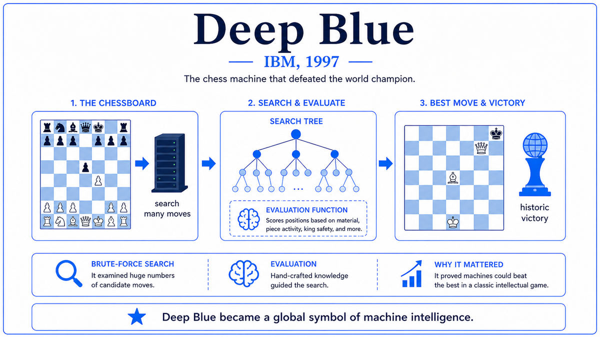

  

  <a href="https://www.sciencedirect.com/science/article/pii/S0004370201001291">📄 Deep Blue (Artificial Intelligence Journal 2002)</a> · Feng-hsiung Hsu (Born Keelung, Taiwan, 1959), Murray Campbell (Canadian), with A. Joseph Hoane, Joel Benjamin, C.J. Tan

<em>The most famous AI moment of the 1990s. The technical reality was less than the public image.</em>

  

<em>Deep Blue's pipeline: search the chessboard, evaluate positions, pick the best move. Brute-force speed, hand-coded knowledge, no learning.</em>

---

On May 11, 1997, in a hotel ballroom in New York City, an IBM supercomputer called Deep Blue defeated Garry Kasparov in the sixth and final game of a six-game match. The final score was 3.5 to 2.5. Kasparov, the reigning world chess champion and one of the strongest players in chess history, became the first reigning champion to lose a regulation match to a machine. The moment was televised worldwide and became, for most of the public, the defining image of artificial intelligence in the 1990s.

The technical reality was less dramatic. Deep Blue was a custom-built supercomputer with 30 PowerPC 604e processors and 480 special-purpose chess chips, designed and built over more than a decade. Its core algorithm was alpha-beta search, a variant of brute-force tree search that had been understood since the 1950s. It evaluated about 200 million chess positions per second. Its evaluation function was hand-coded by chess grandmasters, particularly Joel Benjamin, who fine-tuned the position scoring rules between games. Its opening book was compiled by grandmasters Miguel Illescas, John Fedorowicz, and Nick de Firmian. The system did not learn. It did not generalize. It searched.

The architect of Deep Blue was Feng-hsiung Hsu, a Taiwanese-American computer scientist who had started chess machine work at Carnegie Mellon in 1985 and joined IBM in 1989. The team included Murray Campbell, the AI lead, who had also come from Carnegie Mellon. The project was a hardware engineering achievement. Hsu's custom chess chips were the fastest specialized chess hardware ever built. The match against Kasparov was the culmination of more than a decade of patient hardware-software co-design. Hsu wrote afterwards that the victory was "not a case of John Henry versus the steam engine; instead, it was man-as-toolmaker defeating man-as-performer." That framing was honest. Deep Blue was a tool, built by humans, that did one specific task very fast.

The cultural impact ran far ahead of the technical content. Most people who heard about the match did not know what alpha-beta search was. They saw a machine winning at chess and understood it as a machine thinking. The narrative that machines were beginning to challenge humans in domains long considered uniquely human had begun. That narrative would prove durable. It would shape public expectations of AI for the next twenty years. The technical content of Deep Blue, by contrast, would prove almost irrelevant to the actual story of AI's development. The future of AI lay with the statistical and learning-based methods this walk has been tracing, not with the brute-force search Deep Blue exemplified.

---

Deep Blue mattered for one cultural reason and almost no technical ones.

The cultural impact was substantial. The match defined AI in the public imagination throughout the late 1990s and 2000s. It convinced governments, investors, and the general public that machine intelligence was real and advancing rapidly. The funding climate for AI research improved. Universities expanded their AI programs. Tech journalism began treating AI as a major beat. The narrative arc of "machine beats human at X" became the default storytelling format for AI achievements, used later for AlphaGo in 2016, for AlphaFold in 2020, and for ChatGPT in 2022. Deep Blue established the template.

The technical impact was almost zero. Deep Blue's core algorithm, alpha-beta search, was already standard. Its specialized hardware did not generalize to anything else. The hand-coded evaluation function had no transfer value. The team disbanded after the match. No one took Deep Blue's approach forward to other problems. Modern chess engines like Stockfish use enormously refined versions of the same alpha-beta approach, but the field of AI moved on. The deep learning revolution and modern generative AI owe nothing to Deep Blue's architecture.

The contrast with TD-Gammon, five years earlier, is striking. TD-Gammon learned to play world-class backgammon by playing against itself, with no human chess knowledge encoded into it. The same self-play paradigm scaled up directly to AlphaGo and AlphaZero in the 2010s. AlphaZero, with no opening book and no hand-tuned evaluation function, learned to play chess at a level that surpassed Stockfish, the world's strongest engine, by training itself for a few hours. Deep Blue's approach, dominant in 1997, was obsolete by 2017. TD-Gammon's approach, niche in 1992, became the foundation of modern game AI. Deep Blue is a useful negative example. It shows what AI looks like when it is built on hand-coded human knowledge and brute-force computation rather than on learning.

---

The core technique behind Deep Blue is alpha-beta search. The basic idea is simple. Look ahead from the current position by considering all legal moves, all responses, all responses to the responses, and so on, building a tree of possible game continuations. At the leaves of the tree, evaluate each position with a numerical score. At the internal nodes, take the maximum score if it's the player's turn or the minimum score if it's the opponent's turn. The score that propagates back to the root tells you the value of each move. Pick the move with the best score.

The pure version is intractable for chess, because the tree branches by about 30 moves at each ply, so a 10-ply search examines 30^10 ≈ 6×10^14 positions. The alpha-beta refinement prunes branches that cannot affect the final answer, reducing the effective branching factor and making deeper searches feasible. With careful engineering, modern chess engines can search 20 to 30 plies into the future for typical positions.

Deep Blue's contribution was to make alpha-beta search faster than anything before it. The custom VLSI chess chips, designed by Hsu, generated and evaluated chess positions in hardware rather than software. The 480 chess chips together examined about 200 million positions per second. The evaluation function for each position was hand-coded by chess experts, with thousands of features capturing positional concepts like material balance, king safety, pawn structure, and piece activity. The weights were tuned by Joel Benjamin, who played thousands of games against Deep Blue and adjusted the evaluation when the machine made bad moves. The opening book contained millions of positions from grandmaster games.

The combination of fast specialized hardware, deep alpha-beta search, a finely tuned hand-coded evaluation function, and an extensive opening book gave Deep Blue chess strength comparable to the best human players. This strength came from the speed of the search, not from any flexible understanding of chess. Deep Blue could not explain its moves. It could not adapt to a new game. It could not generalize.

---

The minimax algorithm computes the value of a position recursively as

> V(p) = max over moves m of V(p after m), if it's our turn
> V(p) = min over moves m of V(p after m), if it's opponent's turn

with V(p) at terminal positions or at the search depth limit given by the evaluation function. Alpha-beta pruning maintains two bounds, alpha and beta, representing the worst score the maximizing player is assured of and the worst score the minimizing player is assured of. When the algorithm finds a move that proves a branch cannot affect the result, it cuts the branch. The pruning reduces the effective search size from b^d to roughly b^(d/2) for branching factor b and depth d, allowing much deeper searches with the same computational budget.

Deep Blue used standard refinements: iterative deepening, transposition tables, killer move heuristics, null move pruning, singular extensions. None of these were invented by the Deep Blue team. All were standard in computer chess by the early 1990s. The team's contribution was implementing them efficiently in custom hardware and tuning the evaluation function with grandmaster help. There is no learning algorithm in Deep Blue. The evaluation function weights were hand-tuned by humans. The opening book entries were compiled from human games. From the perspective of the AI history this walk is tracing, Deep Blue contains essentially no algorithmic content. It is a hardware optimization of techniques that were already well understood.

---

After the 1997 match, IBM dismantled Deep Blue. The team disbanded. Hsu and Campbell moved to other projects. Kasparov demanded a rematch but IBM refused. Within a few years, commodity PCs running open-source chess engines like Crafty and Fruit were stronger than any human player. By the mid 2000s, chess was solved as a research problem in the sense that no human could compete with the best programs.

The deeper lesson of Deep Blue, that brute-force search plus hand-coded knowledge could solve a hard problem if you threw enough hardware at it, was widely accepted in AI circles for about ten years. Researchers tried similar approaches for Go. Go has a much larger branching factor than chess and a much harder evaluation problem. Brute-force search did not work. Computers remained at amateur level in Go through the 2000s, even as they reached superhuman level in chess. By the late 2000s, the limits of the Deep Blue approach were clear.

Those limits were broken in 2016 with DeepMind's AlphaGo. AlphaGo used a combination of deep neural networks, Monte Carlo tree search, and self-play reinforcement learning, descending from the lineage that runs through TD-Gammon and the broader connectionist tradition this walk has been tracing. AlphaGo defeated Lee Sedol in March 2016. AlphaZero in 2017 learned chess from scratch by self-play and surpassed Stockfish in 24 hours. AlphaZero's chess play was qualitatively different from Deep Blue's. It made positional decisions based on learned intuition rather than deep search. Chess grandmasters described its style as more human-like than computer-like.

The historical irony is complete. Deep Blue, the most famous AI achievement of the 1990s, was built on techniques that did not lead to modern AI. The techniques that did lead to modern AI, including the LSTM paper that appeared in the same year as the Deep Blue match, were quietly being developed by smaller groups working on different problems. Twenty years later, when AlphaZero played Stockfish, the descendants of those quieter 1990s papers had completely surpassed the descendants of Deep Blue.

The next stop on this walk is 1998. Two graduate students at Stanford, Sergey Brin and Larry Page, were finishing a paper on a new algorithm for ranking web pages.

---

  <a href="1997a-Hochreiter-Schmidhuber-LSTM.md">← Previous: LSTM 1997</a> &nbsp;·&nbsp; <a href="1998-Brin-Page-PageRank.md">Next: PageRank 1998 →</a>

