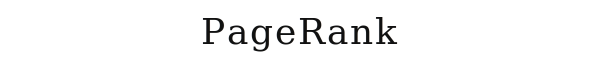
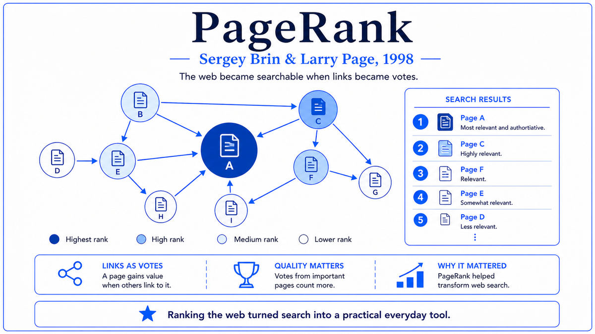

  

  <a href="http://infolab.stanford.edu/pub/papers/google.pdf">📄 Original Paper (WWW7 1998)</a> · Sergey Brin (Born Moscow, Soviet Union, 1973), Lawrence Page (Born East Lansing, Michigan, 1973)

<em>Two Stanford graduate students wrote a paper about ranking web pages. The company they founded would, twenty-five years later, fund much of the modern AI revolution.</em>

---

In the autumn of 1995, two new graduate students arrived at Stanford's computer science PhD program. Larry Page, born in East Lansing, Michigan in March 1973, was the son of a computer science professor at Michigan State and an early researcher in artificial intelligence. Sergey Brin, born in Moscow in August 1973, had emigrated to the United States with his family in 1979. The two met during orientation. Page's advisor was Terry Winograd, the same Winograd who had built SHRDLU at MIT in 1971. Page proposed studying the structure of the World Wide Web as a giant graph. Winograd encouraged him.

The web in 1995 was small, perhaps 50 million pages. Search engines existed: Yahoo, AltaVista, Excite, Lycos. The dominant search method was keyword matching, with rankings based on how many times the query terms appeared on each page. The results were often poor. The same words could appear on a Wikipedia-quality reference page and on a junk page, and keyword matching could not distinguish between them.

The intellectual move that became PageRank was to recognize that the web had structure that mattered, specifically the links between pages. A page that many other pages linked to was probably more important. This was an old idea in academic publishing, where citations had long been used as informal indicators of a paper's importance. Page realized the same logic applied to the web. A page linked from the New York Times homepage was likely more important than a page linked only from random personal sites. Importance was determined by who linked to you, not just by how many people linked to you.

The recursive part was the key insight. The importance of a page depends on the importance of the pages that link to it. But those pages' importance also depends on what links to them. Page and Brin formulated this circular definition mathematically. The PageRank of a page is the sum of the PageRanks of all pages that link to it, weighted by how many outgoing links those pages have. The mathematical structure is an eigenvector equation. Brin contributed the algorithmic expertise to make computing this eigenvector tractable for the entire web. They used an iterative algorithm that starts with uniform PageRanks and applies the recursive update rule until the values converge, in about 50 to 100 passes.

Page and Brin called their initial system BackRub, later renamed PageRank. The first prototype ran out of Page's dorm room. By 1997, it had crawled 24 million pages, a substantial fraction of the web. The search results were qualitatively much better than what existing search engines produced. The paper, "The Anatomy of a Large-Scale Hypertextual Web Search Engine," was presented at the seventh International World Wide Web Conference in Brisbane in April 1998. By then, Page and Brin had already tried to sell PageRank to AltaVista, Yahoo, and Excite. None were interested. Better search would send users away faster, hurting ad revenue. Page and Brin took a leave from their PhD programs and incorporated Google in September 1998.

  

<em>The recursive structure of PageRank. Importance flows through links, and the algorithm finds a self-consistent ranking of all pages on the web simultaneously.</em>

---

PageRank mattered for three reasons that took twenty-five years to fully unfold.

First, it transformed how humans access information. Before Google, finding things on the web was unreliable. After Google, finding things on the web became automatic. By 2010, Google was processing about three billion queries per day. By 2025, about nine billion per day. Search became an invisible utility. Activities that previously required hours in a library now took seconds. The PageRank algorithm was the technical foundation of this transformation.

Second, it created the company that funded much of modern AI. Google's profits from search advertising became the financial engine behind a remarkable amount of AI research. DeepMind was acquired by Google in 2014. Google Brain produced TensorFlow. Google researchers developed the Transformer architecture in 2017, which became the foundation of every modern large language model including GPT, Claude, and Gemini. Google built the Tensor Processing Unit. Word2Vec and BERT came from Google. Without Google's profits, the AI revolution of the 2020s would have proceeded much more slowly. The PageRank paper is the financial origin story of modern AI.

Third, the technical infrastructure Google built to run PageRank at web scale became the foundation of large-scale machine learning. Google developed the Google File System, MapReduce, and BigTable to handle distributed storage and computation. These systems were later open-sourced in inspired-by form as Hadoop, Spark, and HBase. Modern AI training, with its distributed gradient computation across thousands of GPUs, runs on infrastructure whose direct ancestors were built to run PageRank.

---

The defining concept of PageRank is recursive importance. The importance of any element in a network depends on the importance of the elements that connect to it. This is not a circular definition that fails to compute. It is a self-consistent equation that has a unique solution under standard mathematical conditions, and that solution can be computed by iterative refinement.

Each web page is a node. Each link from page A to page B is a directed edge from A to B. The PageRank of page B is the sum, over all pages A that link to B, of A's PageRank divided by the number of outgoing links from A. The division by outgoing links is important. A page that links to many other pages is "voting" for many pages, so each vote counts less. A page that links to only a few pages is concentrating its endorsement, so each endorsement counts more.

The intuition can be understood through the random surfer model. Imagine someone who starts at a random web page and clicks links forever. At each step, with probability 1 minus alpha (typically alpha = 0.15), they follow a random outgoing link from the current page. With probability alpha, they get bored and jump to a completely random page anywhere on the web. After many steps, the probability that the surfer is on any particular page approaches a stationary distribution. That stationary distribution is the PageRank. The connection to Markov chain theory is exact. The mathematical machinery of Markov chains, including the Perron-Frobenius theorem, applies directly.

The damping factor alpha is essential. Without it, the algorithm can fail on certain graph structures. A page with no outgoing links is a "rank sink" that absorbs probability without giving it back. A cycle of pages that link only to each other is also a sink. The damping factor solves both problems by giving the surfer a way to escape any structure. The conceptual depth of PageRank is in the recognition that the structure of a network can encode meaningful information not present in any individual node. This idea reappears in word embeddings, graph neural networks, and attention mechanisms in transformers.

---

The PageRank update rule for a page p is

> PR(p) = (1 − d)/N + d × Σ over q linking to p of PR(q) / L(q)

where d is the damping factor (typically 0.85), N is the total number of pages, q ranges over all pages that link to p, PR(q) is the PageRank of q, and L(q) is the number of outgoing links from q. The first term is the random teleportation probability, and the second term is the contribution from incoming links.

In matrix form, let M be the N × N transition matrix where M[i][j] = 1/L(j) if page j links to page i, and 0 otherwise. The PageRank vector R satisfies

> R = (1 − d)/N × 1 + d × M × R

This is the power method for computing the principal eigenvector of M. Each iteration is O(E) where E is the number of edges. For the early Google index of 24 million pages with about 500 million links, each iteration was about 500 million operations, and convergence took 50 to 100 iterations. The total computation was substantial but feasible on the cluster of cheap PCs the team had assembled.

The full Google ranking algorithm was much more complicated than just PageRank. Modern Google ranking uses hundreds of signals, many based on machine learning models trained on user interaction data. PageRank is no longer the dominant signal. But it remains the conceptual foundation that the original Google search engine was built on.

---

The immediate aftermath was Google's growth into one of the most consequential companies of the modern era. Page and Brin raised $25 million in venture capital in 1999 and grew the engineering team. By 2000, Google had become the dominant search engine on the web. By 2004, Google had its IPO. By 2025, Alphabet was one of the most valuable companies in the world.

Within network science, PageRank became one of the canonical algorithms for analyzing graph-structured data. It was applied to citation networks, social networks, gene interaction networks, recommendation systems, and road networks for traffic analysis. Within machine learning, PageRank's perspective on graphs eventually became part of graph neural networks. Modern GNNs propagate information across graph edges in ways structurally similar to how PageRank propagates importance, but with learned weights instead of fixed ones.

The most consequential indirect effect was through Google itself. Starting around 2010, Google began investing heavily in AI research. The Google Brain project, founded in 2011, demonstrated that very large neural networks could be trained on Google-scale infrastructure. The 2014 acquisition of DeepMind brought reinforcement learning expertise. The 2017 Transformer paper became the architectural foundation of modern large language models. By 2020, Google was producing or supporting much of the foundational research that drove the generative AI revolution of 2022 to 2025.

The next stop on this walk closes Era 06. In 1999, NVIDIA released the GeForce 256, marketed as the world's first graphics processing unit. The chip was designed for video games. It would, in retrospect, become the most important hardware platform for AI in the next twenty-five years.

---

  <a href="1997b-Deep-Blue.md">← Previous: Deep Blue 1997</a> &nbsp;·&nbsp; <a href="1999-NVIDIA-GeForce-256.md">Next: GeForce 256 1999 →</a>

