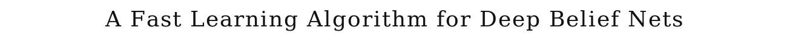
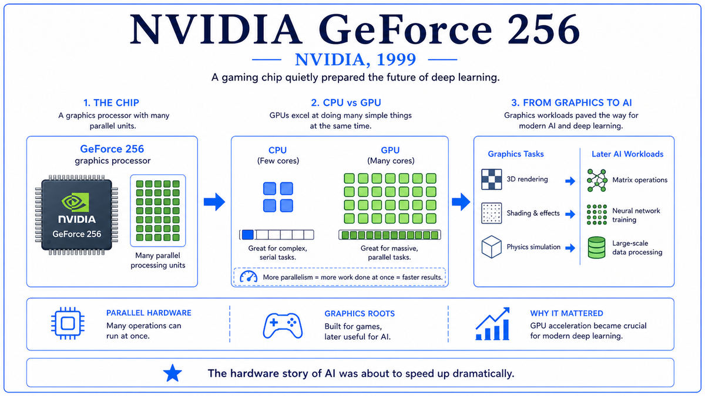

  

  <a href="https://www.cs.toronto.edu/~hinton/absps/fastnc.pdf">📄 Original Paper (Neural Computation 2006)</a> · Geoffrey Hinton (Born Wimbledon, London, 1947), Simon Osindero, Yee-Whye Teh

<em>The paper that ended the second AI winter. Hinton found a way to train deep networks despite the vanishing gradient. Six years later, AlexNet would prove him right at scale.</em>

---

By 2005 the neural network field had been in retreat for fifteen years. The vanishing gradient problem identified by Hochreiter in 1991 meant deep networks could not be trained. Support Vector Machines and statistical learning had displaced connectionism. The handful of researchers who continued, including Yann LeCun in New York, Yoshua Bengio in Montreal, and Geoffrey Hinton in Toronto, were treated as a curiosity by the wider field.

Hinton, born in Wimbledon in 1947 and a great-great-grandson of George Boole, had been working on neural networks since the late 1970s. He had co-authored the 1986 backpropagation paper. By 2004 he was at the University of Toronto, with a small group of students and a CIFAR grant for a "Neural Computation and Adaptive Perception" program.

The breakthrough came from sidestepping the vanishing gradient problem rather than solving it directly. The standard approach, training a deep network end-to-end with backpropagation, fails because gradients vanish in the early layers. Hinton's idea was to train the layers separately, one at a time, in a different way that did not require backpropagation through many layers. Each layer would be trained as a generative model of its input. Once a layer had learned a good representation of its inputs, that representation would serve as the input to the next layer, which would be trained the same way. After all layers had been trained greedily, end-to-end fine-tuning with backpropagation could refine the network. The crucial trick was that the gradient now had a reasonable starting point. The early layers were not random. They had already been pretrained to capture useful structure.

The specific generative model Hinton used was the Restricted Boltzmann Machine, or RBM. An RBM is a two-layer network with visible units and hidden units, fully connected between layers but with no connections within a layer. Given visible inputs, the RBM learns hidden-unit activations that reconstruct the input. Hinton had been working on RBMs since the 1980s. In 2006 he showed how to train them efficiently using a procedure called contrastive divergence, and how to stack them into a deep network. The stacked network was called a Deep Belief Network, or DBN.

The paper, "A fast learning algorithm for deep belief nets," was published in Neural Computation in July 2006 with co-authors Simon Osindero and Yee-Whye Teh. The empirical demonstration was a deep network that learned to recognize handwritten digits on the MNIST dataset, achieving an error rate of 1.25 percent, which was state of the art. More importantly, the paper showed that the deep network had learned a hierarchy of features. Lower layers learned simple strokes. Higher layers learned digit-like shapes. This was the first clear demonstration that hierarchical feature learning, which connectionists had argued for since the 1980s, actually worked when you could train deep networks.

  

<em>The architecture that broke the deadlock. Stack RBMs, train each one greedily as a generative model, then fine-tune the whole stack.</em>

---

DBN mattered for three reasons.

First, it broke the spell of the vanishing gradient. For fifteen years, deep networks had been considered untrainable. Hinton's paper showed they were trainable if you started them in the right place. The greedy pretraining was a workaround, not a fundamental fix, but it was enough to demonstrate that the deep, hierarchical learning that connectionism had promised was actually achievable. The mood of the field shifted. Hinton's own students, including Ruslan Salakhutdinov, Vinod Nair, and later Alex Krizhevsky and Ilya Sutskever, took up deep learning with renewed conviction.

Second, it triggered a wave of methodological progress. Within a few years, Yoshua Bengio's group in Montreal showed that other forms of unsupervised pretraining, including denoising autoencoders, worked similarly. ReLU activations, dropout, and better weight initialization were developed during this period. Each technique addressed some aspect of the difficulty of training deep networks. By the time AlexNet arrived in 2012, the cumulative effect of all this work was that researchers actually knew how to train a deep network.

Third, the success of DBN brought funding and attention back to neural networks. Hinton was hired by Google in 2013, partly on the strength of the deep learning revival he had led. Microsoft, Facebook, and Baidu all built up deep learning teams. The CIFAR program that had supported the lonely neural network researchers through the 1990s and 2000s suddenly looked like a foundational investment. The community of deep learning researchers grew rapidly. The field that had been a backwater in 2005 was, by 2012, the dominant approach in machine learning.

---

The defining concept of DBN is greedy layer-wise pretraining. Train each layer of the network as a separate generative model, in sequence from input to output. Each layer learns to reconstruct the activations of the layer below it. Once a layer has been trained, its outputs become the inputs for training the next layer. The crucial property is that this training does not require backpropagation through many layers. Each layer is trained independently, with gradients that do not have to traverse the rest of the network.

The Restricted Boltzmann Machine is the building block. An RBM has two layers, visible and hidden, with connections between them but not within either layer. Given an input on the visible units, the RBM samples the hidden units according to a probability distribution determined by the connection weights. Given hidden activations, it samples the visible units. Training adjusts the weights so that the visible-unit samples generated by the RBM match the statistics of the training data. The RBM has effectively learned a generative model of its inputs, with the hidden units serving as a learned representation.

Stacking RBMs creates the DBN. After training the first RBM on raw input data, its hidden activations are computed for every training example and used as the visible input for a second RBM. The second RBM is trained the same way. Its hidden activations become input for a third, and so on. After all layers have been trained greedily, the resulting deep network is a generative model of the data, with each layer capturing more abstract features. A final supervised fine-tuning pass with backpropagation, using whatever labels are available, sharpens the network for classification or other downstream tasks.

The conceptual depth is in recognizing that representation learning can be done unsupervised. The bulk of training does not require labeled data. The labels are only needed at the end for fine-tuning. This was important practically, because labeled data was expensive in 2006, but it was also conceptually significant. The brain learns most of what it learns without explicit teachers. DBN was the first compelling demonstration that artificial neural networks could too.

---

A Restricted Boltzmann Machine assigns an energy to each joint configuration of visible units v and hidden units h:

> E(v, h) = −Σᵢ aᵢvᵢ − Σⱼ bⱼhⱼ − Σᵢⱼ vᵢ wᵢⱼ hⱼ

where aᵢ are visible biases, bⱼ are hidden biases, and wᵢⱼ are connection weights. The probability of a configuration is

> P(v, h) = exp(−E(v, h)) / Z

where Z is the partition function summing over all configurations. Because the RBM has no within-layer connections, the conditional distributions factorize:

> P(hⱼ = 1 | v) = σ(bⱼ + Σᵢ vᵢ wᵢⱼ)
> P(vᵢ = 1 | h) = σ(aᵢ + Σⱼ hⱼ wᵢⱼ)

These conditionals are easy to sample, which is what makes RBMs tractable.

Training maximizes the log-likelihood of the data under the model. The exact gradient is intractable because of the partition function. Hinton's contrastive divergence approximation works by initializing the visible units to a training example, sampling the hidden units, then sampling the visible units back, and using the difference between the data correlations and the reconstructed correlations as the gradient. One step of this procedure is enough to train an RBM well in practice.

Stacking proceeds by training the first RBM, computing P(h | v) for every training example, then using those hidden activations as visible inputs for the next RBM. The 2006 paper showed that this stacking has a clean interpretation as variational inference in a deep generative model, and that adding layers can only increase a lower bound on the log-likelihood of the data.

---

The immediate aftermath was a wave of papers exploring deep architectures. Bengio's group in Montreal showed that denoising autoencoders gave similar benefits. Sparse coding and other unsupervised representation methods were investigated. Speech recognition was the first major application area to switch to deep learning. By 2010, deep neural networks had cut speech recognition error rates by 30 percent across the industry. Microsoft, Google, and IBM all deployed deep learning for speech.

The next big breakthrough came from a different direction. As the 2010s progressed, it became clear that with enough data and enough compute, you did not actually need unsupervised pretraining to train deep networks. You could just use ReLU activations, careful initialization, large batches, and stochastic gradient descent. AlexNet in 2012 demonstrated this on ImageNet using only supervised training. By 2014, almost no one was doing greedy layer-wise pretraining anymore. The technique that had broken the deadlock was no longer needed once the dam had broken.

The deeper legacy of DBN is the proof of concept. Before 2006, deep networks were an aspiration. After 2006, they were a working technology. The specific algorithm in the paper was largely abandoned within a decade, but the door it opened never closed. Every modern deep network, including the transformers that power large language models, owes its existence to the moment when Hinton, Osindero, and Teh demonstrated that depth was achievable.

The next stop on this walk is 2007. NVIDIA, the company that had given us the GeForce 256 in 1999, released CUDA. CUDA made GPU computing accessible to ordinary programmers and turned the parallel hardware that had been built for video games into the substrate of modern AI training.

---

  <a href="../06-Statistical-Era-(1990s)/1999-NVIDIA-GeForce-256.md">← Previous: GeForce 256 1999</a> &nbsp;·&nbsp; <a href="2007-NVIDIA-CUDA.md">Next: CUDA 2007 →</a>

