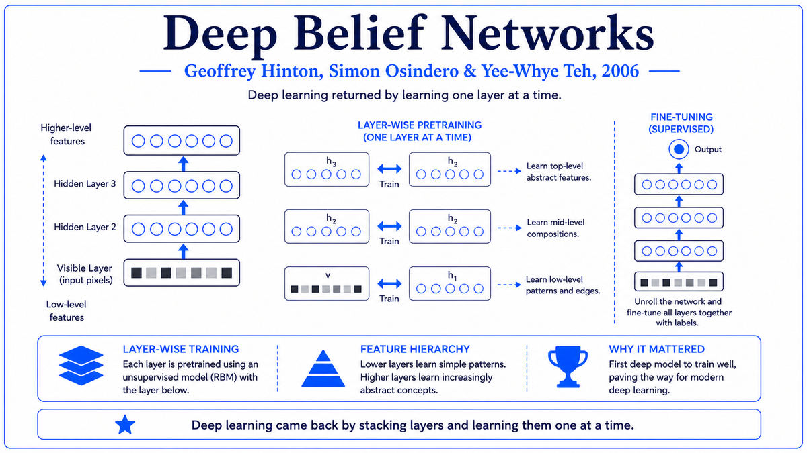

  

  <a href="https://developer.nvidia.com/cuda-toolkit">📄 CUDA Documentation</a> · NVIDIA Corporation, with John Nickolls and Ian Buck (Born United States)

<em>NVIDIA built the GeForce 256 for gamers in 1999. Eight years later, they released the software that turned every gaming GPU into a scientific computer.</em>

---

By the mid 2000s, NVIDIA's GPUs were the dominant graphics hardware on the planet. The GeForce 8800 in 2006 had introduced the unified shader architecture, where all the cores became identical and could be assigned to any kind of work. The hardware was, in principle, capable of arbitrary parallel computation. The problem was the software.

Programming a GPU for non-graphics computation in 2006 was a horrible experience. The hardware was designed to run shader programs, small pieces of code operating on pixels or vertices. To use the GPU for anything else, you had to trick the graphics API into running your math by pretending it was a shader. Researchers who did this were the "GPGPU" community, for general-purpose computing on GPUs. The work was clever, but it required reformulating ordinary algorithms as graphics operations. Most scientific programmers gave up.

NVIDIA had been thinking about this. Ian Buck, then a Stanford PhD student, had developed a system called Brook in 2003 that abstracted GPU computation away from the graphics pipeline. Buck joined NVIDIA in 2004 and led the development of CUDA, the Compute Unified Device Architecture. The other key architect was John Nickolls. Together they designed a programming model that exposed the GPU's parallel cores directly, with a C-like language that any C programmer could read and write.

CUDA was released in 2007 alongside NVIDIA's Tesla architecture. The programming model was simple. You wrote a function called a kernel describing what one parallel thread should do. You then launched the kernel across thousands of threads, each operating on different data. The CUDA runtime mapped the threads onto the physical cores and managed all the synchronization, memory transfers, and scheduling.

The performance improvements were dramatic. Computations that had taken hours on a CPU could finish in minutes on a GPU. Scientific applications adopted CUDA quickly. Molecular dynamics simulations, fluid dynamics, financial modeling, and image processing all migrated to GPUs over the next several years. The GPU stopped being a graphics chip and became a general-purpose parallel processor that happened to also do graphics. NVIDIA stopped being a gaming hardware company and became a parallel computing company.

What no one fully appreciated in 2007 was that CUDA had also accidentally laid the foundation of the deep learning revolution. Neural network training, like graphics, is dominated by parallel matrix operations. With CUDA, training a neural network on a GPU became practical for the first time. The first major demonstration came in 2009, when Rajat Raina, Anand Madhavan, and Andrew Ng at Stanford published a paper showing that deep belief networks could be trained on GPUs 70 times faster than on CPUs. By 2012, AlexNet would use two NVIDIA GTX 580 GPUs to win ImageNet and trigger the deep learning revolution. Without CUDA, that training would have been impossible.

  

<em>The abstraction that opened the GPU. Write a kernel for one thread, launch it across thousands of threads, let the runtime handle the rest.</em>

---

CUDA mattered for three reasons.

First, it democratized parallel computing. Before CUDA, programming massive parallelism required specialized expertise in graphics APIs, supercomputer architectures, or arcane vector instruction sets. After CUDA, any C programmer could write parallel code and run it on hardware that happened to be sitting in millions of consumer PCs. The barrier to entry collapsed. Students, hobbyists, and small research groups suddenly had access to compute power that had previously required a national laboratory.

Second, it locked in NVIDIA's hardware advantage for AI. CUDA is proprietary. It runs only on NVIDIA hardware. Once a generation of researchers had learned CUDA and built their software on top of it, the cost of switching to AMD or Intel hardware was prohibitive. By 2015, every major deep learning framework, including TensorFlow, PyTorch, and Caffe, was built around CUDA. Competitors like AMD's OpenCL and ROCm tried to break this lock-in but never matched the developer experience or the ecosystem of libraries. NVIDIA's market position in AI hardware in 2025, with H100 and Blackwell chips powering essentially every major AI lab, traces directly to the early lead CUDA gave them.

Third, it enabled the deep learning revolution. The story is well known. AlexNet won ImageNet in 2012 by training on two GPUs using CUDA. Within 18 months, every major computer vision lab had switched to GPU training. By 2017, the Transformer architecture was being trained on tens or hundreds of GPUs. By 2024, large language models were trained on tens of thousands of NVIDIA H100s. Every step of this scaling used CUDA. Without it, deep learning would still be running on CPUs, and the field would be a decade behind where it is.

---

The defining concept of CUDA is the kernel. A kernel is a function that describes what a single parallel thread should do. The programmer writes the kernel as if it were a serial function operating on a single piece of data. The CUDA runtime then launches the kernel across thousands or millions of threads, each running the same code on different data. The hardware schedules the threads onto the GPU's physical cores.

Threads are organized hierarchically. A grid is launched, containing many thread blocks. Each block contains many threads, typically up to 1024. Threads within a block can synchronize with each other and share fast memory. Threads in different blocks generally cannot. This hierarchy mirrors the GPU's physical architecture. Each thread block runs on a streaming multiprocessor, with shared memory accessible only to threads in that block. Different blocks run on different multiprocessors, possibly in parallel, possibly in sequence.

The execution model is called SIMT, single instruction multiple thread. Within a warp, a group of typically 32 threads, all threads execute the same instruction at the same time on different data. This is similar to the SIMD model used by CPU vector units, but with the important difference that the warp can branch on a per-thread basis, with the hardware handling divergence by serializing the diverging paths. The programmer writes code that looks scalar, with normal if-statements and loops, and the hardware figures out how to execute it efficiently in parallel.

Memory is the other half of the model. CUDA exposes a hierarchy of memories with different sizes and speeds. Global memory is large but slow. Shared memory, accessible only within a thread block, is small but very fast. Constant memory and texture memory have specialized access patterns. Programmers who care about performance must manage data movement between these memories explicitly. The cost of memory access often dominates the cost of arithmetic, and a CUDA program that ignores memory hierarchy will perform much worse than one that respects it.

---

A simple CUDA kernel for vector addition looks like this:

> __global__ void vec_add(float *a, float *b, float *c, int N) {
>   int i = blockIdx.x * blockDim.x + threadIdx.x;
>   if (i < N) c[i] = a[i] + b[i];
> }

The __global__ qualifier marks this as a kernel, callable from the CPU but executed on the GPU. The variables blockIdx, blockDim, and threadIdx are built-in variables that identify the calling thread's position in the grid. Each thread computes a unique index i and adds one pair of vector elements.

The kernel is launched from the CPU with a syntax that specifies the grid and block dimensions:

> int N = 1000000;
> int threads_per_block = 256;
> int blocks = (N + threads_per_block - 1) / threads_per_block;
> vec_add<<<blocks, threads_per_block>>>(a, b, c, N);

This launches roughly 4000 thread blocks, each with 256 threads, for a total of about a million threads. The CUDA runtime maps these threads onto the available cores and executes them in parallel.

For matrix multiplication, the foundational operation of deep learning, CUDA kernels achieve much of their performance from careful use of shared memory. Naive matrix multiplication reads each element of the input matrices many times from slow global memory. An optimized kernel loads tiles of the matrices into shared memory once, then performs many multiplications on the tile before moving on. Modern matrix multiplication libraries like cuBLAS achieve near-peak hardware performance, typically 90 percent or more of the theoretical floating-point throughput of the chip. Deep learning frameworks build on cuBLAS to train networks at speeds the early GPU programmers could not have imagined.

---

The years immediately after the 2007 CUDA release saw rapid adoption in scientific computing. Molecular dynamics, computational fluid dynamics, seismic processing, and astrophysics simulations all moved to GPUs. By 2012, the Titan supercomputer at Oak Ridge National Laboratory was using NVIDIA Tesla GPUs as its main computational engines.

The deep learning trajectory accelerated rapidly. Andrew Ng's 2009 GPU paper was followed by Dan Cireșan and Schmidhuber's IDSIA work showing GPU-trained networks winning competitions in handwriting and traffic sign recognition. AlexNet in 2012 was the watershed. Within two years, the entire computer vision field had adopted GPU-based training. By 2015, NVIDIA had introduced the cuDNN library, a CUDA-based collection of deep learning primitives that became the foundation of every major deep learning framework. NVIDIA stopped being a graphics company that also did AI and became an AI company that also did graphics.

The lock-in NVIDIA achieved through CUDA has proved extraordinarily durable. Multiple competitors have tried to break it. AMD's OpenCL, an open standard for heterogeneous computing, never achieved comparable developer experience. Intel's various accelerator efforts have failed to gain traction. Even Google's Tensor Processing Units, custom chips designed specifically for AI training, are mostly used internally at Google rather than competing in the open market. As of 2025, the great majority of frontier AI training happens on NVIDIA hardware, programmed through CUDA, and there is no clear competitor in sight.

The next stop on this walk is 2009. Fei-Fei Li at Stanford was about to release ImageNet, a massive labeled image dataset that would, three years later, become the proving ground where AlexNet would announce the deep learning revolution.

---

  <a href="2006-Hinton-Deep-Belief-Networks.md">← Previous: Deep Belief Networks 2006</a> &nbsp;·&nbsp; <a href="2009-Fei-Fei-Li-ImageNet.md">Next: ImageNet 2009 →</a>

