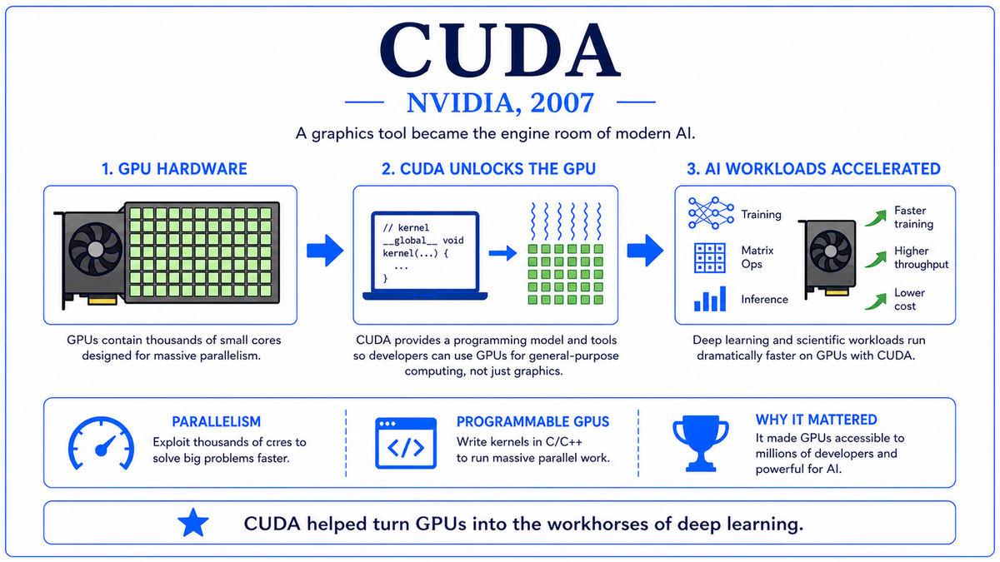

  

  <a href="https://www.image-net.org/static_files/papers/imagenet_cvpr09.pdf">📄 Original Paper (CVPR 2009)</a> · Jia Deng, Wei Dong, Richard Socher, Li-Jia Li, Kai Li, Fei-Fei Li (Born Beijing, China, 1976)

<em>Computer vision had spent twenty years tuning algorithms on tiny datasets. A young Princeton professor argued the field had been working on the wrong problem. The bottleneck was data.</em>

---

By the mid 2000s, computer vision research had a recognizable shape. Researchers proposed algorithms, ran them on the same handful of small benchmark datasets, and reported small improvements over previous methods. Caltech 101 had 9,000 images. Caltech 256 had 30,000. PASCAL VOC had 20,000. The state of the art kept inching forward, but each new technique gave only a few percent of accuracy improvement on benchmarks that had been saturating for years.

Fei-Fei Li thought the field had the wrong picture of the problem. Born in Beijing in 1976 and raised in Chengdu, she had immigrated to the United States at 16, attended Princeton on a full scholarship, and earned her PhD in computer vision at Caltech in 2005 under Pietro Perona. By 2007 she was an assistant professor at Princeton. Her conclusion was that the field was data-starved. Algorithms were not the bottleneck. Data was.

The argument went like this. A child sees millions of images, with parents and teachers and books labeling objects, before learning to recognize a chair. If a learning algorithm has to learn from 30 examples of chairs, no amount of algorithmic cleverness will close the gap with human vision. The path forward was to build a dataset closer in scale to what a human child experiences. Not 30 examples per category. Hundreds, ideally thousands. Not 100 categories. Thousands. Not 30,000 images. Millions.

The plan that became ImageNet had two parts. The first was to use WordNet, a hierarchical database of English nouns developed by George Miller at Princeton starting in the 1980s. WordNet organized 80,000 noun senses into a tree of "is-a" relationships: a Dalmatian is a dog, a dog is a mammal, a mammal is an animal. ImageNet would use this hierarchy as the category structure. The second part was to populate each WordNet category with hundreds or thousands of images, harvested from the web and verified by humans for accuracy.

The verification was the hard part. Initial attempts to label images with student labor at Princeton estimated the project would take 19 years. Li's team turned to Amazon's Mechanical Turk, a then-new platform for crowdsourcing small tasks. With Turk, they could distribute the labeling work across thousands of workers. Three years of work and 49,000 workers across 167 countries produced ImageNet. The first version had 14 million images organized into 22,000 categories. It was orders of magnitude larger than anything that had existed in computer vision before.

The paper, "ImageNet: A Large-Scale Hierarchical Image Database," was presented at the Conference on Computer Vision and Pattern Recognition (CVPR) in June 2009. The reception was mixed. Many researchers thought the dataset was overkill. Li's group launched the ImageNet Large Scale Visual Recognition Challenge (ILSVRC) in 2010 on a subset of 1.2 million images and 1,000 categories, partly to convince the field that the data was useful. The first two ILSVRC competitions were won by classical computer vision methods using hand-engineered features and SVM classifiers, with error rates stuck around 25 percent. The data was not yet making a difference.

Then in 2012, Alex Krizhevsky's deep convolutional neural network, AlexNet, won the ILSVRC with a top-5 error rate of 15.3 percent, against the second-place 26.2 percent. The margin was so large it shocked the field. The explanation was simple. ImageNet had finally provided enough data for a deep neural network to learn rich hierarchical features, and AlexNet had used GPUs and CUDA to make the training computationally feasible. ImageNet's bet on data had been right. The era of hand-engineered features in computer vision ended that day.

  

<em>Two orders of magnitude larger than every dataset that came before. The data the deep learning revolution had been waiting for.</em>

---

ImageNet mattered for three reasons.

First, it shifted the central question of machine learning. Before ImageNet, the question was: what is the best algorithm for this dataset? After ImageNet, the question was: how do we get more data? The "scale hypothesis" that came to dominate AI in the 2010s and 2020s, that more data plus more compute is the path to better performance, has its origins in ImageNet. AlexNet vindicated Li's argument. By 2020, when GPT-3 was trained on 300 billion tokens, scaling was the entire research program. The lineage of "data is what matters" runs from ImageNet through every modern AI breakthrough.

Second, it became the benchmark that organized the field. From 2010 to about 2017, ImageNet's annual ILSVRC competition was the central event of computer vision research. Every major architecture, including AlexNet, VGGNet, GoogLeNet, ResNet, and DenseNet, was developed and validated on ImageNet. Error rates dropped from 25 percent in 2011 to under 5 percent by 2015, surpassing the human error rate. Pretrained ImageNet models became the starting point for virtually every computer vision application. The convention of pretraining on ImageNet then fine-tuning on task-specific data shaped applied computer vision for over a decade.

Third, it demonstrated the power of crowdsourced data labeling at industrial scale. Before ImageNet, large labeled datasets were expensive luxuries built by national labs or large companies. ImageNet showed that academic researchers, with grant funding and Mechanical Turk, could build datasets that exceeded anything previously available. The model spread quickly. COCO for object detection, Visual Genome for scene understanding, AudioSet for audio, Common Crawl for web text, and many others followed similar patterns. The data infrastructure of modern AI rests on conventions that ImageNet established.

---

The defining concept of ImageNet is hierarchical organization at scale. The dataset is not a flat collection of categories. It is a tree of categories derived from the WordNet ontology, with relationships of generalization and specialization between categories. A "Persian cat" is a "domestic cat" is a "cat" is a "feline" is a "carnivore" is a "mammal" is an "animal". Images at lower levels of the tree are also implicitly examples of higher-level categories. A picture of a Persian cat is also a picture of a cat, a feline, and an animal. This structure, inherited from WordNet, allows the dataset to support tasks at multiple levels of granularity.

The scale is the second key feature. The full ImageNet has roughly 14 million images and 22,000 categories, with most categories containing hundreds to a few thousand examples. The ILSVRC subset, used for the annual competition, has 1.2 million training images and 1,000 categories, balanced so that each category has roughly equal representation. This subset became the de facto standard for measuring image classification progress.

The labels are the third feature. Each ImageNet image was annotated by multiple Mechanical Turk workers, with majority voting and verification steps to ensure quality. The labels are categorical, indicating what is in the image, but ImageNet also has bounding box annotations for many images, indicating where the object is located. Later derivative datasets added segmentation masks and other annotations, building on the foundation ImageNet provided.

The conceptual depth is in the recognition that data quality and quantity matter more than the choice of model or algorithm. A simple model trained on a lot of carefully labeled data outperforms a sophisticated model trained on little data. This was a hard lesson for computer vision researchers who had spent decades developing clever feature descriptors like SIFT and HOG. The lesson was repeated in NLP in the 2010s. The path to better AI runs through better data.

---

ImageNet does not have a defining equation. The dataset is the contribution. But the standard ImageNet classification benchmark has a well-defined evaluation protocol that became the ruler of computer vision progress.

For a classifier f that produces a ranked list of category predictions for each input image, the top-1 error rate counts the fraction of images for which the highest-ranked prediction is incorrect:

> top-1 error = (1 / N) × Σᵢ 1[f(xᵢ)₁ ≠ yᵢ]

where xᵢ is the i-th image, yᵢ is its true label, f(xᵢ)₁ is the top prediction, and 1[·] is the indicator function. The top-5 error counts the fraction of images for which none of the top five predictions is correct:

> top-5 error = (1 / N) × Σᵢ 1[yᵢ ∉ {f(xᵢ)₁, f(xᵢ)₂, ..., f(xᵢ)₅}]

The top-5 metric was used because many ImageNet categories are very fine-grained, with multiple types of dog or bird that even humans struggle to distinguish. Allowing five guesses gave a more meaningful measure of whether the classifier had identified roughly what was in the image.

The benchmark numbers tell the story. In 2010, the ILSVRC top-5 error rate was around 28 percent for the best classical methods. AlexNet in 2012 dropped it to 15.3 percent. VGGNet in 2014 reached 7.3 percent. GoogLeNet in 2014 reached 6.7 percent. ResNet in 2015 reached 3.6 percent, surpassing the estimated human error rate of about 5 percent. By 2017, the best methods were below 3 percent, and the competition was retired because progress on the benchmark had outrun the noise in the labels.

---

The ILSVRC ran annually from 2010 to 2017, becoming the central event in computer vision research. The architectures that won, in sequence: classical features in 2010 and 2011, AlexNet in 2012, ZFNet and OverFeat in 2013, VGGNet and GoogLeNet in 2014, ResNet in 2015, ResNeXt and other refinements in 2016 and 2017. By 2017, the top-5 error rate on ImageNet was below 3 percent, and the benchmark was retired.

Beyond the competition, ImageNet became the standard pretraining dataset. A neural network trained on ImageNet learned features useful far beyond image classification. Object detection systems like Faster R-CNN started from ImageNet-pretrained backbones. Even medical imaging applications, where the underlying images look nothing like ImageNet's everyday photographs, benefited from ImageNet pretraining. The visual features the network learned during ImageNet training were general enough to transfer.

The deeper legacy of ImageNet is the data thesis. The most important AI breakthroughs of the 2010s and 2020s, including AlphaGo, GPT-3, AlphaFold, and ChatGPT, all involved combining clever architectures with massive datasets and massive compute. The ratio of attention paid to data versus algorithms in modern AI research is a direct legacy of ImageNet's argument. Data is what matters.

The next stop on this walk is 2012. A graduate student named Alex Krizhevsky, working with Ilya Sutskever and Geoffrey Hinton at the University of Toronto, was about to enter the ILSVRC with a deep convolutional neural network trained on two NVIDIA GPUs. The result would change the trajectory of artificial intelligence.

---

  <a href="2007-NVIDIA-CUDA.md">← Previous: CUDA 2007</a> &nbsp;·&nbsp; <a href="2012-Krizhevsky-AlexNet.md">Next: AlexNet 2012 →</a>

