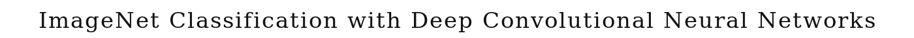
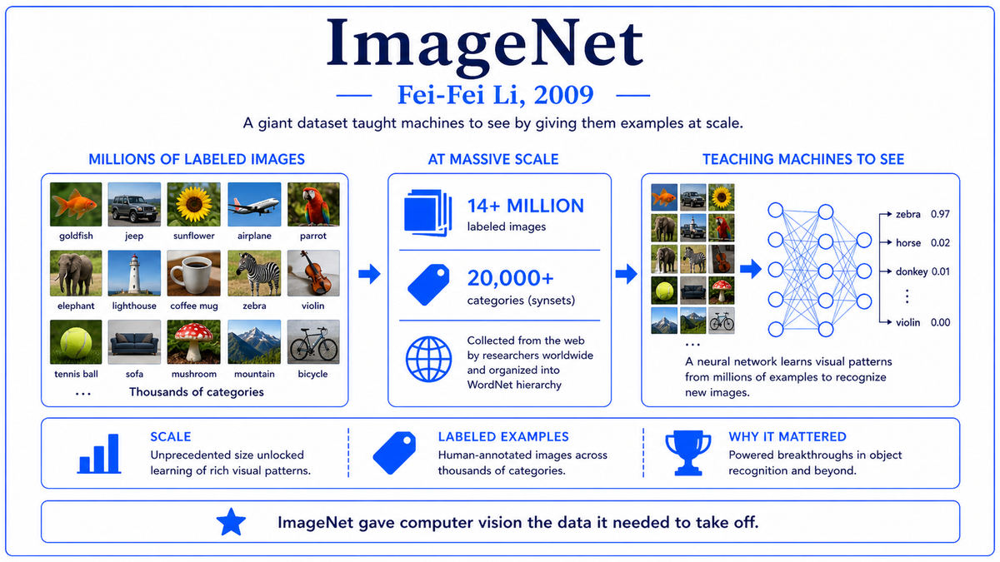

  

  <a href="https://papers.nips.cc/paper/2012/file/c399862d3b9d6b76c8436e924a68c45b-Paper.pdf">📄 Original Paper (NIPS 2012)</a> · Alex Krizhevsky (Born Kiev, Soviet Union, 1986), Ilya Sutskever (Born Russia, 1986), Geoffrey Hinton (Born Wimbledon, London, 1947)

<em>The single moment when deep learning won. A graduate student, two GPUs, eight layers, and an error rate that left every other approach in the dust.</em>

---

By 2011 all the pieces were sitting on the table. Hinton's 2006 deep belief network paper had shown deep networks could be trained. CUDA had made GPU computing accessible since 2007. ImageNet had provided 1.2 million labeled training images since 2009. ReLU activations had been published. Dropout regularization was being developed. And yet, computer vision in 2011 was still dominated by hand-engineered features, SIFT and HOG fed into SVM classifiers. Deep learning was a curiosity, not a competitor.

Alex Krizhevsky was a graduate student in Hinton's group at the University of Toronto. Born in Kiev in 1986, he had emigrated to Canada with his family. He was a brilliant programmer with a particular talent for low-level GPU optimization. By 2011 he had been writing CUDA kernels for neural network operations as a side project. Ilya Sutskever, also Hinton's student, born in Russia in 1986 and raised in Israel before moving to Canada, was the theoretical and conceptual lead. The two of them, with Hinton's encouragement, decided to enter the 2012 ImageNet challenge.

The architecture they built, eventually called AlexNet, was a convolutional neural network with eight layers, five convolutional and three fully connected. It was deeper than previous CNNs and had a few specific innovations. ReLU activations replaced the saturating sigmoids that had dominated neural networks for decades, addressing the vanishing gradient problem at the level of individual neurons. Dropout was used in the fully connected layers to prevent overfitting. Local response normalization was applied between certain layers. Data augmentation, including random crops and horizontal flips, multiplied the effective training set size.

The network had 60 million parameters and required serious compute to train. Krizhevsky wrote custom CUDA kernels for the convolutional and fully connected layers, optimized to run on two NVIDIA GTX 580 GPUs in parallel. Each GPU had only 3 GB of memory, not enough for the full network, so the network was split across the two GPUs with carefully designed cross-connections at certain layers. Training on the 1.2 million ImageNet images took five to six days. The total compute used was about 4×10^16 floating point operations, an order of magnitude or two more than typical academic computer vision experiments of the era.

The result was a top-5 error rate of 15.3 percent on the ILSVRC test set. Second place was 26.2 percent. The margin was so large that the entire computer vision community had to take notice. AlexNet was not a small improvement. It was a different kind of system entirely, beating the carefully engineered classical pipelines by 11 percentage points. The paper, "ImageNet Classification with Deep Convolutional Neural Networks," was presented at NIPS in December 2012. The standing-room-only audience included most of the senior figures in computer vision, all of them watching the field they had built being overtaken in real time.

  

<em>Eight layers, sixty million parameters, two GPUs, six days of training. The configuration that ended classical computer vision.</em>

---

AlexNet mattered for three reasons that defined the next decade of AI.

First, it ended classical computer vision. Within 18 months of the 2012 ImageNet competition, every major computer vision research group had switched to deep learning. The hand-engineered feature descriptors that had taken decades to develop, including SIFT, HOG, and SURF, were obsolete. The expertise of senior researchers who had built careers on classical methods became less valuable. New PhD students learned to train neural networks rather than design feature extractors. The transition was the most dramatic methodology shift in the history of computer vision.

Second, it triggered the deep learning revolution beyond computer vision. The shock of AlexNet's 2012 victory propagated through the rest of machine learning. Speech recognition, which had already been adopting deep learning, accelerated. Natural language processing started taking neural networks seriously. By 2014, deep learning was the default approach in every major area of AI research. The "neural networks plus GPUs plus big data" recipe that AlexNet demonstrated became the template that all subsequent breakthroughs followed.

Third, it was a commercial inflection point. Within months of AlexNet, every major tech company had a deep learning team. Google acquired DeepMind in 2014. Facebook hired LeCun to lead its AI lab. Microsoft, Baidu, and Apple all built up deep learning capabilities. Hinton, Krizhevsky, and Sutskever themselves founded a small startup called DNNresearch and were quickly acquired by Google in 2013. Sutskever later co-founded OpenAI in 2015. The flow of talent and capital into deep learning that began with AlexNet has continued without interruption to the present, building the foundation for the generative AI boom of the 2020s.

---

The defining concept of AlexNet is depth combined with scale. The network was eight layers deep, more than any successful convolutional network before it. The layers were also large, with the fully connected layers having 4096 units each. The total parameter count was 60 million. Networks of this scale had been considered impossible to train, both because of the vanishing gradient problem and because of the computational cost. AlexNet showed that with the right techniques, depth and scale were the path forward, not obstacles.

Convolutional layers do most of the work. A convolution layer applies a learned filter at every position of the input, producing a feature map that captures the same kind of pattern at different locations. This is computationally efficient because the same filter is shared across positions, with parameters reused millions of times. It also encodes a useful inductive bias: visual features like edges and textures are translation-invariant. AlexNet's first convolutional layer used 96 filters of size 11x11, applied with stride 4. Subsequent layers used progressively smaller filters with more channels.

ReLU activations were essential. The traditional sigmoid and tanh activations saturate for large inputs, with derivatives that approach zero. This is what causes vanishing gradients in deep networks. The Rectified Linear Unit, ReLU(x) = max(0, x), has a derivative of 1 in its active region and 0 in its inactive region. The non-saturating positive region allows gradients to flow freely through deep stacks of ReLU layers. AlexNet was the first major demonstration that ReLU could be trained reliably in deep networks, and it became the standard activation for the next decade.

Dropout was the other essential technique. With 60 million parameters and 1.2 million training images, AlexNet had vastly more capacity than data. Without regularization, it would have memorized the training set and failed to generalize. Dropout, introduced by Hinton and his students in 2012, randomly drops neurons during training, forcing the network to learn redundant representations that do not depend on any individual neuron. Dropout was applied in the fully connected layers of AlexNet and contributed several percentage points of test accuracy.

---

The AlexNet architecture, layer by layer, is approximately:

> Layer 1: Conv 11x11, 96 filters, stride 4, ReLU, max-pool 3x3, LRN
> Layer 2: Conv 5x5, 256 filters, ReLU, max-pool 3x3, LRN
> Layer 3: Conv 3x3, 384 filters, ReLU
> Layer 4: Conv 3x3, 384 filters, ReLU
> Layer 5: Conv 3x3, 256 filters, ReLU, max-pool 3x3
> Layer 6: Fully connected, 4096 units, ReLU, dropout 0.5
> Layer 7: Fully connected, 4096 units, ReLU, dropout 0.5
> Layer 8: Fully connected, 1000 units, softmax

The convolutions reduce spatial dimensions while increasing channel depth. Each convolution computes

> y[i, j, k] = ReLU(Σ over m, n, c of x[i+m, j+n, c] · w[m, n, c, k] + b[k])

where x is the input feature map, w is the filter, and b is the bias. The output y has the same spatial structure as x but with k filter activations at each position.

ReLU is the simplest nonlinearity:

> ReLU(x) = max(0, x)

Its derivative is 1 for positive inputs and 0 for negative inputs. The non-saturating positive region allows gradients to flow without vanishing, which is the critical property for training deep networks.

The training procedure used stochastic gradient descent with momentum, batch size 128, weight decay 0.0005, learning rate 0.01 reduced by 10x when validation error plateaued. The total training was 90 epochs over the ImageNet training set. The network's predictions are obtained by taking the softmax of the final layer's outputs, giving a probability distribution over the 1000 classes.

---

The years immediately after AlexNet were a frenzy of architectural improvements. ZFNet in 2013 improved on AlexNet by tuning hyperparameters. OverFeat extended it to object detection. VGGNet in 2014 from Oxford, with 16 to 19 layers, demonstrated that deeper networks worked even better. GoogLeNet, also in 2014, introduced the Inception module with parallel convolutions of different sizes. By 2015, ResNet would push depth to 152 layers and surpass human performance on ImageNet.

Hinton, Krizhevsky, and Sutskever capitalized on AlexNet quickly. They formed the company DNNresearch in late 2012 and were acquired by Google in March 2013. Krizhevsky moved to Google Brain. Sutskever moved to Google Research, then in 2015 became a co-founder and chief scientist of OpenAI. Hinton split his time between Google and Toronto until 2023. The pattern of the AlexNet team being acquired by a major tech company was repeated many times in subsequent years, as every major AI lab in academia was systematically courted by industry.

The deep learning revolution that AlexNet triggered has continued without pause. Image classification was followed by object detection, segmentation, and image generation. Speech recognition migrated to deep learning by 2014. Machine translation followed in 2016. Language modeling exploded with the Transformer in 2017. AlphaGo defeated Lee Sedol in 2016. AlphaFold solved protein structure prediction in 2020. ChatGPT brought large language models to public awareness in 2022. Every one of these achievements descends from the recipe AlexNet established: deep neural networks plus large datasets plus GPU compute.

The next stop on this walk is 2013. Tomas Mikolov at Google was about to publish a paper introducing Word2Vec, a technique for learning vector representations of words that would transform natural language processing.

---

  <a href="2009-Fei-Fei-Li-ImageNet.md">← Previous: ImageNet 2009</a> &nbsp;·&nbsp; <a href="2013-Mikolov-Word2Vec.md">Next: Word2Vec 2013 →</a>

