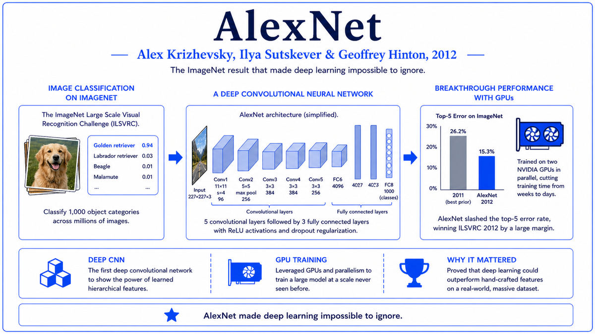

  

  <a href="https://arxiv.org/pdf/1301.3781.pdf">📄 Original Paper (ICLR 2013)</a> · Tomas Mikolov (Born Czechoslovakia, 1982), Kai Chen, Greg Corrado, Jeffrey Dean

<em>Six months after AlexNet announced the deep learning revolution in vision, a Czech researcher at Google announced its arrival in language. Words became geometry.</em>

---

By 2012 natural language processing was in a strange place. The deep learning revolution that had just transformed computer vision had not yet reached language. Most NLP systems still ran on bag-of-words representations, where each word was a dimension in a vector space and any two distinct words were entirely orthogonal to each other. The word "king" and the word "queen" had no more in common, mathematically, than "king" and "banana." Each word was its own indivisible token. The system could not see that some words were similar to others.

Researchers had been chipping at this for decades. Latent Semantic Analysis from the 1990s used singular value decomposition on word-document matrices. Neural language models from the early 2000s, including Bengio's 2003 paper on a neural probabilistic language model, learned word embeddings as a side effect of training. But these methods were either expensive or limited in scope. Nothing scaled to web-sized text corpora.

Tomas Mikolov was a young researcher who had worked on neural language models during his PhD at Brno University of Technology in the Czech Republic, then during postdoctoral work in Montreal. By 2012 he had joined Google as part of a small team focused on neural network approaches to language. Working with Kai Chen, Greg Corrado, and Jeffrey Dean, he published a paper in early 2013 titled "Efficient Estimation of Word Representations in Vector Space." The paper introduced two architectures, Continuous Bag-of-Words (CBOW) and Skip-gram, that together became known as Word2Vec.

The architectures were simple. Both used a shallow neural network with a single hidden layer. CBOW took a context window of surrounding words and predicted the center word. Skip-gram did the opposite, taking the center word and predicting the surrounding words. After training, the hidden layer's weight matrix gave a dense vector for every word in the vocabulary. Words that appeared in similar contexts ended up with similar vectors. The geometry of the resulting space encoded semantic relationships in a way that classical methods had never achieved.

The most striking demonstration was vector arithmetic. Subtracting "man" from "king" and adding "woman" gave a vector close to "queen." Subtracting "Paris" from "France" and adding "Italy" gave "Rome." Word2Vec had discovered analogies as a learnable property of the embedding geometry. The vectors encoded gender, geography, tense, and many other relationships as approximate linear directions in the space. Word2Vec embeddings were released as a free, pretrained resource, and they became the standard input for natural language tasks across the field.

  

<em>Words become points in a high-dimensional space. Similar words cluster. Analogies become arithmetic.</em>

---

Word2Vec mattered for three reasons.

First, it brought distributed representations into mainstream NLP. Before Word2Vec, most NLP researchers worked with sparse, symbolic representations of language. Words were one-hot vectors, sentences were bag-of-words counts, and grammar was hand-coded rules. After Word2Vec, the dense vector representation became the default. Every neural NLP system from 2013 forward took dense vectors as input. The transition from symbols to vectors was the conceptual shift that made modern language AI possible. Without dense embeddings, transformers and large language models could not exist.

Second, it demonstrated that simple training objectives produce rich representations. Word2Vec trains by predicting nearby words. That is the entire learning signal. The system never sees explicit definitions, never gets told that king and queen are related, never learns linguistic theory. Yet from this simple co-occurrence prediction task, the network learns rich semantic structure. This was the first compelling demonstration of what would later be called self-supervised learning. The pattern of training on a simple prediction task to produce broadly useful representations is the foundation of every modern language model. BERT predicts masked words. GPT predicts the next token. The lineage runs straight back to Skip-gram.

Third, it changed how the field thought about meaning. The classical view of word meaning, going back to dictionary-based AI of the 1960s, treated meaning as something to be defined by hand and encoded in symbolic structures. Word2Vec showed that meaning could be learned from raw text, with the meaning of a word becoming the position of its vector in relation to all other vectors. This is the distributional hypothesis from linguistics, given a computational form: a word is characterized by the company it keeps. Modern language models extend this idea radically, but the core insight that meaning is geometry was crystallized by Word2Vec.

---

The defining concept of Word2Vec is the distributed word vector. Each word in the vocabulary is mapped to a dense vector of real numbers, typically 100 to 300 dimensions. The vector is "distributed" in the sense that the word's meaning is spread across many dimensions, with no single dimension having a clean semantic interpretation. This contrasts with classical "localist" representations where each word is a single distinct symbol.

The training objective is prediction in context. The Skip-gram architecture takes a center word and tries to predict the words that appear around it within a small window. The CBOW architecture takes a window of surrounding words and tries to predict the center word. Both produce embedding matrices as a side effect of optimizing the prediction task. The intuition is that words with similar meanings appear in similar contexts. If "king" and "monarch" are interchangeable in many sentences, both will be trained to predict similar context words, which forces their vectors to become similar.

The vectors capture a remarkable amount of structure. Beyond simple similarity, the embedding space exhibits compositional structure. Differences between vectors correspond to semantic relations. The vector "queen" minus "king" is approximately the same as "woman" minus "man," because both differences capture the male-to-female direction in the embedding space. The same kind of analogical structure appears for verb tense, geographic relations, and many other semantic properties. The space is not just a collection of similar-words clusters. It is a geometric encoding of the relational structure of language.

The conceptual depth is in the recognition that meaning is relational, not absolute. A word's meaning, in the Word2Vec representation, is entirely defined by its relation to other words. There is no anchor to physical reality, no grounding in perception, just the relative positions of words in a learned space. Despite this purely relational definition, the representations are useful for a vast range of downstream tasks, including classification, translation, and information retrieval. This is a deep philosophical point about what computational meaning can be.

---

The Skip-gram model defines the probability of a context word w_O given a center word w_I as

> p(w_O | w_I) = exp(v'_{w_O}^T v_{w_I}) / Σ over w in V of exp(v'_w^T v_{w_I})

where v_w is the input vector for word w, v'_w is the output vector, and V is the vocabulary. The training objective is to maximize the log probability of context words across the training corpus:

> L = Σ over t of Σ over -c ≤ j ≤ c, j ≠ 0 of log p(w_{t+j} | w_t)

where w_t is the t-th word and c is the context window size, typically 5 to 10. The softmax denominator is expensive when V is large, so Word2Vec uses two approximations. Hierarchical softmax replaces the flat softmax with a binary tree structure that reduces complexity from O(V) to O(log V). Negative sampling replaces the softmax with a simpler binary classification task where the model distinguishes the true context word from a small number of randomly sampled "negative" words.

After training, the input vectors v_w form the embedding matrix. For a vocabulary of 1 million words and 300-dimensional vectors, this is a 300 million parameter matrix. The embeddings are typically used as a fixed lookup table that converts word tokens to dense vectors at the input of downstream models.

Vector arithmetic emerges from the training dynamics. Words that appear in similar contexts end up with similar input vectors. Words that systematically differ in some dimension of their context end up with vectors that differ in a similar way. The "gender" direction, for example, is the average difference between male and female word vectors. Adding this direction to "king" produces something close to "queen" because the network has learned that gender is encoded as a roughly linear shift in the embedding space.

---

The immediate aftermath of Word2Vec was a flood of follow-up papers improving on the basic technique. GloVe from Stanford in 2014 used global word co-occurrence statistics rather than local context windows, with comparable results. FastText from Facebook in 2016 extended Word2Vec to handle subword units, allowing the system to produce vectors for words it had never seen. Sentence and document embeddings, including doc2vec and various sentence-encoder architectures, extended the idea from words to longer pieces of text.

The deeper trajectory was toward contextual embeddings. Word2Vec produces a single vector per word, regardless of context. The word "bank" gets the same vector whether the sentence is about a river or a financial institution. ELMo in 2018 introduced contextual word vectors that depend on the surrounding sentence. BERT in 2018 made contextual embeddings the default for NLP. By 2019, Word2Vec-style fixed embeddings were largely obsolete for advanced NLP, replaced by contextual embeddings produced by transformer models. Every transformer-based language model still begins with an embedding lookup, and the conceptual ancestor of that lookup is Word2Vec.

The research culture impact was also significant. Word2Vec was released as free, pretrained vectors that anyone could download and use. This open distribution model accelerated NLP research enormously. Researchers no longer needed access to web-scale text corpora to do interesting work. They could just download the vectors and build on top. The pattern was repeated for BERT, for GPT-2, for many other models. The norm of releasing pretrained models is one of the most important cultural legacies of Word2Vec, even though the specific model has been superseded.

The next stop on this walk is 2014. A graduate student named Ian Goodfellow, working with Yoshua Bengio at Montreal, was about to publish a paper introducing Generative Adversarial Networks. The idea would crack open generative modeling and produce, eventually, the photorealistic image generation that has reshaped creative AI.

---

  <a href="2012-Krizhevsky-AlexNet.md">← Previous: AlexNet 2012</a> &nbsp;·&nbsp; <a href="2014a-Goodfellow-GAN.md">Next: GAN 2014 →</a>

