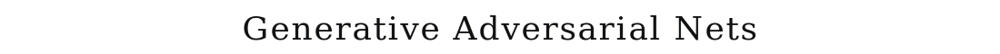
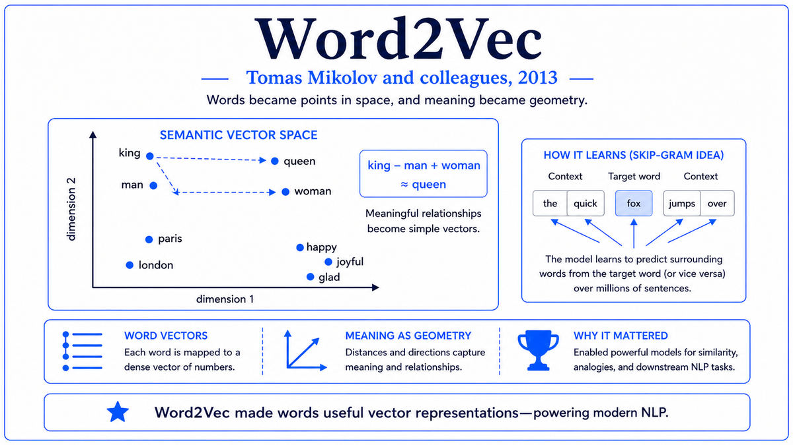

  

  <a href="https://arxiv.org/pdf/1406.2661.pdf">📄 Original Paper (NIPS 2014)</a> · Ian Goodfellow (Born United States, 1985), Jean Pouget-Abadie, Mehdi Mirza, Bing Xu, David Warde-Farley, Sherjil Ozair, Aaron Courville, Yoshua Bengio (Born Paris, France, 1964)

<em>The idea allegedly came at a bar in Montreal. Two networks, one trying to fool the other, locked in a game neither could quite win. The result was the first generative model that could produce convincing images.</em>

---

By 2014 deep learning had conquered classification. AlexNet had been followed by VGGNet and GoogLeNet. Convolutional networks could recognize objects in images at near-human accuracy. But generation was still hard. Building a network that could produce realistic images from scratch, rather than merely categorize existing ones, had defeated decades of effort. Variational autoencoders existed but produced blurry samples. Pixel-by-pixel models like Restricted Boltzmann Machines were too slow for high-resolution images. Generation was the unsolved problem at the frontier of unsupervised learning.

Ian Goodfellow was a graduate student in Yoshua Bengio's group at the Université de Montréal. Born in 1985 in the United States, he had studied at Stanford under Andrew Ng before moving to Montreal for his PhD. By June 2014 he had been thinking about generation for a while, and was unsatisfied with the existing approaches. The story he later told was that the key idea came during an argument at a Montreal bar called Les 3 Brasseurs, where some friends had been discussing generative models and the difficulty of explicit likelihood estimation. Goodfellow proposed a different approach. Instead of asking a network to model the data distribution explicitly, you would have two networks compete. One, the generator, would produce fake samples. The other, the discriminator, would try to tell real samples from fake ones. Each would push the other to improve.

He went home that night and coded up a working implementation. The training procedure was as follows. The generator starts random and produces meaningless noise. The discriminator starts random too. Real images and generator outputs are shown to the discriminator, which is trained to assign high probability to real and low probability to fake. The generator is trained to produce outputs that the discriminator assigns high probability, in other words, to fool the discriminator. The two networks update in alternation. Over time, the generator learns to produce outputs that look indistinguishable from real data, because anything less convincing would be detected by the increasingly skilled discriminator.

Goodfellow's first results, on MNIST handwritten digits, showed the generator producing sharp, realistic-looking digits without any explicit pixel-by-pixel modeling. The paper, with co-authors including Jean Pouget-Abadie, Mehdi Mirza, and ultimately Bengio, was titled "Generative Adversarial Nets" and was submitted to NIPS 2014. It would become one of the most cited in deep learning, with the basic GAN idea spreading rapidly across the field.

The conceptual move was striking. Most generative modeling tried to maximize a likelihood function or minimize a divergence with the data distribution. Both approaches require explicitly characterizing the data distribution, which is hard. The GAN sidestepped the problem entirely. The discriminator implicitly learned the data distribution by trying to tell real from fake. The generator implicitly modeled it by trying to fool the discriminator. Neither network ever computed an explicit probability density. The training process was a minimax game, with a clean theoretical analysis showing that, at convergence, the generator's distribution exactly matches the data distribution.

  

<em>Two networks, locked in adversarial training. The generator gets better at faking. The discriminator gets better at detecting fakes. Both improve through the contest.</em>

---

GANs mattered for three reasons.

First, they unlocked image generation. Before GANs, no method could produce sharp, photorealistic images of natural scenes. Variational autoencoders produced blurry samples. Pixel models were slow and produced low-quality outputs. Within a few years of the 2014 paper, GAN variants like DCGAN, ProgressiveGAN, and StyleGAN were producing photorealistic faces, landscapes, and synthetic data of all kinds. By 2018, a person could not reliably tell a StyleGAN-generated face from a real photograph. The image generation capability we now take for granted, including the diffusion models that power tools like DALL-E and Stable Diffusion, descends in part from the GAN lineage.

Second, the adversarial training paradigm opened a new way of thinking. Instead of optimizing a single objective, you could set up a game between two networks and let them push each other to improvement. This idea spread far beyond image generation. Domain adaptation methods use adversarial training to align representations across domains. Self-supervised learning methods use contrastive losses that share the adversarial flavor. Reinforcement learning from human feedback, which trains language models like ChatGPT and Claude, uses a learned reward model that plays an analogous role to a discriminator. The pattern of "let two systems push each other" is now a standard tool in machine learning.

Third, GANs catalyzed a research boom. The 2014 paper was followed by an explosion of variants. Conditional GANs, Wasserstein GANs, Pix2Pix for image-to-image translation, CycleGAN for unpaired translation, BigGAN for high-resolution generation. By 2018, GANs were one of the most active subfields of machine learning. The model class eventually lost its dominance to diffusion models around 2021, but the techniques developed during the GAN era have remained foundational.

---

The defining concept of a GAN is the adversarial game between two neural networks. The generator G takes a random noise vector z, drawn from a simple distribution like a multivariate Gaussian, and transforms it into a sample G(z). The discriminator D takes a sample, either real or generated, and outputs the probability that the sample is real. The generator wins by producing samples that the discriminator scores as real. The discriminator wins by accurately classifying real and fake.

The training is a minimax optimization. The generator minimizes its loss while the discriminator maximizes its accuracy. Mathematically, the two are playing a zero-sum game. At equilibrium, if both networks are sufficiently powerful, the generator's distribution exactly matches the data distribution, and the discriminator can do no better than random guessing because it cannot tell real from fake. The 2014 paper proved this theoretical result.

The key practical advantage is that GANs do not require explicit likelihood computation. Most generative models work by writing down a probability density function for the data and trying to match it to the empirical distribution. This requires either restrictive model structures, like the conditional independence assumptions in pixel models, or expensive approximations, like the variational lower bound used in VAEs. GANs avoid both. The generator never produces an explicit probability. It just produces samples. The discriminator implicitly learns the data distribution by trying to classify samples. The whole training procedure is sidestepping the hardest problem in classical generative modeling.

The conceptual depth is in the recognition that you can train a generative model without ever defining what makes a sample "good" in absolute terms. The standard for "good" is set by the discriminator, which is itself learned from data. Both networks bootstrap each other up to better and better performance, with no explicit human definition of quality required. This is one of the cleanest examples of self-supervised learning in machine learning. The training signal comes from the contest itself, not from external labels.

---

The GAN training objective is a minimax game with value function V(G, D):

> min_G max_D V(D, G) = E_{x ~ p_data}[log D(x)] + E_{z ~ p_z}[log(1 − D(G(z)))]

The first term rewards the discriminator for assigning high probability to real samples. The second term rewards the discriminator for assigning low probability to fake samples and rewards the generator for fooling the discriminator. The discriminator maximizes V; the generator minimizes V.

For a fixed generator, the optimal discriminator is

> D*(x) = p_data(x) / (p_data(x) + p_g(x))

where p_g is the distribution induced by the generator. Substituting this back into V gives

> V(D*, G) = 2 · JSD(p_data || p_g) − 2 log 2

where JSD is the Jensen-Shannon divergence. So the generator, when paired with the optimal discriminator, is minimizing the JSD between its distribution and the data distribution. The minimum is achieved at p_g = p_data, where JSD = 0. This is the convergence theorem of the original GAN paper.

In practice, training is unstable. The generator and discriminator can diverge from the equilibrium, leading to mode collapse where the generator only produces a few types of samples. Many later papers proposed modifications to stabilize training. The Wasserstein GAN of 2017 replaced the Jensen-Shannon divergence with the Earth Mover's distance, which has better gradient properties. Spectral normalization, gradient penalties, and other techniques became standard for high-quality GAN training. Despite the instability, the basic minimax framework of the original 2014 paper has remained the conceptual core of all GAN variants.

---

Within months of the 2014 paper, GAN variants began appearing. DCGAN in 2015, by Radford, Metz, and Chintala, established a stable architecture for generating natural images and demonstrated that GAN-generated samples had meaningful structure in their latent space. Conditional GANs allowed control over what was generated. By 2017, Karras and others at NVIDIA had developed Progressive GANs that produced 1024x1024 photorealistic faces.

The peak of GAN-generated quality came with StyleGAN in 2018 and StyleGAN2 in 2019, also from NVIDIA. The faces these models produced were essentially indistinguishable from real photographs. The website thispersondoesnotexist.com became viral in 2019. GANs had effectively solved image synthesis at the level of single objects.

The shift away from GANs began around 2020 with the rise of diffusion models. DDPM in 2020 and the subsequent line of work showed that a different paradigm, based on iteratively denoising random noise, could produce images of comparable or higher quality with much more stable training. By 2022, when DALL-E 2 and Stable Diffusion arrived, diffusion had displaced GANs as the dominant paradigm for image generation.

The deeper lessons of GANs persist. Adversarial training as a technique remains an active area. The minimax game-theoretic framing has influenced many areas of machine learning. Goodfellow himself moved through Google Brain, OpenAI, and Apple, and authored the standard deep learning textbook in 2016.

The next stop on this walk is also 2014. Three researchers at Google, Ilya Sutskever, Oriol Vinyals, and Quoc Le, were about to publish a paper on sequence-to-sequence learning that would transform machine translation and lay the groundwork for modern dialogue systems.

---

  <a href="2013-Mikolov-Word2Vec.md">← Previous: Word2Vec 2013</a> &nbsp;·&nbsp; <a href="2014b-Sutskever-Sequence-to-Sequence.md">Next: Seq2Seq 2014 →</a>

