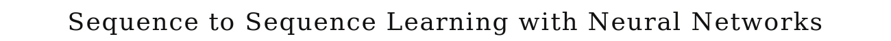
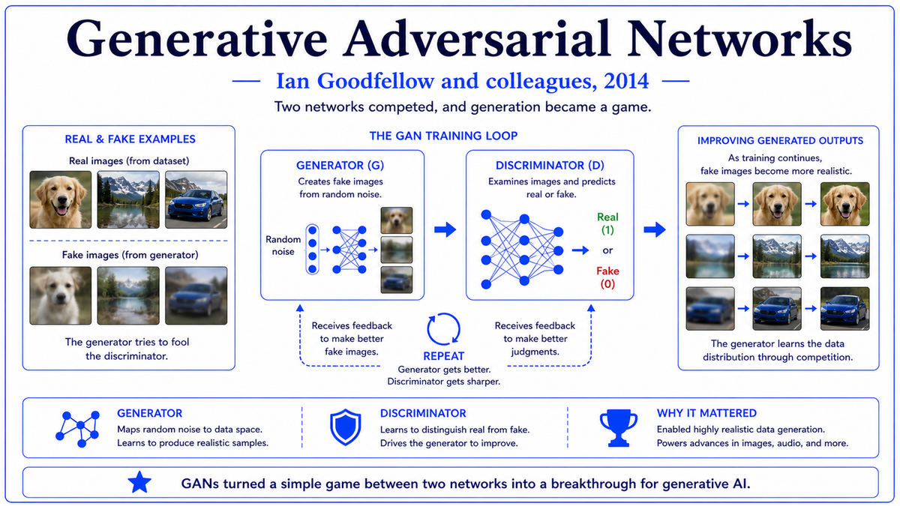

  

  <a href="https://arxiv.org/pdf/1409.3215.pdf">📄 Original Paper (NIPS 2014)</a> · Ilya Sutskever (Born Russia, 1986), Oriol Vinyals (Born Spain, 1983), Quoc Le (Born Vietnam, 1982)

<em>Translating sentences had been a sixty-year struggle. Three Google researchers showed that two LSTMs, glued back to back, could do it better than the entire industry's hand-engineered systems.</em>

---

By 2013 deep learning had taken over computer vision and was starting to make inroads in speech recognition. Language was harder. The fundamental issue was that language is sequential, and the same input length does not always produce the same output length. A French sentence of 12 words might translate to an English sentence of 9 words, or 15. Standard neural networks expect fixed-size inputs and outputs. Recurrent networks could handle variable-length inputs in principle, but the vanishing gradient problem made them ineffective for long sequences. Machine translation in 2013 was still dominated by phrase-based statistical methods that had been refined over a decade. Translations worked, but they were stilted and often nonsensical. Long-range dependencies were beyond the systems' reach.

Three researchers at Google decided to try a different approach. Ilya Sutskever, the AlexNet co-author who had moved to Google Brain in 2013, was the lead. Oriol Vinyals, born in Spain in 1983 and trained at UC Berkeley, was the second author. Quoc Le, who had been part of Google Brain since its founding, was the third. Together they proposed a radical simplification. Use one LSTM to read the entire input sentence and compress it into a single fixed-size vector representing the meaning of the sentence. Use another LSTM to take that vector and produce the output sentence one word at a time.

This is the encoder-decoder architecture. The encoder LSTM reads the input sequence one token at a time and updates its hidden state. After the last token, the final hidden state is the encoded representation of the whole sequence. The decoder LSTM is initialized with this encoded vector and generates the output sequence one token at a time, with each generated token feeding back as input to the next step. The whole system is trained end-to-end on parallel sentence pairs to maximize the probability of the correct output given the input.

The 2014 paper, "Sequence to Sequence Learning with Neural Networks," was published at NIPS in December 2014. The authors trained their model on the WMT English-to-French translation task, with 12 million sentence pairs. They used 4-layer LSTMs with 1000 units per layer. The model had 384 million parameters and was trained on 8 GPUs for about 10 days. The result was a BLEU score of 34.8, comparable to the carefully engineered phrase-based systems that had been the state of the art for years. With ensembling and a few tricks, they pushed the score to 36.5, beating the phrase-based baseline.

The paper made one observation that would prove enormously consequential. The authors found that reversing the source sentence before feeding it to the encoder substantially improved performance. This brought the first word of the input closer in time to the first word of the output, making it easier for the decoder to learn the correspondence. This was a hint about a deeper problem. Compressing an entire sentence into a single fixed-size vector loses information, especially for long sentences. The fix would come within months, in the form of attention.

  

<em>Two networks, encoder and decoder, with a fixed-size vector between them carrying the meaning of the source sentence.</em>

---

Seq2Seq mattered for three reasons.

First, it provided the first general-purpose architecture for transforming one sequence into another. Translation was the immediate application, but the same encoder-decoder pattern was applied to dozens of other tasks within months. Image captioning, where the encoder is a CNN and the decoder is an LSTM. Speech recognition, where the encoder reads audio frames and the decoder produces text. Conversation systems, where both encoder and decoder process text. Code generation, summarization, question answering. The seq2seq architecture became the universal scaffold for any "input sequence to output sequence" problem in deep learning.

Second, it changed how Google translates language. Within two years of the 2014 paper, Google had developed an internal seq2seq translation system called GNMT, deployed it across all its languages, and seen substantial quality improvements. Other major translation services followed. The shift from phrase-based to neural translation around 2016 was one of the largest deployed AI improvements that real users experienced before the LLM era. Translations became smoother, longer-range dependencies were handled correctly, and the systems started to feel like they actually understood what they were translating, even if they often did not.

Third, the architecture exposed a critical limitation that drove the next breakthrough. Compressing an entire sentence into a single vector turned out to be a bottleneck, especially for long sentences. The 2014 paper hinted at this with its source-sentence reversal trick. Within a year, Bahdanau and others would introduce attention as the fix. By 2017, attention would prove powerful enough that recurrence could be removed entirely, giving the Transformer. The seq2seq paper was the architecture that made this lineage possible. Without the encoder-decoder framing, neither attention nor the Transformer would have made sense.

---

The defining concept of seq2seq is the encoder-decoder architecture. Two neural networks, each handling one half of the problem. The encoder reads the input and compresses it into an internal representation. The decoder takes that representation and produces the output. The two are trained together end-to-end, with the gradient signal flowing from the output predictions back through both networks.

The encoder is typically a recurrent neural network, often an LSTM or GRU, that processes the input sequence one element at a time. At each step, it updates its hidden state based on the current input and the previous hidden state. After processing the entire input, the final hidden state serves as a summary of the sequence. The hope is that this summary captures all the information needed to produce the correct output.

The decoder is another recurrent network. It is initialized with the encoder's final hidden state and produces the output sequence one element at a time. At each step, it takes its previous hidden state and the previously generated output element, and produces a probability distribution over possible next outputs. The model samples or selects an output and feeds it back as input to the next step. Decoding continues until a special end-of-sequence token is generated.

The conceptual depth is in the recognition that two neural networks, each learning a different half of the task, could together do something neither could do alone. The encoder learned to compress sequences. The decoder learned to expand them. Both together learned a mapping from input sequences to output sequences without requiring any explicit alignment between them. Phrase-based systems required explicit word and phrase alignments. Neural translation, in contrast, learned its own alignments implicitly. The flexibility was what allowed seq2seq to handle long-range dependencies and complex syntactic transformations.

---

The seq2seq model defines the conditional probability of an output sequence y₁, y₂, ..., y_T given an input sequence x₁, x₂, ..., x_S as

> p(y₁, ..., y_T | x₁, ..., x_S) = Π_{t=1}^T p(y_t | v, y₁, ..., y_{t−1})

where v is the encoded representation of the input sequence, computed by the encoder LSTM. The encoder updates its hidden state h_s at each input step:

> h_s = LSTM_enc(h_{s−1}, x_s)

After processing the full input, v = h_S is the final encoder state. The decoder is initialized with v and updates its hidden state at each output step:

> s_t = LSTM_dec(s_{t−1}, y_{t−1})
> p(y_t | ...) = softmax(W · s_t + b)

with s_0 = v. The whole system is trained by maximizing the log-likelihood of the correct output sequence given the input:

> L = Σ over training pairs of log p(y₁, ..., y_T | x₁, ..., x_S)

Training uses standard backpropagation through time. The deep LSTM architecture with 4 layers and 1000 units per layer was crucial for capturing the complexity of natural language sentences. The reversed-input trick mentioned in the paper reduced the average distance between corresponding source and target tokens, which made backpropagation through time more effective.

Inference uses beam search rather than greedy decoding. At each step, the model maintains the top-k partial sequences by total log probability. After each new token is generated, the beam is pruned back to k. This dramatically improves output quality compared to greedy decoding, especially for longer outputs. The 2014 paper used beam size 12.

---

Within a year of the seq2seq paper, Bahdanau, Cho, and Bengio introduced attention as a way to break the fixed-size bottleneck. Instead of compressing the entire input into a single vector, the decoder could "attend" to different parts of the input at each output step. This dramatically improved translation quality, especially for long sentences. Within two years, attention-augmented seq2seq was the dominant architecture for machine translation.

Google deployed seq2seq with attention as Google Neural Machine Translation in late 2016, replacing the phrase-based statistical translation that had been Google Translate's engine for over a decade. User-visible quality improved substantially. Other companies followed within a year. The era of phrase-based statistical machine translation, which had defined the field from the 1990s through 2015, ended.

The encoder-decoder architecture spread to every sequence task. Image captioning, speech recognition, summarization, question answering, code generation, and dialogue systems all used seq2seq with attention as their starting point. By 2017, the architecture was simply assumed background, the standard tool that every NLP system used.

The deeper trajectory led to the Transformer. The 2017 paper "Attention Is All You Need" showed that the recurrence in seq2seq could be removed entirely, with attention alone handling all the sequence modeling. The Transformer kept the encoder-decoder structure but replaced the LSTMs with attention layers. This change made training much more parallelizable and allowed scaling to vastly larger models and datasets. Modern large language models like GPT and Claude descend directly from this lineage. The original seq2seq paper is the architectural ancestor of every modern generative AI system.

The next stop on this walk is also 2014. Dzmitry Bahdanau, working with Cho and Bengio at Montreal, was about to publish the attention mechanism that would solve seq2seq's bottleneck and become the foundational primitive of the Transformer.

---

  <a href="2014a-Goodfellow-GAN.md">← Previous: GAN 2014</a> &nbsp;·&nbsp; <a href="2014c-Bahdanau-Attention.md">Next: Attention 2014 →</a>

