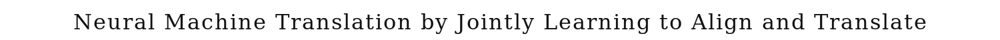

  

  <a href="https://arxiv.org/pdf/1409.0473.pdf">📄 Original Paper (ICLR 2015)</a> · Dzmitry Bahdanau (Born Belarus), Kyunghyun Cho (Born South Korea, 1984), Yoshua Bengio (Born Paris, France, 1964)

<em>Three months after seq2seq, a Belarusian master's student in Montreal fixed its biggest weakness. The fix would, three years later, become the only thing modern AI is built on.</em>

---

The seq2seq paper had been published in September 2014. By December that year, its limitations were already clear. Compressing an entire input sentence into a single fixed-size vector worked passably for short sentences. For long sentences, performance degraded sharply. The bottleneck vector was simply too small to capture all the information needed. Sutskever's reversed-input trick had improved matters slightly but not solved the underlying problem.

In Yoshua Bengio's lab in Montreal, three researchers were working on the issue independently. Dzmitry Bahdanau was a Belarusian master's student doing a research internship in Montreal. Kyunghyun Cho was a Korean postdoc, born in 1984, who had joined Bengio's lab in 2014. Bengio himself was the senior author. The three together had been working on neural machine translation since the spring of 2014, in parallel with the Google team that produced seq2seq.

The fix Bahdanau proposed was conceptually simple. Instead of compressing the entire source sentence into one vector, keep the encoder's hidden state at every position. The decoder, at each step of generating the output, computes a weighted sum of all the encoder states, with the weights themselves computed by a small neural network. The weights are called attention. They tell the decoder where to look in the input at each step of generating the output. When the decoder is generating the third word of the output, it might attend most strongly to the second and third positions of the input. When it is generating the eighth word, it might attend to position seven. The decoder learns these alignments automatically as part of training.

The architecture is striking in its simplicity. The encoder produces a sequence of hidden states, one per input position. The decoder, at each step, computes a query from its current state. It compares the query to each encoder state to produce a similarity score. The scores are normalized via softmax to give attention weights. The weighted sum of encoder states is the context vector for that decoder step. The decoder uses the context vector along with its own state to produce the next output. The entire system is differentiable end to end, so the attention weights are learned by backpropagation along with everything else.

The paper was titled "Neural Machine Translation by Jointly Learning to Align and Translate." It was uploaded to arXiv in September 2014, just days after Sutskever's seq2seq paper, and presented at ICLR 2015. The empirical results on English-to-French translation showed that attention-augmented seq2seq matched or beat the original seq2seq, especially on long sentences. More importantly, the attention weights, when visualized, looked exactly like the word alignments that classical machine translation had spent decades trying to compute. The model had learned, on its own and as a byproduct of training, what classical systems had been engineered to produce. The implications would prove enormous, although neither the authors nor the readers fully understood them in 2014.

  

<em>The decoder no longer has to remember the whole input. It can look back at any source position when needed.</em>

---

Attention mattered for three reasons.

First, it solved seq2seq's bottleneck and dramatically improved machine translation. Translation quality on long sentences, where seq2seq had been particularly weak, became comparable to short-sentence performance. Within two years, every major translation system had adopted attention-augmented seq2seq. Google's deployment of GNMT in 2016 used it. The transition from phrase-based to neural translation that real users experienced as a quality jump in Google Translate was attention's first practical victory.

Second, attention generalized far beyond translation. The same mechanism could be applied to any task where one piece of computation needed to selectively attend to another. Image captioning models used attention to focus on specific image regions while generating each word. Speech recognition used attention to align acoustic frames with output phonemes. Question answering used attention to find relevant passages in long documents. By 2016, attention had become a standard component of any deep learning system handling sequences or structured inputs.

Third, attention turned out to be powerful enough to replace recurrence entirely. The 2017 Transformer paper, "Attention Is All You Need," showed that you could throw away the LSTMs in seq2seq and replace them with stacked attention layers. The Transformer was easier to parallelize, scaled better, and ultimately produced better results. By 2019, transformer-based models dominated NLP. By 2022, ChatGPT had brought transformer-based language models to public attention. Every modern large language model, including GPT-4, Claude, and Gemini, is built almost entirely from attention layers. The Bahdanau attention mechanism is the architectural seed of all modern generative AI.

---

The defining concept of attention is selective focus. When processing an input, instead of compressing it into a single representation, keep all the position-by-position representations and let downstream computation choose which to use. The mechanism for choosing is itself learned. The model learns when to attend to which positions, with the attention weights becoming a kind of soft pointer over the input.

The mechanics of attention can be described in three steps. First, compute a query vector representing what is being looked for. In Bahdanau attention, the query is derived from the decoder's current hidden state. Second, compute similarity scores between the query and each of the input positions. The original Bahdanau paper used a small feedforward network for this. Third, normalize the scores via softmax to get attention weights, then take the weighted sum of the input position representations as the context vector.

The conceptual depth is in the recognition that fixed-size representations are unnecessary. If you keep all the position-level information and let the model dynamically pull what it needs, you avoid the bottleneck that makes fixed-size compression problematic. The price is that you have to do more computation at each step, since the model has to compare the query against every input position. For sequences of length N processing for N output steps, attention costs O(N²) operations rather than the O(N) of pure recurrence. For modern models with sequences of thousands of tokens, this quadratic cost has become a major engineering concern, but in 2014 the trade-off was a clear win.

The interpretability of attention is a major bonus. The attention weights can be visualized as a matrix showing which input positions the model attended to at each output step. For machine translation, this matrix looks like an alignment between source and target words. For image captioning, it shows which image regions correspond to which output words. For question answering, it shows which parts of the document were used to answer the question. Researchers could see what their models were doing in a way that previous opaque networks did not allow.

---

The Bahdanau attention mechanism, given encoder hidden states h₁, h₂, ..., h_T and a decoder state s_t at time t, computes a context vector c_t as follows.

First, score each encoder position by similarity to the decoder state:

> e_{t,i} = a(s_{t−1}, h_i)

where a is a small feedforward network. The original paper used a single hidden layer with tanh activation:

> a(s, h) = v_a^T tanh(W_a s + U_a h)

Second, normalize the scores into attention weights via softmax:

> α_{t,i} = exp(e_{t,i}) / Σ_{j=1}^T exp(e_{t,j})

The weights satisfy 0 ≤ α_{t,i} ≤ 1 and Σ α_{t,i} = 1, so they form a probability distribution over input positions.

Third, compute the context vector as the weighted sum of encoder states:

> c_t = Σ_{i=1}^T α_{t,i} · h_i

The context vector is then concatenated or added to the decoder's input at time t, and the decoder produces its output as before. The entire computation is differentiable, so backpropagation through the softmax and the scoring network learns the attention weights along with everything else.

The 2017 Transformer would generalize this mechanism using "scaled dot-product attention" with explicit query, key, and value vectors. The query is what is being looked for, the keys are the encoder representations being matched against, and the values are the actual representations being aggregated. In the Transformer formulation:

> Attention(Q, K, V) = softmax(Q K^T / √d_k) V

This is mathematically a generalization of Bahdanau attention with different scoring and aggregation, but the conceptual core is the same. Soft alignment via learned weights, then weighted sum.

---

Within a year of the attention paper, attention was being applied to almost every sequence task in deep learning. Vinyals and others used attention as a discrete pointer in Pointer Networks. Xu and others used visual attention for image captioning. By 2016, attention was a standard component of NLP pipelines.

Google deployed attention-augmented seq2seq as Google Neural Machine Translation in late 2016, replacing the phrase-based system that had been their translation engine for years. The user-visible quality improvement on long sentences was substantial. Other major translation services followed within a year.

The watershed came with the Transformer in 2017. Vaswani and seven co-authors at Google showed that you could remove the recurrence from seq2seq entirely and rely on attention alone. The Transformer used multi-head self-attention to let positions in the input attend to each other, and cross-attention to let the decoder attend to the encoder. The architecture was much more parallelizable than RNN-based seq2seq, allowing training on much larger datasets and models. By 2018, the Transformer had taken over machine translation. By 2019, it dominated NLP through BERT and GPT-2. By 2022, it was the foundation of ChatGPT. By 2025, it powers essentially every frontier AI system.

The Bahdanau, Cho, Bengio attention paper has become one of the most cited works in deep learning. Bahdanau himself moved through ElementAI and ServiceNow Research. Cho moved to NYU as a professor. Bengio remains at Montreal and has become one of the most prominent voices on AI safety and policy. The attention mechanism they introduced in 2014 is, arguably, the single most important architectural innovation in the history of deep learning.

The next stop on this walk is 2015. Researchers at Microsoft Research Asia, led by Kaiming He, were about to introduce residual connections in ResNet, finally making it possible to train networks of arbitrary depth.

---

  <a href="2014b-Sutskever-Sequence-to-Sequence.md">← Previous: Seq2Seq 2014</a> &nbsp;·&nbsp; <a href="2015-He-ResNet.md">Next: ResNet 2015 →</a>

