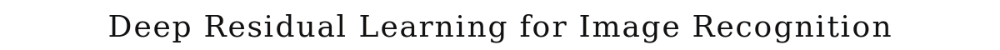
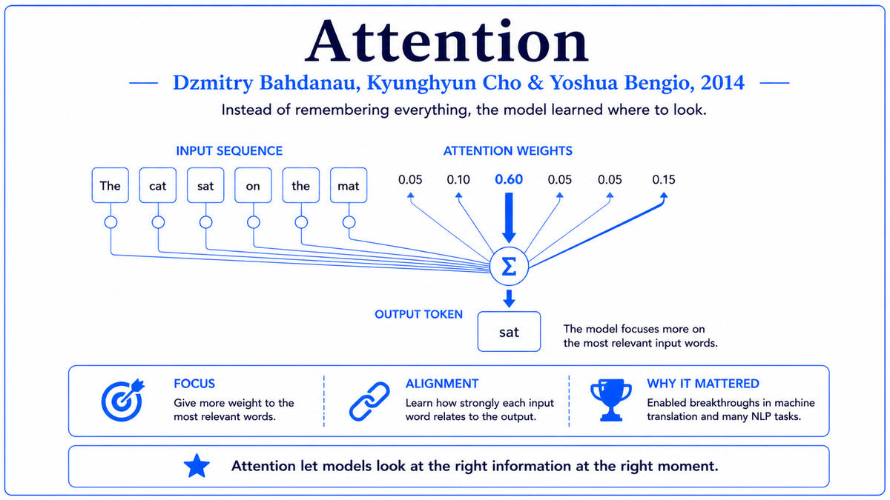

  

  <a href="https://arxiv.org/pdf/1512.03385.pdf">📄 Original Paper (CVPR 2016)</a> · Kaiming He (Born China, 1984), Xiangyu Zhang, Shaoqing Ren, Jian Sun (Born China, 1976, died 2022)

<em>Twenty-four years after Hochreiter named the vanishing gradient problem, four researchers at Microsoft Research Asia trained a 152-layer network that worked. The fix was a single shortcut.</em>

---

By 2015 the deep learning revolution was three years old. AlexNet had eight layers. VGGNet pushed to 19. GoogLeNet reached 22. With each generation, going deeper helped. But there was a wall. Beyond about 30 layers, networks stopped improving and often got worse. Training accuracy degraded along with test accuracy, ruling out simple overfitting. Something fundamental about deep networks was broken, and nobody knew what.

The puzzle was strange. In principle, a deeper network should never be worse than a shallower one. You could always set the extra layers to learn the identity function and recover the shallower network's behavior. But in practice, the optimizer could not find these identity solutions. Adding more layers made the loss harder to minimize, even on the training set. The vanishing gradient that Hochreiter had identified in 1991 was part of the story, but ReLU activations and careful initialization had largely fixed that for moderate depths. Something else was wrong.

Four researchers at Microsoft Research Asia in Beijing decided to attack this directly. Kaiming He, born in 1984 in Guangzhou, had earned his PhD at Chinese University of Hong Kong and joined MSR Asia in 2011. He was the lead. Xiangyu Zhang and Shaoqing Ren were younger researchers in the same group. Jian Sun, born in 1976, was the senior figure, head of MSR Asia's visual computing group and one of the most respected computer vision researchers in China. Sun would later move to Megvii and tragically die of a heart attack in 2022.

The fix they proposed was almost embarrassingly simple. Instead of asking each layer to learn a transformation H(x) directly, ask it to learn the residual F(x) = H(x) - x, then add x back at the output. The layer's output becomes F(x) + x. The "+ x" part is called a skip connection or shortcut. It carries the input forward unchanged, in parallel with the layer's own computation.

The architectural change is tiny. A few extra arrows in the diagram. The effect is enormous. With residual connections, the optimizer no longer has to learn to construct identity functions when extra depth is unhelpful. The identity is already there, built in. The layer just needs to learn what to add to it. If the optimal solution is to do nothing, the layer learns F(x) = 0, which is trivial. The pathology that had been killing deep networks beyond 30 layers disappeared.

The paper, "Deep Residual Learning for Image Recognition," was uploaded to arXiv in December 2015 and won the best paper award at CVPR 2016. The empirical results were stunning. He's team trained a 152-layer ResNet on ImageNet and won the 2015 ILSVRC with a top-5 error rate of 3.57 percent, beating human-level performance. They also trained a 1001-layer ResNet on CIFAR-10 just to demonstrate that depth was no longer a barrier. Networks of any depth could now be trained reliably. Within months, ResNet became the default backbone for every computer vision system.

  

<em>One arrow added to the diagram. Networks could suddenly be hundreds of layers deep.</em>

---

ResNet mattered for three reasons.

First, it removed depth as a constraint. Before ResNet, network depth was a hyperparameter to be carefully tuned. Too shallow and the network lacked capacity. Too deep and training fell apart. After ResNet, you could just keep adding layers. Modern image classification, object detection, and segmentation systems routinely use ResNet backbones with 50, 101, or 152 layers. The choice of depth became a question of compute budget rather than fundamental feasibility.

Second, residual connections turned out to be far more general than ResNet itself. The same principle was applied to recurrent networks, where gating mechanisms in LSTM had effectively been doing the same thing since 1997. The Transformer, introduced two years after ResNet, uses residual connections around every attention and feedforward layer. Modern large language models with hundreds of layers depend critically on residual connections to train. The constant error carousel that Hochreiter had sketched in 1991 for recurrent networks finally arrived for feedforward networks in 2015, in a slightly different form, and reshaped the entire field.

Third, ResNet provided a clean conceptual framework that researchers could build on. The idea that layers should learn deltas relative to a default identity gave a precise vocabulary for thinking about deep networks. Many subsequent architectures, including DenseNet, Highway Networks, and the various Transformer variants, can be understood as different ways of mixing or reweighting the residual stream. The "stream" view of deep networks, where information flows along a backbone and layers contribute additive updates, traces directly to ResNet.

---

The defining concept of ResNet is the residual block. A standard layer takes input x and produces output H(x), with the layer's job being to learn the full function H. A residual block reformulates this. The layer learns F(x), and the block's output is F(x) + x. The "+ x" is the shortcut connection.

The mathematical effect is on the gradient. During backpropagation, the gradient of the loss with respect to the input x of a residual block is the gradient with respect to the output, times (1 + ∂F/∂x). The "1" comes from the shortcut path. Even if ∂F/∂x is small or zero, the gradient still flows through the "+1" path. This is the same trick LSTM uses for its memory cell, applied to feedforward networks. Gradients can propagate through the shortcut path unchanged, no matter how many layers they traverse.

The conceptual move is to change what the network is trying to learn. The hypothesis is that learning small deviations from identity is easier than learning full transformations from scratch. If the optimal layer behavior is close to identity, F(x) only needs to be small. The optimizer can find this easily. By contrast, asking a deep stack of layers to learn full transformations all the way through, with no built-in default, makes optimization much harder.

The skip connection is also informationally cheap. It introduces no new parameters and adds only a few extra additions per forward pass. The cost in compute is negligible. The benefit, in trainability and final performance, is enormous. This combination of simple idea, low cost, and high impact is what made ResNet propagate so quickly through the field.

---

A residual block computes

> y = F(x, {Wᵢ}) + x

where x is the input, F is a function defined by a few stacked layers with weights {Wᵢ}, and y is the output. In the simplest case, F is two convolutional layers with batch normalization and ReLU between them:

> F(x) = W₂ · σ(BN(W₁ · x))

where σ is ReLU and BN is batch normalization. When the spatial dimensions or channel counts change between input and output, the shortcut applies a 1x1 convolution to match the dimensions:

> y = F(x) + W_s · x

where W_s is a learned linear projection.

During backpropagation, the gradient through the residual block is

> ∂L/∂x = ∂L/∂y · (1 + ∂F/∂x)

The "1" is the gradient through the shortcut path. This is the critical mathematical property. Even when stacks of residual blocks are composed, the gradient always has a path back to any input through pure shortcut connections, with multiplicative factors of 1 at every step. Gradients do not vanish, regardless of network depth.

The 152-layer ResNet used in the 2015 paper has 50 residual blocks, with each block containing three convolutional layers in a "bottleneck" configuration: 1x1, 3x3, 1x1. The total parameter count is about 60 million, comparable to AlexNet, despite being almost 20 times deeper. The deeper network achieves much better performance with the same parameter budget because the residual connections make every layer easy to train.

---

The immediate aftermath of ResNet was a wave of architectural follow-ups exploring residual connections in different contexts. DenseNet in 2016 connected every layer to every subsequent layer with shortcuts. Highway Networks, predating ResNet by a few months, used learned gates to control shortcut flow. ResNeXt, ResNet variants with grouped convolutions, and Wide ResNets explored different ways of structuring residual blocks. By 2017, residual connections were standard in every deep network architecture.

The Transformer in 2017 used residual connections around every sub-layer. Without them, the 6-layer Transformer of the original paper would have been hard to train, let alone the 100-plus-layer Transformers that power modern language models. Every modern large language model, including GPT-4, Claude, and Gemini, uses residual connections inherited directly from the ResNet design. The "+x" in the math of those models is the same "+x" He, Zhang, Ren, and Sun introduced in 2015.

ResNet itself remained the dominant backbone for computer vision well into the 2020s. Object detection systems like Faster R-CNN, segmentation systems like Mask R-CNN, and the family of EfficientNet models all build on ResNet-style residual connections. Vision Transformers, introduced in 2020, also use residual connections, just structured differently. The principle has outlasted its originating architecture.

He, Zhang, Ren, and Sun all moved on. Kaiming He moved to Facebook AI Research in 2016 and became one of the most prolific computer vision researchers of the 2010s. He moved to MIT as a professor in 2024. Sun's death in 2022 was a major loss for the Chinese AI community, where he had been a defining figure. The 2015 paper has become one of the most cited works in computer science, with citations in the hundreds of thousands.

The next stop on this walk is 2016. DeepMind, the London-based AI lab acquired by Google in 2014, was about to publish a paper describing AlphaGo, the program that defeated Lee Sedol at the game of Go. The match would become the most watched AI demonstration since Deep Blue.

---

  <a href="2014c-Bahdanau-Attention.md">← Previous: Attention 2014</a> &nbsp;·&nbsp; <a href="2016a-DeepMind-AlphaGo.md">Next: AlphaGo 2016 →</a>

