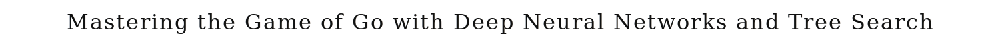
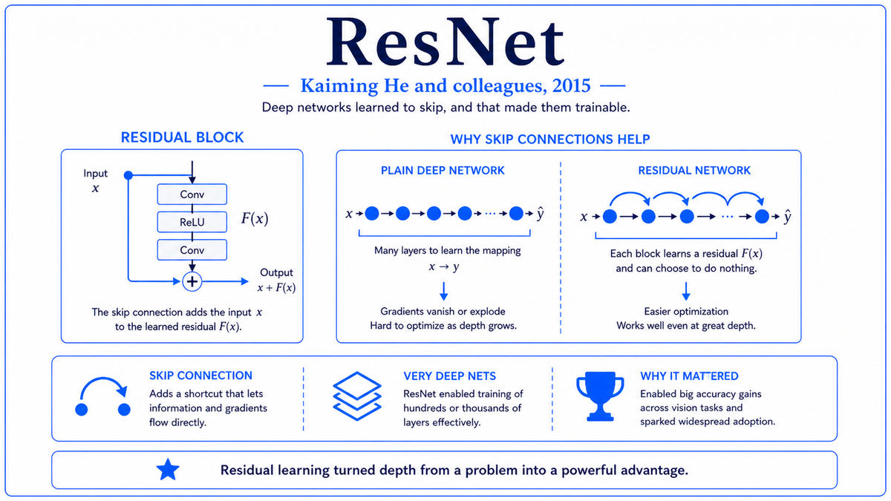

  

  <a href="https://www.nature.com/articles/nature16961">📄 Original Paper (Nature 2016)</a> · David Silver (Born United Kingdom, 1976), Aja Huang, Chris Maddison, Arthur Guez, Laurent Sifre, George van den Driessche, Julian Schrittwieser, Demis Hassabis (Born London, 1976), and the DeepMind Go team

<em>Go had been considered the holy grail of game AI for two decades. DeepMind's program defeated Lee Sedol 4-1 in March 2016. The Deep Blue moment of the deep learning era.</em>

---

Go is harder than chess. The branching factor is much larger, with about 250 legal moves per position compared to 35 in chess. Long-range strategic patterns matter more than tactical calculation. Crucially, no one had ever found a good evaluation function for Go positions. In chess, you can roughly estimate who is winning by counting material and adding positional bonuses. In Go, the value of a position depends on subtle global properties that resist simple formulas. Without a good evaluation function, deep search could not produce strong play. Computer Go programs had been stuck at strong amateur level for over a decade.

DeepMind was a London AI lab founded in 2010 by Demis Hassabis, Shane Legg, and Mustafa Suleyman. Hassabis, born in London in 1976, was a chess prodigy turned game designer turned neuroscientist turned AI researcher. Google had acquired DeepMind in 2014 for about $500 million. By 2014, DeepMind had already demonstrated deep reinforcement learning by training neural networks to play Atari games at human level. Go was the next target.

David Silver led the AlphaGo project. Born in 1976 in the UK and a former colleague of Hassabis at the Cambridge lab where they both did research, Silver had spent his career on reinforcement learning and computer game playing. With a team that included Aja Huang, who had been working on computer Go for years, Chris Maddison, Arthur Guez, and others, Silver designed AlphaGo as a combination of three components. A policy network learned from human expert games predicted plausible moves. A value network learned through self-play estimated the probability of winning from any position. Monte Carlo tree search used both networks to explore promising lines deeply.

The training proceeded in stages. The policy network was first trained by supervised learning on 30 million board positions from 160,000 games played by strong human players, learning to predict the moves human experts had made. The network was then refined by reinforcement learning through self-play, with the policy network playing against earlier versions of itself. The value network was trained on 30 million self-play games, learning to predict the eventual outcome from any board position. Tree search at game time combined both networks to plan many moves ahead.

The first major test was a match against Fan Hui, the European Go champion, in October 2015. AlphaGo won 5-0. The paper announcing the result was published in Nature in January 2016. The Go community was startled. No computer had ever beaten a professional Go player in an even game without a handicap. But Fan Hui was ranked 2 dan professional, far below the world's top players. The real test would come in March 2016, in a five-game match against Lee Sedol, an 18-time world champion and one of the strongest Go players of the past decade.

Lee Sedol was favored to win, with most observers predicting 5-0 or 4-1 in his favor. He lost game one, then lost three more straight. By game three, the consensus had reversed. Lee won game four with a brilliant move 78 that AlphaGo had not anticipated, providing the only human victory of the match. AlphaGo won game five. Final score: 4-1 to AlphaGo. The match was watched live by 200 million people worldwide. Lee Sedol retired from professional Go in 2019, citing AlphaGo's dominance as a primary reason.

  

<em>Three networks working together. Each one solved a piece of the problem. None alone would have been enough.</em>

---

AlphaGo mattered for three reasons.

First, it cracked the Go problem that had defied AI researchers for decades. The combination of deep neural networks for evaluation and Monte Carlo tree search for exploration solved what had previously seemed intractable. The principle generalized far beyond Go. Within a year, AlphaZero would apply the same approach to chess and shogi, learning from scratch and surpassing human-level play in hours. The recipe of "neural networks plus self-play plus tree search" became the standard for game-playing AI.

Second, the match itself was a cultural inflection point. Like Deep Blue versus Kasparov in 1997, the Lee Sedol match brought AI capabilities to public awareness in a visceral way. Unlike Deep Blue, which had used hand-coded knowledge and brute-force search, AlphaGo was a learned system. It had taught itself most of what it knew through self-play. The implications for the broader trajectory of AI were not lost on observers. If a machine could teach itself to master Go from no specific knowledge, what else might it teach itself?

Third, AlphaGo discovered new strategies that human Go players adopted. Move 37 in game two of the Lee Sedol match was a 5th-line shoulder hit that no human professional would have played. Commentators initially thought it was a mistake. Within hours, top players had recognized it as a deep, unconventional move. Top professional players began studying AlphaGo's games and adopting its preferred openings. The machine had taught the human masters something new about a game humans had been studying for thousands of years. This was the second time in AI history, after TD-Gammon's slotting versus splitting in 1992, that machines had generated new knowledge in a domain humans had thoroughly studied.

---

AlphaGo's defining concept is the combination of learned evaluation with tree search. Pure tree search like Deep Blue's alpha-beta works when you have a fast, accurate evaluation function. Pure learning like TD-Gammon works for games with simple structure where the network alone can play strongly. Go has neither property. AlphaGo's insight was that deep learning could provide the evaluation function that classical tree search needed, while tree search could provide the lookahead that the network alone could not.

The policy network handles "what moves to consider." Given a board position, it outputs a probability distribution over the 361 board points, with high probability on moves that strong human players would make. This dramatically prunes the search. Instead of considering all 250 legal moves at each step, the search only seriously considers the few moves the policy network rates highly. This trades exhaustive search for guided search.

The value network handles "who is winning." Given a board position, it outputs an estimate of the probability that the current player will eventually win. This is what classical Go programs had lacked. With an accurate value network, the search can stop expanding nodes deep in the tree and trust the value network's evaluation. The value network was trained by self-play, with the network playing millions of games against itself and learning to predict outcomes from board positions.

Monte Carlo tree search ties everything together. Starting from the current position, the algorithm builds a search tree by repeatedly selecting promising paths, expanding leaf nodes, evaluating them with the value network, and propagating the results back up the tree. The selection at each step balances exploration of moves the network thinks promising against exploration of moves that might be undervalued. Over thousands of simulations per move, the tree search refines the policy network's initial estimates and produces a strong final move.

---

The policy network p_σ(a | s) is a deep convolutional network that maps a board state s to a probability distribution over actions a. It is trained by supervised learning on human expert games to maximize log-likelihood:

> ∇σ ∝ ∂log p_σ(a | s) / ∂σ

A reinforcement learning policy network p_ρ is then initialized from p_σ and refined by self-play, with policy gradient updates:

> ∇ρ ∝ z · ∂log p_ρ(a | s) / ∂ρ

where z is +1 for a win and -1 for a loss in the self-play game.

The value network v_θ(s) estimates the probability of winning from state s. It is trained by regression on positions sampled from self-play games, with the target being the actual outcome z of the game:

> L = (z − v_θ(s))²

At game time, MCTS builds a tree from the current position. Each node stores the current best move estimate. The selection step picks the child a maximizing Q(s, a) + u(s, a), where Q is the action value and u is an exploration bonus that decays as a is visited more often. After a tree-walk reaches a leaf, the value is computed as a mixture of the value network output and a random rollout policy. The result is propagated back up the tree, updating Q values. After many simulations, the move with the highest visit count at the root is played.

The full AlphaGo system used 1,920 CPUs and 280 GPUs during the Lee Sedol match. The training had used many more, with self-play generating tens of millions of games over months of compute time.

---

The immediate sequel was AlphaGo Zero in October 2017. Silver and team showed that the supervised learning step on human games was unnecessary. AlphaGo Zero learned from pure self-play, starting with random weights and no human knowledge at all. After 40 days of self-play, AlphaGo Zero defeated the original AlphaGo 100-0. Removing the human knowledge had improved performance, not hurt it.

AlphaZero in December 2017 generalized further. Using essentially the same algorithm with no game-specific tuning, AlphaZero learned chess, shogi, and Go from scratch. In 24 hours of training, AlphaZero defeated Stockfish, the world's strongest chess engine, with a style chess grandmasters described as more human-like than computer-like. The general principle of "self-play plus deep neural networks plus tree search" had been validated.

DeepMind's subsequent work continued to extend the paradigm. MuZero in 2019 learned to play games without being told the rules. AlphaStar in 2019 mastered StarCraft II at grandmaster level. AlphaFold in 2020 applied deep learning to protein structure prediction, solving a 50-year-old problem in molecular biology. The AlphaGo trajectory has shaped DeepMind's entire research program for nearly a decade.

The cultural impact has continued. The 2017 documentary "AlphaGo" reached millions of viewers. Top Go professionals now train against AI systems as a matter of course. The center of Go expertise has shifted, in a real sense, from human players to AI programs that have surpassed them.

The next stop on this walk is also 2016. On August 15 of that year, Jensen Huang would personally hand-deliver the world's first AI supercomputer, the NVIDIA DGX-1, to a small office in San Francisco that housed a year-old AI lab called OpenAI.

---

  <a href="2015-He-ResNet.md">← Previous: ResNet 2015</a> &nbsp;·&nbsp; <a href="2016b-NVIDIA-DGX-1.md">Next: DGX-1 2016 →</a>

