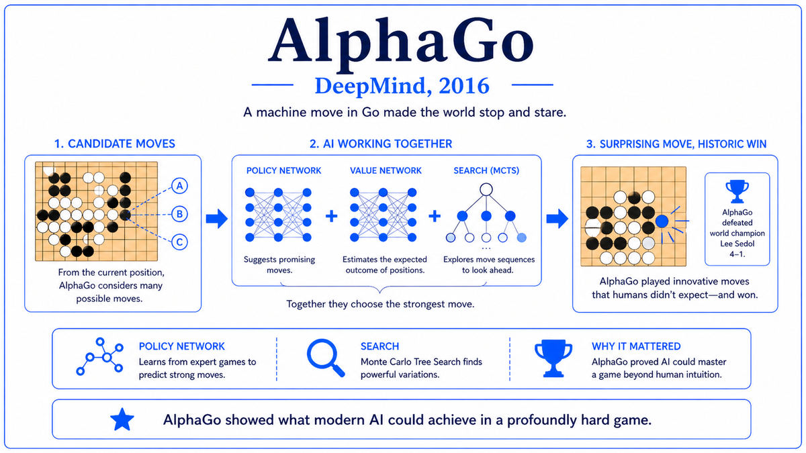

  

  <a href="https://www.nvidia.com/en-us/data-center/dgx-1/">📄 Product Announcement (NVIDIA, April 2016)</a> · Jensen Huang (Born Tainan, Taiwan, 1963), NVIDIA Corporation, Santa Clara, California

<em>On August 15, 2016, the CEO of NVIDIA personally hand-delivered the world's first AI supercomputer to a one-year-old San Francisco lab named OpenAI. The photograph that day marks the start of an era.</em>

---

On August 15, 2016, Jensen Huang drove from NVIDIA headquarters in Santa Clara to a modest office at 3180 18th Street in the Mission District of San Francisco. In the back of the car, packed in foam, was a 4U rack-mountable computer that Huang had decided to deliver in person. The office belonged to OpenAI, an AI research lab less than a year old. The computer was the world's first NVIDIA DGX-1.

OpenAI had been founded on December 11, 2015, by Elon Musk, Sam Altman, Greg Brockman, Ilya Sutskever, and several others. By the summer of 2016, the lab had a small team and was beginning ambitious projects in reinforcement learning, robotics, and language modeling. The team was hungry for compute. Setting up a multi-GPU training rig in 2016 was still a researcher craft, requiring careful selection of motherboards, power supplies, and PCIe layouts. The DGX-1 collapsed all of that into a single product. It was sold as an AI supercomputer in a box.

Huang carried the box into OpenAI's office and set it on a workbench. Photographs from that afternoon show Musk, Altman, Brockman, Sutskever, and the small early team gathered around the machine. Huang signed the lid in black marker. The inscription has since become famous in AI circles. "To Elon and the OpenAI team! To the future of computing and humanity. I present you the world's first DGX-1!" Huang, born in Tainan, Taiwan in 1963, had spent the previous twenty years building NVIDIA from a small graphics chip startup into a major Silicon Valley company. The hand-delivery was, in retrospect, a turning point in his career and his company's trajectory.

The machine itself contained eight NVIDIA Tesla P100 GPUs, the first chips built on NVIDIA's new Pascal architecture. The P100 was the first NVIDIA GPU designed from the ground up specifically for deep learning. It used 16 gigabytes of High Bandwidth Memory stacked directly on the package, supported native FP16 mixed-precision arithmetic, and connected to the seven other GPUs via a new high-speed interconnect called NVLink. NVLink ran at 160 gigabytes per second, five times faster than the PCIe bus that had previously connected GPUs. The eight P100s in the DGX-1 could behave more like one giant GPU than like eight separate ones. The system delivered 170 teraFLOPS of mixed-precision performance and was priced at 129,000 dollars.

For a researcher in 2016, that performance was unprecedented and turnkey. The hardware, drivers, and major deep learning frameworks were already installed. A researcher could plug in power and Ethernet and start training within an hour. The hand-delivery to OpenAI was the symbolic beginning of a new era of AI compute, in which AI labs no longer assembled hardware from gaming components. They bought purpose-built AI supercomputers.

  

<em>Eight Pascal GPUs behaving more like one giant chip than eight separate ones.</em>

---

The DGX-1 mattered for three reasons that compounded over the following decade.

First, it created the AI supercomputer as a product category. Before August 2016, AI compute was either built bespoke by researchers or rented as raw cloud GPU instances. The DGX-1 introduced a third option, an integrated turnkey appliance optimized end to end for deep learning workloads. Within two years, every major AI lab had at least one. Within five years, NVIDIA was selling DGX-class systems by the thousands per quarter, and competitors had launched their own AI server lines. The DGX-1 defined the form factor for the next generation of AI infrastructure.

Second, the strategic shift was decisive for NVIDIA. The company had spent twenty years known primarily for gaming GPUs. The DGX-1 was the moment NVIDIA committed publicly and unambiguously to AI as its central business. Revenue from data center products surpassed gaming revenue by 2020 and exceeded it by an order of magnitude by 2024. NVIDIA's market capitalization grew from about 30 billion dollars in 2016 to over 3 trillion dollars by 2024, briefly making it the most valuable public company in the world. The trajectory traces directly back to the bet symbolized by Huang's hand-delivery in San Francisco.

Third, the specific machine handed to OpenAI on August 15 was, in a real sense, the seed of modern generative AI. The compute it provided let OpenAI scale its early language modeling experiments. Within three years OpenAI would release GPT-2, then GPT-3 in 2020, and by November 2022, ChatGPT. The lab built on top of the foundation that single DGX-1 represented. The decision to deliver it personally, to a small lab that few people in 2016 had heard of, reads in retrospect as an unusually well-aimed bet by Huang on the future shape of AI.

---

The DGX-1's defining concept is the AI supercomputer as an integrated product. Conventional supercomputers had existed for decades, but they cost tens of millions of dollars and occupied entire rooms. The DGX-1 packed supercomputer-class deep learning performance into a 4U appliance that fit under a desk, ran on standard datacenter power, and was usable by a single researcher.

The architectural choices reflected this goal. Eight GPUs were chosen because eight was the largest number that NVLink could fully interconnect with reasonable latency. Pascal P100 GPUs were chosen because they were the first generation with native FP16 support, which roughly doubles effective throughput on neural network workloads with minimal accuracy loss. NVLink was new and proprietary because PCIe had become the bottleneck. The pre-installed software stack, including CUDA, cuDNN, and the major deep learning frameworks, was the final piece. A researcher unboxing a DGX-1 had only to plug it in. AI workloads had become a market serious enough to justify their own product line, with their own form factor, interconnect, and software stack.

---

The DGX-1's specifications reflected NVIDIA's investment in deep learning hardware. Each P100 GPU contained 15.3 billion transistors built on TSMC's 16-nanometer FinFET process and ran at a base clock of 1,328 MHz. It delivered 21.2 teraFLOPS of FP16 performance and 10.6 teraFLOPS of FP32 performance. The 16 gigabytes of High Bandwidth Memory ran at 720 gigabytes per second, more than three times the bandwidth of the GDDR5 memory used in gaming GPUs of the era.

The eight GPUs were connected in a hybrid mesh-cube topology. Each GPU had four NVLink connections, each running at 20 gigabytes per second per direction, giving 160 gigabytes per second of bidirectional bandwidth per GPU. Two Intel Xeon CPUs and 512 gigabytes of DDR4 handled host-side coordination, with 7.6 terabytes of NVMe SSD storage. Power consumption was 3.2 kilowatts at full load. The chassis was 4U. The total system delivered 170 teraFLOPS of mixed-precision performance, comparable to the Top500 supercomputers of just a few years earlier, in a box small enough to wheel into an office on a hand truck.

---

The DGX-1 was followed quickly by the DGX-2 in 2018, the DGX A100 in 2020, the DGX H100 in 2022, and the DGX B200 in 2024. Each generation roughly doubled compute density, with the H100-based DGX delivering several petaFLOPS of training performance in the same footprint. NVIDIA's data center revenue, which had been a small fraction of total revenue in 2016, became the dominant segment by 2020 and reached 48 billion dollars in fiscal year 2024 alone. The compute platform that began with that single hand-delivered box in San Francisco now powers essentially all frontier AI training in the world.

But NVIDIA's success was being noticed by the largest cloud providers, who were among NVIDIA's biggest customers. Buying DGX-class systems by the thousands had given Amazon, Microsoft, and especially Google an uncomfortable awareness of how dependent they had become on a single supplier. Google had decided as early as 2013 to do something about it. The company had quietly begun designing its own custom silicon, optimized specifically for the neural network workloads that were beginning to dominate its datacenters. By the time Jensen Huang delivered the DGX-1 to OpenAI in August 2016, Google had already been running its own AI accelerator inside its datacenters for over a year. Three months earlier, in May 2016, Google had announced it publicly. They called it the Tensor Processing Unit.

---

  <a href="2016a-DeepMind-AlphaGo.md">← Previous: AlphaGo 2016</a> &nbsp;·&nbsp; <a href="2016c-Google-TPU.md">Next: Google TPU 2016 →</a>

