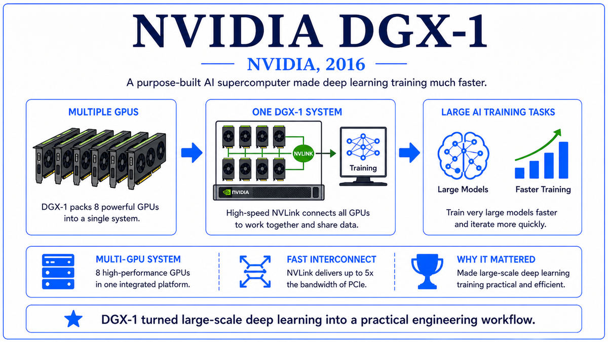

  

  <a href="https://arxiv.org/pdf/1704.04760">📄 Original Paper (ISCA 2017)</a> · Norman P. Jouppi (Born United States) and 75 co-authors at Google, Mountain View, California

<em>Three months before Jensen Huang hand-delivered the DGX-1, Google revealed that it had quietly been running its own AI chip inside its datacenters for over a year. The era of custom AI silicon had begun.</em>

---

By the early 2010s, Google had a problem with its own success. Neural networks were being deployed everywhere inside the company. Voice Search used them for acoustic modeling. Google Photos used them for image classification. Translate had switched to neural machine translation. Search ranking used them for query understanding. Each of these models, running across billions of user queries per day, consumed enormous amounts of compute on Google's CPUs and GPUs.

Around 2013, internal projections produced an alarming result. If voice search adoption continued at its current pace, supporting it for the global user base on existing CPU hardware would require Google to roughly double its datacenter footprint. Building entire new datacenters just to serve voice queries was not an acceptable answer. The company needed dramatically more efficient hardware for the specific workload of neural network inference.

Jeff Dean and a small group of senior engineers made the case internally for custom silicon. The team that took on the project was led by Norman Jouppi, a veteran computer architect who had joined Google in 2013. Jouppi, born in the United States, had earned his PhD at Stanford under John Hennessy in 1984 and had spent the following three decades on processor design at MIPS, DEC's Western Research Lab, and HP Labs. His 1990 paper on stream buffers was foundational to modern CPU prefetching. He had built more processors than almost anyone alive. The TPU project gave him an opportunity to design a chip from scratch with a single workload in mind.

The team made a series of unusual choices. Most chips support a wide instruction set so that they can run any kind of code. The TPU would support only a small set of instructions, optimized for matrix multiplication and a few activation functions. Most chips do floating-point arithmetic. The TPU would do 8-bit integer arithmetic, with the assumption that neural network inference rarely needed more precision than that. Most chips have a complex memory hierarchy with multiple levels of cache. The TPU would have one large on-chip buffer holding the activations and a separate path to off-chip memory for weights. Most chips schedule work dynamically with branch prediction and out-of-order execution. The TPU would do nothing of the kind. It would be told what to compute, in order, by software running on the host CPU.

The design was finished and the first chips were running inside Google's datacenters by 2015. Roughly 15 months from project start to deployment, an extraordinary timeline for a custom ASIC. By March 2016 the TPU was already powering AlphaGo's match against Lee Sedol in Seoul. Google announced the TPU publicly at Google I/O on May 18, 2016. The detailed performance paper, "In-Datacenter Performance Analysis of a Tensor Processing Unit," was presented at ISCA in June 2017 with Jouppi as first author and 75 co-authors representing the breadth of the team. The TPU was the first major AI accelerator built and deployed by a hyperscaler.

  

<em>Data flowing through the grid in waves. Weights stationary, activations streaming in, partial sums accumulating.</em>

---

The TPU mattered for three reasons that reshaped the AI hardware landscape.

First, it was the first major AI accelerator built and deployed at scale by a hyperscaler. Before 2016, AI compute came from one of two places. Researchers used NVIDIA GPUs, and large companies bought more of them. The TPU showed that the largest cloud providers could design their own silicon, optimized for their own workloads, and get an order of magnitude better performance per watt than the general-purpose GPUs they had been buying. Within five years, every major cloud provider had its own AI chip program. Amazon launched Inferentia in 2019 and Trainium in 2022. Microsoft announced the Maia chip in 2023. Meta deployed MTIA in 2023. Apple shipped Neural Engines in every iPhone from 2017 onward. The TPU started this trend.

Second, the TPU validated domain-specific architecture as the future of computing. The dominant intellectual position in computer architecture for the prior thirty years had been that general-purpose processors would always win. CPUs were getting faster, software was getting better, and any specialized chip would be obsolete by the time it shipped. The TPU showed that for narrow but enormous workloads like neural network inference, specialization could deliver gains that general-purpose hardware could not match. The 2017 Turing Award lecture by John Hennessy and David Patterson, "A New Golden Age for Computer Architecture," made domain-specific architecture the central thesis of the modern era. The TPU was their primary example.

Third, the TPU was directly responsible for AlphaGo's success at the Lee Sedol match. The match in March 2016 was the cultural inflection point of the deep learning era, watched by 200 million people worldwide. The compute that ran AlphaGo's policy and value networks during that match came from TPUs in a Google datacenter. The chip that beat the human Go champion was a chip that Google had built itself, in secret, eighteen months earlier. The same chips would, within a few years, train the language models that produced ChatGPT and its successors.

---

The TPU's defining concept is domain-specific architecture. A processor optimized for one workload, even at the cost of being unable to run anything else, can vastly outperform a general-purpose processor on that workload. The TPU was an existence proof. For neural network inference, the TPU delivered roughly 30 to 80 times better performance per watt than the contemporary CPUs and GPUs Google had been using for the same task.

The architectural mechanism that made this possible is the systolic array. Imagine a square grid of small arithmetic units, each capable of one multiply and one add per cycle. Weights for a matrix multiplication are loaded into the grid and stay there. Activations are streamed in from one edge of the grid, propagating across the array one column per cycle. As the activations move, each cell multiplies by its stored weight and adds the result to a partial sum that is also flowing through the grid in a different direction. After enough cycles, the partial sums emerge from the opposite edge, fully computed. The data flows through the grid like blood through a heart, which is where the name systolic comes from. The crucial property is that each value is read from memory exactly once and then reused across many computations. Memory bandwidth, which dominates energy cost in conventional processors, is minimized.

The other architectural commitment was 8-bit integer arithmetic. Floating-point arithmetic is expensive in silicon, requiring hardware to handle exponents, mantissas, and rounding. Neural network inference, however, often does not need the dynamic range of floating-point numbers. Quantizing trained weights and activations to 8-bit integers, with appropriate scaling, gives accuracy almost indistinguishable from floating-point on most CNN inference tasks. The TPU exploited this fact. Each MAC unit was a small 8-bit multiplier and a wider accumulator, costing perhaps a tenth as much silicon as the equivalent FP32 unit. With ten times as many units in the same chip area, the TPU could do an order of magnitude more arithmetic per second than a comparable floating-point chip.

---

The TPU v1 was a single ASIC built on a 28-nanometer process. The heart of the chip was a 256-by-256 systolic array of multiply-accumulate units, totaling 65,536 MACs. Each MAC performed an 8-bit integer multiply followed by an integer addition into a wider accumulator. The array ran at 700 MHz. Peak performance was 256 times 256 times 2 operations per cycle times 700 megahertz, which works out to roughly 92 trillion 8-bit operations per second.

On-chip the TPU had a 24 megabyte unified buffer for activations and a smaller weight FIFO for streaming weights into the array. Off-chip there was 8 gigabytes of DDR3 DRAM connected through two channels, providing 34 gigabytes per second of memory bandwidth. The chip drew about 75 watts at full load. Physically, it was packaged on a PCIe expansion card that plugged into a standard server, with the host CPU sending instructions over the PCIe bus.

The instruction set was deliberately minimal. The TPU could read activations from off-chip memory into the on-chip buffer, read weights from memory through the FIFO, multiply through the systolic array, apply an activation function such as ReLU, and write the result back. There were no branches, no caches, and no virtual memory. The chip executed a sequence of these instructions, scheduled by the host, with predictable latency and no surprises. The simplicity was a feature. By giving up everything that a general-purpose CPU does, the TPU could spend nearly all of its silicon area on the matrix unit that did the actual work.

---

TPU v1 was inference only. It could run trained models but could not train them. Training requires more dynamic range than 8-bit integer arithmetic provides, and it requires the ability to compute gradients and update weights, neither of which v1 supported. TPU v2, announced at Google I/O in May 2017, fixed this. It introduced bfloat16, a 16-bit floating-point format with the dynamic range of FP32 but reduced precision, designed specifically for neural network training. Each v2 chip delivered 180 teraFLOPS of bfloat16 performance and was paired with 64 gigabytes of HBM. Four v2 chips were packaged into a board, and 256 boards were organized into a "pod" delivering over 11 petaFLOPS of training performance.

TPU v3 in 2018 added liquid cooling and roughly doubled per-chip throughput. Subsequent generations followed every two years. TPU v4 in 2021 introduced optical interconnects between pods. TPU v5p in 2024 allowed pods of 8,960 chips trained as a single coherent unit. The custom-silicon arms race the TPU triggered had escalated into one of the most competitive frontiers in semiconductor design.

The deepest connection between the TPU and the next chapter of this walk is the workload it would soon serve. Six months after the ISCA paper presentation in June 2017, a small team at Google Brain working on machine translation would publish a paper that they had trained, mostly, on TPUs. The paper killed off recurrence, replaced LSTMs with stacked attention layers, and demonstrated the result on English-to-German translation. The architecture they introduced would become, within a few years, the substrate of every major language model in the world. The paper was called "Attention Is All You Need."

---

  <a href="2016b-NVIDIA-DGX-1.md">← Previous: DGX-1 2016</a> &nbsp;·&nbsp; <a href="2017-Vaswani-Transformer.md">Next: Transformer 2017 →</a>

