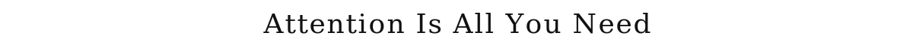
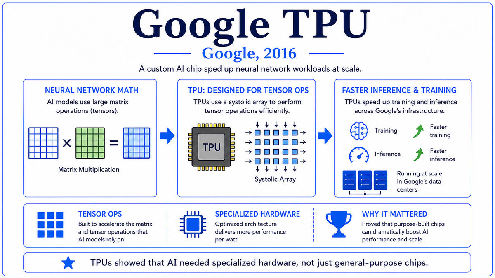

  

  <a href="https://arxiv.org/pdf/1706.03762">📄 Original Paper (NeurIPS 2017)</a> · Ashish Vaswani (Born India), Noam Shazeer (Born United States), Niki Parmar (Born India), Jakob Uszkoreit (Born Germany), Llion Jones (Born Wales, United Kingdom), Aidan N. Gomez (Born Canada), Łukasz Kaiser (Born Poland), Illia Polosukhin (Born Ukraine)

<em>Eight authors at Google removed recurrence entirely from machine translation and replaced it with stacked attention. The architecture they introduced became, within five years, the foundation of every major language model in the world.</em>

---

By early 2017, the dominant architecture for sequence-to-sequence problems was the recurrent encoder-decoder with attention. Sutskever's seq2seq paper from 2014, augmented by Bahdanau's attention mechanism, had been deployed in Google's translation system in 2016 and was producing the best machine translation in the world. But the architecture had a fundamental limitation that was becoming increasingly painful as models grew larger. RNNs are inherently sequential. To compute the hidden state at position t, you first have to compute the hidden state at position t-1. Training therefore could not be parallelized within a single sequence. On long sequences, RNN training was slow even on the latest hardware.

A team at Google Brain and Google Research had been working through 2016 and early 2017 on improving translation. The team included Ashish Vaswani, who had done his PhD at USC; Noam Shazeer, a long-time Google engineer; Niki Parmar, recently joined from Apple; Jakob Uszkoreit, whose father Hans was a pioneer of computational linguistics; Llion Jones; Aidan Gomez, an undergraduate intern from the University of Toronto; Łukasz Kaiser, a theoretical computer scientist; and Illia Polosukhin. They had been experimenting with various ways to reduce the recurrence in their translation models.

The radical move was to remove recurrence entirely. The team's proposal was that the encoder would consist of stacked layers of self-attention, each letting every position in the input attend to every other position. The decoder would do the same, plus cross-attention to the encoder. Positional encodings would be added to the input embeddings to give the model a sense of word order, since without recurrence the architecture had no other way to know which word came first. Multi-head attention, with several attention computations running in parallel and their outputs concatenated, would let the model learn different kinds of relationships between positions in the same layer. Residual connections, borrowed from ResNet two years earlier, would let the network be stacked deeply. The result was a sequence-to-sequence model with no recurrence, no convolution, just attention and feedforward layers.

The paper was uploaded to arXiv on June 12, 2017, and presented at NeurIPS in December 2017 in Long Beach, California. The title was "Attention Is All You Need," a confident technical claim. The benchmark results were strong but not earth-shattering. On WMT 2014 English-to-German translation, the Transformer beat the previous best by 2.0 BLEU points and set a new state of the art on English-to-French as well. The training cost was lower than the prior best by an order of magnitude. The paper was respected at NeurIPS but not the talk of the conference. The authors themselves did not yet realize what they had built.

  

<em>No recurrence. No convolution. Just attention and feedforward layers, stacked.</em>

---

The Transformer mattered for three reasons that took five years to fully unfold and now define the present moment in AI.

First, it became the architectural foundation of every modern large language model. Within a year of the NeurIPS paper, BERT applied the Transformer encoder to representation learning and broke records on every NLP benchmark. GPT-1 applied the Transformer decoder to language modeling. By 2019, BERT and its descendants had taken over natural language processing entirely. By 2022, ChatGPT brought transformer-based language models to public awareness. Every major frontier model in 2025, including GPT-4, Claude, Gemini, Llama, and Mistral, is built on the Transformer architecture. The 2017 paper is the architectural ancestor of essentially every system that the public now associates with AI.

Second, the Transformer was the architecture that finally let AI systems exploit the compute that NVIDIA and Google had been building. RNNs could not parallelize within a sequence. The Transformer could. Every position in a sequence is processed simultaneously during training, with attention letting positions exchange information. This maps perfectly onto the matrix-multiplication-heavy hardware of the DGX-1 and TPU. By 2020, GPT-3 was being trained on tens of thousands of GPU-equivalents in parallel, something that would have been infeasible with RNN-based architectures.

Third, the Transformer demonstrated, almost by accident, that the right architecture combined with sufficient scale would produce capabilities the architects had not anticipated. The 2017 paper showed strong translation results. By GPT-3 in 2020, the same architecture at vastly larger scale was producing in-context learning, basic reasoning, code generation, and a long list of capabilities not present in any training objective. The doctrine that became known as "scale is what matters" was not stated in the original paper but was implied by everything that followed. The Transformer was the architecture that scaled.

---

The Transformer's defining concept is self-attention as a universal computational primitive for sequences. Every position in a sequence can directly attend to every other position in a single layer. There are no intermediate hops, no sequential dependencies, and no fixed receptive fields. If position 1 needs to consider position 1000, it does so in the same number of operations as considering position 2. This is a sharp departure from RNNs, which had to pass information sequentially through every intermediate position, and from CNNs, which had a fixed receptive field that grew slowly with depth.

Self-attention is implemented through three projections of the input. Each position's representation is multiplied by three learned matrices to produce a query vector, a key vector, and a value vector. The query of one position is compared against the keys of all positions, by dot product, to produce attention scores. The scores are normalized by softmax to produce attention weights. The output for that position is the weighted average of all position values, using the attention weights. The interpretation is that the query says what the position is looking for, the keys say what each position offers, and the values are what gets aggregated. The same mechanism is applied to all positions in parallel.

Multi-head attention runs several independent attention operations in parallel and concatenates their outputs. The Transformer paper used eight heads. Each head has its own query, key, and value projections, so each can specialize in different kinds of relationships. Some heads learn syntactic dependencies. Some learn coreference. Some attend to nearby positions, others to distant ones. The heads' outputs are concatenated and projected back to the original dimensionality before going to the next layer. Multi-head attention allows the same layer to learn multiple relationships between positions simultaneously.

Positional encoding is the mechanism that gives the architecture a sense of order. Without recurrence or convolution, the raw self-attention operation is permutation-invariant. The Transformer adds a fixed sinusoidal vector to each input embedding, with a different frequency at each dimension, so that the model can read the position from the embedding itself. This trick lets the architecture process sequences while remaining fully parallelizable. Subsequent variants would replace sinusoidal encodings with learned encodings and rotary embeddings, but the principle that position must be injected as data has remained.

---

The core operation is scaled dot-product attention:

> Attention(Q, K, V) = softmax(Q K^T / √d_k) V

The query matrix Q has one row per output position. The key matrix K has one row per input position. The product Q K^T produces a matrix of attention scores. The division by √d_k, where d_k is the dimension of the key vectors, prevents the softmax from saturating when d_k is large. The softmax normalizes each row to a probability distribution. The product with V produces the output, with one row per output position.

Multi-head attention is the parallel application of attention with h different sets of projections:

> MultiHead(Q, K, V) = Concat(head₁, ..., head_h) W^O
>
> where head_i = Attention(Q W_i^Q, K W_i^K, V W_i^V)

The base Transformer used h = 8 heads with model dimension d_model = 512. Each head therefore operates on 64-dimensional projections. The output is concatenated to 512 dimensions and projected by W^O.

The full Transformer architecture is six encoder layers and six decoder layers. Each encoder layer contains a multi-head self-attention sublayer and a position-wise feedforward sublayer, each wrapped with a residual connection and layer normalization. Each decoder layer contains masked self-attention so that decoding stays autoregressive, cross-attention from the decoder to the encoder, and a feedforward sublayer, again wrapped with residuals and layer norm. The feedforward sublayer is a two-layer network with hidden dimension 2048 and ReLU activation.

The base Transformer was trained on 8 NVIDIA P100 GPUs for 12 hours on the WMT 2014 English-to-German dataset. The big Transformer, with d_model = 1024, ran for 3.5 days on the same hardware. The entire experiment ran on a single DGX-class machine in a few days, a quiet announcement of the new era of AI compute.

---

The Transformer's afterlife began almost immediately. In June 2018, OpenAI released GPT-1, applying the Transformer decoder to unsupervised language modeling on a large web corpus. In October 2018, Google released BERT, applying the Transformer encoder to bidirectional representation learning. BERT broke records on every standard NLP benchmark. By the end of 2018, transformer-based models had taken over natural language processing.

The scaling era followed. GPT-2 in February 2019 had 1.5 billion parameters and produced fluent multi-paragraph generation. GPT-3 in May 2020 had 175 billion parameters and demonstrated in-context learning, the ability to perform new tasks from a few examples in the prompt. Each scale-up produced new capabilities not present in smaller models, with the same Transformer architecture throughout. The release of ChatGPT in November 2022, followed by GPT-4, Claude, Gemini, and Llama in the years following, brought transformer-based AI into the everyday lives of hundreds of millions of people.

The eight authors of the Transformer paper have come to be called, half-jokingly, the Transformer Mafia. By 2023 all of them had left Google. Vaswani and Parmar co-founded Adept AI. Shazeer co-founded Character.AI. Uszkoreit co-founded Inceptive, working on biological applications. Jones co-founded Sakana AI in Tokyo. Gomez co-founded Cohere. Kaiser joined OpenAI. Polosukhin co-founded NEAR Protocol. The pattern parallels the so-called PayPal Mafia of the early 2000s, in which a small group of co-workers at one company seeded a large fraction of the next decade's most consequential startups. The eight Transformer authors did the same for the AI industry of the 2020s.

This walk now closes Era 07. The deep learning awakening that began in 2006 with Hinton's deep belief networks ended in 2017 with the architecture that made everything afterward possible. The next era of this walk, Era 08, is the Generative Era. It begins with BERT and GPT-1 in 2018 and continues to the present day.

---

  <a href="2016c-Google-TPU.md">← Previous: Google TPU 2016</a> &nbsp;·&nbsp; <a href="../08-Generative-Era-(2018-Today)/2018-Devlin-BERT.md">Next: BERT 2018 →</a>

