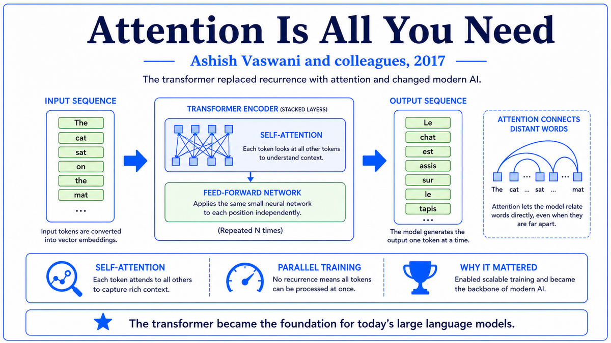

  

  <a href="https://arxiv.org/pdf/1810.04805">📄 Original Paper (NAACL 2019)</a> · Jacob Devlin (Born United States), Ming-Wei Chang (Born Taiwan), Kenton Lee (Born United States), Kristina Toutanova (Born Sofia, Bulgaria), Google AI Language

<em>One year after the Transformer, a small team at Google asked a simple question. What if we just took the encoder, pre-trained it on the entire internet, and let everyone fine-tune it for their own tasks? The answer remade natural language processing.</em>

---

In June 2017 the Transformer paper had introduced an encoder-decoder architecture for translation. In June 2018, OpenAI's Alec Radford had shown that the decoder side, trained on raw text with autoregressive language modeling, could be pre-trained and then fine-tuned for downstream tasks. That work was called GPT-1. It set new state-of-the-art on several benchmarks but received modest attention. The natural follow-up question was whether the encoder side could do something similar, and whether a different pre-training objective could go further.

Jacob Devlin and his colleagues at Google AI Language had been thinking about exactly this. The team included Ming-Wei Chang, born in Taiwan, who had worked on machine reading and question answering at Microsoft Research before Google. Kenton Lee was a Google researcher with a background in question answering systems. Kristina Toutanova, born in Sofia, Bulgaria, was a senior researcher who had spent her career on syntactic and semantic parsing. Devlin himself, born in the United States, had been at Google since 2014 working on machine translation. The group brought a deep knowledge of the actual NLP tasks the field cared about, which would shape every choice in the paper that followed.

Their core observation was that Radford's left-to-right autoregressive objective was needlessly restrictive. Predicting the next word given previous words is one form of language understanding, but humans reading text use both leftward and rightward context simultaneously. A truly bidirectional model could see all of a sentence at once and use any word's context to learn representations of any other word. The Transformer encoder, with its self-attention layers, was naturally bidirectional. The problem was that you could not train it with autoregressive language modeling without it trivially seeing the answer.

The solution was the masked language modeling objective. Instead of predicting the next token, the model would see a sentence with roughly 15 percent of the tokens randomly replaced by a special MASK symbol, and would have to predict the original tokens. Because the model could not know which tokens had been masked until it saw them, it had to build representations of every position that captured information from both directions. The objective had been used before in restricted forms but had not been combined with a deep transformer encoder at scale. The team also added a second auxiliary objective called next sentence prediction, asking the model whether two sentences had appeared adjacently in the source corpus.

The model was pre-trained on a corpus of BookCorpus and English Wikipedia, totaling about 3.3 billion words. The team released two sizes. BERT-base had 12 transformer encoder layers, hidden dimension 768, 12 attention heads, and 110 million parameters. BERT-large had 24 layers, hidden dimension 1024, 16 attention heads, and 340 million parameters. Pre-training took four days on a 16-chip TPU pod for the base model. Fine-tuning on a downstream task took an hour or two on a single GPU. The paper was uploaded to arXiv on October 11, 2018, and presented at NAACL in June 2019. On the GLUE benchmark, BERT-large set new state-of-the-art on every task. On SQuAD question answering, it achieved superhuman performance. On 11 standard NLP benchmarks, it broke prior records, often by large margins.

  

<em>Mask 15 percent of tokens, predict them from both-sided context. The pretext task that taught the encoder language.</em>

---

BERT mattered for three reasons that reshaped natural language processing in less than a year.

First, it established the pretrain-then-finetune paradigm as the dominant approach for NLP. Before BERT, almost every NLP task had its own specialized architecture. Question answering used one kind of model, sentiment analysis used another, named entity recognition used a third. After BERT, the recipe was the same for nearly every task. Take the pre-trained BERT, add a small task-specific head, and fine-tune on the task's labeled data. Within a year, this approach had displaced the prior task-specific architectures across the field. NLP had unified around a single backbone, just as computer vision had unified around ImageNet-pretrained convolutional networks half a decade earlier.

Second, BERT spawned an entire ecosystem of variants and competitors. RoBERTa from Facebook in July 2019 showed that the next-sentence-prediction objective was unnecessary and that BERT was undertrained. ALBERT in late 2019 reduced parameter count by sharing weights across layers. DistilBERT compressed it for production deployment. ELECTRA replaced masking with a token-replacement detection task. XLNet combined autoregressive and bidirectional objectives. Hugging Face built its Transformers library around the BERT API, becoming the standard distribution channel for pretrained models. Within eighteen months, dozens of major variants existed, each refining one aspect of the pre-training recipe.

Third, BERT was deployed at scale in real products almost immediately. In October 2019, Google announced that BERT was being used in Google Search, initially affecting about 10 percent of English queries. It was the first time a transformer-based pretrained model was used to interpret the queries of billions of users every day. Other major technology companies followed quickly. By 2020, BERT or a variant of it was running inside most major search engines, customer support systems, and content moderation pipelines. The deployment of BERT in Google Search marked the moment when the deep learning revolution in NLP became visible in everyday life.

---

The defining concept of BERT is self-supervised pre-training of a bidirectional encoder. Three pieces work together. The architecture is the Transformer encoder. The pretext task is masked language modeling. The downstream procedure is fine-tuning, in which a small task-specific layer is added on top of the pretrained model and the whole stack is trained end-to-end on labeled task data.

Self-supervised pre-training is the conceptual heart. The model learns from raw text without any human-provided labels. The learning signal comes from the structure of language itself, specifically from the consistent statistical regularities that link words to their contexts. By learning to fill in masked words from both sides, the model is forced to build internal representations that capture syntactic structure, semantic meaning, factual knowledge, and pragmatic conventions. None of these are explicitly trained for, but all emerge as a byproduct of doing the masking task well across billions of examples.

Bidirectionality is what distinguishes BERT from autoregressive models like GPT. An autoregressive language model predicts each token from only its leftward context. This is fine for generation, where you produce text one token at a time and never know the future. But for understanding tasks like question answering or classification, you have access to the whole input simultaneously, and a model that can use both directions of context produces better representations. The masked language modeling trick lets the encoder use both directions while still having a meaningful prediction objective.

Fine-tuning is the bridge from the general pretrained model to specific tasks. The pretrained BERT contains general knowledge of language. A specific task such as sentiment analysis or question answering needs to map that general knowledge to a particular output format. Fine-tuning achieves this by adding one or two new layers and adjusting all of the model's weights with the task's labeled data. Because most of the heavy learning has happened during pre-training, fine-tuning needs only a few thousand labeled examples and a few hours of compute, even for large tasks.

---

The BERT architecture is a stack of transformer encoder layers. Each layer contains a multi-head self-attention sublayer and a position-wise feedforward sublayer, each wrapped with a residual connection and layer normalization, exactly as in the 2017 Transformer paper.

Inputs are tokenized using WordPiece, a subword tokenization scheme. Two special tokens are added. CLS is prepended to every input and is used as the aggregate representation for classification tasks. SEP separates sentences when two are passed in. Each input position receives three embeddings, summed together. A token embedding for the WordPiece itself, a position embedding for its position in the sequence, and a segment embedding indicating whether the token belongs to the first or second sentence.

The masked language modeling objective is implemented as follows. For each training example, 15 percent of input tokens are selected at random. Of those selected, 80 percent are replaced with the MASK token, 10 percent are replaced with a random other token, and 10 percent are left unchanged. The model is trained with cross-entropy loss to predict the original token at every selected position. The mixing of replacement strategies prevents the model from overfitting to the literal MASK token, since at fine-tune time the MASK token never appears.

The next sentence prediction objective adds a binary classifier on top of the CLS token's final representation, trained to distinguish actual adjacent sentence pairs from random pairs. Subsequent papers showed this objective contributed little, and most BERT variants drop it. Pre-training proceeds for one million steps with batch size 256, using the Adam optimizer with learning rate warm-up. At fine-tune time, the same model is loaded and the task-specific head is added. All weights are updated with the task's data, typically for two to four epochs at a much lower learning rate.

---

Within months of BERT's release, the encoder family had multiplied. RoBERTa, ALBERT, DistilBERT, ELECTRA, XLNet, ERNIE, and dozens of others refined the recipe. Hugging Face's Transformers library became the de facto distribution channel. Google deployed BERT in Search in October 2019. NLP had been transformed.

But while the world was focused on encoder models, OpenAI was quietly continuing to develop the decoder side. The team that had produced GPT-1 had been impressed by BERT's results but unconvinced that bidirectionality was the long-term answer. They believed that a sufficiently large autoregressive model, trained on more data, would not just match BERT on understanding tasks but would also be able to generate fluent text, which BERT could not. The bet they were preparing to make was on scale. By February 2019, they had a model ten times larger than GPT-1. They called it GPT-2, and what it produced startled even the people who built it.

---

  <a href="../07-Deep-Learning-Awakens-(2000s-2017)/2017-Vaswani-Transformer.md">← Previous: Transformer 2017</a> &nbsp;·&nbsp; <a href="2019-Radford-GPT-2.md">Next: GPT-2 2019 →</a>

